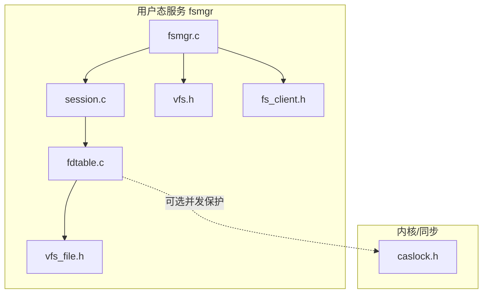
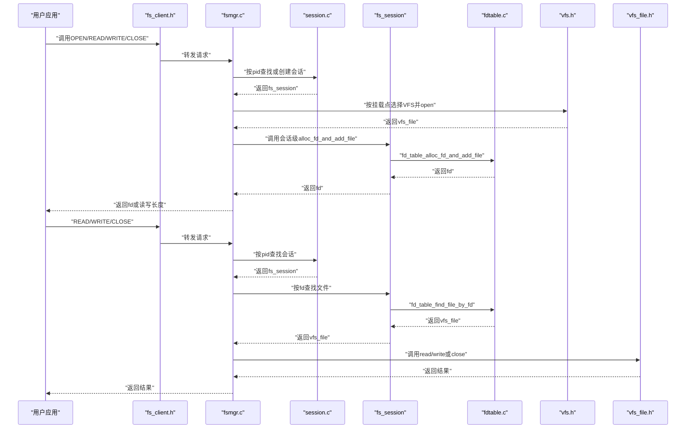
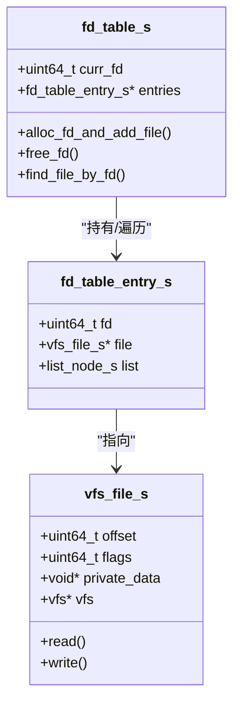
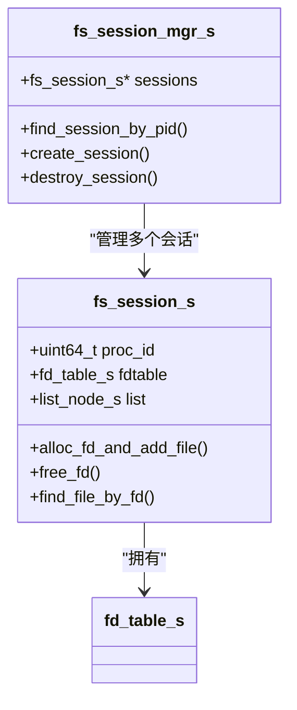
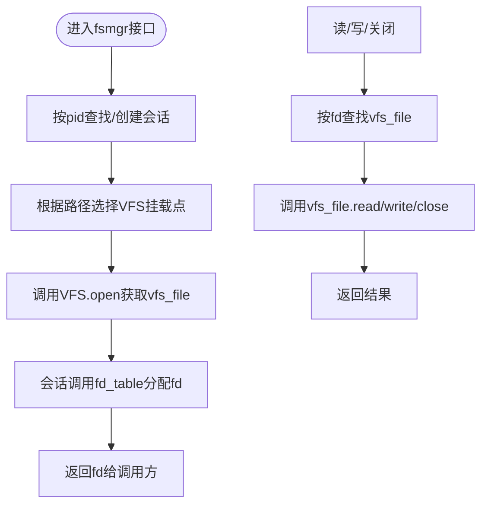
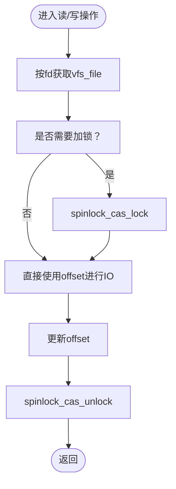
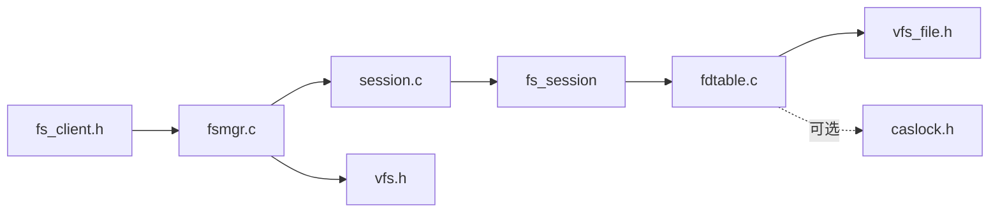
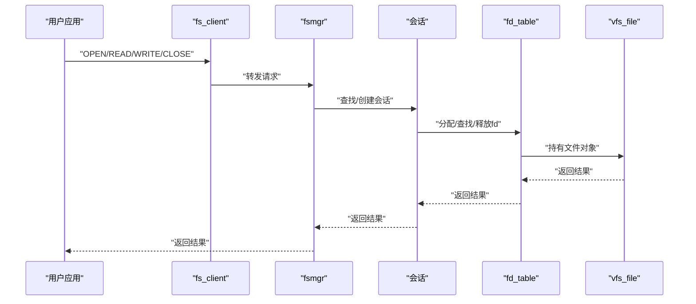

# 文件描述符管理

<cite>
**本文引用的文件**
- [fdtable.h](file://uapps/fsmgr/include/fdtable.h)
- [fdtable.c](file://uapps/fsmgr/fdtable.c)
- [session.h](file://uapps/fsmgr/include/session.h)
- [session.c](file://uapps/fsmgr/session.c)
- [fsmgr.c](file://uapps/fsmgr/fsmgr.c)
- [vfs.h](file://uapps/fsmgr/include/vfs/vfs.h)
- [vfs_file.h](file://uapps/fsmgr/include/vfs/vfs_file.h)
- [fs_client.h](file://ulibs/include/libsystem/fs_client.h)
- [caslock.h](file://kernel/include/sync/spinlock/caslock.h)
- [log.h（fsmgr）](file://uapps/fsmgr/include/log.h)
- [log.h（idle）](file://uapps/idle/include/log.h)
- [log.h（shell）](file://uapps/shell/include/log.h)
</cite>

## 目录
1. [引言](#引言)
2. [项目结构](#项目结构)
3. [核心组件](#核心组件)
4. [架构总览](#架构总览)
5. [详细组件分析](#详细组件分析)
6. [依赖关系分析](#依赖关系分析)
7. [性能考量](#性能考量)
8. [故障排查指南](#故障排查指南)
9. [结论](#结论)
10. [附录](#附录)

## 引言
本文件系统服务（fsmgr）为TranquilOS提供文件描述符管理能力，负责：
- 进程级文件访问上下文的维护（会话）
- 文件描述符表（fd_table）的分配、查找与回收
- 基于虚拟文件系统（VFS）的打开、读取、写入与关闭流程
- 文件位置指针（offset）与并发访问的同步机制现状说明
- 权限控制与继承机制的现状与建议
- 性能优化策略与泄漏检测、调试方法

## 项目结构
fsmgr模块位于用户态应用层，围绕以下关键头文件与实现文件组织：
- fd_table：文件描述符表数据结构与操作
- session：进程级会话管理，持有fd_table
- fsmgr：对外接口与VFS挂载点选择
- vfs/vfs.h、vfs_file.h：VFS抽象与文件对象
- libsystem/fs_client.h：用户态客户端调用接口
- kernel同步原语：自旋锁（CAS）用于并发保护（当前未在fd_table中使用）

**图表来源**
- [fsmgr.c](file://uapps/fsmgr/fsmgr.c#L1-L216)
- [session.c](file://uapps/fsmgr/session.c#L1-L112)
- [fdtable.c](file://uapps/fsmgr/fdtable.c#L1-L96)
- [vfs.h](file://uapps/fsmgr/include/vfs/vfs.h#L1-L21)
- [vfs_file.h](file://uapps/fsmgr/include/vfs/vfs_file.h#L1-L19)
- [fs_client.h](file://ulibs/include/libsystem/fs_client.h#L1-L47)
- [caslock.h](file://kernel/include/sync/spinlock/caslock.h#L1-L42)

**章节来源**
- [fsmgr.c](file://uapps/fsmgr/fsmgr.c#L1-L216)
- [session.c](file://uapps/fsmgr/session.c#L1-L112)
- [fdtable.c](file://uapps/fsmgr/fdtable.c#L1-L96)
- [vfs.h](file://uapps/fsmgr/include/vfs/vfs.h#L1-L21)
- [vfs_file.h](file://uapps/fsmgr/include/vfs/vfs_file.h#L1-L19)
- [fs_client.h](file://ulibs/include/libsystem/fs_client.h#L1-L47)
- [caslock.h](file://kernel/include/sync/spinlock/caslock.h#L1-L42)

## 核心组件
- 文件描述符表（fd_table）
  - 结构：包含当前fd计数、链表头节点、操作函数指针
  - 操作：分配新fd并加入文件、按fd查找文件、按fd释放并回收
- 会话（fs_session）
  - 结构：进程ID、fd_table、链表节点、会话级操作函数
  - 职责：为每个进程维护独立的fd_table
- 文件系统管理器（fsmgr）
  - 职责：挂载VFS、根据路径选择挂载点、封装open/read/write/close
- VFS与文件对象
  - vfs：挂载点信息与open操作
  - vfs_file：文件对象，包含offset、flags、私有数据与read/write操作

**章节来源**
- [fdtable.h](file://uapps/fsmgr/include/fdtable.h#L1-L31)
- [fdtable.c](file://uapps/fsmgr/fdtable.c#L1-L96)
- [session.h](file://uapps/fsmgr/include/session.h#L1-L39)
- [session.c](file://uapps/fsmgr/session.c#L1-L112)
- [fsmgr.c](file://uapps/fsmgr/fsmgr.c#L1-L216)
- [vfs.h](file://uapps/fsmgr/include/vfs/vfs.h#L1-L21)
- [vfs_file.h](file://uapps/fsmgr/include/vfs/vfs_file.h#L1-L19)

## 架构总览
下图展示从用户态发起open/read/write/close到VFS与fd_table的交互流程。

**图表来源**
- [fs_client.h](file://ulibs/include/libsystem/fs_client.h#L1-L47)
- [fsmgr.c](file://uapps/fsmgr/fsmgr.c#L65-L190)
- [session.c](file://uapps/fsmgr/session.c#L5-L60)
- [fdtable.c](file://uapps/fsmgr/fdtable.c#L4-L83)
- [vfs.h](file://uapps/fsmgr/include/vfs/vfs.h#L7-L10)
- [vfs_file.h](file://uapps/fsmgr/include/vfs/vfs_file.h#L4-L17)

## 详细组件分析

### 文件描述符表（fd_table）
- 数据结构
  - fd_table_entry_s：保存fd与vfs_file指针，并通过双向链表连接
  - fd_table_s：维护当前fd计数、entries链表头、操作函数指针
- 关键操作
  - 分配与添加：生成唯一fd，初始化链表节点，追加到entries尾部
  - 查找：遍历entries，按fd匹配返回vfs_file
  - 释放：遍历entries，定位条目，释放其vfs_file与自身，更新链表
- 复杂度
  - 分配/查找/释放均为O(n)链表遍历
- 现状与建议
  - 当前未实现哈希表；可考虑引入哈希桶以降低平均查找复杂度至O(1)
  - 未实现并发保护；在多线程场景下需加锁或采用无锁结构

**图表来源**
- [fdtable.h](file://uapps/fsmgr/include/fdtable.h#L8-L27)
- [fdtable.c](file://uapps/fsmgr/fdtable.c#L4-L30)
- [vfs_file.h](file://uapps/fsmgr/include/vfs/vfs_file.h#L11-L17)

**章节来源**
- [fdtable.h](file://uapps/fsmgr/include/fdtable.h#L1-L31)
- [fdtable.c](file://uapps/fsmgr/fdtable.c#L1-L96)

### 会话管理（fs_session 与 fs_session_mgr）
- 会话职责
  - 维护进程ID与fd_table
  - 提供会话级的fd分配/查找/释放操作
- 会话管理器
  - 按进程ID查找或创建会话
  - 维护会话链表
- 并发与持久化
  - 当前未实现并发保护与文件状态持久化；可在会话层引入自旋锁并在退出时清理资源

**图表来源**
- [session.h](file://uapps/fsmgr/include/session.h#L16-L35)
- [session.c](file://uapps/fsmgr/session.c#L5-L89)

**章节来源**
- [session.h](file://uapps/fsmgr/include/session.h#L1-L39)
- [session.c](file://uapps/fsmgr/session.c#L1-L112)

### 文件系统管理器（fsmgr）
- 职责
  - 挂载多个VFS实例并维护链表
  - 根据文件路径选择对应VFS并执行open/read/write/close
  - 将VFS返回的文件对象包装为fd并返回给调用方
- 路径处理
  - 去除公共挂载前缀，构造相对路径传递给VFS

**图表来源**
- [fsmgr.c](file://uapps/fsmgr/fsmgr.c#L65-L190)
- [vfs.h](file://uapps/fsmgr/include/vfs/vfs.h#L7-L10)
- [vfs_file.h](file://uapps/fsmgr/include/vfs/vfs_file.h#L4-L17)

**章节来源**
- [fsmgr.c](file://uapps/fsmgr/fsmgr.c#L1-L216)

### 文件位置指针与并发同步
- 位置指针
  - vfs_file包含offset字段，用于记录读写位置
- 并发同步
  - 当前fd_table与会话未使用自旋锁等同步原语
  - 建议在多线程场景下对fd_table操作加锁，或采用无锁队列/哈希结构

**图表来源**
- [vfs_file.h](file://uapps/fsmgr/include/vfs/vfs_file.h#L12-L13)
- [caslock.h](file://kernel/include/sync/spinlock/caslock.h#L19-L42)

**章节来源**
- [vfs_file.h](file://uapps/fsmgr/include/vfs/vfs_file.h#L1-L19)
- [caslock.h](file://kernel/include/sync/spinlock/caslock.h#L1-L42)

### 权限控制与继承
- 现状
  - fd_table与会话未显式维护访问权限位
  - vfs_file包含flags字段，可用于承载权限/状态标志
- 建议
  - 在open阶段基于路径与VFS权限规则设置flags
  - 在fd_table层记录权限位，每次read/write前校验
  - 支持继承：子进程复制父进程fd时同步权限位

**章节来源**
- [vfs_file.h](file://uapps/fsmgr/include/vfs/vfs_file.h#L12-L13)
- [fsmgr.c](file://uapps/fsmgr/fsmgr.c#L65-L108)

## 依赖关系分析
- 组件耦合
  - fsmgr依赖session_mgr与VFS
  - session持有fd_table
  - fd_table持有vfs_file
- 外部依赖
  - libsystem/fs_client.h定义了用户态调用接口
  - 内核同步原语caslock.h可用于并发保护

**图表来源**
- [fs_client.h](file://ulibs/include/libsystem/fs_client.h#L1-L47)
- [fsmgr.c](file://uapps/fsmgr/fsmgr.c#L1-L216)
- [session.c](file://uapps/fsmgr/session.c#L1-L112)
- [fdtable.c](file://uapps/fsmgr/fdtable.c#L1-L96)
- [vfs.h](file://uapps/fsmgr/include/vfs/vfs.h#L1-L21)
- [vfs_file.h](file://uapps/fsmgr/include/vfs/vfs_file.h#L1-L19)
- [caslock.h](file://kernel/include/sync/spinlock/caslock.h#L1-L42)

**章节来源**
- [fs_client.h](file://ulibs/include/libsystem/fs_client.h#L1-L47)
- [fsmgr.c](file://uapps/fsmgr/fsmgr.c#L1-L216)
- [session.c](file://uapps/fsmgr/session.c#L1-L112)
- [fdtable.c](file://uapps/fsmgr/fdtable.c#L1-L96)
- [vfs.h](file://uapps/fsmgr/include/vfs/vfs.h#L1-L21)
- [vfs_file.h](file://uapps/fsmgr/include/vfs/vfs_file.h#L1-L19)
- [caslock.h](file://kernel/include/sync/spinlock/caslock.h#L1-L42)

## 性能考量
- 时间复杂度
  - 当前fd_table为链表，分配/查找/释放均为O(n)，在高并发与大量fd场景下存在瓶颈
- 建议优化
  - 引入哈希表：以fd为key，O(1)平均查找；扩容与冲突处理需权衡
  - 缓存热点fd：最近使用的fd优先级更高，减少链表扫描
  - 批量回收：延迟释放策略，合并多次close
  - 内存池：fd_table_entry与vfs_file统一内存池，降低碎片
- 空间复杂度
  - 链表节点额外开销较大；哈希表可显著降低空间占用

[本节为通用性能讨论，不直接分析具体文件，故无“章节来源”]

## 故障排查指南
- 常见问题
  - fd未找到：检查路径解析与挂载点选择逻辑
  - 重复close：确认fd_table释放后是否再次使用
  - 泄漏检测：统计会话生命周期内分配与释放的fd数量差值
- 日志与断言
  - 使用fsmgr/log.h输出调试/错误信息
  - 在关键路径增加日志，如open成功、read/write长度、close完成
- 调试建议
  - 启用详细日志级别，定位会话创建与销毁时机
  - 对异常返回值（负数）进行捕获与记录
  - 单元测试：构造多线程并发场景，验证一致性

**章节来源**
- [log.h（fsmgr）](file://uapps/fsmgr/include/log.h#L11-L30)
- [log.h（idle）](file://uapps/idle/include/log.h#L11-L30)
- [log.h（shell）](file://uapps/shell/include/log.h#L10-L30)
- [fsmgr.c](file://uapps/fsmgr/fsmgr.c#L65-L190)
- [session.c](file://uapps/fsmgr/session.c#L5-L112)
- [fdtable.c](file://uapps/fsmgr/fdtable.c#L4-L83)

## 结论
- 设计要点
  - 以会话为单位隔离进程级文件访问上下文
  - fd_table提供简单直观的fd管理，但缺乏并发与哈希支持
- 改进建议
  - 引入哈希表与并发保护，提升大规模场景性能与可靠性
  - 明确权限模型与继承策略，完善安全边界
  - 加强监控与日志，便于泄漏检测与问题定位

[本节为总结性内容，不直接分析具体文件，故无“章节来源”]

## 附录
- 关键流程时序（概念性）

[本图为概念性流程示意，不直接映射具体源码，故无“图表来源”]