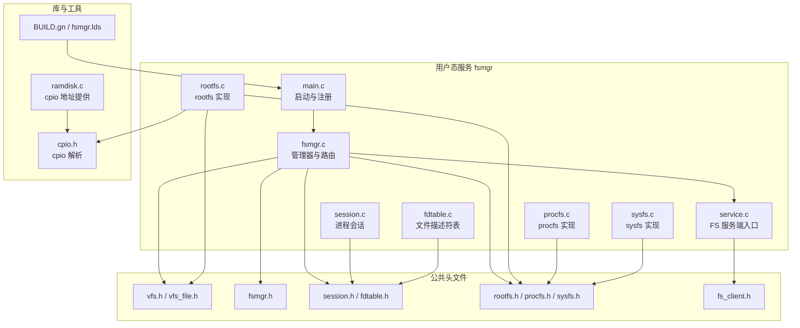
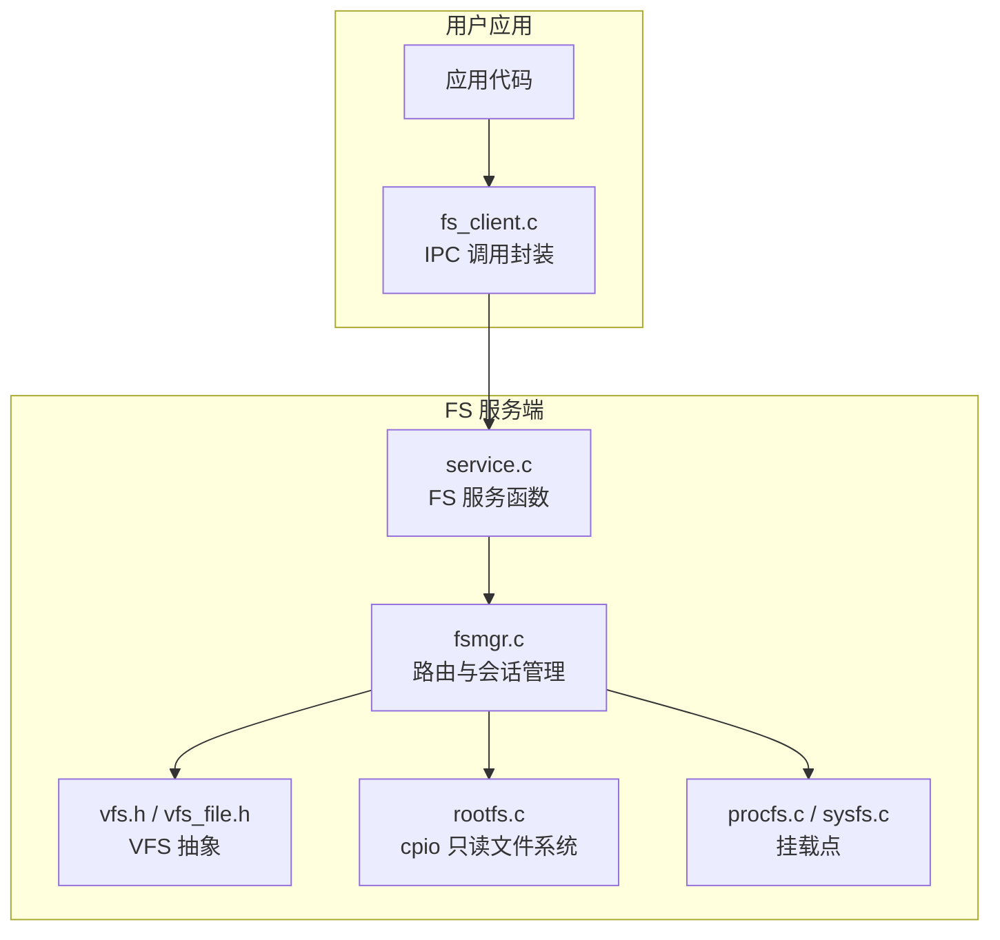
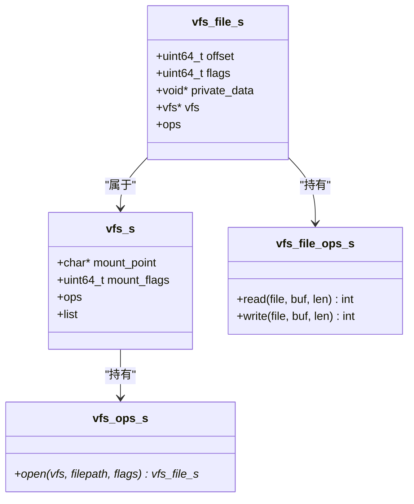
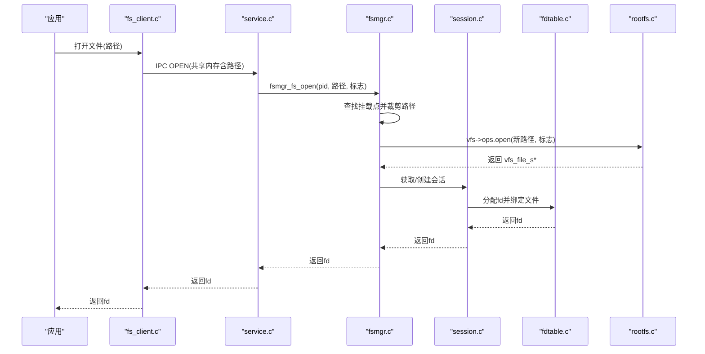
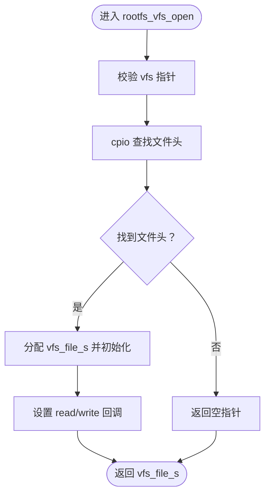
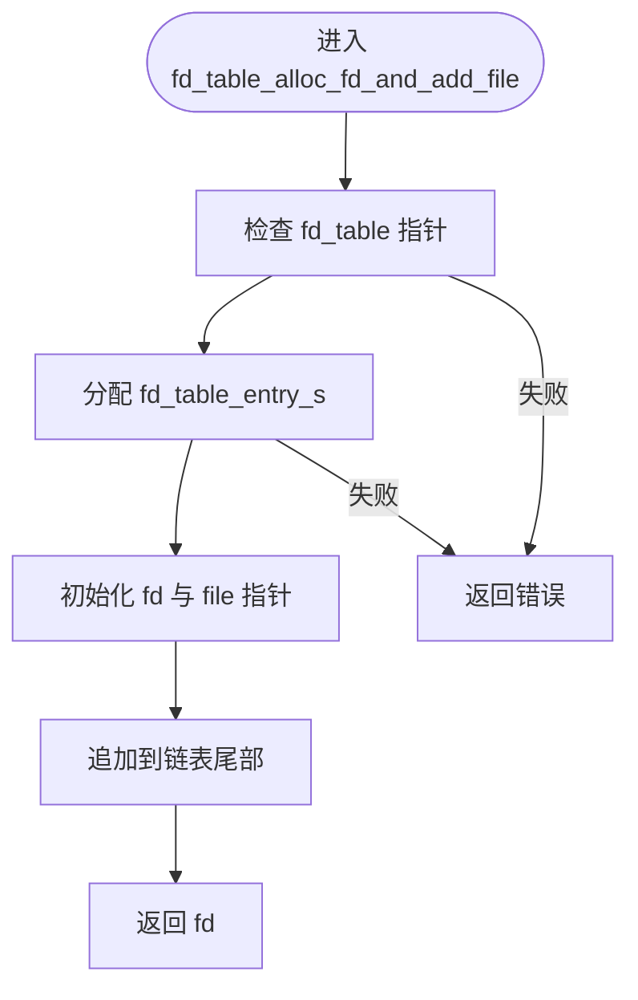
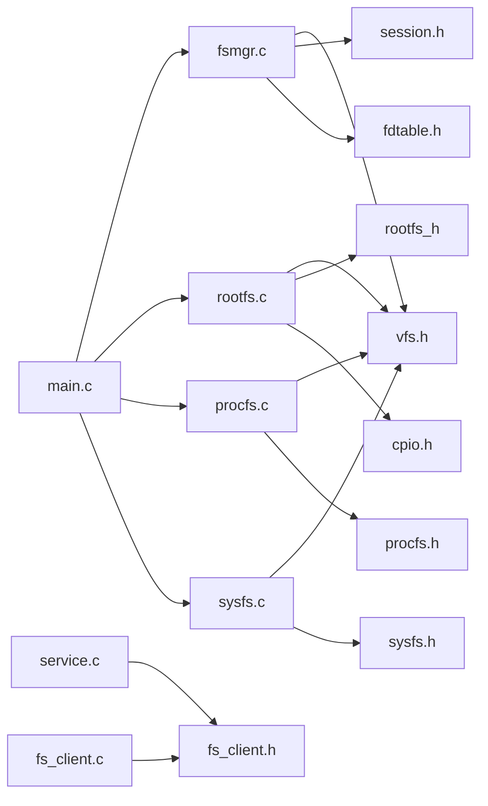

# 文件系统管理器

<cite>
**本文引用的文件**
- [vfs.h](file://uapps/fsmgr/include/vfs/vfs.h)
- [vfs_file.h](file://uapps/fsmgr/include/vfs/vfs_file.h)
- [fsmgr.h](file://uapps/fsmgr/include/fsmgr.h)
- [fdtable.h](file://uapps/fsmgr/include/fdtable.h)
- [session.h](file://uapps/fsmgr/include/session.h)
- [rootfs.h](file://uapps/fsmgr/include/rootfs/rootfs.h)
- [procfs.h](file://uapps/fsmgr/include/procfs/procfs.h)
- [sysfs.h](file://uapps/fsmgr/include/sysfs/sysfs.h)
- [fsmgr.c](file://uapps/fsmgr/fsmgr.c)
- [fdtable.c](file://uapps/fsmgr/fdtable.c)
- [session.c](file://uapps/fsmgr/session.c)
- [rootfs.c](file://uapps/fsmgr/rootfs/rootfs.c)
- [procfs.c](file://uapps/fsmgr/procfs/procfs.c)
- [sysfs.c](file://uapps/fsmgr/sysfs/sysfs.c)
- [service.c](file://uapps/fsmgr/service.c)
- [main.c](file://uapps/fsmgr/main.c)
- [fs_client.h](file://ulibs/include/libsystem/fs_client.h)
- [fs_client.c](file://ulibs/libsystem/fs_client.c)
- [cpio.h](file://ulibs/include/libcpio/cpio.h)
- [ramdisk.c](file://kernel/systemd/ramdisk.c)
- [BUILD.gn](file://uapps/fsmgr/BUILD.gn)
- [fsmgr.lds](file://uapps/fsmgr/fsmgr.lds)
- [log.h（fsmgr）](file://uapps/fsmgr/include/log.h)
</cite>

## 目录
1. [引言](#引言)
2. [项目结构](#项目结构)
3. [核心组件](#核心组件)
4. [架构总览](#架构总览)
5. [详细组件分析](#详细组件分析)
6. [依赖关系分析](#依赖关系分析)
7. [性能考虑](#性能考虑)
8. [故障排查指南](#故障排查指南)
9. [结论](#结论)
10. [附录](#附录)

## 引言
本文件系统管理器（fsmgr）是TranquilOS中负责统一抽象与调度各类文件系统的用户态服务。其目标包括：
- 提供VFS（虚拟文件系统）抽象层，屏蔽具体文件系统差异；
- 实现根文件系统（rootfs），支持cpio格式镜像与内存映射读取；
- 提供procfs与sysfs的挂载入口，用于进程与系统信息的暴露；
- 管理文件描述符表与进程会话，实现open/read/write/close等系统调用的转发与执行；
- 对外提供简洁的API，便于上层应用通过IPC调用文件系统服务。

## 项目结构
fsmgr位于uapps/fsmgr目录，采用“功能模块化 + 抽象层”的组织方式：
- VFS抽象：vfs.h、vfs_file.h
- 会话与FD表：session.h、fdtable.h、session.c、fdtable.c
- 具体文件系统：rootfs（cpio）、procfs、sysfs
- 服务入口与客户端：service.c、fs_client.h、fs_client.c
- 启动与链接脚本：main.c、BUILD.gn、fsmgr.lds

图表来源
- [fsmgr.c](file://uapps/fsmgr/fsmgr.c#L1-L216)
- [session.c](file://uapps/fsmgr/session.c#L1-L112)
- [fdtable.c](file://uapps/fsmgr/fdtable.c#L1-L96)
- [rootfs.c](file://uapps/fsmgr/rootfs/rootfs.c#L1-L100)
- [procfs.c](file://uapps/fsmgr/procfs/procfs.c#L1-L28)
- [sysfs.c](file://uapps/fsmgr/sysfs/sysfs.c#L1-L28)
- [service.c](file://uapps/fsmgr/service.c#L1-L49)
- [main.c](file://uapps/fsmgr/main.c#L1-L38)
- [vfs.h](file://uapps/fsmgr/include/vfs/vfs.h#L1-L21)
- [vfs_file.h](file://uapps/fsmgr/include/vfs/vfs_file.h#L1-L19)
- [fsmgr.h](file://uapps/fsmgr/include/fsmgr.h#L1-L43)
- [session.h](file://uapps/fsmgr/include/session.h#L1-L39)
- [fdtable.h](file://uapps/fsmgr/include/fdtable.h#L1-L31)
- [rootfs.h](file://uapps/fsmgr/include/rootfs/rootfs.h#L1-L13)
- [procfs.h](file://uapps/fsmgr/include/procfs/procfs.h#L1-L12)
- [sysfs.h](file://uapps/fsmgr/include/sysfs/sysfs.h#L1-L12)
- [fs_client.h](file://ulibs/include/libsystem/fs_client.h#L1-L47)
- [cpio.h](file://ulibs/include/libcpio/cpio.h#L1-L88)
- [ramdisk.c](file://kernel/systemd/ramdisk.c#L1-L28)
- [BUILD.gn](file://uapps/fsmgr/BUILD.gn#L1-L51)
- [fsmgr.lds](file://uapps/fsmgr/fsmgr.lds#L1-L41)

章节来源
- [BUILD.gn](file://uapps/fsmgr/BUILD.gn#L1-L51)
- [fsmgr.lds](file://uapps/fsmgr/fsmgr.lds#L1-L41)

## 核心组件
- VFS抽象层：定义通用的文件系统接口与文件对象，屏蔽具体实现差异。
- 文件系统管理器：负责挂载点查找、路径裁剪、系统调用分发。
- 会话与FD表：按进程维护独立的文件描述符表，实现fd分配、查找与回收。
- rootfs：基于cpio镜像的只读文件系统，提供内存映射读取。
- procfs/sysfs：作为挂载点注册到VFS，用于进程与系统信息的暴露。
- FS服务端与客户端：通过IPC将用户态应用的文件操作请求转发至fsmgr。

章节来源
- [vfs.h](file://uapps/fsmgr/include/vfs/vfs.h#L1-L21)
- [vfs_file.h](file://uapps/fsmgr/include/vfs/vfs_file.h#L1-L19)
- [fsmgr.h](file://uapps/fsmgr/include/fsmgr.h#L1-L43)
- [fdtable.h](file://uapps/fsmgr/include/fdtable.h#L1-L31)
- [session.h](file://uapps/fsmgr/include/session.h#L1-L39)
- [rootfs.h](file://uapps/fsmgr/include/rootfs/rootfs.h#L1-L13)
- [procfs.h](file://uapps/fsmgr/include/procfs/procfs.h#L1-L12)
- [sysfs.h](file://uapps/fsmgr/include/sysfs/sysfs.h#L1-L12)

## 架构总览
fsmgr以VFS为核心，将不同文件系统抽象为统一接口；每个具体文件系统（如rootfs）实现自己的open/read/write等操作，并在初始化时挂载到指定挂载点。进程发起文件操作后，通过FS客户端与FS服务端进行IPC通信，最终由fsmgr根据挂载点选择对应VFS并完成操作。

图表来源
- [fs_client.c](file://ulibs/libsystem/fs_client.c#L1-L45)
- [service.c](file://uapps/fsmgr/service.c#L1-L49)
- [fsmgr.c](file://uapps/fsmgr/fsmgr.c#L1-L216)
- [vfs.h](file://uapps/fsmgr/include/vfs/vfs.h#L1-L21)
- [vfs_file.h](file://uapps/fsmgr/include/vfs/vfs_file.h#L1-L19)
- [rootfs.c](file://uapps/fsmgr/rootfs/rootfs.c#L1-L100)
- [procfs.c](file://uapps/fsmgr/procfs/procfs.c#L1-L28)
- [sysfs.c](file://uapps/fsmgr/sysfs/sysfs.c#L1-L28)

## 详细组件分析

### VFS 抽象层
- vfs_s：包含挂载点、挂载标志与操作函数指针，以及链表节点，用于将多个VFS串联。
- vfs_file_s：包含文件偏移、标志位、私有数据与所属VFS，以及read/write回调，用于具体文件系统的读写实现。

图表来源
- [vfs.h](file://uapps/fsmgr/include/vfs/vfs.h#L1-L21)
- [vfs_file.h](file://uapps/fsmgr/include/vfs/vfs_file.h#L1-L19)

章节来源
- [vfs.h](file://uapps/fsmgr/include/vfs/vfs.h#L1-L21)
- [vfs_file.h](file://uapps/fsmgr/include/vfs/vfs_file.h#L1-L19)

### 文件系统管理器（fsmgr）
- 挂载管理：将具体VFS挂载到链表，支持多文件系统共存。
- 路径解析：根据挂载点裁剪路径，确保具体文件系统仅接收相对路径。
- 系统调用路由：open/read/write/close分别委托给具体文件系统或会话FD表。

图表来源
- [fs_client.c](file://ulibs/libsystem/fs_client.c#L1-L45)
- [service.c](file://uapps/fsmgr/service.c#L1-L49)
- [fsmgr.c](file://uapps/fsmgr/fsmgr.c#L65-L108)
- [session.c](file://uapps/fsmgr/session.c#L35-L60)
- [fdtable.c](file://uapps/fsmgr/fdtable.c#L4-L30)
- [rootfs.c](file://uapps/fsmgr/rootfs/rootfs.c#L32-L63)

章节来源
- [fsmgr.c](file://uapps/fsmgr/fsmgr.c#L1-L216)

### 根文件系统（rootfs）与 cpio 支持
- 初始化：从设备管理器获取cpio起始地址，打印镜像内容，挂载到“/root”。
- 打开文件：在cpio中查找目标文件，返回vfs_file_s并设置偏移为0。
- 读取：按当前偏移拷贝数据，更新偏移量；写入为只读。
- 内存映射：通过cpio工具函数定位文件数据区，直接访问物理内存。

图表来源
- [rootfs.c](file://uapps/fsmgr/rootfs/rootfs.c#L32-L63)
- [cpio.h](file://ulibs/include/libcpio/cpio.h#L69-L88)

章节来源
- [rootfs.c](file://uapps/fsmgr/rootfs/rootfs.c#L1-L100)
- [cpio.h](file://ulibs/include/libcpio/cpio.h#L1-L88)
- [ramdisk.c](file://kernel/systemd/ramdisk.c#L1-L28)

### procfs 与 sysfs
- 初始化：将挂载点分别设为“/proc”和“/sys”，并注册到fsmgr。
- 功能：作为占位实现，当前未提供具体文件内容，但已具备挂载与后续扩展能力。

章节来源
- [procfs.c](file://uapps/fsmgr/procfs/procfs.c#L1-L28)
- [sysfs.c](file://uapps/fsmgr/sysfs/sysfs.c#L1-L28)

### 文件描述符管理（FD 表）
- 数据结构：fd_table_entry_s 包含fd与vfs_file_s指针，使用双向链表组织。
- 操作：
  - 分配fd并添加文件：生成自增fd并插入链表尾部。
  - 释放fd：根据fd查找条目，释放文件与条目。
  - 根据fd查找文件：遍历链表返回对应文件。

图表来源
- [fdtable.c](file://uapps/fsmgr/fdtable.c#L4-L30)

章节来源
- [fdtable.h](file://uapps/fsmgr/include/fdtable.h#L1-L31)
- [fdtable.c](file://uapps/fsmgr/fdtable.c#L1-L96)

### 会话管理（按进程）
- 会话：fs_session_s 维护进程pid与fd_table，并提供分配/查找/释放fd的接口。
- 会话管理器：按pid查找或创建会话，维护会话链表。

章节来源
- [session.h](file://uapps/fsmgr/include/session.h#L1-L39)
- [session.c](file://uapps/fsmgr/session.c#L1-L112)

### FS 服务端与客户端
- 客户端：fs_client.c 将路径放入共享内存并通过IPC调用服务端函数（OPEN/READ/WRITE/CLOSE）。
- 服务端：service.c 接收IPC请求，调用fsmgr的open/read/write/close，传递进程pid与fd。

章节来源
- [fs_client.h](file://ulibs/include/libsystem/fs_client.h#L1-L47)
- [fs_client.c](file://ulibs/libsystem/fs_client.c#L1-L45)
- [service.c](file://uapps/fsmgr/service.c#L1-L49)

### 启动流程与链接
- main.c：初始化fsmgr、rootfs、procfs、sysfs，并注册页异常回调。
- 链接脚本：fsmgr.lds 定义文本、只读数据、数据与BSS段布局。

章节来源
- [main.c](file://uapps/fsmgr/main.c#L1-L38)
- [fsmgr.lds](file://uapps/fsmgr/fsmgr.lds#L1-L41)

## 依赖关系分析
- 头文件依赖：各模块通过include头文件建立弱耦合接口契约。
- 运行时依赖：fsmgr依赖cpio库进行镜像解析；rootfs依赖设备管理器提供的cpio地址；FS客户端依赖systemd提供的IPC与共享内存能力。
- 链接依赖：BUILD.gn列出源文件与链接脚本，确保可执行文件正确布局。

图表来源
- [fsmgr.c](file://uapps/fsmgr/fsmgr.c#L1-L216)
- [rootfs.c](file://uapps/fsmgr/rootfs/rootfs.c#L1-L100)
- [procfs.c](file://uapps/fsmgr/procfs/procfs.c#L1-L28)
- [sysfs.c](file://uapps/fsmgr/sysfs/sysfs.c#L1-L28)
- [service.c](file://uapps/fsmgr/service.c#L1-L49)
- [fs_client.c](file://ulibs/libsystem/fs_client.c#L1-L45)
- [main.c](file://uapps/fsmgr/main.c#L1-L38)
- [vfs.h](file://uapps/fsmgr/include/vfs/vfs.h#L1-L21)
- [rootfs.h](file://uapps/fsmgr/include/rootfs/rootfs.h#L1-L13)
- [procfs.h](file://uapps/fsmgr/include/procfs/procfs.h#L1-L12)
- [sysfs.h](file://uapps/fsmgr/include/sysfs/sysfs.h#L1-L12)
- [fs_client.h](file://ulibs/include/libsystem/fs_client.h#L1-L47)

章节来源
- [BUILD.gn](file://uapps/fsmgr/BUILD.gn#L1-L51)

## 性能考虑
- cpio访问：rootfs直接按偏移拷贝，避免额外缓冲与系统调用开销；建议在大文件读取场景下结合应用侧缓冲减少频繁IPC。
- FD表遍历：当前采用线性链表，查找/删除复杂度为O(n)。若并发与高fd数量成为瓶颈，可考虑哈希表或有序结构优化。
- 挂载点查找：fsmgr对挂载点列表线性扫描，建议在挂载点较少且初始化后不频繁变更的前提下保持高效。
- 日志输出：调试日志有助于定位问题，但在高频路径应谨慎开启以避免I/O阻塞。

## 故障排查指南
- 打不开文件
  - 检查路径是否包含正确的挂载点前缀；
  - 确认cpio镜像已正确加载且包含目标文件；
  - 查看fsmgr与rootfs初始化日志。
- 读写失败
  - rootfs为只读，写入会返回错误；
  - 检查文件句柄有效性与偏移状态。
- IPC调用异常
  - 确认fs_client已成功获取FS服务引用；
  - 检查共享内存分配与释放流程。
- 日志定位
  - 使用fsmgr与systemd的日志宏输出定位调用栈与错误点。

章节来源
- [rootfs.c](file://uapps/fsmgr/rootfs/rootfs.c#L26-L30)
- [fsmgr.c](file://uapps/fsmgr/fsmgr.c#L65-L108)
- [fs_client.c](file://ulibs/libsystem/fs_client.c#L1-L45)
- [log.h（fsmgr）](file://uapps/fsmgr/include/log.h#L1-L32)

## 结论
fsmgr通过清晰的VFS抽象与模块化设计，实现了对多种文件系统的统一接入。rootfs基于cpio提供了稳定的只读基础，procfs与sysfs预留了扩展空间。配合会话与FD表管理，以及IPC客户端/服务端模式，fsmgr为TranquilOS提供了可扩展、可维护的文件系统基础设施。

## 附录

### API 接口文档（概要）
- 文件操作
  - open：通过IPC将路径传入FS服务端，返回fd。
  - read：从指定fd读取数据到共享内存。
  - write：向指定fd写入共享内存中的数据。
  - close：关闭fd并释放资源。
- 目录与挂载
  - 挂载点：/root（rootfs）、/proc（procfs）、/sys（sysfs）。
- 属性查询
  - 当前未提供属性查询接口，可通过扩展procfs/sysfs实现。

章节来源
- [fs_client.h](file://ulibs/include/libsystem/fs_client.h#L1-L47)
- [fs_client.c](file://ulibs/libsystem/fs_client.c#L1-L45)
- [service.c](file://uapps/fsmgr/service.c#L1-L49)
- [fsmgr.h](file://uapps/fsmgr/include/fsmgr.h#L1-L43)