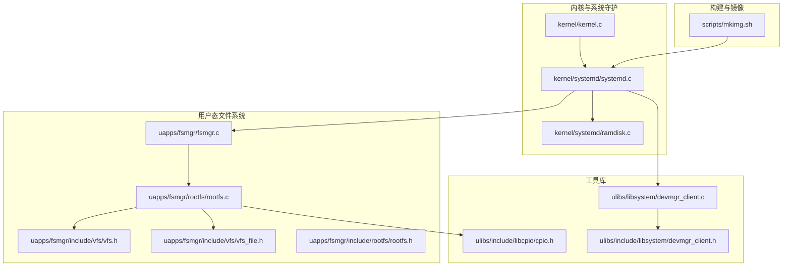
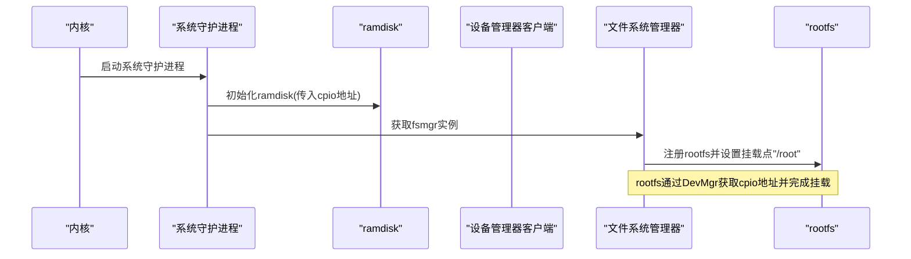
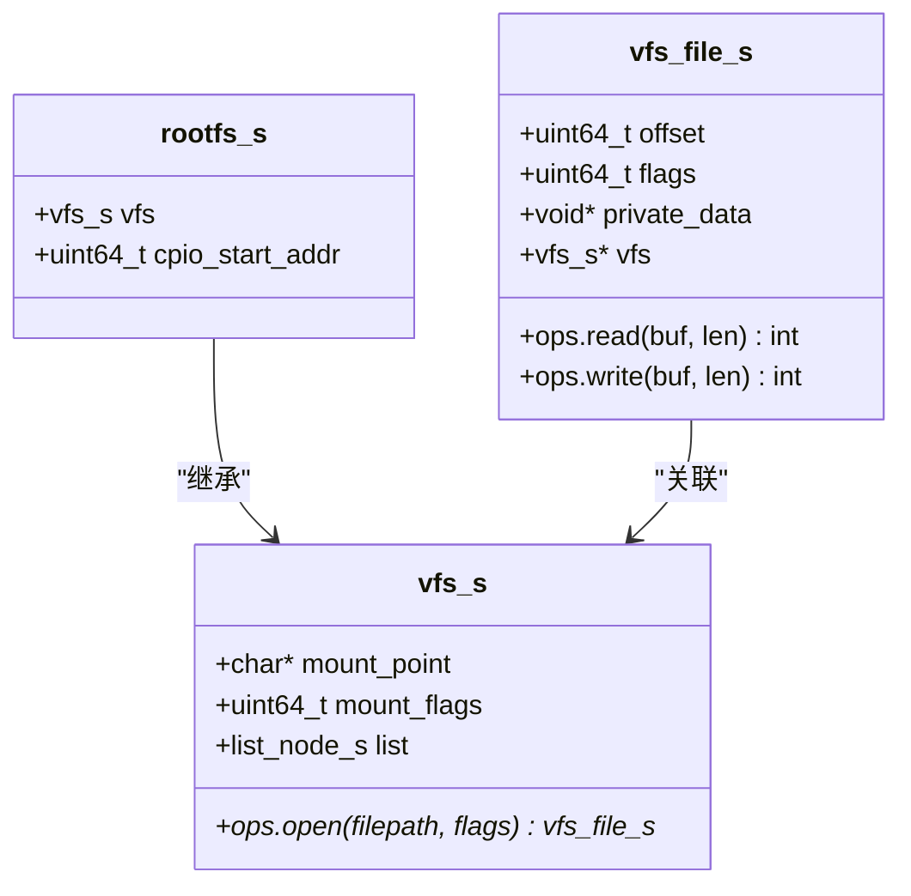
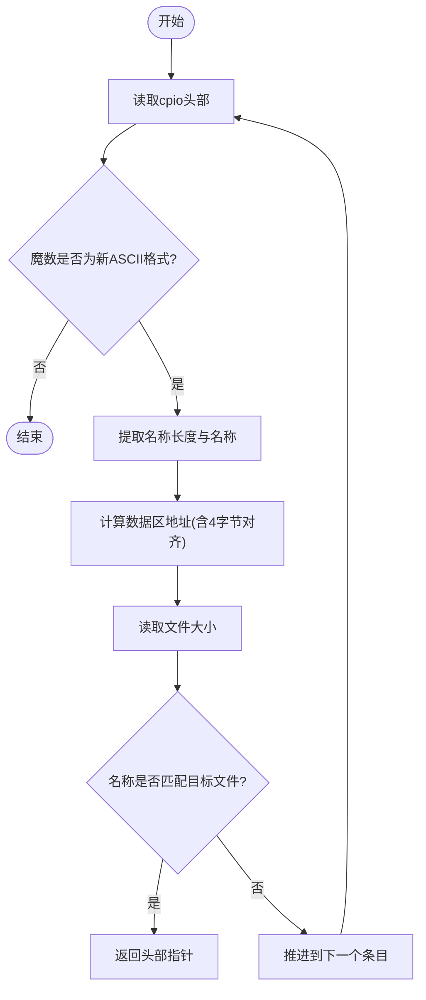
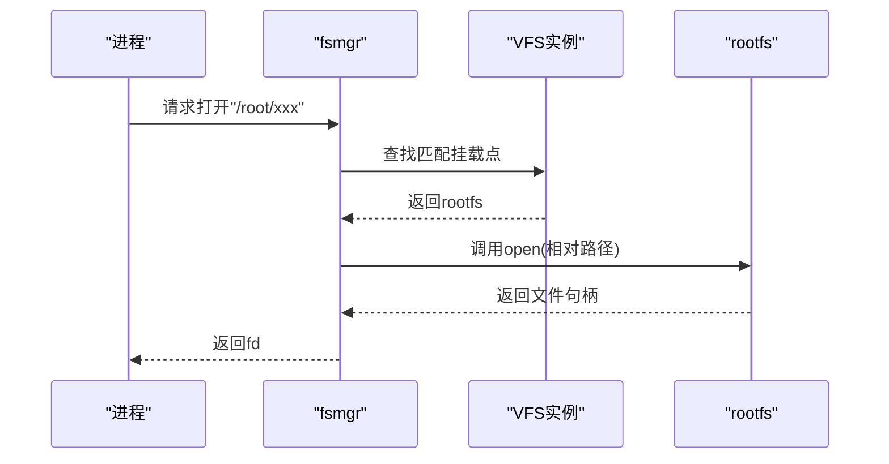
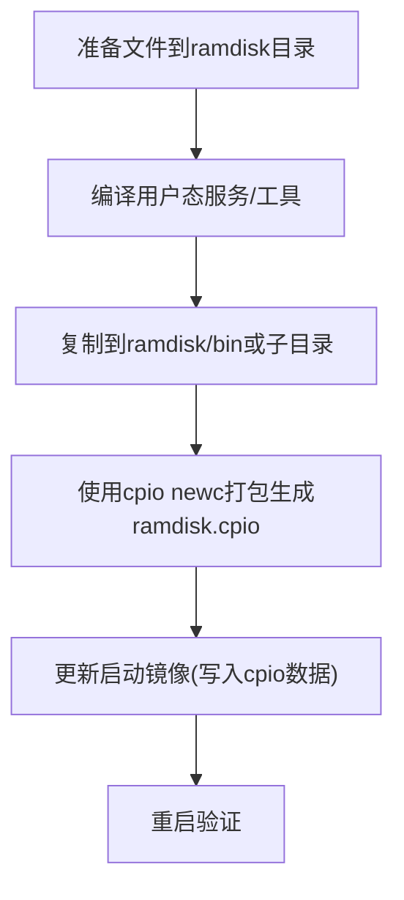
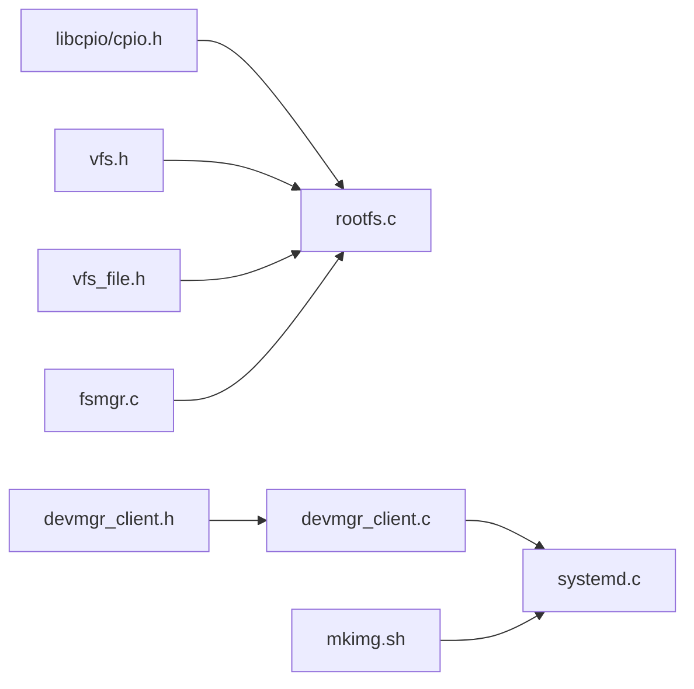

# 根文件系统

<cite>
**本文引用的文件**
- [uapps/fsmgr/rootfs/rootfs.c](file://uapps/fsmgr/rootfs/rootfs.c)
- [uapps/fsmgr/include/rootfs/rootfs.h](file://uapps/fsmgr/include/rootfs/rootfs.h)
- [ulibs/include/libcpio/cpio.h](file://ulibs/include/libcpio/cpio.h)
- [uapps/fsmgr/fsmgr.c](file://uapps/fsmgr/fsmgr.c)
- [uapps/fsmgr/include/fsmgr.h](file://uapps/fsmgr/include/fsmgr.h)
- [uapps/fsmgr/include/vfs/vfs.h](file://uapps/fsmgr/include/vfs/vfs.h)
- [uapps/fsmgr/include/vfs/vfs_file.h](file://uapps/fsmgr/include/vfs/vfs_file.h)
- [kernel/systemd/ramdisk.c](file://kernel/systemd/ramdisk.c)
- [kernel/systemd/include/procmgr/ramdisk.h](file://kernel/systemd/include/procmgr/ramdisk.h)
- [ulibs/include/libsystem/devmgr_client.h](file://ulibs/include/libsystem/devmgr_client.h)
- [ulibs/libsystem/devmgr_client.c](file://ulibs/libsystem/devmgr_client.c)
- [kernel/systemd/systemd.c](file://kernel/systemd/systemd.c)
- [kernel/kernel.c](file://kernel/kernel.c)
- [scripts/mkimg.sh](file://scripts/mkimg.sh)
</cite>

## 目录
1. [引言](#引言)
2. [项目结构](#项目结构)
3. [核心组件](#核心组件)
4. [架构总览](#架构总览)
5. [详细组件分析](#详细组件分析)
6. [依赖关系分析](#依赖关系分析)
7. [性能考量](#性能考量)
8. [故障排查指南](#故障排查指南)
9. [结论](#结论)
10. [附录](#附录)

## 引言
本文件围绕TranquilOS的根文件系统（rootfs）进行系统化说明，重点覆盖以下方面：
- rootfs在系统启动阶段的作用与初始化流程
- 以cpio格式打包的根文件系统镜像的解析与访问机制
- VFS层对rootfs的抽象与挂载方式
- rootfs的只读特性与文件读取路径
- 与其他文件系统的挂载关系与优先级
- 配置与定制方法（如何添加或修改根文件系统内容）

## 项目结构
TranquilOS采用多模块分层组织：内核引导与系统守护进程位于kernel与virt目录；用户态文件系统管理器（fsmgr）与根文件系统实现位于uapps/fsmgr；cpio工具库位于ulibs；构建脚本负责生成包含ramdisk的启动镜像。

**图示来源**
- [kernel/kernel.c](file://kernel/kernel.c#L202-L222)
- [kernel/systemd/systemd.c](file://kernel/systemd/systemd.c#L237-L246)
- [kernel/systemd/ramdisk.c](file://kernel/systemd/ramdisk.c#L9-L13)
- [uapps/fsmgr/fsmgr.c](file://uapps/fsmgr/fsmgr.c#L192-L212)
- [uapps/fsmgr/rootfs/rootfs.c](file://uapps/fsmgr/rootfs/rootfs.c#L75-L100)
- [uapps/fsmgr/include/vfs/vfs.h](file://uapps/fsmgr/include/vfs/vfs.h#L12-L19)
- [uapps/fsmgr/include/vfs/vfs_file.h](file://uapps/fsmgr/include/vfs/vfs_file.h#L11-L17)
- [ulibs/include/libcpio/cpio.h](file://ulibs/include/libcpio/cpio.h#L10-L25)
- [ulibs/libsystem/devmgr_client.c](file://ulibs/libsystem/devmgr_client.c#L9-L11)
- [scripts/mkimg.sh](file://scripts/mkimg.sh#L29-L37)

**章节来源**
- [kernel/kernel.c](file://kernel/kernel.c#L202-L222)
- [kernel/systemd/systemd.c](file://kernel/systemd/systemd.c#L237-L246)
- [scripts/mkimg.sh](file://scripts/mkimg.sh#L29-L37)

## 核心组件
- rootfs实现：基于cpio新ASCII格式的只读文件系统，通过VFS接口对外提供open/read等操作，并挂载到"/root"。
- cpio工具库：提供cpio条目解析、文件查找、数据区定位与大小计算等能力。
- 文件系统管理器（fsmgr）：负责将具体文件系统（如rootfs）挂载到统一的VFS框架下，并根据路径选择对应的VFS实例。
- 设备管理器客户端：向系统守护进程查询cpio起始地址，供rootfs初始化使用。
- 系统守护进程：在启动早期初始化ramdisk并启动核心服务，为rootfs提供cpio数据源。

**章节来源**
- [uapps/fsmgr/rootfs/rootfs.c](file://uapps/fsmgr/rootfs/rootfs.c#L12-L30)
- [ulibs/include/libcpio/cpio.h](file://ulibs/include/libcpio/cpio.h#L41-L54)
- [uapps/fsmgr/fsmgr.c](file://uapps/fsmgr/fsmgr.c#L8-L28)
- [ulibs/libsystem/devmgr_client.c](file://ulibs/libsystem/devmgr_client.c#L9-L11)
- [kernel/systemd/systemd.c](file://kernel/systemd/systemd.c#L237-L246)

## 架构总览
rootfs的启动与运行涉及如下关键步骤：
- 内核初始化完成后，系统守护进程启动，调用ramdisk初始化函数，传入cpio起始地址。
- rootfs初始化时通过设备管理器客户端获取cpio地址，随后将自身注册到fsmgr中并以只读方式挂载到"/root"。
- 进程发起文件打开请求时，fsmgr根据目标路径匹配到rootfs对应的VFS实例，再由rootfs内部的cpio解析函数定位文件并返回文件句柄。

**图示来源**
- [kernel/kernel.c](file://kernel/kernel.c#L202-L222)
- [kernel/systemd/systemd.c](file://kernel/systemd/systemd.c#L237-L246)
- [kernel/systemd/ramdisk.c](file://kernel/systemd/ramdisk.c#L9-L13)
- [uapps/fsmgr/fsmgr.c](file://uapps/fsmgr/fsmgr.c#L192-L212)
- [uapps/fsmgr/rootfs/rootfs.c](file://uapps/fsmgr/rootfs/rootfs.c#L75-L100)

## 详细组件分析

### rootfs实现与数据结构
- 数据结构
  - rootfs_s：继承自vfs_s，包含挂载点与cpio起始地址字段。
  - vfs_s：VFS抽象，包含open操作指针、挂载点与链表节点。
  - vfs_file_s：文件句柄，包含偏移、标志位、私有数据与读写操作指针。
- 关键行为
  - 只读：写操作直接返回错误。
  - 打开文件：通过cpio查找函数定位目标文件头，构造vfs_file_s并设置读写回调。
  - 读取文件：根据文件头计算数据区地址与长度，按当前偏移拷贝数据并更新偏移。

**图示来源**
- [uapps/fsmgr/include/rootfs/rootfs.h](file://uapps/fsmgr/include/rootfs/rootfs.h#L6-L9)
- [uapps/fsmgr/include/vfs/vfs.h](file://uapps/fsmgr/include/vfs/vfs.h#L12-L19)
- [uapps/fsmgr/include/vfs/vfs_file.h](file://uapps/fsmgr/include/vfs/vfs_file.h#L11-L17)

**章节来源**
- [uapps/fsmgr/rootfs/rootfs.c](file://uapps/fsmgr/rootfs/rootfs.c#L12-L30)
- [uapps/fsmgr/rootfs/rootfs.c](file://uapps/fsmgr/rootfs/rootfs.c#L32-L63)
- [uapps/fsmgr/include/rootfs/rootfs.h](file://uapps/fsmgr/include/rootfs/rootfs.h#L6-L9)
- [uapps/fsmgr/include/vfs/vfs.h](file://uapps/fsmgr/include/vfs/vfs.h#L12-L19)
- [uapps/fsmgr/include/vfs/vfs_file.h](file://uapps/fsmgr/include/vfs/vfs_file.h#L11-L17)

### cpio格式解析与处理流程
- 头部结构：包含魔数、inode、权限、uid/gid、链接数、mtime、文件大小、设备号、名称长度与校验等字段。
- 条目布局：头部 + 名称 + 填充至4字节对齐 + 数据区 + 填充至4字节对齐。
- 解析流程
  - 遍历cpio起始地址，识别魔数判断是否为新ASCII格式。
  - 计算每个条目的总长度并推进到下一个条目。
  - 查找指定文件名，定位其头部与数据区地址。
  - 读取文件大小与数据区地址，用于后续读取。

**图示来源**
- [ulibs/include/libcpio/cpio.h](file://ulibs/include/libcpio/cpio.h#L41-L54)
- [ulibs/include/libcpio/cpio.h](file://ulibs/include/libcpio/cpio.h#L69-L86)
- [ulibs/include/libcpio/cpio.h](file://ulibs/include/libcpio/cpio.h#L27-L39)
- [ulibs/include/libcpio/cpio.h](file://ulibs/include/libcpio/cpio.h#L60-L67)

**章节来源**
- [ulibs/include/libcpio/cpio.h](file://ulibs/include/libcpio/cpio.h#L10-L25)
- [ulibs/include/libcpio/cpio.h](file://ulibs/include/libcpio/cpio.h#L27-L39)
- [ulibs/include/libcpio/cpio.h](file://ulibs/include/libcpio/cpio.h#L41-L54)
- [ulibs/include/libcpio/cpio.h](file://ulibs/include/libcpio/cpio.h#L60-L67)
- [ulibs/include/libcpio/cpio.h](file://ulibs/include/libcpio/cpio.h#L69-L86)

### rootfs的内存映射与加载策略
- 当前实现不涉及动态页表映射或虚拟地址空间分配。rootfs通过已知的cpio起始地址与文件头信息直接访问数据区，无需额外的内存映射步骤。
- 该策略简化了启动初期的内存管理复杂度，适合小规模只读根文件系统场景。

**章节来源**
- [uapps/fsmgr/rootfs/rootfs.c](file://uapps/fsmgr/rootfs/rootfs.c#L12-L30)
- [uapps/fsmgr/rootfs/rootfs.c](file://uapps/fsmgr/rootfs/rootfs.c#L65-L73)

### 与其他文件系统的挂载关系与优先级
- 挂载关系
  - rootfs以只读方式挂载到"/root"，作为系统早期可访问的根文件系统。
  - fsmgr维护一个VFS链表，支持多个文件系统并存，按挂载顺序管理。
- 路径匹配与优先级
  - 打开文件时，fsmgr根据目标路径前缀匹配到对应VFS实例，优先匹配更长的挂载点前缀。
  - 若未找到匹配的VFS，则返回失败。

**图示来源**
- [uapps/fsmgr/fsmgr.c](file://uapps/fsmgr/fsmgr.c#L30-L63)
- [uapps/fsmgr/fsmgr.c](file://uapps/fsmgr/fsmgr.c#L65-L108)
- [uapps/fsmgr/rootfs/rootfs.c](file://uapps/fsmgr/rootfs/rootfs.c#L32-L63)

**章节来源**
- [uapps/fsmgr/fsmgr.c](file://uapps/fsmgr/fsmgr.c#L8-L28)
- [uapps/fsmgr/fsmgr.c](file://uapps/fsmgr/fsmgr.c#L30-L63)
- [uapps/fsmgr/fsmgr.c](file://uapps/fsmgr/fsmgr.c#L65-L108)

### rootfs的配置选项与定制方法
- 定制入口
  - 通过构建脚本将用户态服务与工具复制到ramdisk目录，然后使用cpio打包生成ramdisk.cpio。
  - 在系统守护进程中固定传入cpio起始地址，确保rootfs能正确访问。
- 典型步骤
  - 将目标二进制或资源文件放入ramdisk/bin或相应子目录。
  - 使用cpio newc格式重新打包，生成新的ramdisk.cpio。
  - 更新启动镜像，确保cpio数据被写入到启动镜像的指定位置。

**图示来源**
- [scripts/mkimg.sh](file://scripts/mkimg.sh#L29-L37)
- [kernel/systemd/systemd.c](file://kernel/systemd/systemd.c#L237-L246)

**章节来源**
- [scripts/mkimg.sh](file://scripts/mkimg.sh#L29-L37)
- [kernel/systemd/systemd.c](file://kernel/systemd/systemd.c#L237-L246)

## 依赖关系分析
- 组件耦合
  - rootfs依赖cpio工具库进行条目解析与文件定位。
  - rootfs通过fsmgr暴露VFS接口，fsmgr再根据路径选择具体VFS实例。
  - 系统守护进程负责提供cpio地址，使rootfs得以初始化。
- 外部依赖
  - 设备管理器客户端通过IPC获取cpio地址。
  - 构建脚本依赖cpio工具生成ramdisk镜像。

**图示来源**
- [ulibs/include/libcpio/cpio.h](file://ulibs/include/libcpio/cpio.h#L10-L25)
- [uapps/fsmgr/include/vfs/vfs.h](file://uapps/fsmgr/include/vfs/vfs.h#L12-L19)
- [uapps/fsmgr/include/vfs/vfs_file.h](file://uapps/fsmgr/include/vfs/vfs_file.h#L11-L17)
- [uapps/fsmgr/fsmgr.c](file://uapps/fsmgr/fsmgr.c#L192-L212)
- [ulibs/libsystem/devmgr_client.c](file://ulibs/libsystem/devmgr_client.c#L9-L11)
- [ulibs/include/libsystem/devmgr_client.h](file://ulibs/include/libsystem/devmgr_client.h#L29-L34)
- [kernel/systemd/systemd.c](file://kernel/systemd/systemd.c#L237-L246)
- [scripts/mkimg.sh](file://scripts/mkimg.sh#L29-L37)

**章节来源**
- [uapps/fsmgr/rootfs/rootfs.c](file://uapps/fsmgr/rootfs/rootfs.c#L1-L10)
- [uapps/fsmgr/fsmgr.c](file://uapps/fsmgr/fsmgr.c#L192-L212)
- [ulibs/libsystem/devmgr_client.c](file://ulibs/libsystem/devmgr_client.c#L9-L11)
- [scripts/mkimg.sh](file://scripts/mkimg.sh#L29-L37)

## 性能考量
- 仅在启动阶段进行cpio条目遍历与打印，避免频繁解析带来的开销。
- rootfs为只读，读取路径简单直接，无写路径与同步开销。
- 当前未实现缓存或预读策略，适合小规模根文件系统；若需扩展，可在cpio层增加索引或在fsmgr层引入文件句柄缓存。

## 故障排查指南
- 无法打开文件
  - 检查cpio地址是否正确传递给rootfs初始化流程。
  - 确认目标文件存在于cpio镜像中且名称完全一致。
- rootfs未挂载
  - 检查fsmgr挂载逻辑与挂载点设置。
  - 确认系统守护进程已调用ramdisk初始化并传入有效地址。
- 写操作失败
  - rootfs为只读，写操作会直接返回错误，属预期行为。

**章节来源**
- [uapps/fsmgr/rootfs/rootfs.c](file://uapps/fsmgr/rootfs/rootfs.c#L26-L30)
- [uapps/fsmgr/rootfs/rootfs.c](file://uapps/fsmgr/rootfs/rootfs.c#L43-L47)
- [uapps/fsmgr/rootfs/rootfs.c](file://uapps/fsmgr/rootfs/rootfs.c#L82-L95)
- [kernel/systemd/ramdisk.c](file://kernel/systemd/ramdisk.c#L9-L13)

## 结论
TranquilOS的rootfs以cpio新ASCII格式为基础，通过简洁的VFS接口实现了只读根文件系统的快速挂载与访问。其设计强调启动初期的确定性与低开销，适合嵌入式或小型系统场景。若需扩展功能（如写入、缓存、更大容量），可在现有cpio与VFS框架上逐步增强。

## 附录
- 关键流程参考路径
  - rootfs初始化与挂载：[uapps/fsmgr/rootfs/rootfs.c](file://uapps/fsmgr/rootfs/rootfs.c#L75-L100)
  - cpio条目解析与查找：[ulibs/include/libcpio/cpio.h](file://ulibs/include/libcpio/cpio.h#L41-L54), [ulibs/include/libcpio/cpio.h](file://ulibs/include/libcpio/cpio.h#L69-L86)
  - VFS挂载与路径匹配：[uapps/fsmgr/fsmgr.c](file://uapps/fsmgr/fsmgr.c#L8-L28), [uapps/fsmgr/fsmgr.c](file://uapps/fsmgr/fsmgr.c#L30-L63)
  - 系统守护进程初始化与cpio地址提供：[kernel/systemd/systemd.c](file://kernel/systemd/systemd.c#L237-L246), [ulibs/libsystem/devmgr_client.c](file://ulibs/libsystem/devmgr_client.c#L9-L11)
  - ramdisk打包与镜像生成：[scripts/mkimg.sh](file://scripts/mkimg.sh#L29-L37)