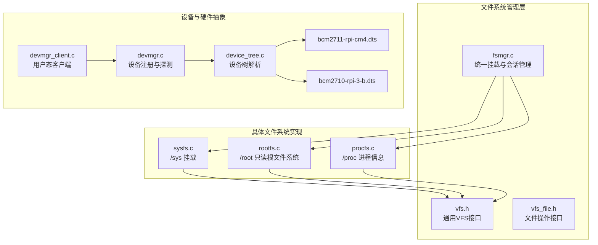
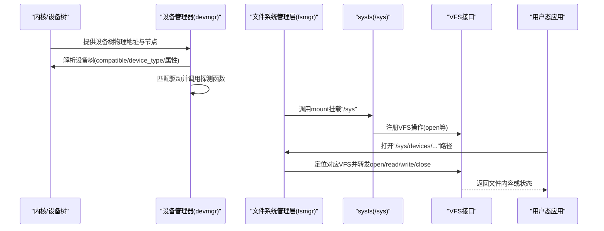
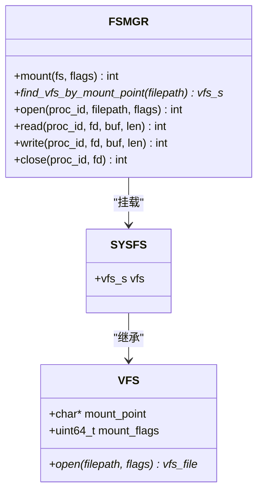
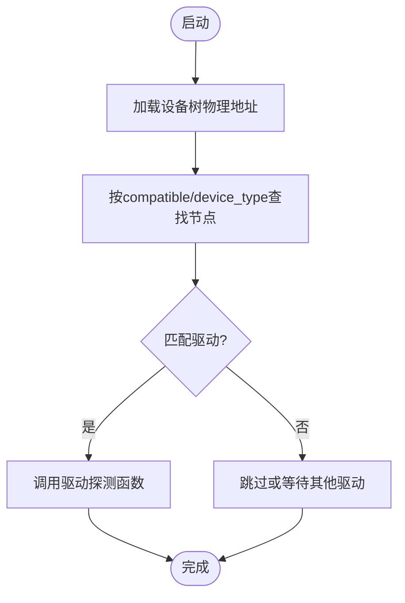
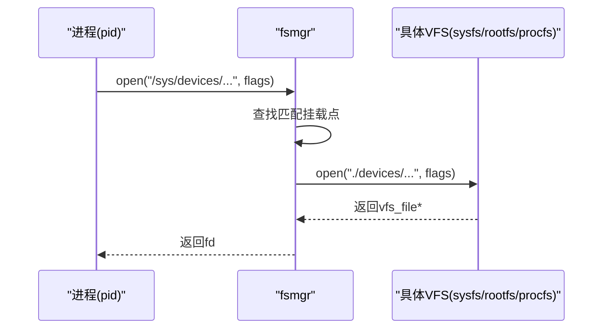
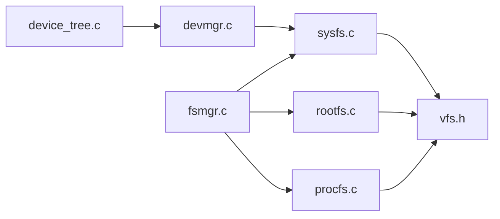

# 系统文件系统

<cite>
**本文引用的文件**
- [sysfs.c](file://uapps/fsmgr/sysfs/sysfs.c)
- [sysfs.h](file://uapps/fsmgr/include/sysfs/sysfs.h)
- [fsmgr.c](file://uapps/fsmgr/fsmgr.c)
- [fsmgr.h](file://uapps/fsmgr/include/fsmgr.h)
- [vfs.h](file://uapps/fsmgr/include/vfs/vfs.h)
- [vfs_file.h](file://uapps/fsmgr/include/vfs/vfs_file.h)
- [rootfs.c](file://uapps/fsmgr/rootfs/rootfs.c)
- [procfs.c](file://uapps/fsmgr/procfs/procfs.c)
- [devmgr.c](file://uapps/devmgr/devmgr.c)
- [devmgr.h](file://uapps/devmgr/include/devmgr.h)
- [device_tree.c](file://kernel/device/device_tree.c)
- [bcm2711-rpi-cm4.dts](file://platform/CM4/dts/bcm2711-rpi-cm4.dts)
- [bcm2710-rpi-3-b.dts](file://platform/Pi3b/dts/bcm2710-rpi-3-b.dts)
- [devmgr_client.c](file://ulibs/libsystem/devmgr_client.c)
</cite>

## 目录
1. [引言](#引言)
2. [项目结构](#项目结构)
3. [核心组件](#核心组件)
4. [架构总览](#架构总览)
5. [详细组件分析](#详细组件分析)
6. [依赖关系分析](#依赖关系分析)
7. [性能考虑](#性能考虑)
8. [故障排查指南](#故障排查指南)
9. [结论](#结论)
10. [附录：使用示例与系统管理技巧](#附录使用示例与系统管理技巧)

## 引言
本文件面向TranquilOS的系统文件系统（sysfs）设计与实现，聚焦其在硬件抽象层的角色与工作机制。sysfs作为内核向用户态暴露硬件拓扑与属性的虚拟文件系统接口，使系统信息以“文件化”的形式呈现，便于通过标准文件操作进行查询与配置。本文将结合代码与设备树（Device Tree）说明sysfs的挂载、目录组织、属性映射、动态更新以及与设备管理器的协作方式，并提供实用的使用示例与运维建议。

## 项目结构
TranquilOS的文件系统子系统由统一的文件系统管理层（fsmgr）协调多个具体文件系统实现，其中sysfs负责在“/sys”挂载点提供硬件信息视图；rootfs与procfs分别提供只读根文件系统与进程信息视图；设备管理器（devmgr）负责解析设备树并驱动硬件探测与初始化。

**图表来源**
- [fsmgr.c](file://uapps/fsmgr/fsmgr.c#L1-L216)
- [vfs.h](file://uapps/fsmgr/include/vfs/vfs.h#L1-L21)
- [vfs_file.h](file://uapps/fsmgr/include/vfs/vfs_file.h#L1-L19)
- [sysfs.c](file://uapps/fsmgr/sysfs/sysfs.c#L1-L28)
- [rootfs.c](file://uapps/fsmgr/rootfs/rootfs.c#L1-L100)
- [procfs.c](file://uapps/fsmgr/procfs/procfs.c#L1-L28)
- [devmgr.c](file://uapps/devmgr/devmgr.c#L1-L62)
- [device_tree.c](file://kernel/device/device_tree.c#L1-L95)
- [bcm2711-rpi-cm4.dts](file://platform/CM4/dts/bcm2711-rpi-cm4.dts#L1-L800)
- [bcm2710-rpi-3-b.dts](file://platform/Pi3b/dts/bcm2710-rpi-3-b.dts#L1-L800)
- [devmgr_client.c](file://ulibs/libsystem/devmgr_client.c#L1-L25)

**章节来源**
- [fsmgr.c](file://uapps/fsmgr/fsmgr.c#L1-L216)
- [sysfs.c](file://uapps/fsmgr/sysfs/sysfs.c#L1-L28)
- [rootfs.c](file://uapps/fsmgr/rootfs/rootfs.c#L1-L100)
- [procfs.c](file://uapps/fsmgr/procfs/procfs.c#L1-L28)
- [devmgr.c](file://uapps/devmgr/devmgr.c#L1-L62)
- [device_tree.c](file://kernel/device/device_tree.c#L1-L95)
- [bcm2711-rpi-cm4.dts](file://platform/CM4/dts/bcm2711-rpi-cm4.dts#L1-L800)
- [bcm2710-rpi-3-b.dts](file://platform/Pi3b/dts/bcm2710-rpi-3-b.dts#L1-L800)
- [devmgr_client.c](file://ulibs/libsystem/devmgr_client.c#L1-L25)

## 核心组件
- sysfs：在“/sys”挂载点提供系统硬件信息的虚拟文件系统视图，当前实现仅完成挂载入口，后续可扩展为设备树与属性文件的映射。
- fsmgr：统一的文件系统管理器，负责将不同文件系统挂载到指定路径，并为进程提供打开、读写、关闭等统一接口。
- VFS/VFS_FILE：抽象的文件系统接口与文件操作接口，屏蔽具体文件系统差异。
- rootfs：只读根文件系统，用于加载内核镜像或初始ramdisk内容。
- procfs：进程信息文件系统，提供运行时进程与调度信息。
- 设备管理器（devmgr）与设备树（device_tree）：解析平台设备树，定位硬件节点并驱动初始化。
- 设备树（DTS）：描述硬件拓扑、兼容性与属性，为sysfs提供数据源。

**章节来源**
- [sysfs.h](file://uapps/fsmgr/include/sysfs/sysfs.h#L1-L12)
- [sysfs.c](file://uapps/fsmgr/sysfs/sysfs.c#L1-L28)
- [fsmgr.h](file://uapps/fsmgr/include/fsmgr.h#L1-L43)
- [fsmgr.c](file://uapps/fsmgr/fsmgr.c#L1-L216)
- [vfs.h](file://uapps/fsmgr/include/vfs/vfs.h#L1-L21)
- [vfs_file.h](file://uapps/fsmgr/include/vfs/vfs_file.h#L1-L19)
- [rootfs.c](file://uapps/fsmgr/rootfs/rootfs.c#L1-L100)
- [procfs.c](file://uapps/fsmgr/procfs/procfs.c#L1-L28)
- [devmgr.h](file://uapps/devmgr/include/devmgr.h#L1-L30)
- [devmgr.c](file://uapps/devmgr/devmgr.c#L1-L62)
- [device_tree.c](file://kernel/device/device_tree.c#L1-L95)

## 架构总览
下图展示了TranquilOS中sysfs与设备树、设备管理器及文件系统管理层的交互关系。设备树提供硬件拓扑与属性，设备管理器根据兼容性匹配驱动并探测硬件，fsmgr负责将sysfs挂载到“/sys”，并通过VFS接口对外提供统一访问。

**图表来源**
- [devmgr.c](file://uapps/devmgr/devmgr.c#L1-L62)
- [device_tree.c](file://kernel/device/device_tree.c#L1-L95)
- [fsmgr.c](file://uapps/fsmgr/fsmgr.c#L1-L216)
- [sysfs.c](file://uapps/fsmgr/sysfs/sysfs.c#L1-L28)
- [vfs.h](file://uapps/fsmgr/include/vfs/vfs.h#L1-L21)

## 详细组件分析

### sysfs 组件分析
- 角色与职责
  - 在“/sys”挂载点提供系统硬件信息的虚拟文件系统视图。
  - 当前实现仅完成挂载入口，后续可扩展为将设备树节点映射为目录与属性文件。
- 关键接口
  - sysfs_init：设置挂载点为“/sys”，并向fsmgr注册挂载。
  - 结构体sysfs继承自vfs_s，具备通用VFS能力。
- 设计要点
  - 与fsmgr解耦，通过统一接口接入。
  - 与设备树/设备管理器协作，实现硬件信息的动态展示。

**图表来源**
- [sysfs.h](file://uapps/fsmgr/include/sysfs/sysfs.h#L1-L12)
- [vfs.h](file://uapps/fsmgr/include/vfs/vfs.h#L1-L21)
- [fsmgr.h](file://uapps/fsmgr/include/fsmgr.h#L1-L43)

**章节来源**
- [sysfs.c](file://uapps/fsmgr/sysfs/sysfs.c#L1-L28)
- [sysfs.h](file://uapps/fsmgr/include/sysfs/sysfs.h#L1-L12)
- [fsmgr.c](file://uapps/fsmgr/fsmgr.c#L1-L216)
- [fsmgr.h](file://uapps/fsmgr/include/fsmgr.h#L1-L43)
- [vfs.h](file://uapps/fsmgr/include/vfs/vfs.h#L1-L21)

### 设备树与设备管理器
- 设备树解析
  - device_tree.c提供设备树初始化、遍历、按兼容性/类型查找节点、属性查询等能力。
  - 支持打印设备树、迭代节点、获取节点地址等。
- 设备管理器
  - devmgr.c根据设备树物理地址与兼容性字符串匹配驱动，触发探测流程。
  - 提供节点地址转换、设备注册等辅助能力。
- 平台DTS
  - 平台目录包含多套设备树定义，描述硬件拓扑、外设节点与属性，为sysfs提供数据基础。

**图表来源**
- [device_tree.c](file://kernel/device/device_tree.c#L1-L95)
- [devmgr.c](file://uapps/devmgr/devmgr.c#L1-L62)
- [bcm2711-rpi-cm4.dts](file://platform/CM4/dts/bcm2711-rpi-cm4.dts#L1-L800)
- [bcm2710-rpi-3-b.dts](file://platform/Pi3b/dts/bcm2710-rpi-3-b.dts#L1-L800)

**章节来源**
- [device_tree.c](file://kernel/device/device_tree.c#L1-L95)
- [devmgr.c](file://uapps/devmgr/devmgr.c#L1-L62)
- [devmgr.h](file://uapps/devmgr/include/devmgr.h#L1-L30)
- [bcm2711-rpi-cm4.dts](file://platform/CM4/dts/bcm2711-rpi-cm4.dts#L1-L800)
- [bcm2710-rpi-3-b.dts](file://platform/Pi3b/dts/bcm2710-rpi-3-b.dts#L1-L800)

### 文件系统管理层（fsmgr）
- 职责
  - 统一挂载多个文件系统（如sysfs/rootfs/procfs）。
  - 为进程建立会话，分配文件描述符，转发open/read/write/close请求。
- 关键流程
  - 根据请求路径选择对应VFS实现（基于挂载点前缀匹配）。
  - 将绝对路径转换为相对路径后交由具体VFS处理。
- 性能与可靠性
  - 使用链表维护已挂载的VFS实例，查找效率与挂载数量线性相关。
  - 对空指针与未找到路径进行日志记录，便于问题定位。

**图表来源**
- [fsmgr.c](file://uapps/fsmgr/fsmgr.c#L65-L108)
- [fsmgr.h](file://uapps/fsmgr/include/fsmgr.h#L1-L43)
- [vfs.h](file://uapps/fsmgr/include/vfs/vfs.h#L1-L21)

**章节来源**
- [fsmgr.c](file://uapps/fsmgr/fsmgr.c#L1-L216)
- [fsmgr.h](file://uapps/fsmgr/include/fsmgr.h#L1-L43)
- [vfs.h](file://uapps/fsmgr/include/vfs/vfs.h#L1-L21)
- [vfs_file.h](file://uapps/fsmgr/include/vfs/vfs_file.h#L1-L19)

### rootfs 与 procfs
- rootfs
  - 只读根文件系统，从devmgr提供的cpio地址加载内容，支持open/read/write。
  - 当前实现写操作返回错误，体现只读特性。
- procfs
  - 进程信息文件系统，提供运行时进程与调度信息的文件化视图。

**章节来源**
- [rootfs.c](file://uapps/fsmgr/rootfs/rootfs.c#L1-L100)
- [procfs.c](file://uapps/fsmgr/procfs/procfs.c#L1-L28)
- [devmgr_client.c](file://ulibs/libsystem/devmgr_client.c#L1-L25)

## 依赖关系分析
- sysfs依赖fsmgr完成挂载与路径分发；同时依赖VFS接口实现文件操作。
- 设备树解析与设备管理器为sysfs提供硬件拓扑与属性数据源。
- rootfs与procfs与sysfs并列挂载于不同路径，共同构成系统文件系统视图。

**图表来源**
- [device_tree.c](file://kernel/device/device_tree.c#L1-L95)
- [devmgr.c](file://uapps/devmgr/devmgr.c#L1-L62)
- [sysfs.c](file://uapps/fsmgr/sysfs/sysfs.c#L1-L28)
- [fsmgr.c](file://uapps/fsmgr/fsmgr.c#L1-L216)
- [rootfs.c](file://uapps/fsmgr/rootfs/rootfs.c#L1-L100)
- [procfs.c](file://uapps/fsmgr/procfs/procfs.c#L1-L28)
- [vfs.h](file://uapps/fsmgr/include/vfs/vfs.h#L1-L21)

**章节来源**
- [device_tree.c](file://kernel/device/device_tree.c#L1-L95)
- [devmgr.c](file://uapps/devmgr/devmgr.c#L1-L62)
- [sysfs.c](file://uapps/fsmgr/sysfs/sysfs.c#L1-L28)
- [fsmgr.c](file://uapps/fsmgr/fsmgr.c#L1-L216)
- [rootfs.c](file://uapps/fsmgr/rootfs/rootfs.c#L1-L100)
- [procfs.c](file://uapps/fsmgr/procfs/procfs.c#L1-L28)
- [vfs.h](file://uapps/fsmgr/include/vfs/vfs.h#L1-L21)

## 性能考虑
- VFS查找复杂度：当前基于链表遍历已挂载VFS，时间复杂度为O(n)。若挂载点较多，可考虑哈希表优化。
- 设备树解析：设备树规模较大时，遍历与查找可能成为热点。建议在设备管理器侧缓存常用节点与属性。
- 文件操作：rootfs为只读，写操作直接失败；procfs与sysfs的读取应避免频繁大块读取，必要时采用分页策略。

## 故障排查指南
- sysfs挂载失败
  - 检查fsmgr是否成功获取且挂载标志正确。
  - 确认sysfs_init中挂载点设置为“/sys”。
- 路径无法打开
  - 使用fsmgr的日志确认路径匹配的VFS是否正确。
  - 检查具体VFS的open实现是否返回空指针。
- 设备树相关问题
  - 确认设备树物理地址有效且设备树格式正确。
  - 检查compatible/device_type是否与驱动匹配。
- 权限与只读限制
  - rootfs写操作会失败，属预期行为；如需修改请使用可写文件系统。

**章节来源**
- [sysfs.c](file://uapps/fsmgr/sysfs/sysfs.c#L1-L28)
- [fsmgr.c](file://uapps/fsmgr/fsmgr.c#L1-L216)
- [rootfs.c](file://uapps/fsmgr/rootfs/rootfs.c#L1-L100)
- [device_tree.c](file://kernel/device/device_tree.c#L1-L95)
- [devmgr.c](file://uapps/devmgr/devmgr.c#L1-L62)

## 结论
sysfs在TranquilOS中承担着将硬件信息以文件化方式呈现的关键角色。当前实现已完成挂载入口，后续可围绕以下方向演进：
- 将设备树节点映射为/sys/devices下的设备树与属性文件，形成完整的设备树视图。
- 实现热插拔事件通知与目录结构的动态更新，提升实时性。
- 增强属性文件的语义与权限控制，满足系统管理与安全需求。
- 与设备管理器深度集成，确保驱动探测与sysfs展示的一致性。

## 附录：使用示例与系统管理技巧
- 查看设备信息
  - 通过“/sys/devices”路径浏览设备树节点与属性文件，使用标准文件操作读取。
- 查看进程信息
  - 通过“/proc”路径查看进程与调度信息，便于系统监控与调试。
- 只读根文件系统
  - “/root”为只读根文件系统，适合存放初始ramdisk内容；写操作将被拒绝。
- 设备树集成
  - 平台DTS定义了丰富的硬件节点与属性，sysfs可据此构建一致的硬件视图。
- 动态更新建议
  - 在驱动探测完成后，可扩展sysfs以添加新设备目录与属性文件，实现热插拔场景下的自动响应。

**章节来源**
- [sysfs.c](file://uapps/fsmgr/sysfs/sysfs.c#L1-L28)
- [rootfs.c](file://uapps/fsmgr/rootfs/rootfs.c#L1-L100)
- [procfs.c](file://uapps/fsmgr/procfs/procfs.c#L1-L28)
- [devmgr.c](file://uapps/devmgr/devmgr.c#L1-L62)
- [device_tree.c](file://kernel/device/device_tree.c#L1-L95)
- [bcm2711-rpi-cm4.dts](file://platform/CM4/dts/bcm2711-rpi-cm4.dts#L1-L800)
- [bcm2710-rpi-3-b.dts](file://platform/Pi3b/dts/bcm2710-rpi-3-b.dts#L1-L800)