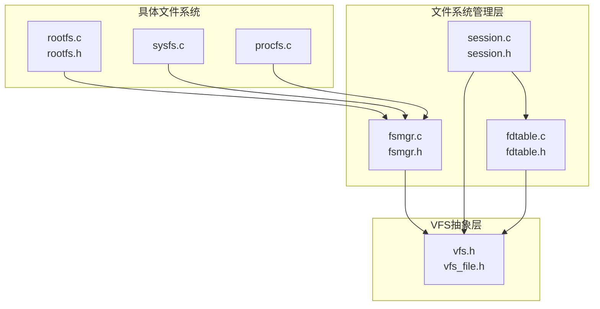
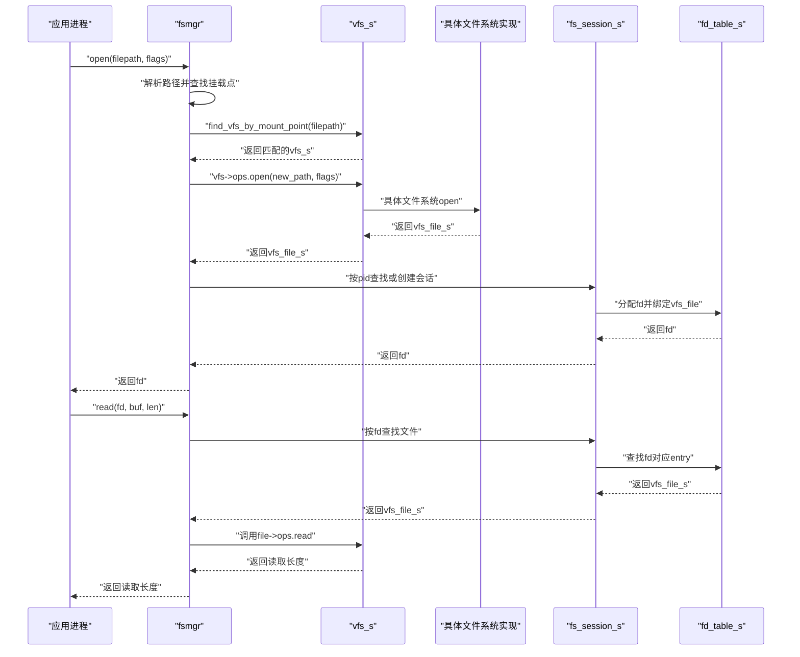
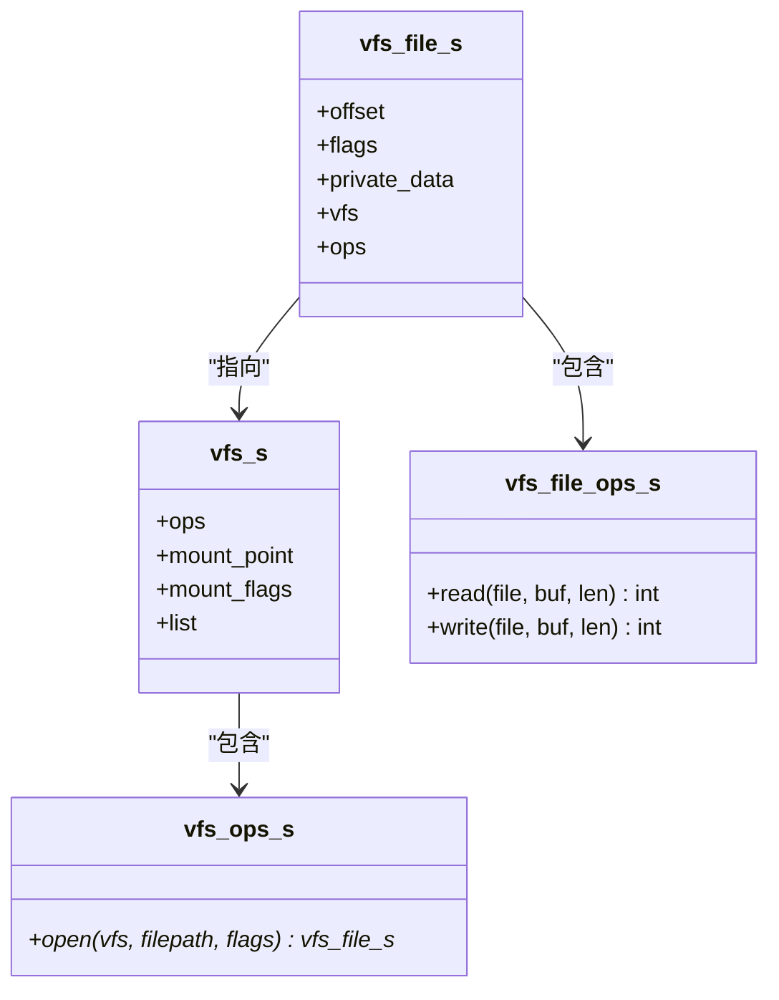
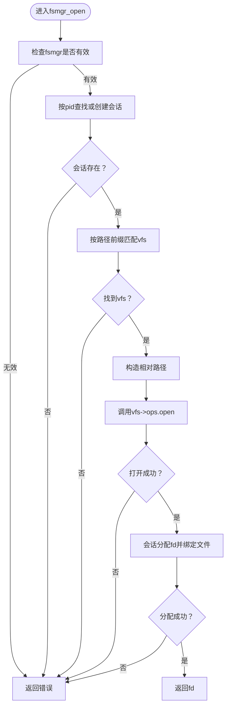
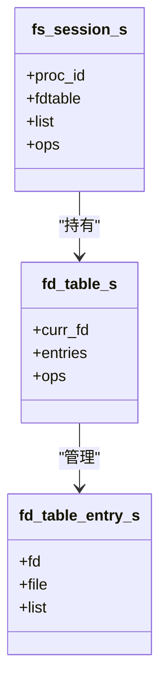
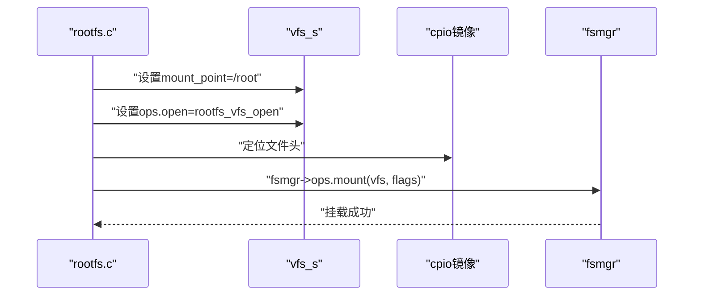
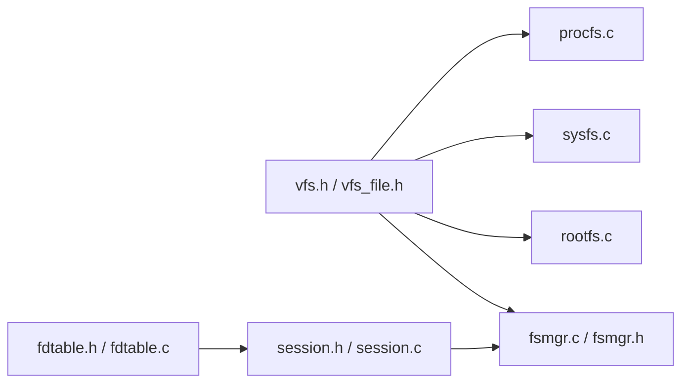

# 虚拟文件系统层

<cite>
**本文引用的文件**
- [vfs.h](file://uapps/fsmgr/include/vfs/vfs.h)
- [vfs_file.h](file://uapps/fsmgr/include/vfs/vfs_file.h)
- [fsmgr.h](file://uapps/fsmgr/include/fsmgr.h)
- [session.h](file://uapps/fsmgr/include/session.h)
- [fdtable.h](file://uapps/fsmgr/include/fdtable.h)
- [fsmgr.c](file://uapps/fsmgr/fsmgr.c)
- [session.c](file://uapps/fsmgr/session.c)
- [fdtable.c](file://uapps/fsmgr/fdtable.c)
- [rootfs.c](file://uapps/fsmgr/rootfs/rootfs.c)
- [rootfs.h](file://uapps/fsmgr/include/rootfs/rootfs.h)
- [sysfs.c](file://uapps/fsmgr/sysfs/sysfs.c)
- [procfs.c](file://uapps/fsmgr/procfs/procfs.c)
</cite>

## 目录
1. [简介](#简介)
2. [项目结构](#项目结构)
3. [核心组件](#核心组件)
4. [架构总览](#架构总览)
5. [详细组件分析](#详细组件分析)
6. [依赖关系分析](#依赖关系分析)
7. [性能考虑](#性能考虑)
8. [故障排查指南](#故障排查指南)
9. [结论](#结论)
10. [附录：扩展接口与新增文件系统](#附录扩展接口与新增文件系统)

## 简介
本文件系统层（VFS）旨在为TranquilOS提供统一的文件访问抽象，屏蔽底层具体文件系统的差异，向上层提供一致的打开、读写、关闭等操作接口。通过会话管理与文件描述符表，VFS实现了进程级的文件句柄管理，并支持多文件系统挂载与路由选择。

## 项目结构
VFS相关代码主要位于用户态服务uapps/fsmgr中，包含：
- VFS抽象层头文件：vfs.h、vfs_file.h
- 文件系统管理层：fsmgr.h、fsmgr.c
- 会话与FD表：session.h、fdtable.h、session.c、fdtable.c
- 具体文件系统实现示例：rootfs、sysfs、procfs

图表来源
- [fsmgr.c](file://uapps/fsmgr/fsmgr.c#L1-L216)
- [session.c](file://uapps/fsmgr/session.c#L1-L112)
- [fdtable.c](file://uapps/fsmgr/fdtable.c#L1-L96)
- [vfs.h](file://uapps/fsmgr/include/vfs/vfs.h#L1-L21)
- [vfs_file.h](file://uapps/fsmgr/include/vfs/vfs_file.h#L1-L19)
- [rootfs.c](file://uapps/fsmgr/rootfs/rootfs.c#L1-L100)
- [sysfs.c](file://uapps/fsmgr/sysfs/sysfs.c#L1-L28)
- [procfs.c](file://uapps/fsmgr/procfs/procfs.c#L1-L28)

章节来源
- [fsmgr.c](file://uapps/fsmgr/fsmgr.c#L1-L216)
- [session.c](file://uapps/fsmgr/session.c#L1-L112)
- [fdtable.c](file://uapps/fsmgr/fdtable.c#L1-L96)
- [vfs.h](file://uapps/fsmgr/include/vfs/vfs.h#L1-L21)
- [vfs_file.h](file://uapps/fsmgr/include/vfs/vfs_file.h#L1-L19)
- [rootfs.c](file://uapps/fsmgr/rootfs/rootfs.c#L1-L100)
- [sysfs.c](file://uapps/fsmgr/sysfs/sysfs.c#L1-L28)
- [procfs.c](file://uapps/fsmgr/procfs/procfs.c#L1-L28)

## 核心组件
- VFS抽象层
  - vfs_s：文件系统抽象，包含挂载点、挂载标志与操作函数指针open等。
  - vfs_file_s：文件对象抽象，包含偏移、标志、私有数据以及read/write等操作函数指针。
- 文件系统管理层
  - fsmgr_s：文件系统管理器，维护已挂载的VFS链表、进程级会话管理器、以及统一的open/read/write/close接口。
- 会话与文件描述符
  - fs_session_s：进程级会话，持有fd表并提供按PID查找、分配FD、按FD查找文件的能力。
  - fd_table_s：文件描述符表，以链表存储fd到vfs_file的映射，提供分配、释放、查询。

章节来源
- [vfs.h](file://uapps/fsmgr/include/vfs/vfs.h#L7-L19)
- [vfs_file.h](file://uapps/fsmgr/include/vfs/vfs_file.h#L4-L17)
- [fsmgr.h](file://uapps/fsmgr/include/fsmgr.h#L13-L37)
- [session.h](file://uapps/fsmgr/include/session.h#L7-L21)
- [fdtable.h](file://uapps/fsmgr/include/fdtable.h#L14-L27)

## 架构总览
VFS采用“抽象+分发”的设计：上层通过fsmgr统一入口调用，fsmgr根据路径前缀匹配到具体挂载点对应的vfs_s，再由该vfs_s的open回调打开文件，生成vfs_file_s并返回FD。读写时通过会话与FD表定位到对应文件对象，调用其read/write回调完成实际IO。

图表来源
- [fsmgr.c](file://uapps/fsmgr/fsmgr.c#L65-L108)
- [fsmgr.c](file://uapps/fsmgr/fsmgr.c#L110-L140)
- [session.c](file://uapps/fsmgr/session.c#L35-L60)
- [fdtable.c](file://uapps/fsmgr/fdtable.c#L4-L30)
- [rootfs.c](file://uapps/fsmgr/rootfs/rootfs.c#L32-L63)

章节来源
- [fsmgr.c](file://uapps/fsmgr/fsmgr.c#L65-L108)
- [fsmgr.c](file://uapps/fsmgr/fsmgr.c#L110-L140)
- [session.c](file://uapps/fsmgr/session.c#L35-L60)
- [fdtable.c](file://uapps/fsmgr/fdtable.c#L4-L30)
- [rootfs.c](file://uapps/fsmgr/rootfs/rootfs.c#L32-L63)

## 详细组件分析

### VFS抽象层
- vfs_s
  - 字段：ops（open等）、mount_point（挂载点）、mount_flags（只读/读写）、链表节点用于挂载列表。
  - 作用：作为具体文件系统的统一入口，封装不同文件系统的open行为。
- vfs_file_s
  - 字段：offset（当前读写偏移）、flags（打开标志）、private_data（指向具体文件系统内部数据）、vfs指针、ops（read/write）。
  - 作用：承载一次打开后的文件状态与操作能力。

图表来源
- [vfs.h](file://uapps/fsmgr/include/vfs/vfs.h#L7-L19)
- [vfs_file.h](file://uapps/fsmgr/include/vfs/vfs_file.h#L4-L17)

章节来源
- [vfs.h](file://uapps/fsmgr/include/vfs/vfs.h#L7-L19)
- [vfs_file.h](file://uapps/fsmgr/include/vfs/vfs_file.h#L4-L17)

### 文件系统管理层（fsmgr）
- 功能
  - 挂载管理：将vfs_s加入链表，支持多文件系统共存。
  - 路径路由：根据输入路径前缀匹配挂载点，返回对应vfs_s。
  - 统一接口：open/read/write/close，内部委派给具体文件系统与会话/FD表。
- 关键流程
  - 打开：解析路径、定位vfs、调用open、分配fd并返回。
  - 读写：按pid查找会话，按fd查找文件，调用文件对象read/write。

图表来源
- [fsmgr.c](file://uapps/fsmgr/fsmgr.c#L65-L108)

章节来源
- [fsmgr.c](file://uapps/fsmgr/fsmgr.c#L8-L28)
- [fsmgr.c](file://uapps/fsmgr/fsmgr.c#L30-L63)
- [fsmgr.c](file://uapps/fsmgr/fsmgr.c#L65-L108)
- [fsmgr.c](file://uapps/fsmgr/fsmgr.c#L110-L140)
- [fsmgr.c](file://uapps/fsmgr/fsmgr.c#L142-L172)
- [fsmgr.c](file://uapps/fsmgr/fsmgr.c#L174-L190)
- [fsmgr.c](file://uapps/fsmgr/fsmgr.c#L192-L212)

### 会话与文件描述符表
- fs_session_s
  - 字段：proc_id、fdtable、链表节点、ops（分配/释放/查找）。
  - 作用：进程级上下文，维护该进程的FD集合。
- fd_table_s
  - 字段：curr_fd（下一个可用fd）、entries（fd条目链表）、ops。
  - 作用：以链表组织fd到vfs_file的映射，提供分配、删除、查找。

图表来源
- [session.h](file://uapps/fsmgr/include/session.h#L16-L21)
- [fdtable.h](file://uapps/fsmgr/include/fdtable.h#L23-L27)
- [fdtable.h](file://uapps/fsmgr/include/fdtable.h#L8-L12)

章节来源
- [session.h](file://uapps/fsmgr/include/session.h#L7-L21)
- [session.h](file://uapps/fsmgr/include/session.h#L23-L35)
- [fdtable.h](file://uapps/fsmgr/include/fdtable.h#L8-L27)
- [session.c](file://uapps/fsmgr/session.c#L35-L60)
- [fdtable.c](file://uapps/fsmgr/fdtable.c#L4-L30)
- [fdtable.c](file://uapps/fsmgr/fdtable.c#L32-L61)
- [fdtable.c](file://uapps/fsmgr/fdtable.c#L63-L83)

### 具体文件系统实现（示例）
- rootfs
  - 读取：从cpio镜像中定位文件头，拷贝数据至用户缓冲区，维护offset。
  - 写入：只读文件系统，直接返回错误。
  - 初始化：设置挂载点为“/root”，注册open回调，向fsmgr注册挂载。
- sysfs/procfs
  - 初始化：设置挂载点分别为“/sys”、“/proc”，注册挂载标志（读写），并向fsmgr注册挂载。

图表来源
- [rootfs.c](file://uapps/fsmgr/rootfs/rootfs.c#L75-L100)
- [rootfs.c](file://uapps/fsmgr/rootfs/rootfs.c#L32-L63)
- [rootfs.h](file://uapps/fsmgr/include/rootfs/rootfs.h#L6-L9)
- [sysfs.c](file://uapps/fsmgr/sysfs/sysfs.c#L12-L27)
- [procfs.c](file://uapps/fsmgr/procfs/procfs.c#L12-L27)

章节来源
- [rootfs.c](file://uapps/fsmgr/rootfs/rootfs.c#L12-L30)
- [rootfs.c](file://uapps/fsmgr/rootfs/rootfs.c#L32-L63)
- [rootfs.c](file://uapps/fsmgr/rootfs/rootfs.c#L75-L100)
- [rootfs.h](file://uapps/fsmgr/include/rootfs/rootfs.h#L6-L9)
- [sysfs.c](file://uapps/fsmgr/sysfs/sysfs.c#L12-L27)
- [procfs.c](file://uapps/fsmgr/procfs/procfs.c#L12-L27)

## 依赖关系分析
- fsmgr依赖vfs抽象层（vfs.h/vfs_file.h）进行统一接口定义与分发。
- 会话与FD表独立于具体文件系统，仅依赖vfs_file抽象，便于复用与扩展。
- 具体文件系统（rootfs/sysfs/procfs）通过注册open回调接入fsmgr，实现多文件系统共存。

图表来源
- [fsmgr.c](file://uapps/fsmgr/fsmgr.c#L1-L216)
- [session.c](file://uapps/fsmgr/session.c#L1-L112)
- [fdtable.c](file://uapps/fsmgr/fdtable.c#L1-L96)
- [vfs.h](file://uapps/fsmgr/include/vfs/vfs.h#L1-L21)
- [vfs_file.h](file://uapps/fsmgr/include/vfs/vfs_file.h#L1-L19)
- [rootfs.c](file://uapps/fsmgr/rootfs/rootfs.c#L1-L100)
- [sysfs.c](file://uapps/fsmgr/sysfs/sysfs.c#L1-L28)
- [procfs.c](file://uapps/fsmgr/procfs/procfs.c#L1-L28)

章节来源
- [fsmgr.c](file://uapps/fsmgr/fsmgr.c#L1-L216)
- [session.c](file://uapps/fsmgr/session.c#L1-L112)
- [fdtable.c](file://uapps/fsmgr/fdtable.c#L1-L96)
- [vfs.h](file://uapps/fsmgr/include/vfs/vfs.h#L1-L21)
- [vfs_file.h](file://uapps/fsmgr/include/vfs/vfs_file.h#L1-L19)
- [rootfs.c](file://uapps/fsmgr/rootfs/rootfs.c#L1-L100)
- [sysfs.c](file://uapps/fsmgr/sysfs/sysfs.c#L1-L28)
- [procfs.c](file://uapps/fsmgr/procfs/procfs.c#L1-L28)

## 性能考虑
- 路由效率：当前路径到vfs的匹配使用前缀比较，建议在挂载点较多时引入更高效的前缀树或哈希表以降低查找复杂度。
- FD表遍历：当前FD表基于链表，查找/删除为O(n)。可考虑使用哈希表优化以提升大并发下的性能。
- 缓存策略：当前未见专用缓存层。可在vfs_file层面增加页缓存或在具体文件系统（如rootfs）中对热点数据做缓存，减少重复解析与拷贝。
- 并发安全：会话与FD表未显式加锁，建议在多线程场景下引入轻量锁或无锁队列，避免竞态条件。

## 故障排查指南
- 打开失败
  - 检查fsmgr是否初始化成功、挂载点是否正确、路径是否以挂载点开头。
  - 查看具体文件系统open回调是否返回空指针。
- 读写失败
  - 确认fd有效且未被释放；检查文件对象read/write回调是否返回负值。
- 会话缺失
  - 确认按pid创建了会话；检查会话管理器的查找/创建逻辑。
- 日志定位
  - 使用fsmgr与各模块中的日志输出定位问题发生阶段。

章节来源
- [fsmgr.c](file://uapps/fsmgr/fsmgr.c#L65-L108)
- [fsmgr.c](file://uapps/fsmgr/fsmgr.c#L110-L140)
- [session.c](file://uapps/fsmgr/session.c#L5-L33)
- [fdtable.c](file://uapps/fsmgr/fdtable.c#L32-L61)
- [rootfs.c](file://uapps/fsmgr/rootfs/rootfs.c#L26-L30)

## 结论
TranquilOS的VFS通过抽象层与文件系统管理器实现了对多文件系统的统一访问，结合进程级会话与FD表，提供了稳定的文件句柄管理。当前实现简洁清晰，具备良好的扩展性；未来可在路由、FD表、缓存与并发方面进一步优化。

## 附录：扩展接口与新增文件系统
- 新增文件系统步骤
  - 定义结构体包含vfs_s作为基类字段，设置mount_point与挂载标志。
  - 实现open回调，返回vfs_file_s（含read/write回调与私有数据）。
  - 在初始化中调用fsmgr->ops.mount注册挂载。
- 接口清单
  - 挂载：fsmgr->ops.mount(fsmgr, vfs, flags)
  - 打开：fsmgr->fs_ops.open(fsmgr, pid, filepath, flags)
  - 读写：fsmgr->fs_ops.read/write(fsmgr, pid, fd, buf, len)
  - 关闭：fsmgr->fs_ops.close(fsmgr, pid, fd)

章节来源
- [fsmgr.h](file://uapps/fsmgr/include/fsmgr.h#L13-L29)
- [fsmgr.c](file://uapps/fsmgr/fsmgr.c#L8-L28)
- [fsmgr.c](file://uapps/fsmgr/fsmgr.c#L192-L212)
- [rootfs.c](file://uapps/fsmgr/rootfs/rootfs.c#L75-L100)
- [sysfs.c](file://uapps/fsmgr/sysfs/sysfs.c#L12-L27)
- [procfs.c](file://uapps/fsmgr/procfs/procfs.c#L12-L27)