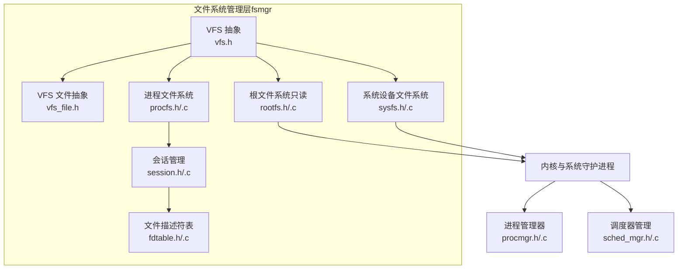
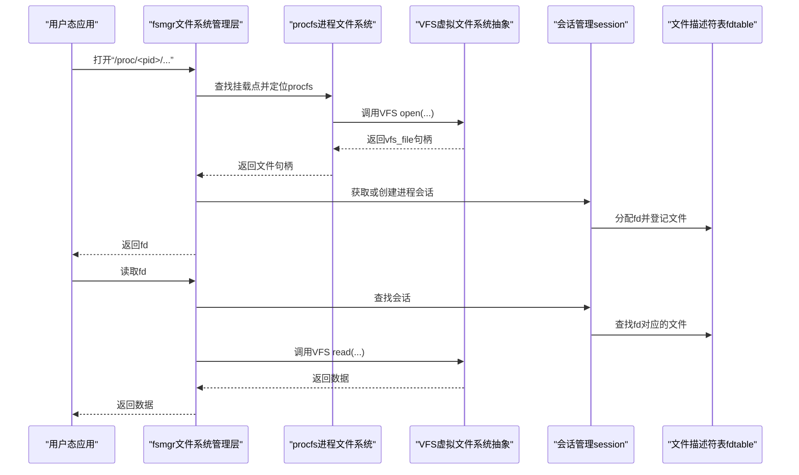
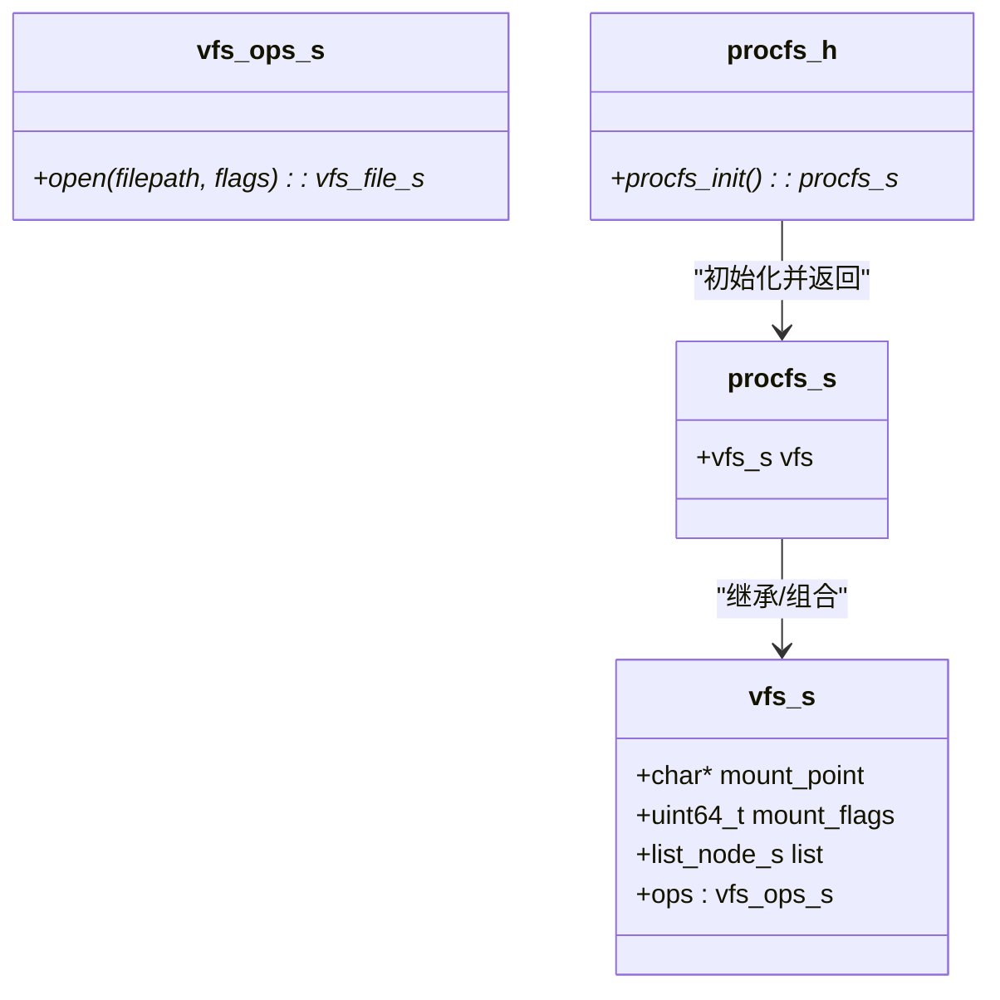
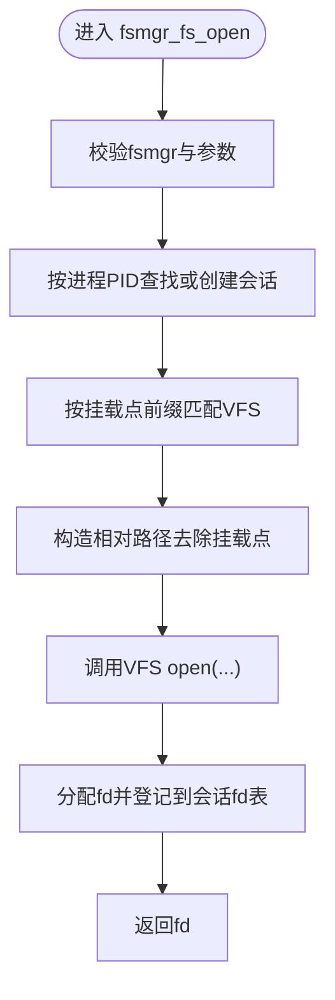
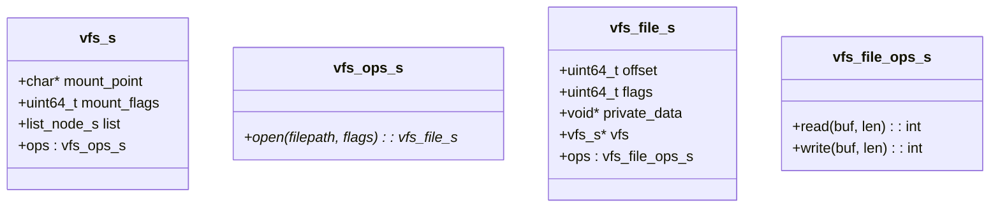
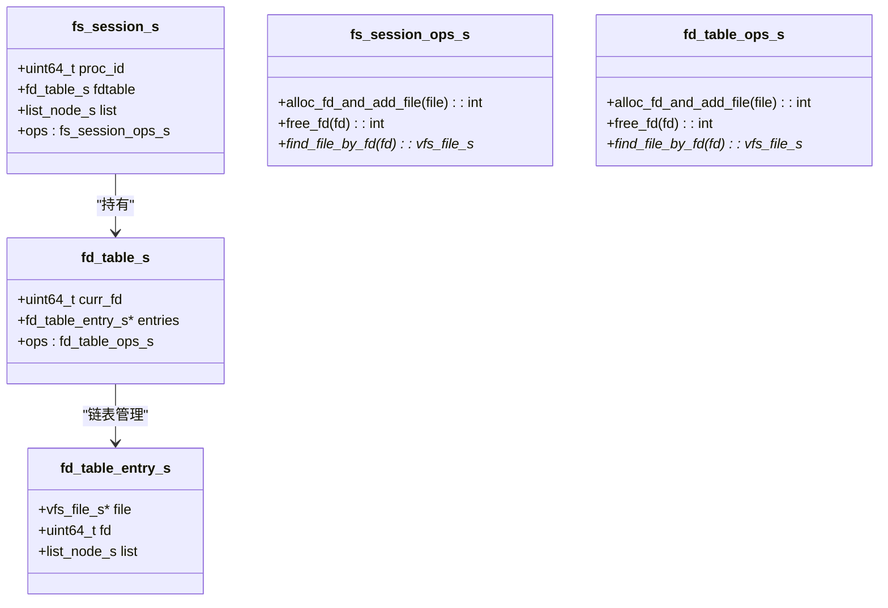
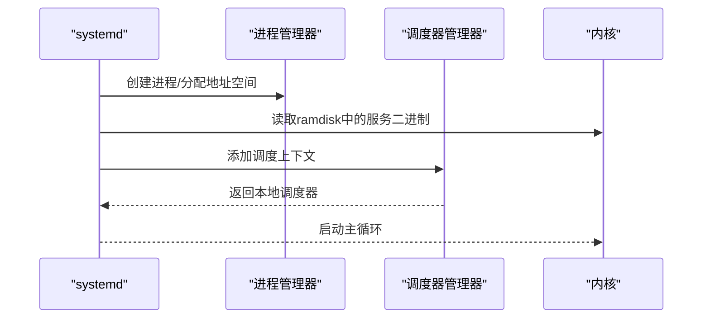
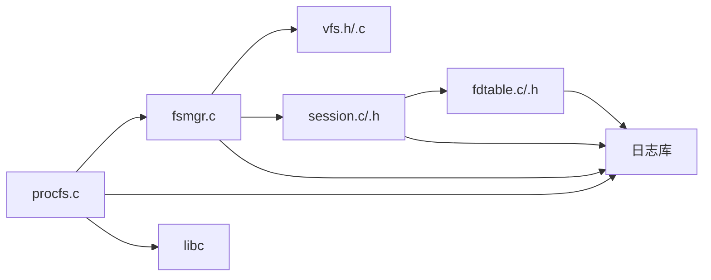

# 进程文件系统

<cite>
**本文引用的文件**
- [procfs.h](file://uapps/fsmgr/include/procfs/procfs.h)
- [procfs.c](file://uapps/fsmgr/procfs/procfs.c)
- [fsmgr.h](file://uapps/fsmgr/include/fsmgr.h)
- [fsmgr.c](file://uapps/fsmgr/fsmgr.c)
- [vfs.h](file://uapps/fsmgr/include/vfs/vfs.h)
- [vfs_file.h](file://uapps/fsmgr/include/vfs/vfs_file.h)
- [session.h](file://uapps/fsmgr/include/session.h)
- [session.c](file://uapps/fsmgr/session.c)
- [fdtable.h](file://uapps/fsmgr/include/fdtable.h)
- [fdtable.c](file://uapps/fsmgr/fdtable.c)
- [rootfs.h](file://uapps/fsmgr/include/rootfs/rootfs.h)
- [rootfs.c](file://uapps/fsmgr/rootfs/rootfs.c)
- [sysfs.h](file://uapps/fsmgr/include/sysfs/sysfs.h)
- [sysfs.c](file://uapps/fsmgr/sysfs/sysfs.c)
- [procmgr.h](file://kernel/systemd/include/procmgr/procmgr.h)
- [procmgr.c](file://kernel/systemd/procmgr/procmgr.c)
- [thread.c](file://kernel/systemd/procmgr/thread.c)
- [sched_mgr.h](file://kernel/include/scheduler/sched_mgr.h)
- [sched_mgr.c](file://kernel/schedule/sched_mgr.c)
- [systemd.c](file://kernel/systemd/systemd.c)
- [kernel.c](file://kernel/kernel.c)
</cite>

## 目录
1. [简介](#简介)
2. [项目结构](#项目结构)
3. [核心组件](#核心组件)
4. [架构总览](#架构总览)
5. [详细组件分析](#详细组件分析)
6. [依赖关系分析](#依赖关系分析)
7. [性能考量](#性能考量)
8. [故障排查指南](#故障排查指南)
9. [结论](#结论)
10. [附录：使用示例与调试技巧](#附录使用示例与调试技巧)

## 简介
本文件面向TranquilOS的进程文件系统（procfs）进行系统性说明。procfs作为虚拟文件系统的一种，将进程相关信息以文件形式暴露给用户态，便于通过标准文件操作接口（如cat、ls等）进行查询与调试。在TranquilOS中，procfs通过统一的文件系统管理层（fsmgr）挂载到“/proc”路径，并与进程管理、调度、能力(capability)调用以及设备树等内核模块协同工作。

本文件涵盖以下主题：
- 设计目的与在系统调试中的作用
- 目录结构与文件组织方式
- 进程信息的文件化表示（状态、内存映射、文件描述符等）
- 动态生成机制（基于当前系统状态实时生成内容）
- 安全控制机制（权限检查与访问限制）
- 使用示例与调试技巧

## 项目结构
procfs位于用户态文件系统管理框架（fsmgr）之下，与rootfs、sysfs并列挂载，共同构成系统的虚拟文件系统层。其核心职责是将进程管理与系统运行时信息以文件形式呈现。

图表来源
- [procfs.h](file://uapps/fsmgr/include/procfs/procfs.h#L1-L12)
- [procfs.c](file://uapps/fsmgr/procfs/procfs.c#L1-L28)
- [fsmgr.h](file://uapps/fsmgr/include/fsmgr.h#L1-L43)
- [fsmgr.c](file://uapps/fsmgr/fsmgr.c#L1-L200)
- [vfs.h](file://uapps/fsmgr/include/vfs/vfs.h#L1-L21)
- [vfs_file.h](file://uapps/fsmgr/include/vfs/vfs_file.h#L1-L19)
- [session.h](file://uapps/fsmgr/include/session.h#L1-L39)
- [session.c](file://uapps/fsmgr/session.c#L1-L112)
- [fdtable.h](file://uapps/fsmgr/include/fdtable.h#L1-L200)
- [fdtable.c](file://uapps/fsmgr/fdtable.c#L1-L96)
- [rootfs.h](file://uapps/fsmgr/include/rootfs/rootfs.h#L1-L13)
- [rootfs.c](file://uapps/fsmgr/rootfs/rootfs.c#L1-L100)
- [sysfs.h](file://uapps/fsmgr/include/sysfs/sysfs.h#L1-L12)
- [sysfs.c](file://uapps/fsmgr/sysfs/sysfs.c#L1-L28)

章节来源
- [procfs.h](file://uapps/fsmgr/include/procfs/procfs.h#L1-L12)
- [procfs.c](file://uapps/fsmgr/procfs/procfs.c#L1-L28)
- [fsmgr.h](file://uapps/fsmgr/include/fsmgr.h#L1-L43)
- [fsmgr.c](file://uapps/fsmgr/fsmgr.c#L1-L200)
- [vfs.h](file://uapps/fsmgr/include/vfs/vfs.h#L1-L21)
- [vfs_file.h](file://uapps/fsmgr/include/vfs/vfs_file.h#L1-L19)
- [session.h](file://uapps/fsmgr/include/session.h#L1-L39)
- [session.c](file://uapps/fsmgr/session.c#L1-L112)
- [fdtable.h](file://uapps/fsmgr/include/fdtable.h#L1-L200)
- [fdtable.c](file://uapps/fsmgr/fdtable.c#L1-L96)
- [rootfs.h](file://uapps/fsmgr/include/rootfs/rootfs.h#L1-L13)
- [rootfs.c](file://uapps/fsmgr/rootfs/rootfs.c#L1-L100)
- [sysfs.h](file://uapps/fsmgr/include/sysfs/sysfs.h#L1-L12)
- [sysfs.c](file://uapps/fsmgr/sysfs/sysfs.c#L1-L28)

## 核心组件
- 进程文件系统（procfs）：负责将进程相关信息以文件形式暴露，挂载点为“/proc”。其内部封装了VFS接口，通过fsmgr完成挂载与文件打开流程。
- 文件系统管理层（fsmgr）：提供统一的挂载接口、按挂载点查找VFS的能力，以及进程级文件操作（open/read/write/close）的代理。
- VFS与VFS文件抽象：定义通用的挂载点、打开接口、文件读写接口，为不同文件系统（procfs/rootfs/sysfs）提供统一契约。
- 会话与文件描述符表：每个进程拥有独立的会话（fs_session），会话内维护文件描述符表（fdtable），用于将打开的VFS文件映射为进程可用的fd。
- 进程管理与调度：系统守护进程（systemd）负责创建进程、分配地址空间与能力节点；调度器管理器负责调度上下文的添加与获取。

章节来源
- [procfs.h](file://uapps/fsmgr/include/procfs/procfs.h#L1-L12)
- [procfs.c](file://uapps/fsmgr/procfs/procfs.c#L1-L28)
- [fsmgr.h](file://uapps/fsmgr/include/fsmgr.h#L1-L43)
- [fsmgr.c](file://uapps/fsmgr/fsmgr.c#L65-L108)
- [vfs.h](file://uapps/fsmgr/include/vfs/vfs.h#L1-L21)
- [vfs_file.h](file://uapps/fsmgr/include/vfs/vfs_file.h#L1-L19)
- [session.h](file://uapps/fsmgr/include/session.h#L1-L39)
- [session.c](file://uapps/fsmgr/session.c#L1-L112)
- [fdtable.h](file://uapps/fsmgr/include/fdtable.h#L1-L200)
- [fdtable.c](file://uapps/fsmgr/fdtable.c#L1-L96)
- [procmgr.h](file://kernel/systemd/include/procmgr/procmgr.h#L1-L32)
- [procmgr.c](file://kernel/systemd/procmgr/procmgr.c#L127-L143)
- [sched_mgr.h](file://kernel/include/scheduler/sched_mgr.h#L30-L49)
- [sched_mgr.c](file://kernel/schedule/sched_mgr.c#L131-L162)

## 架构总览
下图展示了从用户态对“/proc”下文件的访问，到内核侧进程管理与调度的整体流程。

图表来源
- [fsmgr.c](file://uapps/fsmgr/fsmgr.c#L65-L108)
- [procfs.c](file://uapps/fsmgr/procfs/procfs.c#L12-L28)
- [vfs.h](file://uapps/fsmgr/include/vfs/vfs.h#L1-L21)
- [vfs_file.h](file://uapps/fsmgr/include/vfs/vfs_file.h#L1-L19)
- [session.c](file://uapps/fsmgr/session.c#L1-L112)
- [fdtable.c](file://uapps/fsmgr/fdtable.c#L1-L96)

## 详细组件分析

### 组件A：进程文件系统（procfs）
- 角色与职责
  - 将进程相关信息以文件形式暴露于“/proc”挂载点下
  - 通过fsmgr完成挂载，并将具体文件打开委托给底层VFS实现
- 关键接口
  - 初始化函数：设置挂载点为“/proc”，并通过fsmgr注册
  - 依赖：VFS抽象、fsmgr、日志与系统客户端库
- 数据结构
  - 结构体包含一个vfs_s类型的成员，用于承载VFS接口与挂载信息

图表来源
- [procfs.h](file://uapps/fsmgr/include/procfs/procfs.h#L1-L12)
- [procfs.c](file://uapps/fsmgr/procfs/procfs.c#L1-L28)
- [vfs.h](file://uapps/fsmgr/include/vfs/vfs.h#L1-L21)

章节来源
- [procfs.h](file://uapps/fsmgr/include/procfs/procfs.h#L1-L12)
- [procfs.c](file://uapps/fsmgr/procfs/procfs.c#L1-L28)

### 组件B：文件系统管理层（fsmgr）
- 角色与职责
  - 提供挂载接口，支持多个VFS实例链式挂载
  - 按路径前缀匹配挂载点，定位目标VFS
  - 代理进程级文件操作（open/read/write/close），并维护进程会话与fd表
- 关键流程
  - 打开文件：解析路径、定位VFS、打开文件、分配fd并登记到会话
  - 读写文件：根据fd查找文件句柄，调用VFS读写接口
- 性能与复杂度
  - 挂载点查找为线性遍历（链表），时间复杂度O(n)，n为已挂载VFS数量
  - 打开/关闭文件为O(1)，读写文件为O(1)寻址

图表来源
- [fsmgr.c](file://uapps/fsmgr/fsmgr.c#L65-L108)
- [session.c](file://uapps/fsmgr/session.c#L1-L112)
- [fdtable.c](file://uapps/fsmgr/fdtable.c#L1-L96)

章节来源
- [fsmgr.h](file://uapps/fsmgr/include/fsmgr.h#L1-L43)
- [fsmgr.c](file://uapps/fsmgr/fsmgr.c#L1-L200)

### 组件C：VFS与VFS文件抽象
- 角色与职责
  - VFS：定义挂载点、挂载标志、链表连接与open操作接口
  - VFS文件：定义文件偏移、标志、私有数据、所属VFS及读写接口
- 与procfs的关系
  - procfs作为VFS实现之一，提供open接口，将请求转发至具体实现（例如后续可扩展为从进程管理器读取信息）

图表来源
- [vfs.h](file://uapps/fsmgr/include/vfs/vfs.h#L1-L21)
- [vfs_file.h](file://uapps/fsmgr/include/vfs/vfs_file.h#L1-L19)

章节来源
- [vfs.h](file://uapps/fsmgr/include/vfs/vfs.h#L1-L21)
- [vfs_file.h](file://uapps/fsmgr/include/vfs/vfs_file.h#L1-L19)

### 组件D：会话与文件描述符表
- 角色与职责
  - 会话（fs_session）：按进程PID组织，维护fd表与操作接口
  - 文件描述符表（fdtable）：为每个打开的文件分配连续fd，支持查找、删除与释放
- 与procfs的关系
  - procfs通过fsmgr打开文件后，由会话与fd表完成fd分配与生命周期管理

图表来源
- [session.h](file://uapps/fsmgr/include/session.h#L1-L39)
- [session.c](file://uapps/fsmgr/session.c#L1-L112)
- [fdtable.h](file://uapps/fsmgr/include/fdtable.h#L1-L200)
- [fdtable.c](file://uapps/fsmgr/fdtable.c#L1-L96)

章节来源
- [session.h](file://uapps/fsmgr/include/session.h#L1-L39)
- [session.c](file://uapps/fsmgr/session.c#L1-L112)
- [fdtable.h](file://uapps/fsmgr/include/fdtable.h#L1-L200)
- [fdtable.c](file://uapps/fsmgr/fdtable.c#L1-L96)

### 组件E：进程管理与调度（与procfs的集成点）
- 角色与职责
  - 进程管理器：负责创建进程、生成PID、统计进程/线程数
  - 调度器管理器：负责为调度上下文分配本地调度器
  - 系统守护进程（systemd）：启动内存管理、IPC、服务，并加载ramdisk中的服务二进制
- 与procfs的关系
  - procfs通过fsmgr与系统其他子系统解耦；进程信息的最终来源由进程管理器与调度器提供

图表来源
- [procmgr.h](file://kernel/systemd/include/procmgr/procmgr.h#L1-L32)
- [procmgr.c](file://kernel/systemd/procmgr/procmgr.c#L127-L143)
- [sched_mgr.h](file://kernel/include/scheduler/sched_mgr.h#L30-L49)
- [sched_mgr.c](file://kernel/schedule/sched_mgr.c#L131-L162)
- [systemd.c](file://kernel/systemd/systemd.c#L76-L246)

章节来源
- [procmgr.h](file://kernel/systemd/include/procmgr/procmgr.h#L1-L32)
- [procmgr.c](file://kernel/systemd/procmgr/procmgr.c#L127-L143)
- [sched_mgr.h](file://kernel/include/scheduler/sched_mgr.h#L30-L49)
- [sched_mgr.c](file://kernel/schedule/sched_mgr.c#L131-L162)
- [systemd.c](file://kernel/systemd/systemd.c#L76-L246)

## 依赖关系分析
- 组件耦合
  - procfs依赖fsmgr提供的挂载与路径解析能力
  - fsmgr依赖VFS抽象与会话/fd表实现
  - 会话与fd表相互协作，形成进程级文件句柄管理
- 外部依赖
  - 日志库、字符串与内存工具库
  - 系统守护进程（systemd）与进程管理器（procmgr）、调度器管理器（sched_mgr）提供运行时数据来源

图表来源
- [procfs.c](file://uapps/fsmgr/procfs/procfs.c#L1-L28)
- [fsmgr.c](file://uapps/fsmgr/fsmgr.c#L1-L200)
- [vfs.h](file://uapps/fsmgr/include/vfs/vfs.h#L1-L21)
- [session.c](file://uapps/fsmgr/session.c#L1-L112)
- [fdtable.c](file://uapps/fsmgr/fdtable.c#L1-L96)

章节来源
- [procfs.c](file://uapps/fsmgr/procfs/procfs.c#L1-L28)
- [fsmgr.c](file://uapps/fsmgr/fsmgr.c#L1-L200)
- [vfs.h](file://uapps/fsmgr/include/vfs/vfs.h#L1-L21)
- [session.c](file://uapps/fsmgr/session.c#L1-L112)
- [fdtable.c](file://uapps/fsmgr/fdtable.c#L1-L96)

## 性能考量
- 挂载点查找为线性扫描，建议在挂载点数量较少时使用；若未来挂载点增多，可考虑引入哈希表优化
- 打开/关闭文件与读写文件均为O(1)操作，性能开销主要来自VFS实现与系统调用
- 会话与fd表采用链表管理，查找/删除为O(n)；可通过哈希表进一步优化

## 故障排查指南
- 打开文件失败
  - 检查fsmgr是否正确初始化，挂载点是否匹配
  - 确认VFS open返回非空，否则可能路径不正确或VFS未实现
- 读取文件失败
  - 检查fd是否有效，会话是否存在
  - 确认VFS read返回值非负
- 日志定位
  - 使用日志输出定位错误发生的具体阶段（fsmgr、VFS、会话、fd表）

章节来源
- [fsmgr.c](file://uapps/fsmgr/fsmgr.c#L65-L108)
- [session.c](file://uapps/fsmgr/session.c#L1-L112)
- [fdtable.c](file://uapps/fsmgr/fdtable.c#L1-L96)

## 结论
TranquilOS的procfs通过fsmgr实现了对“/proc”的统一挂载与访问代理，结合VFS抽象、会话与fd表，为用户态提供了以文件形式查询进程信息的能力。尽管当前实现以静态挂载为主，但其架构清晰、模块边界明确，便于后续扩展为动态生成模式（例如按需从进程管理器读取状态、内存映射、文件描述符等），并在安全与性能方面具备良好的演进空间。

## 附录：使用示例与调试技巧
- 基本命令
  - 列出/proc目录：使用ls查看挂载点下的条目
  - 查看进程信息：使用cat读取特定进程的文件（如状态、内存映射、文件描述符等）
- 典型场景
  - 查看进程状态：访问“/proc/<pid>/stat”或“/proc/<pid>/status”
  - 查看内存映射：访问“/proc/<pid>/maps”
  - 查看文件描述符：访问“/proc/<pid>/fd”
- 调试技巧
  - 通过日志确认fsmgr的路径解析与VFS打开流程
  - 在读取前先验证fd有效性，避免无效fd导致的读取失败
  - 若出现权限问题，检查挂载标志与访问路径是否匹配