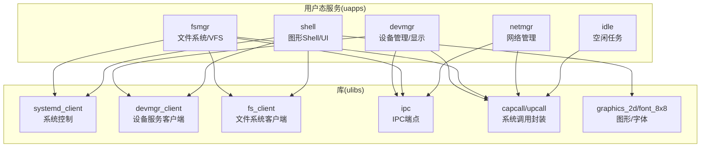
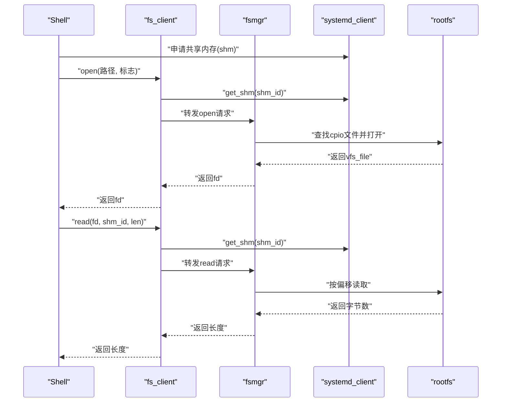
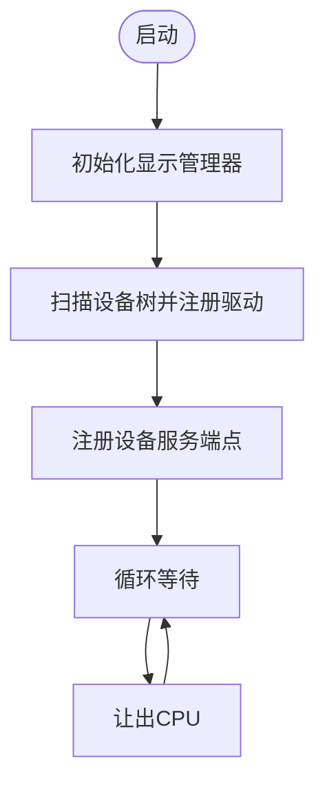
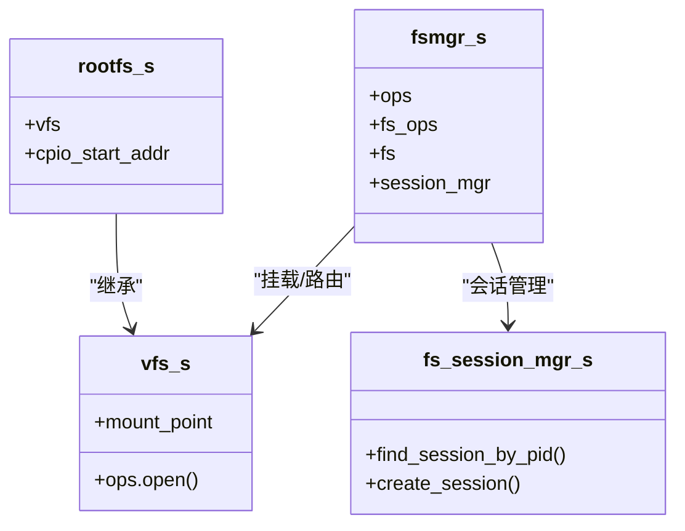
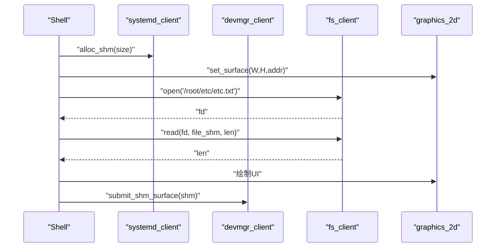
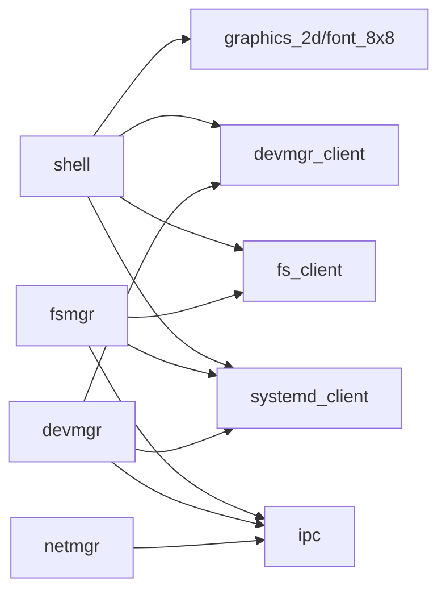

# 用户态服务系统

<cite>
**本文引用的文件**
- [uapps/devmgr/main.c](file://uapps/devmgr/main.c)
- [uapps/devmgr/devmgr.c](file://uapps/devmgr/devmgr.c)
- [uapps/devmgr/service.c](file://uapps/devmgr/service.c)
- [uapps/devmgr/include/devmgr.h](file://uapps/devmgr/include/devmgr.h)
- [uapps/devmgr/peripherals/display/display_mgr.c](file://uapps/devmgr/peripherals/display/display_mgr.c)
- [uapps/fsmgr/main.c](file://uapps/fsmgr/main.c)
- [uapps/fsmgr/fsmgr.c](file://uapps/fsmgr/fsmgr.c)
- [uapps/fsmgr/service.c](file://uapps/fsmgr/service.c)
- [uapps/fsmgr/include/fsmgr.h](file://uapps/fsmgr/include/fsmgr.h)
- [uapps/fsmgr/rootfs/rootfs.c](file://uapps/fsmgr/rootfs/rootfs.c)
- [uapps/fsmgr/procfs/procfs.c](file://uapps/fsmgr/procfs/procfs.c)
- [uapps/netmgr/main.c](file://uapps/netmgr/main.c)
- [uapps/netmgr/service.c](file://uapps/netmgr/service.c)
- [uapps/shell/main.c](file://uapps/shell/main.c)
- [uapps/idle/main.c](file://uapps/idle/main.c)
- [ulibs/libsystem/systemd_client.h](file://ulibs/libsystem/systemd_client.h)
- [ulibs/libsystem/systemd_client.c](file://ulibs/libsystem/systemd_client.c)
- [ulibs/libsystem/devmgr_client.h](file://ulibs/libsystem/devmgr_client.h)
- [ulibs/libsystem/devmgr_client.c](file://ulibs/libsystem/devmgr_client.c)
- [ulibs/libsystem/fs_client.h](file://ulibs/libsystem/fs_client.h)
- [ulibs/libsystem/fs_client.c](file://ulibs/libsystem/fs_client.c)
- [ulibs/libsystem/ipc.h](file://ulibs/libsystem/ipc.h)
- [ulibs/libkernel/capcall.h](file://ulibs/libkernel/capcall.h)
- [ulibs/libkernel/upcall.h](file://ulibs/libkernel/upcall.h)
- [ulibs/libgraphics/graphics_2d.h](file://ulibs/libgraphics/graphics_2d.h)
- [ulibs/libgraphics/font_8x8.h](file://ulibs/libgraphics/font_8x8.h)
</cite>

## 目录
1. [简介](#简介)
2. [项目结构](#项目结构)
3. [核心组件](#核心组件)
4. [架构总览](#架构总览)
5. [详细组件分析](#详细组件分析)
6. [依赖关系分析](#依赖关系分析)
7. [性能考虑](#性能考虑)
8. [故障排查指南](#故障排查指南)
9. [结论](#结论)
10. [附录：用户态服务开发与集成指南](#附录用户态服务开发与集成指南)

## 简介
本文件面向TranquilOS用户态服务系统，系统性梳理以下方面：
- 系统守护进程的初始化流程与服务注册机制
- 设备管理器（devmgr）的设备服务、设备树集成与驱动加载
- 文件系统管理器（fsmgr）的VFS实现、根文件系统与文件描述符管理
- Shell系统的命令解释器、系统调用封装与用户界面设计
- 用户态服务的开发与集成方法、服务间通信与协调策略
- 常见问题与性能优化建议

## 项目结构
用户态服务位于uapps目录下，每个子系统独立构建并运行：
- devmgr：设备管理与显示输出
- fsmgr：文件系统管理（VFS、rootfs、procfs/sysfs）
- netmgr：网络管理（占位示例）
- shell：图形化Shell与系统UI
- idle：空闲任务（占位示例）

图表来源
- [uapps/devmgr/main.c](file://uapps/devmgr/main.c#L1-L18)
- [uapps/fsmgr/main.c](file://uapps/fsmgr/main.c#L1-L38)
- [uapps/netmgr/main.c](file://uapps/netmgr/main.c#L1-L20)
- [uapps/shell/main.c](file://uapps/shell/main.c#L1-L72)
- [uapps/idle/main.c](file://uapps/idle/main.c#L1-L17)

章节来源
- [uapps/devmgr/main.c](file://uapps/devmgr/main.c#L1-L18)
- [uapps/fsmgr/main.c](file://uapps/fsmgr/main.c#L1-L38)
- [uapps/netmgr/main.c](file://uapps/netmgr/main.c#L1-L20)
- [uapps/shell/main.c](file://uapps/shell/main.c#L1-L72)
- [uapps/idle/main.c](file://uapps/idle/main.c#L1-L17)

## 核心组件
- 设备管理器（devmgr）
  - 初始化显示管理器、扫描设备树并注册驱动、注册设备服务端点
  - 提供通过共享内存提交帧缓冲的接口
- 文件系统管理器（fsmgr）
  - 统一VFS挂载与路由、会话级文件描述符管理、页错误上行处理
  - 提供rootfs（只读）、procfs等虚拟文件系统
- Shell系统（shell）
  - 使用图形库绘制系统UI，申请共享内存作为帧缓冲，从文件系统读取配置并展示
- 网络管理器（netmgr）
  - 占位示例，演示服务端点注册与消息分发框架
- 空闲任务（idle）
  - 占位示例，演示轻量级用户态循环

章节来源
- [uapps/devmgr/devmgr.c](file://uapps/devmgr/devmgr.c#L1-L62)
- [uapps/devmgr/service.c](file://uapps/devmgr/service.c#L1-L72)
- [uapps/fsmgr/fsmgr.c](file://uapps/fsmgr/fsmgr.c#L1-L216)
- [uapps/fsmgr/rootfs/rootfs.c](file://uapps/fsmgr/rootfs/rootfs.c#L1-L100)
- [uapps/fsmgr/procfs/procfs.c](file://uapps/fsmgr/procfs/procfs.c#L1-L28)
- [uapps/shell/main.c](file://uapps/shell/main.c#L1-L72)
- [uapps/netmgr/service.c](file://uapps/netmgr/service.c#L1-L29)
- [uapps/idle/main.c](file://uapps/idle/main.c#L1-L17)

## 架构总览
用户态服务通过系统控制客户端与内核交互，使用IPC端点暴露服务方法，采用共享内存进行高效数据传输。

图表来源
- [uapps/shell/main.c](file://uapps/shell/main.c#L41-L55)
- [uapps/fsmgr/service.c](file://uapps/fsmgr/service.c#L9-L35)
- [uapps/fsmgr/rootfs/rootfs.c](file://uapps/fsmgr/rootfs/rootfs.c#L32-L63)
- [ulibs/libsystem/fs_client.h](file://ulibs/libsystem/fs_client.h)
- [ulibs/libsystem/systemd_client.h](file://ulibs/libsystem/systemd_client.h)

## 详细组件分析

### 设备管理器（devmgr）
- 初始化流程
  - 启动时初始化显示管理器、扫描设备树并注册驱动、注册设备服务端点
- 设备树与驱动加载
  - 通过兼容字符串在设备树中定位节点，调用驱动probe函数完成初始化
- 显示输出
  - 通过共享内存接收帧缓冲，拷贝到显存帧缓冲并设置显示

图表来源
- [uapps/devmgr/main.c](file://uapps/devmgr/main.c#L6-L15)
- [uapps/devmgr/devmgr.c](file://uapps/devmgr/devmgr.c#L57-L62)
- [uapps/devmgr/service.c](file://uapps/devmgr/service.c#L68-L72)

章节来源
- [uapps/devmgr/main.c](file://uapps/devmgr/main.c#L1-L18)
- [uapps/devmgr/devmgr.c](file://uapps/devmgr/devmgr.c#L1-L62)
- [uapps/devmgr/service.c](file://uapps/devmgr/service.c#L1-L72)
- [uapps/devmgr/include/devmgr.h](file://uapps/devmgr/include/devmgr.h#L1-L30)
- [uapps/devmgr/peripherals/display/display_mgr.c](file://uapps/devmgr/peripherals/display/display_mgr.c#L1-L31)

### 文件系统管理器（fsmgr）
- VFS与挂载
  - 统一管理多个VFS实例，按挂载点路由到具体文件系统
- 会话与文件描述符
  - 按进程PID建立会话，分配并管理文件描述符
- rootfs实现
  - 从cpio镜像中查找文件，只读访问；挂载到“/root”
- procfs/sysfs
  - 提供进程信息与系统状态的虚拟视图
- 页错误上行
  - 注册页错误回调，由systemd处理缺页并回复

图表来源
- [uapps/fsmgr/include/fsmgr.h](file://uapps/fsmgr/include/fsmgr.h#L31-L43)
- [uapps/fsmgr/rootfs/rootfs.c](file://uapps/fsmgr/rootfs/rootfs.c#L75-L100)
- [uapps/fsmgr/procfs/procfs.c](file://uapps/fsmgr/procfs/procfs.c#L12-L28)

章节来源
- [uapps/fsmgr/fsmgr.c](file://uapps/fsmgr/fsmgr.c#L1-L216)
- [uapps/fsmgr/include/fsmgr.h](file://uapps/fsmgr/include/fsmgr.h#L1-L43)
- [uapps/fsmgr/rootfs/rootfs.c](file://uapps/fsmgr/rootfs/rootfs.c#L1-L100)
- [uapps/fsmgr/procfs/procfs.c](file://uapps/fsmgr/procfs/procfs.c#L1-L28)

### Shell系统（shell）
- 功能概述
  - 申请共享内存作为帧缓冲，使用图形库绘制系统UI
  - 通过文件系统客户端读取配置文件并展示
  - 通过systemd客户端查询内存与进程统计信息
- 关键流程
  - 申请共享内存 -> 初始化图形上下文 -> 打开配置文件 -> 读取内容 -> 绘制UI -> 提交帧缓冲

图表来源
- [uapps/shell/main.c](file://uapps/shell/main.c#L34-L71)
- [ulibs/libsystem/devmgr_client.h](file://ulibs/libsystem/devmgr_client.h)
- [ulibs/libsystem/fs_client.h](file://ulibs/libsystem/fs_client.h)
- [ulibs/libsystem/systemd_client.h](file://ulibs/libsystem/systemd_client.h)
- [ulibs/libgraphics/graphics_2d.h](file://ulibs/libgraphics/graphics_2d.h)

章节来源
- [uapps/shell/main.c](file://uapps/shell/main.c#L1-L72)

### 网络管理器（netmgr）
- 当前实现
  - 占位示例，注册网络服务端点，处理发送/接收/MAC地址等方法
- 集成建议
  - 参考netmgr的服务端点注册方式，结合systemd_client进行系统交互

章节来源
- [uapps/netmgr/main.c](file://uapps/netmgr/main.c#L1-L20)
- [uapps/netmgr/service.c](file://uapps/netmgr/service.c#L1-L29)

### 空闲任务（idle）
- 当前实现
  - 占位示例，循环打印日志并让出CPU
- 作用
  - 展示最小化用户态任务的编写方式

章节来源
- [uapps/idle/main.c](file://uapps/idle/main.c#L1-L17)

## 依赖关系分析
- 客户端库
  - systemd_client：系统控制（内存、共享内存、页错误处理）
  - devmgr_client：设备服务（帧缓冲提交、cpio地址获取）
  - fs_client：文件系统服务（open/read/write/close）
  - ipc：IPC端点注册与调用
  - capcall/upcall：系统调用封装与异常上报
  - graphics_2d/font_8x8：图形与字体渲染

图表来源
- [ulibs/libsystem/systemd_client.h](file://ulibs/libsystem/systemd_client.h)
- [ulibs/libsystem/devmgr_client.h](file://ulibs/libsystem/devmgr_client.h)
- [ulibs/libsystem/fs_client.h](file://ulibs/libsystem/fs_client.h)
- [ulibs/libsystem/ipc.h](file://ulibs/libsystem/ipc.h)
- [ulibs/libkernel/capcall.h](file://ulibs/libkernel/capcall.h)
- [ulibs/libkernel/upcall.h](file://ulibs/libkernel/upcall.h)
- [ulibs/libgraphics/graphics_2d.h](file://ulibs/libgraphics/graphics_2d.h)
- [ulibs/libgraphics/font_8x8.h](file://ulibs/libgraphics/font_8x8.h)

章节来源
- [uapps/shell/main.c](file://uapps/shell/main.c#L1-L9)
- [uapps/fsmgr/main.c](file://uapps/fsmgr/main.c#L1-L8)
- [uapps/devmgr/main.c](file://uapps/devmgr/main.c#L1-L6)
- [uapps/netmgr/main.c](file://uapps/netmgr/main.c#L1-L6)

## 性能考虑
- 共享内存优先
  - 图形与大块数据通过共享内存传递，减少拷贝与系统调用次数
- 会话级文件描述符
  - 按进程PID管理文件句柄，避免跨进程竞争与重复打开
- 显存直写
  - 将共享内存帧缓冲直接拷贝到显存帧缓冲，降低中间层开销
- 调度让步
  - 在空闲循环中合理让出CPU，避免忙等

## 故障排查指南
- 设备树相关
  - 若设备未被识别，检查兼容字符串与设备树节点是否存在
  - 确认驱动probe函数正确完成初始化
- 文件系统相关
  - 打开失败：确认路径与挂载点匹配，检查rootfs是否已挂载
  - 读取异常：确认共享内存地址有效，长度不超过文件大小
- 显示输出相关
  - 帧缓冲提交失败：确认显示设备已注册，共享内存地址有效
- 页错误处理
  - 若出现页错误，确认已注册upcall回调并正确回复

章节来源
- [uapps/devmgr/devmgr.c](file://uapps/devmgr/devmgr.c#L33-L55)
- [uapps/fsmgr/rootfs/rootfs.c](file://uapps/fsmgr/rootfs/rootfs.c#L43-L47)
- [uapps/fsmgr/main.c](file://uapps/fsmgr/main.c#L10-L15)
- [uapps/devmgr/service.c](file://uapps/devmgr/service.c#L9-L40)

## 结论
TranquilOS用户态服务系统以简洁清晰的模块划分实现了设备、文件系统与图形界面的协同工作。通过IPC端点与共享内存，服务间通信高效可靠；通过会话与VFS抽象，文件操作具备良好的可扩展性。开发者可基于现有框架快速集成新服务，并遵循统一的客户端库与系统调用封装模式，确保一致的开发体验与运行效率。

## 附录：用户态服务开发与集成指南
- 开发步骤
  - 创建服务入口：在main.c中初始化所需模块，注册服务端点
  - 选择客户端库：根据功能选择systemd_client、devmgr_client或fs_client
  - 实现IPC端点：使用IPC_ENDPOINT宏定义方法分发逻辑
  - 数据传输：优先使用共享内存，必要时通过systemd_client进行内存映射
- 集成要点
  - 服务注册：使用sys_register_service完成端点注册
  - 异常处理：实现upcall回调处理页错误等异常
  - 资源回收：及时释放共享内存与文件描述符
- 示例参考
  - 设备服务：参考devmgr的服务端点与显示提交流程
  - 文件服务：参考fsmgr的服务端点与rootfs读取流程
  - Shell UI：参考shell的图形绘制与文件读取流程

章节来源
- [uapps/devmgr/service.c](file://uapps/devmgr/service.c#L68-L72)
- [uapps/fsmgr/service.c](file://uapps/fsmgr/service.c#L102-L106)
- [uapps/shell/main.c](file://uapps/shell/main.c#L34-L71)
- [ulibs/libsystem/ipc.h](file://ulibs/libsystem/ipc.h)
- [ulibs/libkernel/upcall.h](file://ulibs/libkernel/upcall.h)