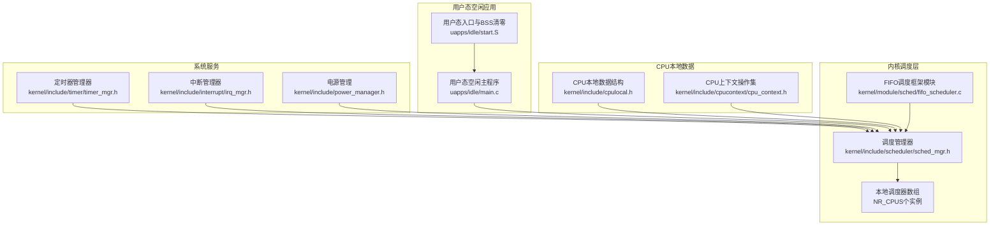
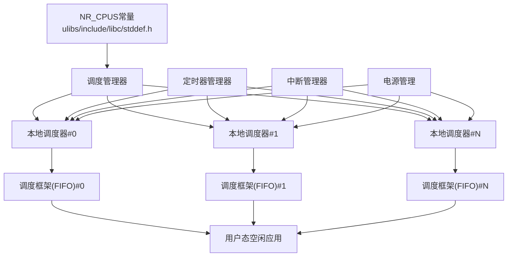
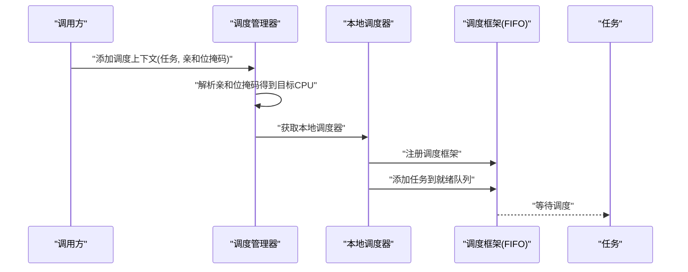
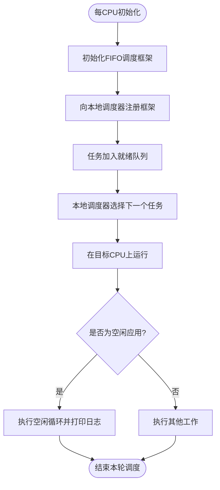
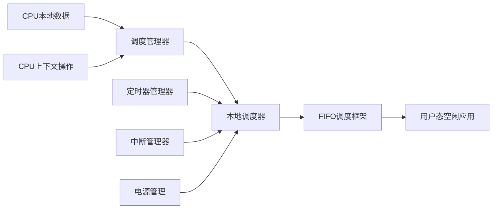

# 空闲进程

<cite>
**本文引用的文件**
- [idle.h](file://kernel/include/idle/idle.h)
- [main.c](file://uapps/idle/main.c)
- [start.S](file://uapps/idle/start.S)
- [sched_mgr.h](file://kernel/include/scheduler/sched_mgr.h)
- [sched_mgr.c](file://kernel/schedule/sched_mgr.c)
- [fifo_scheduler.c](file://kernel/module/sched/fifo_scheduler.c)
- [cpulocal.h](file://kernel/include/cpulocal.h)
- [cpu_context.h](file://kernel/include/cpucontext/cpu_context.h)
- [timer_mgr.h](file://kernel/include/timer/timer_mgr.h)
- [irq_mgr.h](file://kernel/include/interrupt/irq_mgr.h)
- [power_manager.h](file://kernel/include/power_manager.h)
- [power_manager.c](file://kernel/power_manager.c)
- [device.h](file://kernel/include/device/device.h)
- [module.h](file://kernel/include/module/module.h)
- [stddef.h](file://ulibs/include/libc/stddef.h)
</cite>

## 目录
1. [简介](#简介)
2. [项目结构](#项目结构)
3. [核心组件](#核心组件)
4. [架构总览](#架构总览)
5. [详细组件分析](#详细组件分析)
6. [依赖关系分析](#依赖关系分析)
7. [性能考量](#性能考量)
8. [故障排查指南](#故障排查指南)
9. [结论](#结论)
10. [附录](#附录)

## 简介
本文件围绕TranquilOS的空闲进程进行系统化说明，涵盖其作用与重要性、实现方式（每CPU实例与线程管理）、调度策略（优先级与亲和性）、与电源管理及热插拔的交互、监控与统计能力（CPU利用率与系统负载）、配置与调优建议，以及在多核系统中的行为与同步机制。由于当前仓库中内核侧空闲进程实现以头文件声明为主，本文结合用户态示例应用与内核调度框架，给出可落地的实现路径与最佳实践。

## 项目结构
与空闲进程直接相关的代码分布在以下位置：
- 内核调度与本地调度器：用于每CPU调度框架注册与任务亲和性绑定
- 用户态空闲应用：作为系统空闲时的占位任务示例
- CPU本地数据结构：保存每CPU上下文与当前调度上下文指针
- 电源管理与设备子系统：为节能与热插拔场景提供接口

图表来源
- [sched_mgr.h](file://kernel/include/scheduler/sched_mgr.h#L40-L43)
- [sched_mgr.c](file://kernel/schedule/sched_mgr.c#L131-L162)
- [fifo_scheduler.c](file://kernel/module/sched/fifo_scheduler.c#L87-L109)
- [cpulocal.h](file://kernel/include/cpulocal.h#L7-L12)
- [cpu_context.h](file://kernel/include/cpucontext/cpu_context.h#L10-L20)
- [timer_mgr.h](file://kernel/include/timer/timer_mgr.h#L50-L52)
- [irq_mgr.h](file://kernel/include/interrupt/irq_mgr.h#L37-L37)
- [power_manager.h](file://kernel/include/power_manager.h#L1-L50)

章节来源
- [sched_mgr.h](file://kernel/include/scheduler/sched_mgr.h#L40-L43)
- [sched_mgr.c](file://kernel/schedule/sched_mgr.c#L131-L162)
- [fifo_scheduler.c](file://kernel/module/sched/fifo_scheduler.c#L87-L109)
- [cpulocal.h](file://kernel/include/cpulocal.h#L7-L12)
- [cpu_context.h](file://kernel/include/cpucontext/cpu_context.h#L10-L20)
- [timer_mgr.h](file://kernel/include/timer/timer_mgr.h#L50-L52)
- [irq_mgr.h](file://kernel/include/interrupt/irq_mgr.h#L37-L37)
- [power_manager.h](file://kernel/include/power_manager.h#L1-L50)

## 核心组件
- 调度管理器与本地调度器
  - 调度管理器维护每个CPU上的本地调度器实例，并提供添加调度上下文、初始化本地调度器、获取本地调度器等接口。通过亲和位掩码将任务绑定到特定CPU。
- FIFO调度框架模块
  - 每CPU注册一个FIFO调度框架，负责就绪队列的入队、出队与判空操作，并向本地调度器注册自身。
- CPU本地数据与上下文
  - CPU本地数据结构保存当前内核地址空间、特权栈指针与当前调度上下文指针；CPU上下文操作集定义了调度进入/退出回调，便于与调度框架协作。
- 用户态空闲应用
  - 提供一个无限循环的用户态示例，用于演示空闲时的轻量任务形态与日志输出。

章节来源
- [sched_mgr.h](file://kernel/include/scheduler/sched_mgr.h#L30-L49)
- [sched_mgr.c](file://kernel/schedule/sched_mgr.c#L131-L162)
- [fifo_scheduler.c](file://kernel/module/sched/fifo_scheduler.c#L87-L109)
- [cpulocal.h](file://kernel/include/cpulocal.h#L7-L12)
- [cpu_context.h](file://kernel/include/cpucontext/cpu_context.h#L10-L20)
- [main.c](file://uapps/idle/main.c#L6-L16)
- [start.S](file://uapps/idle/start.S#L1-L19)

## 架构总览
下图展示了空闲进程在多核系统中的部署与交互：每个CPU拥有独立的本地调度器与调度框架；用户态空闲应用作为任务被调度到指定CPU上运行；定时器、中断与电源管理为系统节能与事件驱动提供支撑。

图表来源
- [stddef.h](file://ulibs/include/libc/stddef.h#L29-L29)
- [sched_mgr.h](file://kernel/include/scheduler/sched_mgr.h#L40-L43)
- [fifo_scheduler.c](file://kernel/module/sched/fifo_scheduler.c#L87-L109)
- [timer_mgr.h](file://kernel/include/timer/timer_mgr.h#L50-L52)
- [irq_mgr.h](file://kernel/include/interrupt/irq_mgr.h#L37-L37)
- [power_manager.h](file://kernel/include/power_manager.h#L1-L50)

## 详细组件分析

### 组件A：调度管理器与本地调度器
- 角色与职责
  - 调度管理器集中管理所有CPU的本地调度器，提供任务亲和性解析与添加调度上下文的能力。
  - 本地调度器按CPU维度组织，承载具体调度算法框架（如FIFO）。
- 关键流程
  - 添加调度上下文时，根据亲和位掩码定位目标CPU，再将任务加入对应本地调度器。
- 复杂度与优化
  - 亲和性解析为O(log NR_CPUs)，通常NR_CPUs较小，开销可忽略。
  - 建议在任务创建阶段一次性确定亲和性，避免频繁迁移。

图表来源
- [sched_mgr.c](file://kernel/schedule/sched_mgr.c#L131-L162)
- [sched_mgr.h](file://kernel/include/scheduler/sched_mgr.h#L30-L49)
- [fifo_scheduler.c](file://kernel/module/sched/fifo_scheduler.c#L87-L109)

章节来源
- [sched_mgr.c](file://kernel/schedule/sched_mgr.c#L131-L162)
- [sched_mgr.h](file://kernel/include/scheduler/sched_mgr.h#L30-L49)
- [fifo_scheduler.c](file://kernel/module/sched/fifo_scheduler.c#L87-L109)

### 组件B：每CPU实例与线程管理
- 部署模式
  - FIFO调度框架通过每CPU初始化宏注册到对应本地调度器，形成每CPU一份的调度实例。
- 线程管理
  - 用户态空闲应用以无限循环形式存在，作为系统空闲时的占位任务，减少无效唤醒与提升可观测性。
- 同步机制
  - 通过调度框架的就绪队列与本地调度器的互斥保护，确保多核并发下的正确性。

图表来源
- [fifo_scheduler.c](file://kernel/module/sched/fifo_scheduler.c#L87-L109)
- [main.c](file://uapps/idle/main.c#L6-L16)

章节来源
- [fifo_scheduler.c](file://kernel/module/sched/fifo_scheduler.c#L87-L109)
- [main.c](file://uapps/idle/main.c#L6-L16)

### 组件C：调度策略（优先级与亲和性）
- 优先级设置
  - 当前实现采用FIFO队列，无显式优先级字段；若需引入优先级，可在调度框架中扩展比较函数或引入多队列结构。
- CPU亲和性配置
  - 通过亲和位掩码将任务绑定到特定CPU；调度管理器解析掩码后路由至对应本地调度器。
- 多核行为
  - 每个CPU独立调度，避免跨核迁移带来的缓存抖动；可通过调整亲和性降低NUMA跨域访问。

章节来源
- [sched_mgr.c](file://kernel/schedule/sched_mgr.c#L131-L162)
- [sched_mgr.h](file://kernel/include/scheduler/sched_mgr.h#L30-L49)

### 组件D：与电源管理及热插拔的交互
- 电源管理
  - 电源管理模块提供系统节能策略（如CPU频率调节、睡眠状态），空闲进程的存在有助于在无负载时进入低功耗状态。
- 热插拔处理
  - 设备热插拔可能影响中断与定时器，进而影响空闲进程的唤醒时机；应确保中断与定时器管理器在多核环境下保持一致状态。

章节来源
- [power_manager.h](file://kernel/include/power_manager.h#L1-L50)
- [power_manager.c](file://kernel/power_manager.c#L1-L200)
- [device.h](file://kernel/include/device/device.h#L11-L15)
- [irq_mgr.h](file://kernel/include/interrupt/irq_mgr.h#L37-L37)
- [timer_mgr.h](file://kernel/include/timer/timer_mgr.h#L50-L52)

### 组件E：监控与统计（CPU利用率与系统负载）
- CPU利用率
  - 可基于PMU计数器或定时器周期性采样计算；空闲进程的存在有助于区分“真正空闲”与“被唤醒但无工作”的时间片。
- 系统负载
  - 结合就绪队列长度、定时器到期频率与中断发生率评估；FIFO框架的队列长度可作为简单指标。
- 用户态日志
  - 用户态空闲应用定期打印日志，便于观测空闲循环的执行频率与系统活跃度。

章节来源
- [main.c](file://uapps/idle/main.c#L9-L15)
- [timer_mgr.h](file://kernel/include/timer/timer_mgr.h#L50-L52)

### 组件F：配置选项与性能调优
- 配置项
  - NR_CPUS：决定本地调度器数组大小与每CPU模块数量。
  - 调度框架类型：当前为FIFO，可替换为优先级调度或其他策略。
- 调优建议
  - 将关键空闲任务绑定到高优先级CPU，减少跨核迁移。
  - 控制空闲应用的日志频率，避免I/O噪声影响系统性能。
  - 在多核系统中合理分配亲和性，避免热点CPU与冷CPU并存。

章节来源
- [stddef.h](file://ulibs/include/libc/stddef.h#L29-L29)
- [fifo_scheduler.c](file://kernel/module/sched/fifo_scheduler.c#L87-L109)
- [main.c](file://uapps/idle/main.c#L9-L15)

## 依赖关系分析
- 组件耦合
  - 调度管理器与本地调度器强耦合，FIFO调度框架弱耦合于本地调度器。
  - CPU本地数据与调度上下文紧密关联，保证每CPU上下文一致性。
- 外部依赖
  - 定时器与中断管理器为系统事件源；电源管理模块提供节能策略。
- 潜在环路
  - 当前实现未见循环依赖；若扩展调度策略，需避免框架与管理器之间的双向依赖。

图表来源
- [sched_mgr.h](file://kernel/include/scheduler/sched_mgr.h#L40-L43)
- [fifo_scheduler.c](file://kernel/module/sched/fifo_scheduler.c#L87-L109)
- [cpulocal.h](file://kernel/include/cpulocal.h#L7-L12)
- [cpu_context.h](file://kernel/include/cpucontext/cpu_context.h#L10-L20)
- [timer_mgr.h](file://kernel/include/timer/timer_mgr.h#L50-L52)
- [irq_mgr.h](file://kernel/include/interrupt/irq_mgr.h#L37-L37)
- [power_manager.h](file://kernel/include/power_manager.h#L1-L50)

章节来源
- [sched_mgr.h](file://kernel/include/scheduler/sched_mgr.h#L40-L43)
- [fifo_scheduler.c](file://kernel/module/sched/fifo_scheduler.c#L87-L109)
- [cpulocal.h](file://kernel/include/cpulocal.h#L7-L12)
- [cpu_context.h](file://kernel/include/cpucontext/cpu_context.h#L10-L20)
- [timer_mgr.h](file://kernel/include/timer/timer_mgr.h#L50-L52)
- [irq_mgr.h](file://kernel/include/interrupt/irq_mgr.h#L37-L37)
- [power_manager.h](file://kernel/include/power_manager.h#L1-L50)

## 性能考量
- 空闲进程的轻量化设计
  - 用户态空闲应用采用简单循环与有限日志，避免占用过多CPU时间。
- 调度开销控制
  - FIFO框架无复杂优先级比较，适合空闲场景；若引入优先级，需评估比较成本。
- 多核同步
  - 通过每CPU实例与就绪队列互斥保护，降低锁竞争；建议避免在空闲循环中执行重I/O操作。

## 故障排查指南
- 现象：空闲进程未按预期运行
  - 排查步骤
    - 确认每CPU模块已初始化（查看模块初始化宏调用）。
    - 检查调度管理器是否成功将任务加入本地调度器。
    - 验证用户态空闲应用入口与BSS清零逻辑。
- 现象：系统在空闲时仍高占用
  - 排查步骤
    - 检查定时器与中断是否频繁触发。
    - 评估电源管理策略是否导致频繁唤醒。
    - 减少用户态空闲应用日志频率，排除I/O噪声。
- 现象：多核负载不均衡
  - 排查步骤
    - 检查任务亲和性配置，避免集中在少数CPU。
    - 评估调度框架是否需要扩展为支持优先级的队列。

章节来源
- [module.h](file://kernel/include/module/module.h#L6-L9)
- [sched_mgr.c](file://kernel/schedule/sched_mgr.c#L131-L162)
- [start.S](file://uapps/idle/start.S#L1-L19)
- [main.c](file://uapps/idle/main.c#L6-L16)
- [timer_mgr.h](file://kernel/include/timer/timer_mgr.h#L50-L52)
- [irq_mgr.h](file://kernel/include/interrupt/irq_mgr.h#L37-L37)
- [power_manager.h](file://kernel/include/power_manager.h#L1-L50)

## 结论
TranquilOS的空闲进程通过每CPU的本地调度器与FIFO调度框架实现，配合用户态空闲应用与电源管理、定时器、中断等子系统，在多核环境下提供稳定、可观察且节能的空闲处理能力。建议在实际部署中结合系统负载与硬件特性，合理配置亲和性与调度策略，并通过日志与计数器持续监控CPU利用率与系统负载，以获得最佳性能与能耗表现。

## 附录
- 相关头文件与模块
  - 调度管理器与本地调度器：kernel/include/scheduler/sched_mgr.h, kernel/schedule/sched_mgr.c
  - FIFO调度框架：kernel/module/sched/fifo_scheduler.c
  - CPU本地数据与上下文：kernel/include/cpulocal.h, kernel/include/cpucontext/cpu_context.h
  - 用户态空闲应用：uapps/idle/main.c, uapps/idle/start.S
  - 系统服务：kernel/include/timer/timer_mgr.h, kernel/include/interrupt/irq_mgr.h, kernel/include/power_manager.h
  - 平台常量：ulibs/include/libc/stddef.h