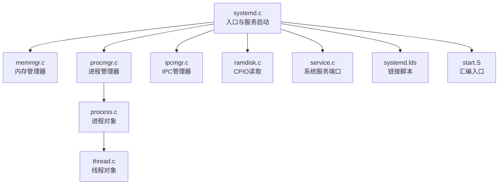
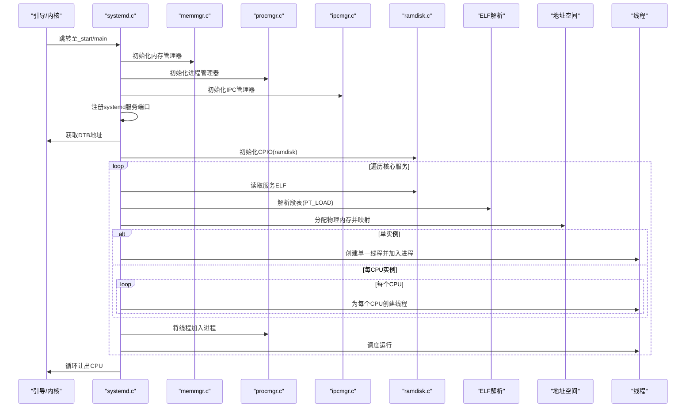
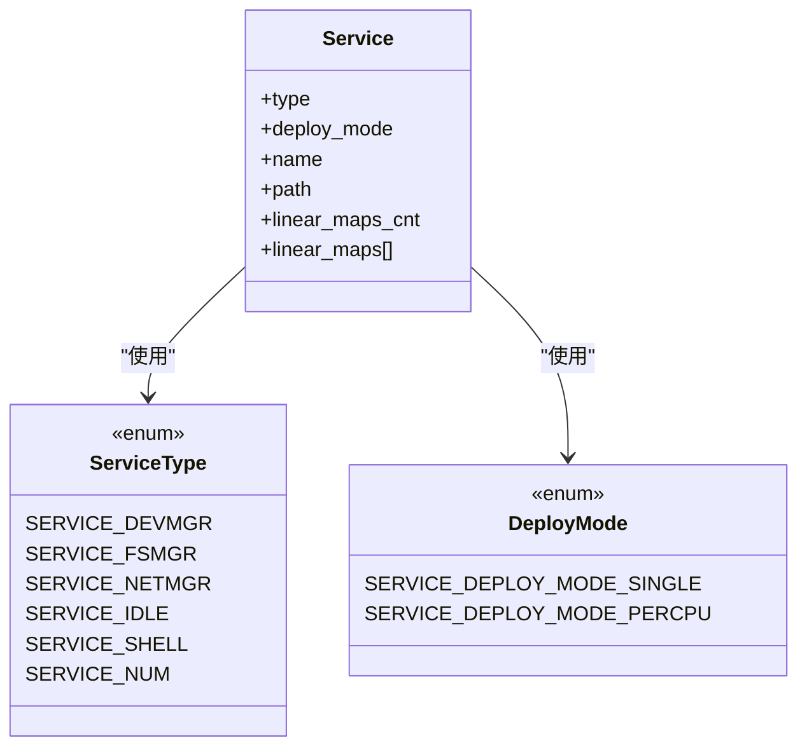
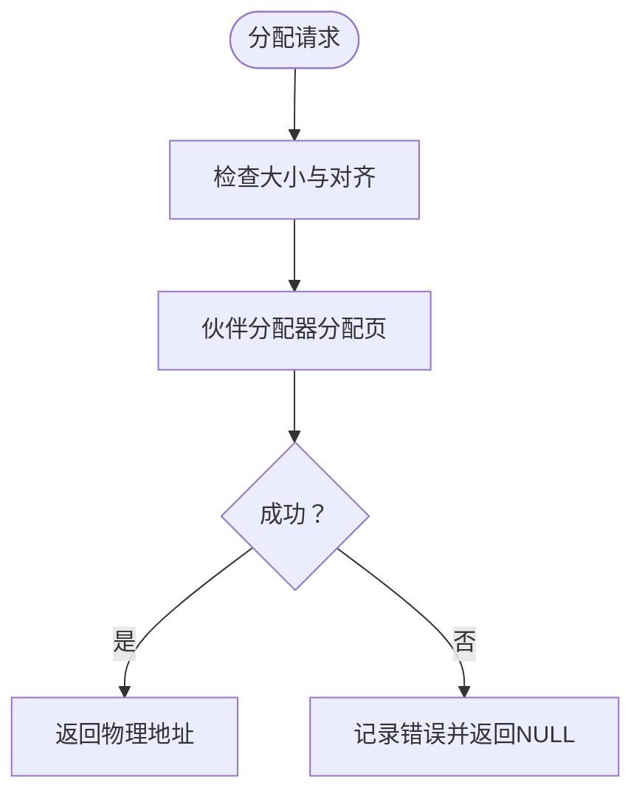
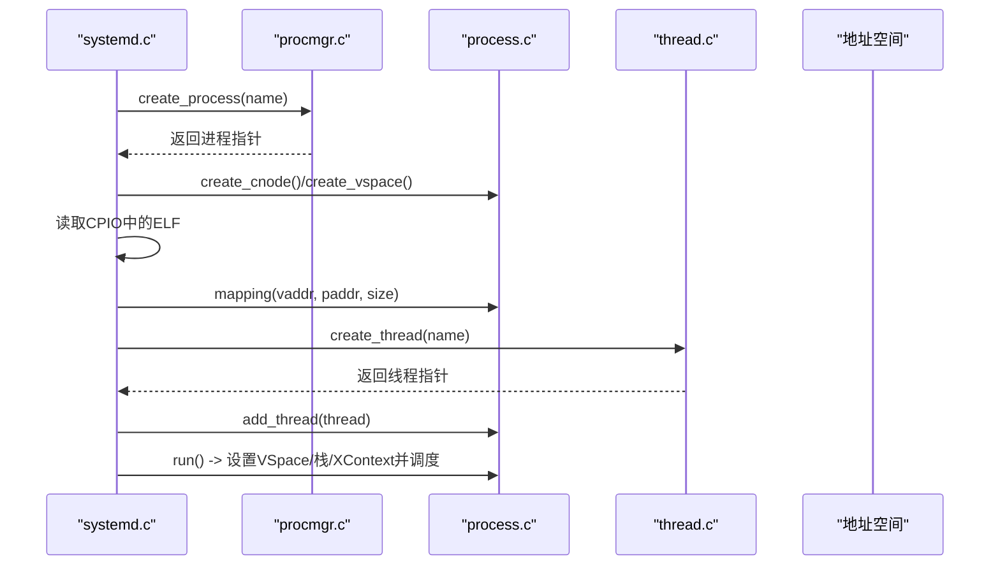
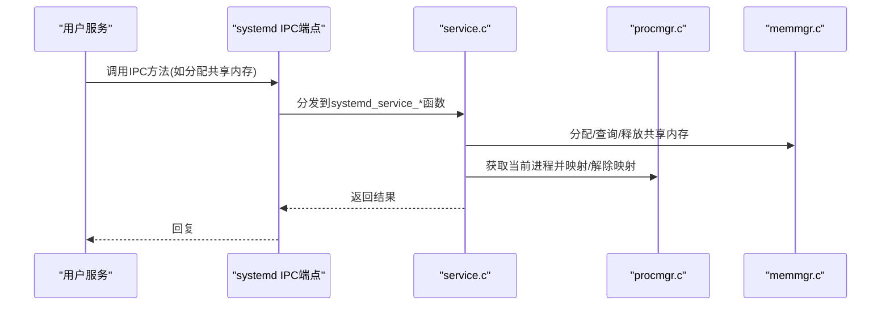
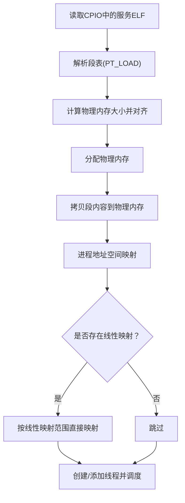
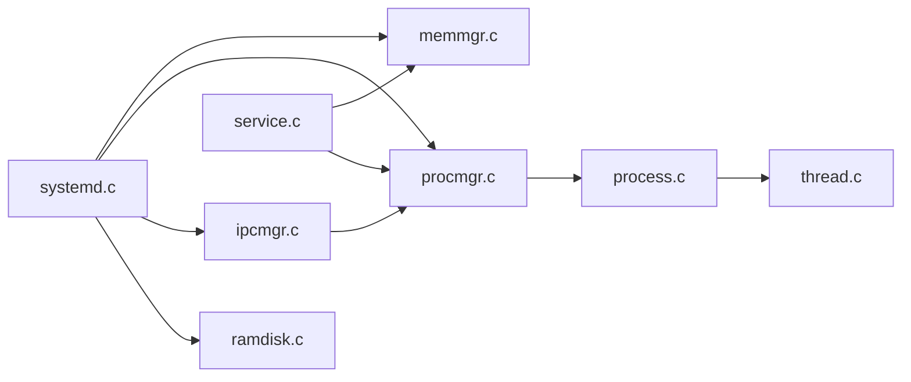

# 系统守护进程

<cite>
**本文引用的文件**
- [kernel/systemd/systemd.c](file://kernel/systemd/systemd.c)
- [kernel/systemd/service.c](file://kernel/systemd/service.c)
- [kernel/systemd/start.S](file://kernel/systemd/start.S)
- [kernel/systemd/systemd.lds](file://kernel/systemd/systemd.lds)
- [kernel/systemd/include/systemd.h](file://kernel/systemd/include/systemd.h)
- [kernel/systemd/include/service.h](file://kernel/systemd/include/service.h)
- [kernel/systemd/include/log.h](file://kernel/systemd/include/log.h)
- [kernel/systemd/include/upcall.h](file://kernel/systemd/include/upcall.h)
- [kernel/systemd/include/memmgr/memmgr.h](file://kernel/systemd/include/memmgr/memmgr.h)
- [kernel/systemd/include/procmgr/procmgr.h](file://kernel/systemd/include/procmgr/procmgr.h)
- [kernel/systemd/include/ipcmgr/ipcmgr.h](file://kernel/systemd/include/ipcmgr/ipcmgr.h)
- [kernel/systemd/memmgr/memmgr.c](file://kernel/systemd/memmgr/memmgr.c)
- [kernel/systemd/procmgr/procmgr.c](file://kernel/systemd/procmgr/procmgr.c)
- [kernel/systemd/procmgr/process.c](file://kernel/systemd/procmgr/process.c)
- [kernel/systemd/procmgr/thread.c](file://kernel/systemd/procmgr/thread.c)
- [kernel/systemd/ipcmgr/ipcmgr.c](file://kernel/systemd/ipcmgr/ipcmgr.c)
- [kernel/systemd/ramdisk.c](file://kernel/systemd/ramdisk.c)
</cite>

## 目录
1. [简介](#简介)
2. [项目结构](#项目结构)
3. [核心组件](#核心组件)
4. [架构总览](#架构总览)
5. [详细组件分析](#详细组件分析)
6. [依赖关系分析](#依赖关系分析)
7. [性能考虑](#性能考虑)
8. [故障排查指南](#故障排查指南)
9. [结论](#结论)
10. [附录](#附录)

## 简介
本文件面向TranquilOS系统守护进程（systemd）的开发者与维护者，系统化阐述systemd的初始化流程、单例与每CPU两种部署模式、核心服务的定义与启动流程（从ELF解析到进程创建、地址空间映射、线性映射、线程创建），以及错误处理与日志记录机制。同时给出入口点、链接脚本与启动参数配置要点，并总结常见问题与调试技巧。

## 项目结构
systemd位于内核态子系统中，负责核心服务的生命周期管理。其关键目录与文件如下：
- 启动与入口：start.S、systemd.c、systemd.lds
- 核心服务定义：systemd.c 中的全局核心服务数组
- 管理器接口：memmgr.h、procmgr.h、ipcmgr.h
- 管理器实现：memmgr.c、procmgr.c、ipcmgr.c
- 进程/线程/地址空间：process.c、thread.c
- 服务端口与共享内存：service.c
- 日志与工具：log.h、upcall.h
- 引导盘（CPIO）读取：ramdisk.c

图表来源
- [kernel/systemd/systemd.c](file://kernel/systemd/systemd.c#L217-L246)
- [kernel/systemd/memmgr/memmgr.c](file://kernel/systemd/memmgr/memmgr.c#L1-L200)
- [kernel/systemd/procmgr/procmgr.c](file://kernel/systemd/procmgr/procmgr.c#L1-L143)
- [kernel/systemd/procmgr/process.c](file://kernel/systemd/procmgr/process.c#L1-L200)
- [kernel/systemd/procmgr/thread.c](file://kernel/systemd/procmgr/thread.c#L1-L25)
- [kernel/systemd/ipcmgr/ipcmgr.c](file://kernel/systemd/ipcmgr/ipcmgr.c#L1-L200)
- [kernel/systemd/ramdisk.c](file://kernel/systemd/ramdisk.c#L1-L28)
- [kernel/systemd/service.c](file://kernel/systemd/service.c#L1-L236)
- [kernel/systemd/systemd.lds](file://kernel/systemd/systemd.lds#L1-L40)
- [kernel/systemd/start.S](file://kernel/systemd/start.S#L1-L4)

章节来源
- [kernel/systemd/systemd.c](file://kernel/systemd/systemd.c#L1-L246)
- [kernel/systemd/systemd.lds](file://kernel/systemd/systemd.lds#L1-L40)
- [kernel/systemd/start.S](file://kernel/systemd/start.S#L1-L4)

## 核心组件
- 单例管理器（内存管理器）：负责物理页分配、伙伴区与页面数组管理、共享内存管理等。
- 进程管理器：负责进程对象创建、PID生成、进程/线程统计、退出回收。
- IPC管理器：负责为服务创建IPC端点、上下文绑定、能力引用与调度。
- 服务端口：systemd对外暴露的IPC方法集合，用于共享内存、缺页处理、调用注册、进程退出等。
- 启动器：从CPIO读取ELF，解析段表，建立地址空间映射，创建并调度线程。
- 日志：统一的日志宏，包含CPU号与单调时钟，便于定位问题。

章节来源
- [kernel/systemd/include/memmgr/memmgr.h](file://kernel/systemd/include/memmgr/memmgr.h#L1-L31)
- [kernel/systemd/include/procmgr/procmgr.h](file://kernel/systemd/include/procmgr/procmgr.h#L1-L33)
- [kernel/systemd/include/ipcmgr/ipcmgr.h](file://kernel/systemd/include/ipcmgr/ipcmgr.h#L1-L15)
- [kernel/systemd/include/log.h](file://kernel/systemd/include/log.h#L1-L32)
- [kernel/systemd/memmgr/memmgr.c](file://kernel/systemd/memmgr/memmgr.c#L1-L200)
- [kernel/systemd/procmgr/procmgr.c](file://kernel/systemd/procmgr/procmgr.c#L1-L143)
- [kernel/systemd/ipcmgr/ipcmgr.c](file://kernel/systemd/ipcmgr/ipcmgr.c#L1-L200)
- [kernel/systemd/service.c](file://kernel/systemd/service.c#L1-L236)

## 架构总览
systemd在内核初始化阶段按序启动三大管理器：内存管理器、进程管理器、IPC管理器，随后加载CPIO中的核心服务ELF，完成地址空间映射与线程创建，最终进入循环让出CPU。

图表来源
- [kernel/systemd/systemd.c](file://kernel/systemd/systemd.c#L217-L246)
- [kernel/systemd/ramdisk.c](file://kernel/systemd/ramdisk.c#L1-L28)
- [kernel/systemd/memmgr/memmgr.c](file://kernel/systemd/memmgr/memmgr.c#L132-L155)
- [kernel/systemd/procmgr/process.c](file://kernel/systemd/procmgr/process.c#L84-L174)
- [kernel/systemd/procmgr/thread.c](file://kernel/systemd/procmgr/thread.c#L15-L25)
- [kernel/systemd/ipcmgr/ipcmgr.c](file://kernel/systemd/ipcmgr/ipcmgr.c#L156-L195)

## 详细组件分析

### systemd入口与初始化流程
- 入口：start.S的_start调用C函数main。
- main中依次执行：
  - 内存管理器初始化
  - 进程管理器初始化
  - IPC管理器初始化
  - 注册systemd服务端口
  - 读取DTB地址
  - 初始化ramdisk（CPIO）
  - 启动核心服务
  - 进入空闲循环

章节来源
- [kernel/systemd/start.S](file://kernel/systemd/start.S#L1-L4)
- [kernel/systemd/systemd.c](file://kernel/systemd/systemd.c#L217-L246)

### 核心服务定义与部署模式
- 服务类型枚举包含设备、文件系统、网络、空闲、Shell等。
- 部署模式支持单实例与每CPU实例。
- 每个服务包含名称、路径、线性映射范围等元数据。

图表来源
- [kernel/systemd/include/systemd.h](file://kernel/systemd/include/systemd.h#L4-L30)
- [kernel/systemd/systemd.c](file://kernel/systemd/systemd.c#L15-L74)

章节来源
- [kernel/systemd/include/systemd.h](file://kernel/systemd/include/systemd.h#L1-L32)
- [kernel/systemd/systemd.c](file://kernel/systemd/systemd.c#L15-L74)

### 内存管理器（memmgr）
- 提供物理内存对齐分配、共享内存分配/查询/释放、内存总量/剩余查询。
- 实现中包含boot页分配器、伙伴分配器、页面数组与zone组织。

图表来源
- [kernel/systemd/memmgr/memmgr.c](file://kernel/systemd/memmgr/memmgr.c#L132-L155)
- [kernel/systemd/include/memmgr/memmgr.h](file://kernel/systemd/include/memmgr/memmgr.h#L10-L24)

章节来源
- [kernel/systemd/memmgr/memmgr.c](file://kernel/systemd/memmgr/memmgr.c#L1-L200)
- [kernel/systemd/include/memmgr/memmgr.h](file://kernel/systemd/include/memmgr/memmgr.h#L1-L31)

### 进程管理器（procmgr）与进程/线程
- 进程管理器负责进程对象创建、PID生成、进程/线程计数、进程退出。
- 进程对象负责：
  - 地址空间映射/反向映射
  - 线程列表维护
  - IPC端点管理
  - 运行调度（设置VSpace、栈、XContext并调度）

图表来源
- [kernel/systemd/procmgr/procmgr.c](file://kernel/systemd/procmgr/procmgr.c#L42-L72)
- [kernel/systemd/procmgr/process.c](file://kernel/systemd/procmgr/process.c#L84-L174)
- [kernel/systemd/procmgr/thread.c](file://kernel/systemd/procmgr/thread.c#L15-L25)

章节来源
- [kernel/systemd/procmgr/procmgr.c](file://kernel/systemd/procmgr/procmgr.c#L1-L143)
- [kernel/systemd/procmgr/process.c](file://kernel/systemd/procmgr/process.c#L1-L200)
- [kernel/systemd/procmgr/thread.c](file://kernel/systemd/procmgr/thread.c#L1-L25)

### IPC管理器（ipcmgr）
- 为服务创建IPC端点、XContext/SContext、能力引用与栈。
- 支持普通服务与系统进程两种端点创建路径。
- 绑定进程的地址空间、能力节点与PID，完成端点初始化。

章节来源
- [kernel/systemd/ipcmgr/ipcmgr.c](file://kernel/systemd/ipcmgr/ipcmgr.c#L22-L87)
- [kernel/systemd/ipcmgr/ipcmgr.c](file://kernel/systemd/ipcmgr/ipcmgr.c#L89-L154)
- [kernel/systemd/ipcmgr/ipcmgr.c](file://kernel/systemd/ipcmgr/ipcmgr.c#L156-L195)

### 服务端口与共享内存（systemd服务）
- 提供共享内存分配/获取/释放、缺页处理、调用注册、进程退出等方法。
- 通过IPC端点接收调用，内部根据调用方PID定位进程并执行相应操作。

图表来源
- [kernel/systemd/service.c](file://kernel/systemd/service.c#L160-L230)
- [kernel/systemd/include/service.h](file://kernel/systemd/include/service.h#L1-L6)

章节来源
- [kernel/systemd/service.c](file://kernel/systemd/service.c#L1-L236)
- [kernel/systemd/include/service.h](file://kernel/systemd/include/service.h#L1-L6)

### 启动参数与链接脚本
- 链接脚本systemd.lds定义了入口点、文本段、只读数据段、数据段与BSS段的布局，并保留“sysmgr.init”节以存放初始化代码。
- 启动汇编start.S仅做跳转至C入口。

章节来源
- [kernel/systemd/systemd.lds](file://kernel/systemd/systemd.lds#L1-L40)
- [kernel/systemd/start.S](file://kernel/systemd/start.S#L1-L4)

### CPIO与ELF加载流程
- ramdisk.c负责初始化CPIO起始地址并打印内容摘要。
- systemd.c从CPIO读取服务ELF，解析段表（PT_LOAD），为每个段分配物理内存并映射到进程虚拟地址空间；随后进行线性映射（如设备树、fw_cfg、帧缓冲等）。

图表来源
- [kernel/systemd/ramdisk.c](file://kernel/systemd/ramdisk.c#L15-L28)
- [kernel/systemd/systemd.c](file://kernel/systemd/systemd.c#L105-L159)
- [kernel/systemd/procmgr/process.c](file://kernel/systemd/procmgr/process.c#L84-L121)

章节来源
- [kernel/systemd/ramdisk.c](file://kernel/systemd/ramdisk.c#L1-L28)
- [kernel/systemd/systemd.c](file://kernel/systemd/systemd.c#L105-L159)

## 依赖关系分析
- systemd.c依赖memmgr、procmgr、ipcmgr、ramdisk、ELF解析库与日志模块。
- procmgr依赖memmgr与线程模块。
- process.c依赖memmgr、ipcmgr、线程模块。
- ipcmgr依赖memmgr、procmgr与capcall。
- service.c依赖memmgr、procmgr、IPC客户端与upcall接口。

图表来源
- [kernel/systemd/systemd.c](file://kernel/systemd/systemd.c#L1-L14)
- [kernel/systemd/procmgr/procmgr.c](file://kernel/systemd/procmgr/procmgr.c#L1-L143)
- [kernel/systemd/procmgr/process.c](file://kernel/systemd/procmgr/process.c#L1-L200)
- [kernel/systemd/procmgr/thread.c](file://kernel/systemd/procmgr/thread.c#L1-L25)
- [kernel/systemd/ipcmgr/ipcmgr.c](file://kernel/systemd/ipcmgr/ipcmgr.c#L1-L200)
- [kernel/systemd/service.c](file://kernel/systemd/service.c#L1-L236)

章节来源
- [kernel/systemd/systemd.c](file://kernel/systemd/systemd.c#L1-L14)
- [kernel/systemd/procmgr/procmgr.c](file://kernel/systemd/procmgr/procmgr.c#L1-L143)
- [kernel/systemd/procmgr/process.c](file://kernel/systemd/procmgr/process.c#L1-L200)
- [kernel/systemd/procmgr/thread.c](file://kernel/systemd/procmgr/thread.c#L1-L25)
- [kernel/systemd/ipcmgr/ipcmgr.c](file://kernel/systemd/ipcmgr/ipcmgr.c#L1-L200)
- [kernel/systemd/service.c](file://kernel/systemd/service.c#L1-L236)

## 性能考虑
- 物理内存分配采用伙伴算法，建议合理规划共享内存大小，避免碎片。
- 地址空间映射时可能触发页表扩展，应尽量减少频繁的小块映射，合并连续区域。
- 每CPU实例会增加线程数量与上下文切换开销，需结合负载评估部署模式。
- 缺页处理路径应尽量避免热点访问导致抖动，必要时预映射或调整线性映射策略。

## 故障排查指南
- 内存管理器未初始化：检查systemd.c中memmgr_init是否成功。
- 进程/线程创建失败：检查procmgr与process的初始化与分配逻辑。
- 地址空间映射失败：关注process.c中的映射与扩展页表逻辑。
- IPC端点创建失败：检查ipcmgr中能力引用与上下文初始化。
- 共享内存分配/释放异常：核查service.c中的分配/查询/解除映射流程。
- 日志定位：使用log.h中的日志宏输出CPU号与单调时钟，便于复现问题。

章节来源
- [kernel/systemd/systemd.c](file://kernel/systemd/systemd.c#L76-L205)
- [kernel/systemd/procmgr/process.c](file://kernel/systemd/procmgr/process.c#L84-L174)
- [kernel/systemd/ipcmgr/ipcmgr.c](file://kernel/systemd/ipcmgr/ipcmgr.c#L22-L87)
- [kernel/systemd/service.c](file://kernel/systemd/service.c#L10-L97)
- [kernel/systemd/include/log.h](file://kernel/systemd/include/log.h#L11-L30)

## 结论
systemd作为TranquilOS的系统守护进程，遵循“先管理器后服务”的初始化顺序，通过内存、进程、IPC三大管理器协同工作，完成核心服务的加载与调度。其设计清晰、职责明确，支持单实例与每CPU两种部署模式，并提供完善的日志与错误处理机制。实际部署中应结合平台资源与负载特征选择合适的部署模式，并关注地址空间映射与共享内存的性能影响。

## 附录

### 启动参数与链接脚本要点
- 链接脚本systemd.lds定义入口点与各段布局，保留“sysmgr.init”节用于初始化代码。
- 启动汇编start.S仅负责跳转至C入口main。

章节来源
- [kernel/systemd/systemd.lds](file://kernel/systemd/systemd.lds#L1-L40)
- [kernel/systemd/start.S](file://kernel/systemd/start.S#L1-L4)

### 常见问题与调试技巧
- 问题：服务启动失败
  - 排查：确认CPIO中ELF存在、内存分配成功、地址空间映射成功、线程创建成功。
- 问题：IPC端点不可用
  - 排查：确认IPC管理器初始化、能力引用创建、上下文绑定与端点初始化均成功。
- 问题：共享内存无法分配/释放
  - 排查：确认memmgr共享内存链表、进程映射/解除映射路径正确。
- 调试：利用log.h输出CPU号与单调时钟，结合逐级断点定位问题环节。

章节来源
- [kernel/systemd/systemd.c](file://kernel/systemd/systemd.c#L105-L205)
- [kernel/systemd/service.c](file://kernel/systemd/service.c#L10-L97)
- [kernel/systemd/include/log.h](file://kernel/systemd/include/log.h#L11-L30)