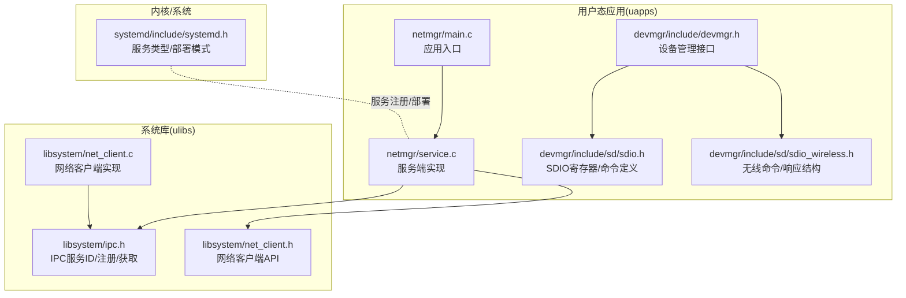
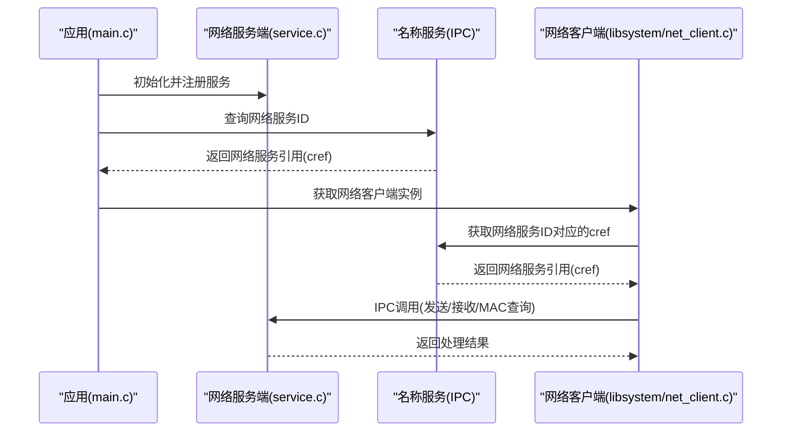
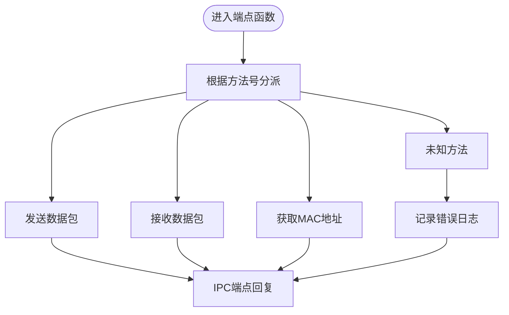
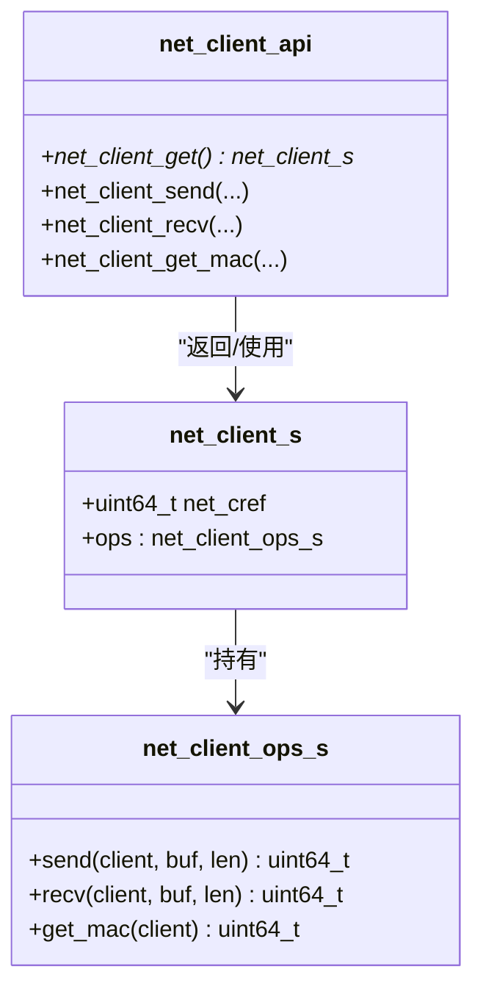
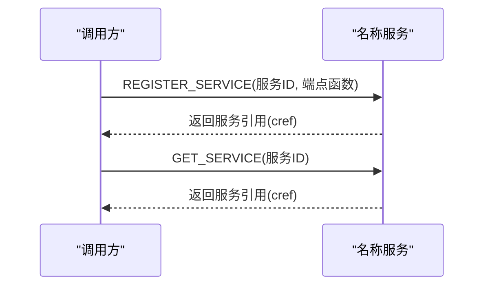
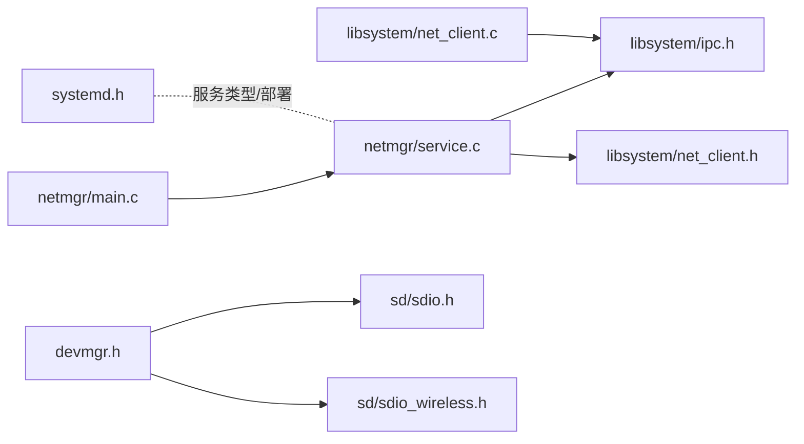

# 网络管理器

<cite>
**本文引用的文件**
- [uapps/netmgr/main.c](file://uapps/netmgr/main.c)
- [uapps/netmgr/service.c](file://uapps/netmgr/service.c)
- [uapps/netmgr/include/service.h](file://uapps/netmgr/include/service.h)
- [ulibs/include/libsystem/net_client.h](file://ulibs/include/libsystem/net_client.h)
- [ulibs/libsystem/net_client.c](file://ulibs/libsystem/net_client.c)
- [ulibs/include/libsystem/ipc.h](file://ulibs/include/libsystem/ipc.h)
- [kernel/systemd/include/systemd.h](file://kernel/systemd/include/systemd.h)
- [uapps/devmgr/include/devmgr.h](file://uapps/devmgr/include/devmgr.h)
- [uapps/devmgr/include/sd/sdio.h](file://uapps/devmgr/include/sd/sdio.h)
- [uapps/devmgr/include/sd/sdio_wireless.h](file://uapps/devmgr/include/sd/sdio_wireless.h)
- [uapps/netmgr/include/log.h](file://uapps/netmgr/include/log.h)
</cite>

## 目录
1. [简介](#简介)
2. [项目结构](#项目结构)
3. [核心组件](#核心组件)
4. [架构总览](#架构总览)
5. [组件详解](#组件详解)
6. [依赖关系分析](#依赖关系分析)
7. [性能考量](#性能考量)
8. [故障排除指南](#故障排除指南)
9. [结论](#结论)
10. [附录](#附录)

## 简介
本文件面向TranquilOS网络管理器（netmgr）的开发者与维护者，系统性梳理其核心功能、架构设计、API接口与与系统其他组件的集成方式。当前仓库中，网络管理器以“系统服务”的形式存在，通过IPC端点对外暴露网络数据包收发与MAC地址查询能力，并由系统服务框架统一调度与部署。同时，网络客户端库封装了对网络服务的调用，提供统一的发送、接收与查询接口；设备管理器（devmgr）负责底层设备探测与驱动注册，其中包含SDIO无线扩展能力的定义，为未来支持无线网络奠定基础。

## 项目结构
网络管理器位于用户态应用层，主要由以下模块组成：
- 应用入口：负责初始化网络服务并进入主循环
- 服务端实现：提供IPC端点处理网络请求
- 客户端库：封装对网络服务的调用，屏蔽IPC细节
- 系统服务框架：声明服务类型、部署模式与路径映射
- 设备管理器：负责设备发现、驱动注册与无线扩展能力定义

**图表来源**
- [uapps/netmgr/main.c](file://uapps/netmgr/main.c#L1-L20)
- [uapps/netmgr/service.c](file://uapps/netmgr/service.c#L1-L29)
- [ulibs/include/libsystem/net_client.h](file://ulibs/include/libsystem/net_client.h#L1-L31)
- [ulibs/libsystem/net_client.c](file://ulibs/libsystem/net_client.c#L1-L33)
- [ulibs/include/libsystem/ipc.h](file://ulibs/include/libsystem/ipc.h#L1-L73)
- [kernel/systemd/include/systemd.h](file://kernel/systemd/include/systemd.h#L1-L32)
- [uapps/devmgr/include/devmgr.h](file://uapps/devmgr/include/devmgr.h#L1-L30)
- [uapps/devmgr/include/sd/sdio.h](file://uapps/devmgr/include/sd/sdio.h#L1-L105)
- [uapps/devmgr/include/sd/sdio_wireless.h](file://uapps/devmgr/include/sd/sdio_wireless.h#L1-L62)

**章节来源**
- [uapps/netmgr/main.c](file://uapps/netmgr/main.c#L1-L20)
- [uapps/netmgr/service.c](file://uapps/netmgr/service.c#L1-L29)
- [ulibs/include/libsystem/net_client.h](file://ulibs/include/libsystem/net_client.h#L1-L31)
- [ulibs/libsystem/net_client.c](file://ulibs/libsystem/net_client.c#L1-L33)
- [ulibs/include/libsystem/ipc.h](file://ulibs/include/libsystem/ipc.h#L1-L73)
- [kernel/systemd/include/systemd.h](file://kernel/systemd/include/systemd.h#L1-L32)
- [uapps/devmgr/include/devmgr.h](file://uapps/devmgr/include/devmgr.h#L1-L30)
- [uapps/devmgr/include/sd/sdio.h](file://uapps/devmgr/include/sd/sdio.h#L1-L105)
- [uapps/devmgr/include/sd/sdio_wireless.h](file://uapps/devmgr/include/sd/sdio_wireless.h#L1-L62)

## 核心组件
- 网络服务端（netmgr/service.c）
  - 提供IPC端点，处理网络数据包发送、接收与MAC地址查询等方法
  - 注册为系统服务，等待客户端通过服务ID进行调用
- 网络客户端库（ulibs/libsystem/net_client.*）
  - 封装对网络服务的调用，提供send/recv/get_mac等高层API
  - 通过系统名称服务获取网络服务的引用（cref），并进行IPC调用
- IPC与服务框架（ulibs/include/libsystem/ipc.h）
  - 定义服务ID枚举（含网络服务ID）
  - 提供注册服务与获取服务的接口
- 应用入口（uapps/netmgr/main.c）
  - 初始化网络服务并保持运行
- 系统服务框架（kernel/systemd/include/systemd.h）
  - 声明服务类型（含SERVICE_NETMGR），用于系统层面的服务编排
- 设备管理器与无线扩展（uapps/devmgr/include/devmgr.h 及 SDIO相关头文件）
  - 设备描述与探测接口
  - SDIO命令/响应与无线网络相关结构定义，为后续无线网络支持做准备

**章节来源**
- [uapps/netmgr/service.c](file://uapps/netmgr/service.c#L6-L22)
- [uapps/netmgr/service.c](file://uapps/netmgr/service.c#L24-L28)
- [ulibs/libsystem/net_client.c](file://ulibs/libsystem/net_client.c#L7-L17)
- [ulibs/libsystem/net_client.c](file://ulibs/libsystem/net_client.c#L19-L32)
- [ulibs/include/libsystem/ipc.h](file://ulibs/include/libsystem/ipc.h#L11-L17)
- [ulibs/include/libsystem/ipc.h](file://ulibs/include/libsystem/ipc.h#L53-L59)
- [ulibs/include/libsystem/ipc.h](file://ulibs/include/libsystem/ipc.h#L61-L70)
- [uapps/netmgr/main.c](file://uapps/netmgr/main.c#L7-L19)
- [kernel/systemd/include/systemd.h](file://kernel/systemd/include/systemd.h#L4-L11)
- [uapps/devmgr/include/devmgr.h](file://uapps/devmgr/include/devmgr.h#L17-L20)
- [uapps/devmgr/include/sd/sdio.h](file://uapps/devmgr/include/sd/sdio.h#L7-L104)
- [uapps/devmgr/include/sd/sdio_wireless.h](file://uapps/devmgr/include/sd/sdio_wireless.h#L18-L48)

## 架构总览
网络管理器采用“服务化+IPC”架构：
- 网络客户端通过系统名称服务获取网络服务引用
- 客户端以IPC端点调用的方式向网络服务发起请求
- 网络服务在端点函数中根据方法号分派到具体处理逻辑
- 系统服务框架负责服务的类型与部署模式管理

**图表来源**
- [uapps/netmgr/main.c](file://uapps/netmgr/main.c#L10-L10)
- [uapps/netmgr/service.c](file://uapps/netmgr/service.c#L24-L28)
- [ulibs/libsystem/net_client.c](file://ulibs/libsystem/net_client.c#L19-L32)
- [ulibs/include/libsystem/ipc.h](file://ulibs/include/libsystem/ipc.h#L61-L70)

## 组件详解

### 网络服务端（netmgr/service.c）
- 职责
  - 注册网络服务端点，处理来自客户端的网络请求
  - 当前实现覆盖数据包发送、接收与MAC地址查询三类方法
- 关键流程
  - 方法分派：根据方法号执行不同分支
  - 日志记录：对每类方法调用进行调试日志输出
  - 回复：通过IPC端点回复调用方

**图表来源**
- [uapps/netmgr/service.c](file://uapps/netmgr/service.c#L6-L22)

**章节来源**
- [uapps/netmgr/service.c](file://uapps/netmgr/service.c#L6-L22)
- [uapps/netmgr/service.c](file://uapps/netmgr/service.c#L24-L28)

### 网络客户端库（ulibs/libsystem/net_client.*）
- 职责
  - 对外暴露统一的网络API：发送、接收、获取MAC地址
  - 内部通过系统名称服务获取网络服务引用，并进行IPC调用
- 数据结构
  - net_client_s：包含服务引用与操作函数指针
  - net_client_ops_s：封装send/recv/get_mac等操作
- 关键流程
  - 首次使用时通过sys_get_service获取网络服务引用
  - 将引用保存在静态对象中，后续直接复用
  - 通过OSIpcEndPointCall系列函数完成IPC调用

**图表来源**
- [ulibs/include/libsystem/net_client.h](file://ulibs/include/libsystem/net_client.h#L17-L26)
- [ulibs/libsystem/net_client.c](file://ulibs/libsystem/net_client.c#L7-L17)
- [ulibs/libsystem/net_client.c](file://ulibs/libsystem/net_client.c#L19-L32)

**章节来源**
- [ulibs/include/libsystem/net_client.h](file://ulibs/include/libsystem/net_client.h#L7-L30)
- [ulibs/libsystem/net_client.c](file://ulibs/libsystem/net_client.c#L7-L17)
- [ulibs/libsystem/net_client.c](file://ulibs/libsystem/net_client.c#L19-L32)

### IPC与服务框架（ulibs/include/libsystem/ipc.h）
- 服务ID
  - 包含网络服务ID（IPC_NET_SERVICE_ID），用于客户端定位服务
- 服务注册与获取
  - sys_register_service：向名称服务注册网络服务端点
  - sys_get_service：通过服务ID获取服务引用（cref），若未找到则重试
- 端点约定
  - IPC_ENDPOINT宏标识端点函数，确保正确处理返回

**图表来源**
- [ulibs/include/libsystem/ipc.h](file://ulibs/include/libsystem/ipc.h#L53-L59)
- [ulibs/include/libsystem/ipc.h](file://ulibs/include/libsystem/ipc.h#L61-L70)

**章节来源**
- [ulibs/include/libsystem/ipc.h](file://ulibs/include/libsystem/ipc.h#L11-L17)
- [ulibs/include/libsystem/ipc.h](file://ulibs/include/libsystem/ipc.h#L53-L59)
- [ulibs/include/libsystem/ipc.h](file://ulibs/include/libsystem/ipc.h#L61-L70)

### 应用入口（uapps/netmgr/main.c）
- 职责
  - 启动网络服务并保持进程存活
  - 使用日志接口输出运行状态
- 运行特征
  - 初始化后进入无限循环，周期性休眠

**章节来源**
- [uapps/netmgr/main.c](file://uapps/netmgr/main.c#L7-L19)

### 系统服务框架（kernel/systemd/include/systemd.h）
- 职责
  - 定义服务类型枚举，包含SERVICE_NETMGR
  - 描述服务部署模式与线性映射范围，便于系统级编排
- 影响
  - 网络管理器可作为系统服务被统一调度与部署

**章节来源**
- [kernel/systemd/include/systemd.h](file://kernel/systemd/include/systemd.h#L4-L11)
- [kernel/systemd/include/systemd.h](file://kernel/systemd/include/systemd.h#L18-L30)

### 设备管理器与无线扩展（uapps/devmgr）
- 设备管理接口
  - 设备描述结构与探测回调约定
  - 设备节点查找与属性访问接口
- SDIO与无线能力
  - SDIO命令/响应结构定义
  - 无线LAN SSID列表等结构，为无线网络接入提供数据模型

**章节来源**
- [uapps/devmgr/include/devmgr.h](file://uapps/devmgr/include/devmgr.h#L17-L20)
- [uapps/devmgr/include/sd/sdio.h](file://uapps/devmgr/include/sd/sdio.h#L7-L104)
- [uapps/devmgr/include/sd/sdio_wireless.h](file://uapps/devmgr/include/sd/sdio_wireless.h#L18-L60)

## 依赖关系分析
- 组件耦合
  - netmgr/service.c 依赖 IPC 与日志库
  - net_client.* 依赖 IPC 与系统服务框架
  - 应用入口依赖服务初始化与日志
- 外部依赖
  - 名称服务（sys_register_service/sys_get_service）
  - 系统服务框架（服务类型与部署模式）

**图表来源**
- [uapps/netmgr/main.c](file://uapps/netmgr/main.c#L1-L20)
- [uapps/netmgr/service.c](file://uapps/netmgr/service.c#L1-L29)
- [ulibs/include/libsystem/ipc.h](file://ulibs/include/libsystem/ipc.h#L1-L73)
- [ulibs/include/libsystem/net_client.h](file://ulibs/include/libsystem/net_client.h#L1-L31)
- [ulibs/libsystem/net_client.c](file://ulibs/libsystem/net_client.c#L1-L33)
- [kernel/systemd/include/systemd.h](file://kernel/systemd/include/systemd.h#L1-L32)
- [uapps/devmgr/include/devmgr.h](file://uapps/devmgr/include/devmgr.h#L1-L30)
- [uapps/devmgr/include/sd/sdio.h](file://uapps/devmgr/include/sd/sdio.h#L1-L105)
- [uapps/devmgr/include/sd/sdio_wireless.h](file://uapps/devmgr/include/sd/sdio_wireless.h#L1-L62)

**章节来源**
- [uapps/netmgr/main.c](file://uapps/netmgr/main.c#L1-L20)
- [uapps/netmgr/service.c](file://uapps/netmgr/service.c#L1-L29)
- [ulibs/include/libsystem/ipc.h](file://ulibs/include/libsystem/ipc.h#L1-L73)
- [ulibs/include/libsystem/net_client.h](file://ulibs/include/libsystem/net_client.h#L1-L31)
- [ulibs/libsystem/net_client.c](file://ulibs/libsystem/net_client.c#L1-L33)
- [kernel/systemd/include/systemd.h](file://kernel/systemd/include/systemd.h#L1-L32)
- [uapps/devmgr/include/devmgr.h](file://uapps/devmgr/include/devmgr.h#L1-L30)
- [uapps/devmgr/include/sd/sdio.h](file://uapps/devmgr/include/sd/sdio.h#L1-L105)
- [uapps/devmgr/include/sd/sdio_wireless.h](file://uapps/devmgr/include/sd/sdio_wireless.h#L1-L62)

## 性能考量
- IPC调用开销
  - 客户端每次网络操作均通过IPC端点调用，建议批量或合并请求以降低系统调用次数
- 服务可用性
  - sys_get_service在未找到服务时会重试，建议在网络服务启动后再进行业务调用，避免不必要的等待
- 日志频率
  - 调试阶段的日志输出有助于定位问题，但应控制日志级别与频率，避免影响吞吐

[本节为通用指导，无需特定文件引用]

## 故障排除指南
- 无法获取网络服务引用
  - 检查网络服务是否已注册（netmgr_init_service）
  - 确认sys_get_service返回值非空且有效
- 端点无响应或异常
  - 查看端点函数是否正确处理方法号
  - 确保IPC端点回复调用方（OSIpcEndPointReply）
- 无线网络相关
  - 若计划扩展无线网络，检查SDIO命令/响应结构与无线LAN数据结构是否满足需求

**章节来源**
- [uapps/netmgr/service.c](file://uapps/netmgr/service.c#L24-L28)
- [ulibs/include/libsystem/ipc.h](file://ulibs/include/libsystem/ipc.h#L61-L70)
- [uapps/devmgr/include/sd/sdio.h](file://uapps/devmgr/include/sd/sdio.h#L7-L104)
- [uapps/devmgr/include/sd/sdio_wireless.h](file://uapps/devmgr/include/sd/sdio_wireless.h#L18-L60)

## 结论
当前TranquilOS网络管理器以最小可行服务形态实现：通过IPC端点提供数据包收发与MAC查询能力，客户端库屏蔽IPC细节，系统服务框架支撑服务注册与部署。设备管理器提供了SDIO与无线扩展的数据结构基础，为后续支持以太网、无线网络与虚拟接口打下基础。建议在现有基础上逐步完善网络协议栈、设备驱动与服务注册机制，以满足更复杂的网络场景。

[本节为总结性内容，无需特定文件引用]

## 附录

### API接口一览（基于当前实现）
- 网络客户端API
  - 发送数据包：net_client_send
  - 接收数据包：net_client_recv
  - 获取MAC地址：net_client_get_mac
  - 获取客户端实例：net_client_get
- IPC服务接口
  - 注册服务：sys_register_service
  - 获取服务：sys_get_service
- 网络服务方法
  - 发送数据包：IPC_NET_SERVICE_FUNCTION_SEND_PACKET
  - 接收数据包：IPC_NET_SERVICE_FUNCTION_RECV_PACKET
  - 获取MAC地址：IPC_NET_SERVICE_FUNCTION_GET_MAC_ADDR

**章节来源**
- [ulibs/include/libsystem/net_client.h](file://ulibs/include/libsystem/net_client.h#L13-L28)
- [ulibs/libsystem/net_client.c](file://ulibs/libsystem/net_client.c#L7-L17)
- [ulibs/libsystem/net_client.c](file://ulibs/libsystem/net_client.c#L19-L32)
- [ulibs/include/libsystem/ipc.h](file://ulibs/include/libsystem/ipc.h#L53-L59)
- [ulibs/include/libsystem/ipc.h](file://ulibs/include/libsystem/ipc.h#L61-L70)
- [uapps/netmgr/service.c](file://uapps/netmgr/service.c#L7-L11)

### 开发指南（基于现有结构的扩展建议）
- 支持新的网络协议
  - 在网络服务端增加对应方法号与处理逻辑
  - 在网络客户端库新增对应API并封装IPC调用
- 集成新的网络设备驱动
  - 在设备管理器中定义设备描述与探测回调
  - 实现设备驱动并注册到设备树或平台设备
- 网络服务注册与部署
  - 在系统服务框架中声明服务类型与部署模式
  - 确保服务在系统启动流程中被正确加载

**章节来源**
- [uapps/devmgr/include/devmgr.h](file://uapps/devmgr/include/devmgr.h#L17-L20)
- [kernel/systemd/include/systemd.h](file://kernel/systemd/include/systemd.h#L4-L11)