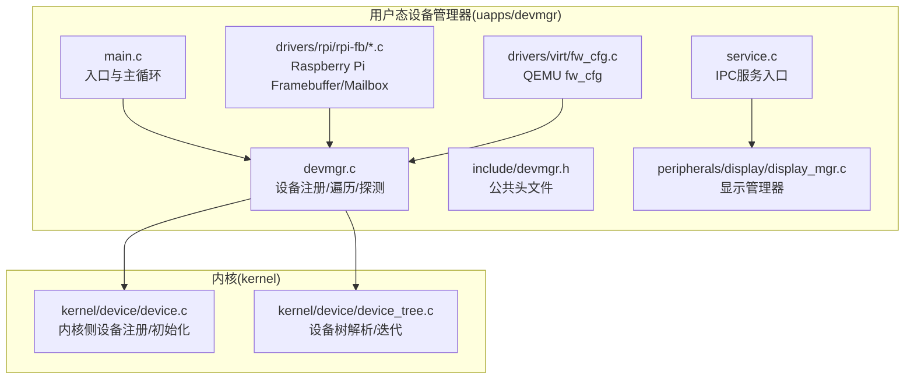
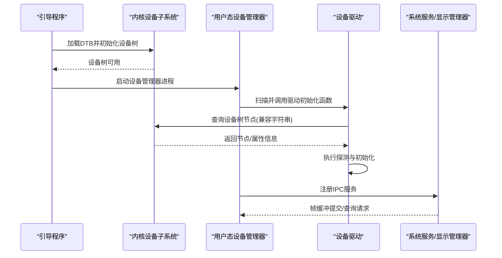
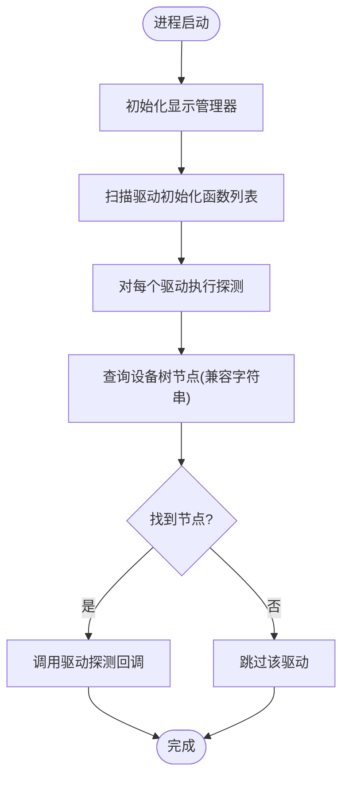
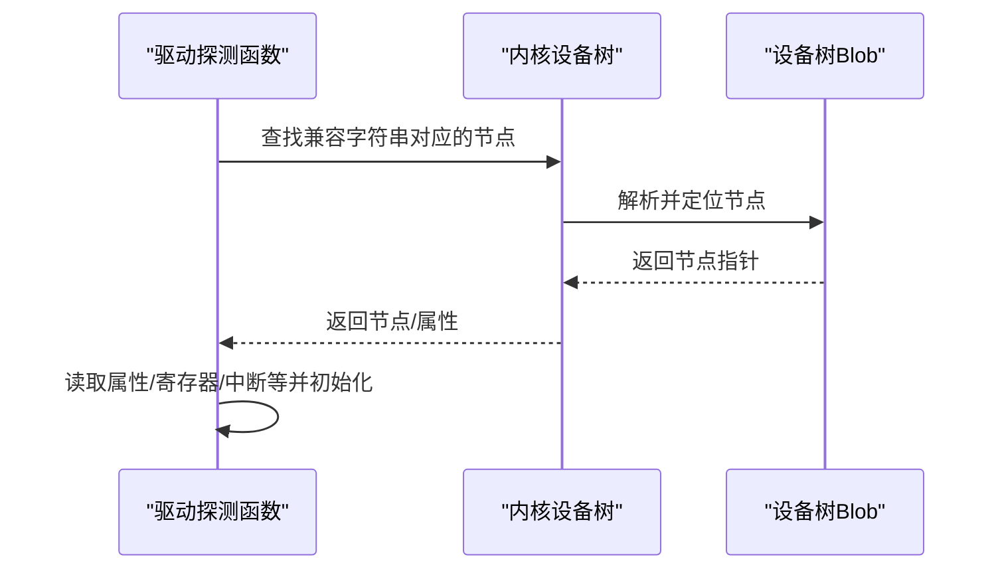
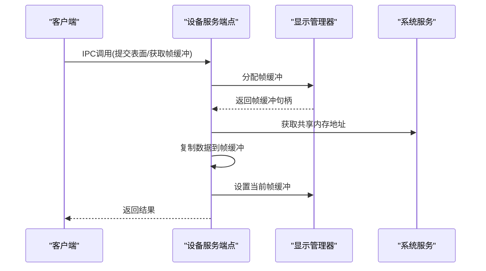
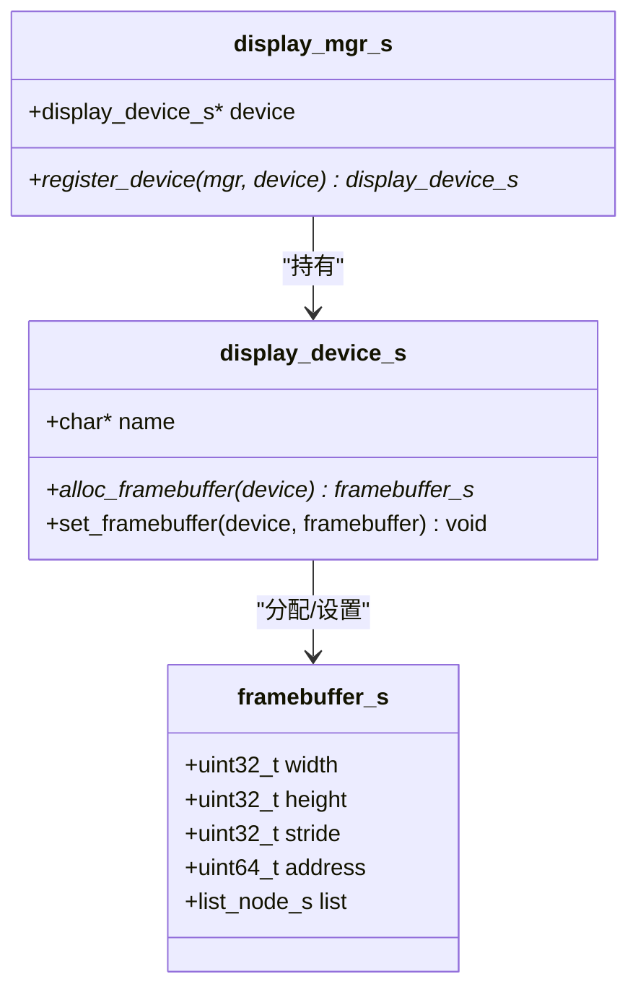
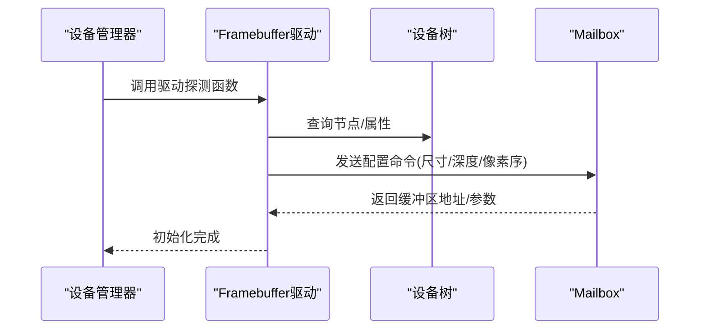
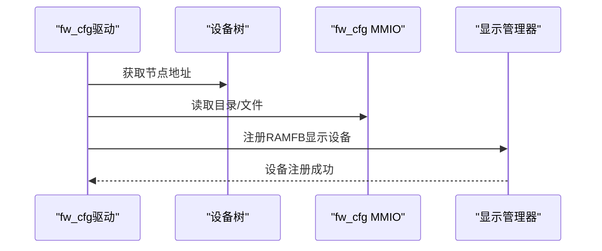
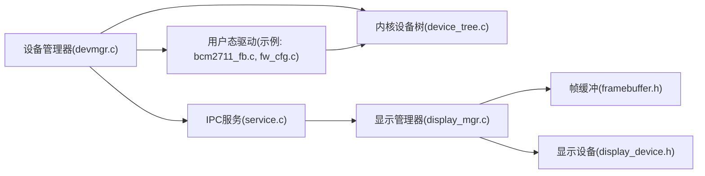

# 设备管理器

<cite>
**本文引用的文件**
- [uapps/devmgr/devmgr.c](file://uapps/devmgr/devmgr.c)
- [uapps/devmgr/main.c](file://uapps/devmgr/main.c)
- [uapps/devmgr/include/devmgr.h](file://uapps/devmgr/include/devmgr.h)
- [uapps/devmgr/service.c](file://uapps/devmgr/service.c)
- [uapps/devmgr/include/service.h](file://uapps/devmgr/include/service.h)
- [uapps/devmgr/peripherals/display/display_mgr.c](file://uapps/devmgr/peripherals/display/display_mgr.c)
- [uapps/devmgr/include/peripherals/display/display_mgr.h](file://uapps/devmgr/include/peripherals/display/display_mgr.h)
- [uapps/devmgr/include/peripherals/display/framebuffer.h](file://uapps/devmgr/include/peripherals/display/framebuffer.h)
- [uapps/devmgr/include/peripherals/display/device/display_device.h](file://uapps/devmgr/include/peripherals/display/device/display_device.h)
- [uapps/devmgr/drivers/rpi/rpi-fb/bcm2711_fb.c](file://uapps/devmgr/drivers/rpi/rpi-fb/bcm2711_fb.c)
- [uapps/devmgr/drivers/rpi/rpi-fb/bcm2711_mailbox.c](file://uapps/devmgr/drivers/rpi/rpi-fb/bcm2711_mailbox.c)
- [uapps/devmgr/drivers/virt/fw_cfg.c](file://uapps/devmgr/drivers/virt/fw_cfg.c)
- [uapps/devmgr/include/sd/sdio.h](file://uapps/devmgr/include/sd/sdio.h)
- [kernel/device/device.c](file://kernel/device/device.c)
- [kernel/device/device_tree.c](file://kernel/device/device_tree.c)
</cite>

## 目录
1. [简介](#简介)
2. [项目结构](#项目结构)
3. [核心组件](#核心组件)
4. [架构总览](#架构总览)
5. [详细组件分析](#详细组件分析)
6. [依赖关系分析](#依赖关系分析)
7. [性能考虑](#性能考虑)
8. [故障排查指南](#故障排查指南)
9. [结论](#结论)
10. [附录](#附录)

## 简介
本文件为 TranquilOS 设备管理器（DevMgr）的权威技术文档。它面向内核开发者与驱动工程师，系统性阐述设备管理器在内核中的职责边界、与内核的交互方式、设备树集成与驱动加载机制、设备服务的 API 接口、以及在 Raspberry Pi 与 QEMU 虚拟平台上的设备支持现状。文档同时提供新增驱动的开发指南与调试技巧，并说明设备管理器与系统其他服务（如显示管理器、系统服务等）的协作机制。

## 项目结构
设备管理器位于用户态应用层，核心代码集中在 uapps/devmgr 目录，配合内核 kernel/device 子系统完成设备树解析与驱动注册。驱动按平台分层组织：Raspberry Pi 的专用驱动位于 drivers/rpi，QEMU 虚拟平台的驱动位于 drivers/virt。

图表来源
- [uapps/devmgr/main.c](file://uapps/devmgr/main.c#L1-L18)
- [uapps/devmgr/devmgr.c](file://uapps/devmgr/devmgr.c#L1-L62)
- [uapps/devmgr/include/devmgr.h](file://uapps/devmgr/include/devmgr.h#L1-L30)
- [uapps/devmgr/service.c](file://uapps/devmgr/service.c#L1-L72)
- [uapps/devmgr/peripherals/display/display_mgr.c](file://uapps/devmgr/peripherals/display/display_mgr.c#L1-L31)
- [uapps/devmgr/drivers/rpi/rpi-fb/bcm2711_fb.c](file://uapps/devmgr/drivers/rpi/rpi-fb/bcm2711_fb.c#L1-L173)
- [uapps/devmgr/drivers/virt/fw_cfg.c](file://uapps/devmgr/drivers/virt/fw_cfg.c#L1-L152)
- [kernel/device/device.c](file://kernel/device/device.c#L1-L55)
- [kernel/device/device_tree.c](file://kernel/device/device_tree.c#L1-L95)

章节来源
- [uapps/devmgr/main.c](file://uapps/devmgr/main.c#L1-L18)
- [uapps/devmgr/devmgr.c](file://uapps/devmgr/devmgr.c#L1-L62)
- [uapps/devmgr/include/devmgr.h](file://uapps/devmgr/include/devmgr.h#L1-L30)
- [kernel/device/device.c](file://kernel/device/device.c#L1-L55)
- [kernel/device/device_tree.c](file://kernel/device/device_tree.c#L1-L95)

## 核心组件
- 设备描述与注册
  - 设备描述结构体包含兼容字符串与探测回调；通过宏将驱动初始化函数注册到特定段，运行时统一调用完成自动探测与初始化。
- 设备树集成
  - 提供基于兼容字符串的节点查找、属性读取、节点迭代等能力；支持打印设备树以辅助调试。
- 驱动加载机制
  - 用户态设备管理器在启动阶段扫描已注册的驱动初始化函数并逐一执行；每个驱动负责根据设备树节点信息完成自身探测与初始化。
- 设备服务与IPC
  - 暴露IPC服务接口，用于获取/提交帧缓冲等操作；与系统服务、显示管理器协作完成图形输出。
- 显示子系统
  - 显示管理器负责注册具体显示设备（如 RAMFB），并提供分配/设置帧缓冲的接口。

章节来源
- [uapps/devmgr/include/devmgr.h](file://uapps/devmgr/include/devmgr.h#L7-L20)
- [uapps/devmgr/devmgr.c](file://uapps/devmgr/devmgr.c#L33-L62)
- [kernel/device/device_tree.c](file://kernel/device/device_tree.c#L25-L80)
- [uapps/devmgr/service.c](file://uapps/devmgr/service.c#L42-L72)
- [uapps/devmgr/peripherals/display/display_mgr.c](file://uapps/devmgr/peripherals/display/display_mgr.c#L6-L19)

## 架构总览
设备管理器采用“用户态驱动框架 + 内核设备树 + IPC 服务”的架构。内核负责设备树解析与早期设备初始化；用户态设备管理器在系统引导后期接管，依据设备树进行驱动匹配与初始化；通过IPC向系统服务注册服务，向应用提供设备控制接口。

图表来源
- [kernel/device/device_tree.c](file://kernel/device/device_tree.c#L10-L37)
- [uapps/devmgr/devmgr.c](file://uapps/devmgr/devmgr.c#L57-L62)
- [uapps/devmgr/service.c](file://uapps/devmgr/service.c#L68-L72)

## 详细组件分析

### 设备管理器核心API与生命周期
- 入口与主循环
  - 进程入口负责初始化显示管理器、扫描并初始化所有驱动、注册设备服务，并进入空转让出CPU。
- 设备注册与探测
  - 通过设备描述结构与初始化宏，将驱动注册到特定段；启动时遍历该段并逐个调用驱动探测函数。
  - 探测函数可直接使用内核提供的设备树查询接口，完成硬件识别与资源绑定。
- 设备树访问
  - 支持按兼容字符串查找节点、按设备类型查找、属性查询、节点迭代与设备树转储等。

图表来源
- [uapps/devmgr/main.c](file://uapps/devmgr/main.c#L6-L17)
- [uapps/devmgr/devmgr.c](file://uapps/devmgr/devmgr.c#L57-L62)
- [kernel/device/device_tree.c](file://kernel/device/device_tree.c#L25-L37)

章节来源
- [uapps/devmgr/main.c](file://uapps/devmgr/main.c#L1-L18)
- [uapps/devmgr/devmgr.c](file://uapps/devmgr/devmgr.c#L1-L62)
- [uapps/devmgr/include/devmgr.h](file://uapps/devmgr/include/devmgr.h#L1-L30)

### 设备树解析与驱动匹配
- 设备树初始化
  - 记录DTB物理地址，提供检查与转储能力；后续驱动通过内核接口访问。
- 节点与属性查询
  - 支持按兼容字符串/设备类型查找节点；支持按名称查找属性；支持遍历节点与按类型遍历。
- 驱动匹配
  - 驱动在探测阶段传入兼容字符串，由内核侧设备树模块返回对应节点；驱动再根据节点信息完成初始化。

图表来源
- [kernel/device/device_tree.c](file://kernel/device/device_tree.c#L10-L37)
- [kernel/device/device.c](file://kernel/device/device.c#L13-L26)

章节来源
- [kernel/device/device_tree.c](file://kernel/device/device_tree.c#L1-L95)
- [kernel/device/device.c](file://kernel/device/device.c#L1-L55)

### 设备服务与IPC接口
- 服务注册
  - 设备管理器在启动时向系统服务注册设备服务，提供IPC端点处理函数。
- 帧缓冲服务
  - 支持通过共享内存提交表面数据；内部通过显示管理器分配帧缓冲并设置到显示设备。
- 方法枚举
  - 包含获取帧缓冲、提交帧缓冲、通过共享内存提交表面、获取CPIO地址等方法。

图表来源
- [uapps/devmgr/service.c](file://uapps/devmgr/service.c#L42-L72)
- [uapps/devmgr/peripherals/display/display_mgr.c](file://uapps/devmgr/peripherals/display/display_mgr.c#L6-L19)

章节来源
- [uapps/devmgr/service.c](file://uapps/devmgr/service.c#L1-L72)
- [uapps/devmgr/include/service.h](file://uapps/devmgr/include/service.h#L1-L6)
- [uapps/devmgr/peripherals/display/display_mgr.c](file://uapps/devmgr/peripherals/display/display_mgr.c#L1-L31)

### 显示管理器与帧缓冲模型
- 显示管理器
  - 维护当前注册的显示设备，提供注册接口；初始化时填充操作表。
- 帧缓冲抽象
  - 帧缓冲包含宽高、跨度、基地址与链表节点；不同显示设备实现分配与设置帧缓冲的具体逻辑。
- 显示设备接口
  - 定义分配帧缓冲与设置帧缓冲两个回调，便于不同平台的实现复用。

图表来源
- [uapps/devmgr/include/peripherals/display/display_mgr.h](file://uapps/devmgr/include/peripherals/display/display_mgr.h#L11-L18)
- [uapps/devmgr/include/peripherals/display/device/display_device.h](file://uapps/devmgr/include/peripherals/display/device/display_device.h#L10-L14)
- [uapps/devmgr/include/peripherals/display/framebuffer.h](file://uapps/devmgr/include/peripherals/display/framebuffer.h#L8-L14)

章节来源
- [uapps/devmgr/peripherals/display/display_mgr.c](file://uapps/devmgr/peripherals/display/display_mgr.c#L1-L31)
- [uapps/devmgr/include/peripherals/display/display_mgr.h](file://uapps/devmgr/include/peripherals/display/display_mgr.h#L1-L20)
- [uapps/devmgr/include/peripherals/display/device/display_device.h](file://uapps/devmgr/include/peripherals/display/device/display_device.h#L1-L16)
- [uapps/devmgr/include/peripherals/display/framebuffer.h](file://uapps/devmgr/include/peripherals/display/framebuffer.h#L1-L16)

### 驱动示例：Raspberry Pi Framebuffer 与 Mailbox
- 驱动注册
  - 通过初始化宏将驱动注册到设备管理器；驱动在探测阶段根据兼容字符串匹配节点。
- 初始化流程
  - 驱动探测函数中可读取设备树节点信息，结合平台寄存器或Mailbox接口完成初始化。
- 邮箱通信
  - 使用Mailbox通道与VideoCore通信，完成帧缓冲尺寸、像素格式、缓冲区分配与偏移切换等操作。

图表来源
- [uapps/devmgr/drivers/rpi/rpi-fb/bcm2711_fb.c](file://uapps/devmgr/drivers/rpi/rpi-fb/bcm2711_fb.c#L159-L166)
- [uapps/devmgr/drivers/rpi/rpi-fb/bcm2711_mailbox.c](file://uapps/devmgr/drivers/rpi/rpi-fb/bcm2711_mailbox.c#L31-L43)

章节来源
- [uapps/devmgr/drivers/rpi/rpi-fb/bcm2711_fb.c](file://uapps/devmgr/drivers/rpi/rpi-fb/bcm2711_fb.c#L1-L173)
- [uapps/devmgr/drivers/rpi/rpi-fb/bcm2711_mailbox.c](file://uapps/devmgr/drivers/rpi/rpi-fb/bcm2711_mailbox.c#L1-L43)

### 驱动示例：QEMU fw_cfg 显存驱动
- fw_cfg 接口
  - 通过MMIO寄存器访问fw_cfg目录与文件，支持DMA读写；用于向虚拟机注入配置（如RAMFB）。
- RAMFB 显示设备
  - 实现分配帧缓冲与设置帧缓冲的回调；通过fw_cfg将帧缓冲元数据下发给虚拟机。
- 驱动注册
  - 在探测阶段解析节点地址，初始化fw_cfg目录，随后注册RAMFB显示设备到显示管理器。

图表来源
- [uapps/devmgr/drivers/virt/fw_cfg.c](file://uapps/devmgr/drivers/virt/fw_cfg.c#L132-L145)
- [uapps/devmgr/drivers/virt/fw_cfg.c](file://uapps/devmgr/drivers/virt/fw_cfg.c#L126-L130)

章节来源
- [uapps/devmgr/drivers/virt/fw_cfg.c](file://uapps/devmgr/drivers/virt/fw_cfg.c#L1-L152)

### SDIO 协议定义（扩展）
- SDIO 命令与响应
  - 定义了多种SDIO命令的位域结构，包括IO_SEND_OP_COND、IO_RW_DIRECT、IO_RW_EXTENDED等，便于上层协议栈实现。
- 用途
  - 可用于未来扩展SD/MMC类设备驱动，实现IO功能卡的读写与状态查询。

章节来源
- [uapps/devmgr/include/sd/sdio.h](file://uapps/devmgr/include/sd/sdio.h#L1-L105)

## 依赖关系分析
- 用户态设备管理器依赖内核设备树模块完成节点与属性查询；驱动通过设备描述与探测回调参与统一初始化流程。
- 显示管理器作为中间层，向上提供统一的帧缓冲接口，向下对接不同平台的显示设备实现。
- IPC 服务依赖系统服务完成共享内存获取与服务注册。

图表来源
- [uapps/devmgr/devmgr.c](file://uapps/devmgr/devmgr.c#L1-L62)
- [kernel/device/device_tree.c](file://kernel/device/device_tree.c#L1-L95)
- [uapps/devmgr/service.c](file://uapps/devmgr/service.c#L1-L72)
- [uapps/devmgr/peripherals/display/display_mgr.c](file://uapps/devmgr/peripherals/display/display_mgr.c#L1-L31)
- [uapps/devmgr/include/peripherals/display/framebuffer.h](file://uapps/devmgr/include/peripherals/display/framebuffer.h#L1-L16)
- [uapps/devmgr/include/peripherals/display/device/display_device.h](file://uapps/devmgr/include/peripherals/display/device/display_device.h#L1-L16)

章节来源
- [uapps/devmgr/devmgr.c](file://uapps/devmgr/devmgr.c#L1-L62)
- [kernel/device/device_tree.c](file://kernel/device/device_tree.c#L1-L95)
- [uapps/devmgr/service.c](file://uapps/devmgr/service.c#L1-L72)
- [uapps/devmgr/peripherals/display/display_mgr.c](file://uapps/devmgr/peripherals/display/display_mgr.c#L1-L31)

## 性能考虑
- 驱动初始化顺序
  - 通过初始化宏将驱动注册到特定段，确保在系统引导后期统一执行，避免早期资源竞争。
- 设备树查询
  - 将频繁查询封装为内核接口，减少重复解析开销；必要时使用节点迭代与按类型过滤降低遍历成本。
- IPC 传输
  - 帧缓冲提交建议使用共享内存以减少拷贝次数；注意跨进程/虚拟机场景下的地址映射一致性。
- 显示路径
  - 帧缓冲双缓/三缓策略可减少撕裂；设置帧缓冲时尽量批量更新，避免频繁切换导致的闪烁。

## 故障排查指南
- 设备树相关
  - 若兼容字符串未匹配到节点，需确认DTB是否正确传递至用户态，以及驱动兼容字符串与设备树一致。
- 驱动探测
  - 探测失败时检查节点地址获取与属性读取流程；必要时启用设备树转储辅助定位。
- IPC 服务
  - 服务未响应或返回错误时，检查服务注册是否成功、共享内存获取是否返回有效地址、帧缓冲参数是否合法。
- 显示问题
  - 帧缓冲无法显示时，确认显示设备已注册、分配的帧缓冲参数与平台期望一致、设置帧缓冲调用成功。

章节来源
- [uapps/devmgr/devmgr.c](file://uapps/devmgr/devmgr.c#L10-L55)
- [uapps/devmgr/service.c](file://uapps/devmgr/service.c#L9-L40)
- [kernel/device/device_tree.c](file://kernel/device/device_tree.c#L19-L23)

## 结论
设备管理器在TranquilOS中承担用户态驱动框架与设备服务的职责，通过与内核设备树紧密协作，实现了对Raspberry Pi与QEMU虚拟平台的设备支持。其模块化设计便于扩展新的设备类型与驱动，配合IPC服务与显示管理器，能够满足基础图形输出与系统服务需求。建议在新增驱动时遵循现有模式，充分利用设备树查询与显示管理器抽象，确保初始化流程清晰、可维护性强。

## 附录

### 开发指南：新增设备驱动
- 步骤
  - 定义设备描述结构，填写兼容字符串与探测回调。
  - 在探测回调中使用设备树查询接口获取节点与属性，完成硬件初始化。
  - 通过初始化宏注册驱动，使其在启动时被统一扫描与执行。
  - 如涉及显示设备，注册到显示管理器以接入帧缓冲服务。
- 最佳实践
  - 驱动内部保持最小耦合，仅依赖设备树与平台接口。
  - 对外暴露稳定的API（如显示设备的分配/设置接口），便于上层复用。
  - 在调试阶段开启设备树转储与日志输出，快速定位问题。

章节来源
- [uapps/devmgr/include/devmgr.h](file://uapps/devmgr/include/devmgr.h#L7-L20)
- [uapps/devmgr/devmgr.c](file://uapps/devmgr/devmgr.c#L33-L55)
- [uapps/devmgr/peripherals/display/display_mgr.c](file://uapps/devmgr/peripherals/display/display_mgr.c#L6-L19)