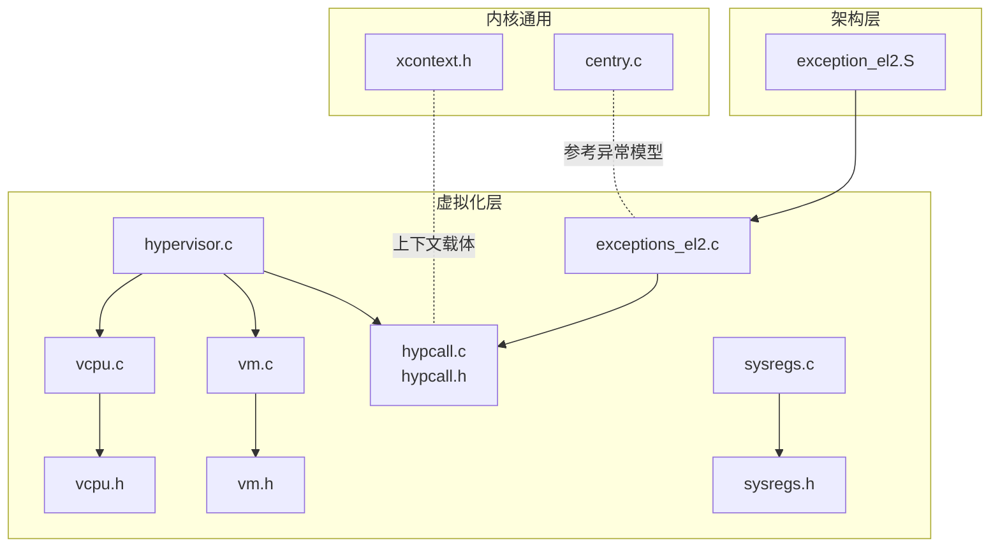
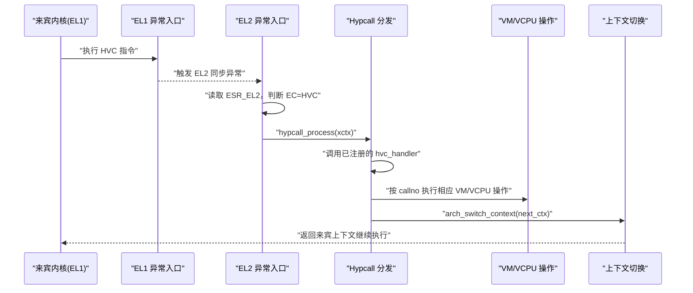
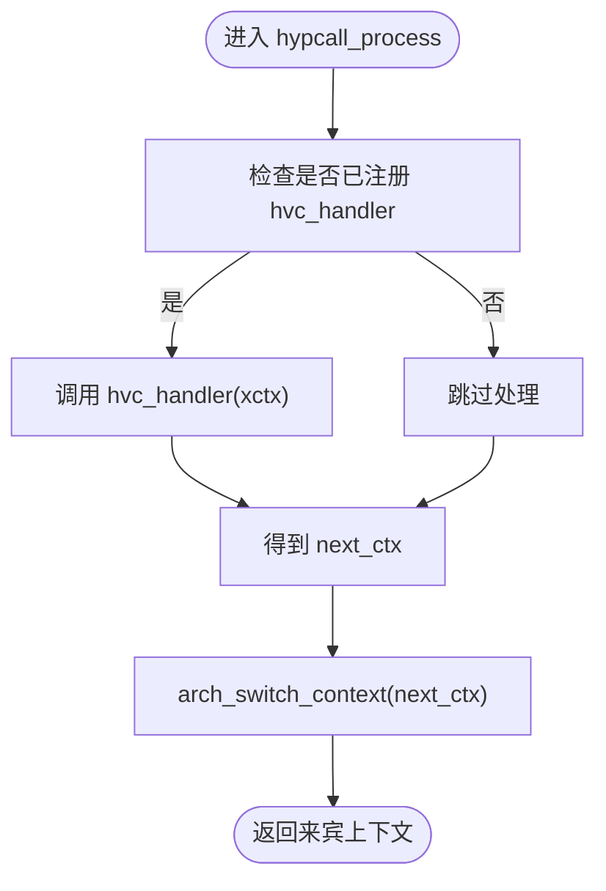
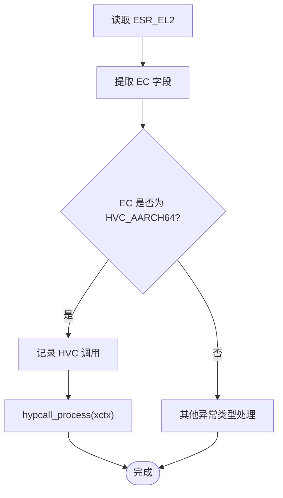
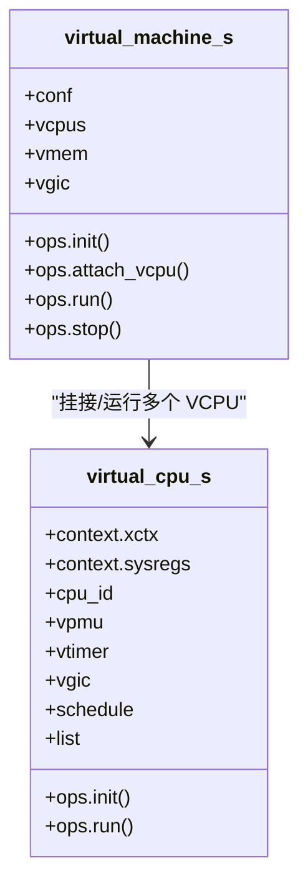
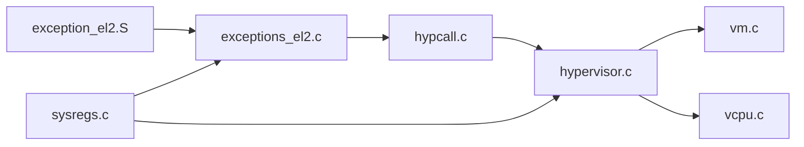

# Hypcall接口

<cite>
**本文引用的文件**
- [hypcall.h](file://virt/include/hypcall/hypcall.h)
- [hypcall.c](file://virt/hypcall/hypcall.c)
- [hypervisor.c](file://virt/hypervisor.c)
- [exceptions_el2.c](file://virt/exceptions_el2.c)
- [exception_el2.S](file://virt/arch/arm64/boot/exception_el2.S)
- [vm.h](file://virt/include/vm.h)
- [vcpu.h](file://virt/include/vcpu.h)
- [vm.c](file://virt/vm.c)
- [vcpu.c](file://virt/vcpu.c)
- [sysregs.h](file://virt/include/arch/arm64/sysregs.h)
- [sysregs.c](file://virt/arch/arm64/sysregs/sysregs.c)
- [xcontext.h](file://kernel/include/xcontext/xcontext.h)
- [centry.c](file://kernel/arch/arm64/entry/centry.c)
</cite>

## 目录
1. [简介](#简介)
2. [项目结构](#项目结构)
3. [核心组件](#核心组件)
4. [架构总览](#架构总览)
5. [详细组件分析](#详细组件分析)
6. [依赖关系分析](#依赖关系分析)
7. [性能考量](#性能考量)
8. [故障排查指南](#故障排查指南)
9. [结论](#结论)
10. [附录：使用示例与最佳实践](#附录使用示例与最佳实践)

## 简介
本文件系统性阐述 TranquilOS 的 Hypcall 接口设计与实现，重点覆盖以下方面：
- Hypcall 机制与 HVC 指令在虚拟机管理中的角色与工作流
- Hypcall 指令号定义、参数传递约定与返回路径
- EL2 异常捕获、HVC 分派与上下文切换
- 虚拟机生命周期管理（初始化、VCPU 创建/运行/停止、VM 停止）
- 错误处理与调试建议
- 性能优化与安全注意事项
- 实战示例与最佳实践

## 项目结构
围绕 Hypcall 的关键源码分布于如下模块：
- 虚拟化层（virt）：Hypcall 定义与分发、EL2 异常处理、VCPU/VM 抽象
- 架构层（arch/arm64）：EL2 异常向量表、系统寄存器访问宏
- 内核通用（kernel）：执行上下文抽象与异常入口

图表来源
- [hypcall.c](file://virt/hypcall/hypcall.c#L1-L25)
- [hypcall.h](file://virt/include/hypcall/hypcall.h#L1-L18)
- [hypervisor.c](file://virt/hypervisor.c#L1-L149)
- [exceptions_el2.c](file://virt/exceptions_el2.c#L1-L138)
- [exception_el2.S](file://virt/arch/arm64/boot/exception_el2.S#L1-L107)
- [vcpu.h](file://virt/include/vcpu.h#L1-L49)
- [vm.h](file://virt/include/vm.h#L1-L39)
- [vcpu.c](file://virt/vcpu.c#L1-L66)
- [vm.c](file://virt/vm.c#L1-L59)
- [sysregs.h](file://virt/include/arch/arm64/sysregs.h#L1-L110)
- [sysregs.c](file://virt/arch/arm64/sysregs/sysregs.c#L1-L172)
- [xcontext.h](file://kernel/include/xcontext/xcontext.h#L1-L24)
- [centry.c](file://kernel/arch/arm64/entry/centry.c#L1-L224)

章节来源
- [hypcall.h](file://virt/include/hypcall/hypcall.h#L1-L18)
- [hypcall.c](file://virt/hypcall/hypcall.c#L1-L25)
- [hypervisor.c](file://virt/hypervisor.c#L1-L149)
- [exceptions_el2.c](file://virt/exceptions_el2.c#L1-L138)
- [exception_el2.S](file://virt/arch/arm64/boot/exception_el2.S#L1-L107)
- [vm.h](file://virt/include/vm.h#L1-L39)
- [vcpu.h](file://virt/include/vcpu.h#L1-L49)
- [vm.c](file://virt/vm.c#L1-L59)
- [vcpu.c](file://virt/vcpu.c#L1-L66)
- [sysregs.h](file://virt/include/arch/arm64/sysregs.h#L1-L110)
- [sysregs.c](file://virt/arch/arm64/sysregs/sysregs.c#L1-L172)
- [xcontext.h](file://kernel/include/xcontext/xcontext.h#L1-L24)
- [centry.c](file://kernel/arch/arm64/entry/centry.c#L1-L224)

## 核心组件
- Hypcall 接口与分发
  - 指令号定义：HYPERCALL_HYPERVISOR_INIT、HYPERCALL_VM_INIT、HYPERCALL_VM_VCPU_CREATE、HYPERCALL_VM_VCPU_RUN、HYPERCALL_VM_VCPU_STOP、HYPERCALL_VM_VM_STOP
  - 分发函数：hypcall_process；注册处理器：hypcall_register
- EL2 异常与 HVC 处理
  - EL2 向量表由 exception_el2.S 提供，异常入口在 exceptions_el2.c 中解析 ESR_EL2 并根据 EC 分派
  - HVC 分支调用 hypcall_process，并最终进行上下文切换
- VCPU/VM 生命周期
  - VM/VCPU 抽象与默认操作集（init/run/attach/stop），VCPU 上下文初始化与寄存器设置
- 执行上下文
  - execute_context_s 作为通用上下文载体，承载架构寄存器与调度上下文

章节来源
- [hypcall.h](file://virt/include/hypcall/hypcall.h#L6-L16)
- [hypcall.c](file://virt/hypcall/hypcall.c#L13-L25)
- [exceptions_el2.c](file://virt/exceptions_el2.c#L51-L85)
- [exception_el2.S](file://virt/arch/arm64/boot/exception_el2.S#L64-L107)
- [vm.h](file://virt/include/vm.h#L8-L36)
- [vcpu.h](file://virt/include/vcpu.h#L14-L46)
- [vm.c](file://virt/vm.c#L48-L59)
- [vcpu.c](file://virt/vcpu.c#L15-L65)
- [xcontext.h](file://kernel/include/xcontext/xcontext.h#L7-L22)

## 架构总览
Hypcall 在 TranquilOS 中通过 HVC 指令从 EL1 触发，进入 EL2 同步异常，解析 ESR_EL2 的 EC 字段识别为 HVC 后，调用 hypcall_process 进行分发。分发器可由 hypervisor.c 注册的处理器完成具体逻辑，最后通过上下文切换回到调用方。

图表来源
- [exceptions_el2.c](file://virt/exceptions_el2.c#L51-L85)
- [hypcall.c](file://virt/hypcall/hypcall.c#L19-L25)
- [hypervisor.c](file://virt/hypervisor.c#L78-L99)
- [exception_el2.S](file://virt/arch/arm64/boot/exception_el2.S#L64-L107)

## 详细组件分析

### Hypcall 接口与分发
- 指令号与语义
  - HYPERCALL_HYPERVISOR_INIT：初始化 Hypervisor 配置寄存器（如 HCR_EL2）
  - HYPERCALL_VM_INIT：预留 VM 初始化入口
  - HYPERCALL_VM_VCPU_CREATE：预留 VCPU 创建入口
  - HYPERCALL_VM_VCPU_RUN：预留 VCPU 运行入口
  - HYPERCALL_VM_VCPU_STOP：预留 VCPU 停止入口
  - HYPERCALL_VM_VM_STOP：预留 VM 停止入口
- 分发流程
  - hypcall_process 读取当前执行上下文，若已注册 hvc_handler，则调用并获得 next_ctx，随后进行上下文切换
  - hypcall_register 用于注册 EL2 HVC 处理回调

图表来源
- [hypcall.c](file://virt/hypcall/hypcall.c#L19-L25)
- [hypcall.h](file://virt/include/hypcall/hypcall.h#L13-L16)

章节来源
- [hypcall.h](file://virt/include/hypcall/hypcall.h#L6-L16)
- [hypcall.c](file://virt/hypcall/hypcall.c#L13-L25)

### EL2 异常与 HVC 处理
- 异常向量表
  - exception_el2.S 提供完整的 EL2 异常向量表，包含不同特权级别与同步/IRQ/FIQ/SError 分支
- 异常入口与分派
  - exceptions_el2.c 在 EL2 同步入口中读取 ESR_EL2，解析 EC 字段
  - 当 EC=HVC_AARCH64 时，记录日志并调用 hypcall_process
- HCR_EL2 配置
  - hypervisor.c 在 hypervisor_hvc_init 中配置 HCR_EL2，启用物理中断/FIQ/SError 路由等

图表来源
- [exceptions_el2.c](file://virt/exceptions_el2.c#L51-L85)
- [exception_el2.S](file://virt/arch/arm64/boot/exception_el2.S#L64-L107)
- [hypervisor.c](file://virt/hypervisor.c#L54-L76)

章节来源
- [exceptions_el2.c](file://virt/exceptions_el2.c#L51-L85)
- [exception_el2.S](file://virt/arch/arm64/boot/exception_el2.S#L64-L107)
- [hypervisor.c](file://virt/hypervisor.c#L54-L76)

### VCPU/VM 生命周期与上下文
- VM 抽象
  - vm.h 定义虚拟机配置、VCPU 列表、内存与虚拟 GIC 结构，以及 init/attach_vcpu/run/stop 操作集
  - vm.c 提供默认实现：初始化内存与各 VCPU、运行所有 VCPU、挂接 VCPU
- VCPU 抽象
  - vcpu.h 定义 VCPU 上下文（execute_context_s + aarch64_sys_regs_s）、调度节点与操作集
  - vcpu.c 提供默认实现：上下文初始化（设置 x0/dtb、SP、PC、SPSR）、运行切换
- Hypervisor 启动流程
  - hypervisor.c 在主核启动时初始化设备树、中断、内存、EL2 异常向量、HCR_EL2，并创建 VM/VCPU，随后运行 VM

图表来源
- [vm.h](file://virt/include/vm.h#L19-L36)
- [vcpu.h](file://virt/include/vcpu.h#L26-L46)
- [vm.c](file://virt/vm.c#L48-L59)
- [vcpu.c](file://virt/vcpu.c#L47-L65)

章节来源
- [vm.h](file://virt/include/vm.h#L8-L36)
- [vcpu.h](file://virt/include/vcpu.h#L14-L46)
- [vm.c](file://virt/vm.c#L48-L59)
- [vcpu.c](file://virt/vcpu.c#L15-L65)
- [hypervisor.c](file://virt/hypervisor.c#L101-L145)

### 执行上下文与寄存器保存/恢复
- execute_context_s
  - 作为通用上下文载体，包含架构寄存器存储区、IPC 字段与调度上下文指针
- aarch64_sys_regs_s
  - 记录一组 AArch64 系统寄存器状态，支持保存/恢复
- 使用场景
  - VCPU 上下文初始化时设置入口地址、栈指针与 SPSR
  - Hypervisor 在 EL2 侧对系统寄存器进行读写以控制虚拟化行为

章节来源
- [xcontext.h](file://kernel/include/xcontext/xcontext.h#L7-L22)
- [sysregs.h](file://virt/include/arch/arm64/sysregs.h#L7-L104)
- [sysregs.c](file://virt/arch/arm64/sysregs/sysregs.c#L88-L172)
- [vcpu.c](file://virt/vcpu.c#L19-L33)

## 依赖关系分析
- 组件耦合
  - EL2 异常入口依赖 ESR_EL2 解析与向量表布局
  - Hypcall 分发依赖 hvc_handler 注册与上下文切换
  - VM/VCPU 抽象独立于具体 Hypcall 实现，便于扩展
- 关键依赖链
  - exception_el2.S → exceptions_el2.c → hypcall.c → hypervisor.c → vm.c/vcpu.c
  - sysregs.c 提供系统寄存器读写，支撑 HCR_EL2 等配置

图表来源
- [exception_el2.S](file://virt/arch/arm64/boot/exception_el2.S#L64-L107)
- [exceptions_el2.c](file://virt/exceptions_el2.c#L1-L138)
- [hypcall.c](file://virt/hypcall/hypcall.c#L1-L25)
- [hypervisor.c](file://virt/hypervisor.c#L1-L149)
- [vm.c](file://virt/vm.c#L1-L59)
- [vcpu.c](file://virt/vcpu.c#L1-L66)
- [sysregs.c](file://virt/arch/arm64/sysregs/sysregs.c#L1-L172)

章节来源
- [exception_el2.S](file://virt/arch/arm64/boot/exception_el2.S#L64-L107)
- [exceptions_el2.c](file://virt/exceptions_el2.c#L1-L138)
- [hypcall.c](file://virt/hypcall/hypcall.c#L1-L25)
- [hypervisor.c](file://virt/hypervisor.c#L1-L149)
- [vm.c](file://virt/vm.c#L1-L59)
- [vcpu.c](file://virt/vcpu.c#L1-L66)
- [sysregs.c](file://virt/arch/arm64/sysregs/sysregs.c#L1-L172)

## 性能考量
- 减少不必要的上下文切换
  - 将高频路径的 Hypcall 逻辑尽量在 EL2 侧完成，避免频繁回退到 EL1
- 合理的异常向量对齐
  - EL2 向量表需满足对齐要求，避免额外的页表/缓存开销
- 寄存器访问优化
  - 使用 sysregs.c 的批量保存/恢复减少冗余读写
- 中断路由策略
  - HCR_EL2 的中断路由位（IMO/FMO/AMO/VF/VI/VSE）应按需开启，避免无效中断转发

## 故障排查指南
- HVC 未被识别
  - 检查 EL2 异常向量表是否正确加载与对齐
  - 确认 ESR_EL2 的 EC 字段是否为 HVC_AARCH64
- 分发未生效
  - 确认 hypcall_register 已在 hypervisor 启动阶段调用
  - 检查 hvc_handler 返回的 next_ctx 是否有效
- VM/VCPU 无法运行
  - 核对 VCPU 上下文初始化（SP/PC/SPSR/dtb）是否正确
  - 检查 VM 的 init/attach_vcpu/run 流程是否按序执行
- 日志定位
  - EL2 入口中包含 HVC 调用日志与各类异常原因字符串，结合 ESR/DFSC/IFSC 定位问题

章节来源
- [exceptions_el2.c](file://virt/exceptions_el2.c#L51-L85)
- [exception_el2.S](file://virt/arch/arm64/boot/exception_el2.S#L127-L137)
- [hypcall.c](file://virt/hypcall/hypcall.c#L19-L25)
- [vcpu.c](file://virt/vcpu.c#L19-L33)
- [vm.c](file://virt/vm.c#L5-L19)

## 结论
TranquilOS 的 Hypcall 接口以 HVC 为入口，借助 EL2 异常与统一的上下文模型，实现了对虚拟机生命周期的可控管理。通过清晰的指令号定义、可插拔的处理器注册与标准的 VM/VCPU 抽象，该接口具备良好的扩展性与可维护性。后续可在保留现有框架的前提下，逐步完善各 Hypcall 指令的具体实现与性能优化。

## 附录：使用示例与最佳实践
- 示例：来宾内核发起 HVC 调用
  - 在来宾内核中使用 HVC 指令，将 Hypcall 编号放入 x8 寄存器，按需传入参数（如 dtb 地址、入口地址等）
  - 参考路径：[hypervisor_hvc_handler](file://virt/hypervisor.c#L78-L99)
- 示例：注册自定义 Hypcall 处理器
  - 在 Hypervisor 启动流程中调用 hypcall_register 注册 hvc_handler
  - 参考路径：[hypervisor_start_primary](file://virt/hypervisor.c#L128)
- 最佳实践
  - 参数传递遵循 AArch64 调用约定，使用 x0-x5 传递前几个参数
  - 对关键系统寄存器（如 HCR_EL2）的修改需谨慎，确保与 VM/VCPU 状态一致
  - 在异常路径中保持最小化处理，尽快完成分发与上下文切换
  - 为每个 Hypcall 指令编写明确的错误码与返回值规范，便于上层诊断

章节来源
- [hypervisor.c](file://virt/hypervisor.c#L78-L99)
- [hypervisor.c](file://virt/hypervisor.c#L128)
- [centry.c](file://kernel/arch/arm64/entry/centry.c#L147-L151)