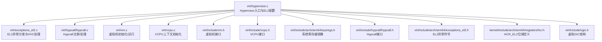
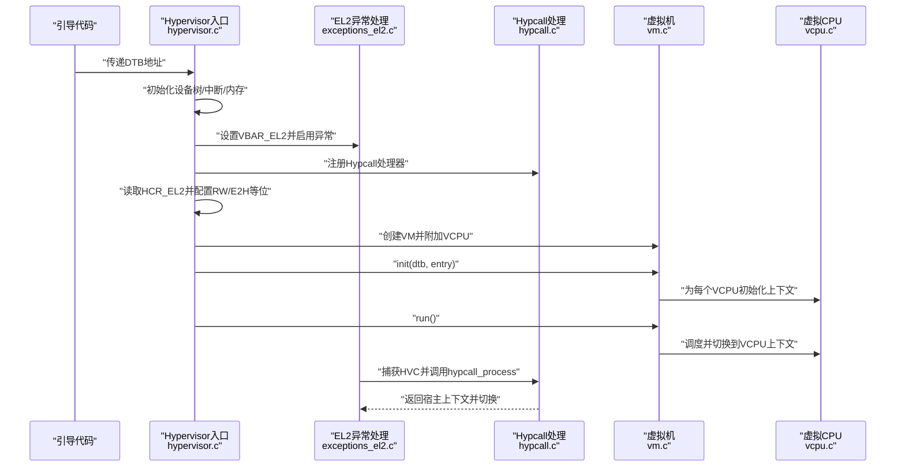
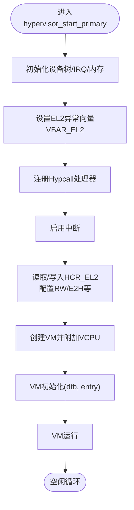
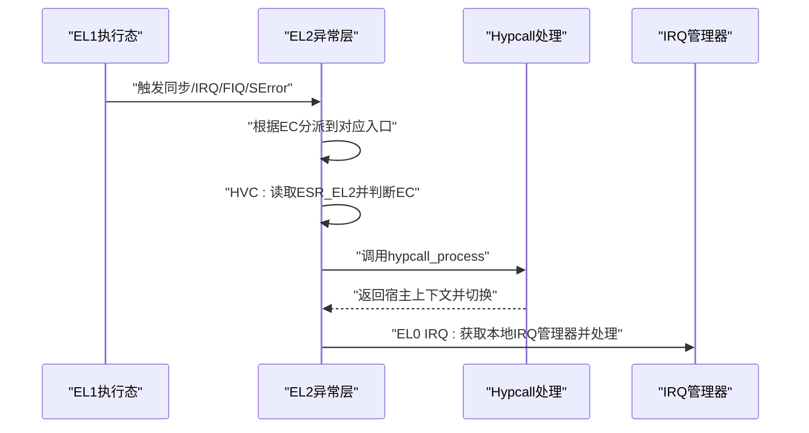
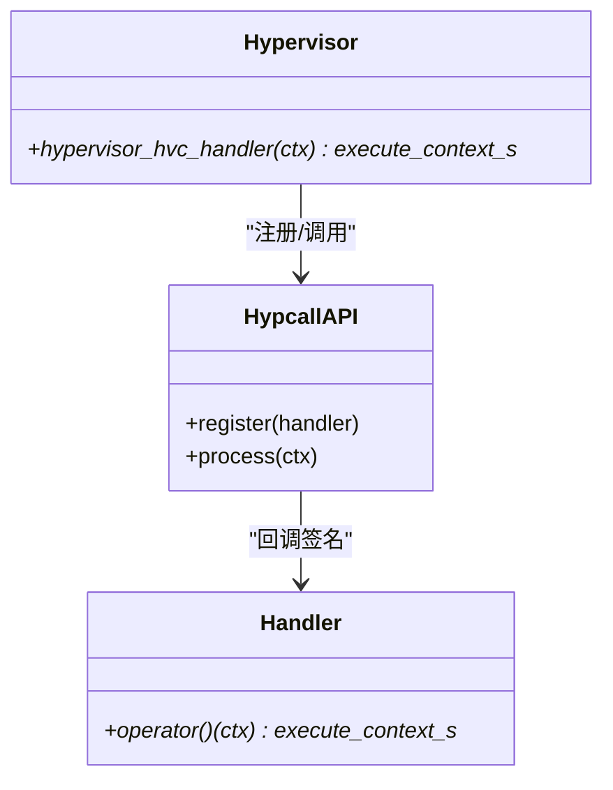
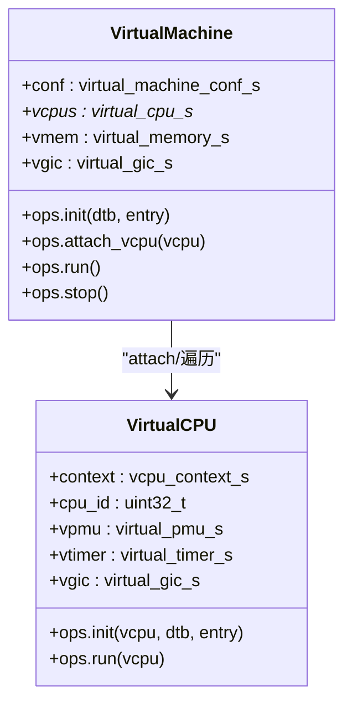
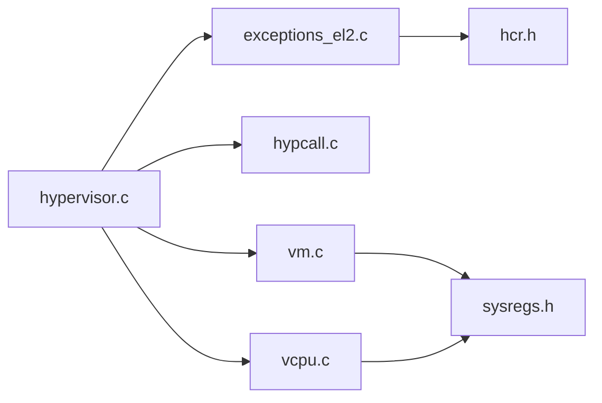

# Hypervisor架构

<cite>
**本文引用的文件**
- [virt/hypervisor.c](file://virt/hypervisor.c)
- [virt/include/vcpu.h](file://virt/include/vcpu.h)
- [virt/include/vm.h](file://virt/include/vm.h)
- [virt/include/arch/arm64/sysregs.h](file://virt/include/arch/arm64/sysregs.h)
- [virt/include/hypcall/hypcall.h](file://virt/include/hypcall/hypcall.h)
- [virt/include/arch/arm64/exceptions_el2.h](file://virt/include/arch/arm64/exceptions_el2.h)
- [virt/include/pcpu.h](file://virt/include/pcpu.h)
- [virt/include/vgic.h](file://virt/include/vgic.h)
- [kernel/include/arch/arm64/registers/hcr.h](file://kernel/include/arch/arm64/registers/hcr.h)
- [virt/exceptions_el2.c](file://virt/exceptions_el2.c)
- [virt/hypcall/hypcall.c](file://virt/hypcall/hypcall.c)
- [virt/vcpu.c](file://virt/vcpu.c)
- [virt/vm.c](file://virt/vm.c)
</cite>

## 目录
1. [引言](#引言)
2. [项目结构](#项目结构)
3. [核心组件](#核心组件)
4. [架构总览](#架构总览)
5. [详细组件分析](#详细组件分析)
6. [依赖关系分析](#依赖关系分析)
7. [性能考虑](#性能考虑)
8. [故障排查指南](#故障排查指南)
9. [结论](#结论)
10. [附录](#附录)

## 引言
本文件面向虚拟化架构师与系统开发者，系统性阐述TranquilOS Hypervisor在ARM64平台上的架构设计与实现要点，重点覆盖以下主题：
- Hypervisor初始化流程与EL2环境配置
- HCR_EL2寄存器配置项及其对异常、中断与内存控制的影响
- 异常处理机制与中断路由策略
- 启动过程：主CPU与辅助CPU初始化差异
- Hypcall接口设计与调用约定
- 配置参数示例与最佳实践
- 性能优化技巧与调试方法

## 项目结构
TranquilOS的Hypervisor位于virt目录，围绕虚拟机（VM）、虚拟CPU（VCPU）、异常处理、系统寄存器与Hypcall等模块组织。核心文件职责如下：
- hypervisor.c：Hypervisor入口、主/辅CPU启动、EL2异常向量设置、Hypcall注册与HCR_EL2初始配置
- exceptions_el2.c：EL2异常入口与分发（含HVC捕获、数据/指令ABORT处理）
- hypcall/*：Hypcall注册与处理框架
- vcpu.c/vm.c：VCPU/VM对象生命周期与默认运行逻辑
- include/*：类型定义、系统寄存器镜像、VGIC虚拟化接口等

图表来源
- [virt/hypervisor.c](file://virt/hypervisor.c#L1-L149)
- [virt/exceptions_el2.c](file://virt/exceptions_el2.c#L1-L138)
- [virt/hypcall/hypcall.c](file://virt/hypcall/hypcall.c#L1-L25)
- [virt/vm.c](file://virt/vm.c#L1-L59)
- [virt/vcpu.c](file://virt/vcpu.c#L1-L66)
- [virt/include/vm.h](file://virt/include/vm.h#L1-L39)
- [virt/include/vcpu.h](file://virt/include/vcpu.h#L1-L49)
- [virt/include/arch/arm64/sysregs.h](file://virt/include/arch/arm64/sysregs.h#L1-L110)
- [virt/include/hypcall/hypcall.h](file://virt/include/hypcall/hypcall.h#L1-L18)
- [virt/include/arch/arm64/exceptions_el2.h](file://virt/include/arch/arm64/exceptions_el2.h#L1-L28)
- [kernel/include/arch/arm64/registers/hcr.h](file://kernel/include/arch/arm64/registers/hcr.h#L1-L72)
- [virt/include/vgic.h](file://virt/include/vgic.h#L1-L66)

章节来源
- [virt/hypervisor.c](file://virt/hypervisor.c#L1-L149)
- [virt/exceptions_el2.c](file://virt/exceptions_el2.c#L1-L138)
- [virt/hypcall/hypcall.c](file://virt/hypcall/hypcall.c#L1-L25)
- [virt/vm.c](file://virt/vm.c#L1-L59)
- [virt/vcpu.c](file://virt/vcpu.c#L1-L66)
- [virt/include/vm.h](file://virt/include/vm.h#L1-L39)
- [virt/include/vcpu.h](file://virt/include/vcpu.h#L1-L49)
- [virt/include/arch/arm64/sysregs.h](file://virt/include/arch/arm64/sysregs.h#L1-L110)
- [virt/include/hypcall/hypcall.h](file://virt/include/hypcall/hypcall.h#L1-L18)
- [virt/include/arch/arm64/exceptions_el2.h](file://virt/include/arch/arm64/exceptions_el2.h#L1-L28)
- [kernel/include/arch/arm64/registers/hcr.h](file://kernel/include/arch/arm64/registers/hcr.h#L1-L72)
- [virt/include/vgic.h](file://virt/include/vgic.h#L1-L66)

## 核心组件
- Hypervisor入口与EL2配置
  - 初始化设备树、中断管理器、早期设备、内存子系统
  - 设置EL2异常向量基址、注册Hypcall处理器、启用中断
  - 初始HCR_EL2配置（RW=1，指示EL1使用AArch64）
- 虚拟机/虚拟CPU模型
  - VM负责VCPU集合的初始化与运行调度
  - VCPU保存执行上下文与系统寄存器镜像，提供默认run/init操作
- EL2异常与中断
  - EL2异常向量表写入VBAR_EL2，区分SP0与SPx路径
  - 捕获HVC指令并交由Hypcall处理；对数据/指令ABORT进行分类记录
  - 对来自EL0的IRQ进行本地中断管理器处理
- Hypcall接口
  - 定义一组超调用号，注册回调函数统一处理
  - 在EL2中捕获HVC后切换到宿主上下文继续执行

章节来源
- [virt/hypervisor.c](file://virt/hypervisor.c#L47-L149)
- [virt/exceptions_el2.c](file://virt/exceptions_el2.c#L19-L137)
- [virt/hypcall/hypcall.c](file://virt/hypcall/hypcall.c#L15-L25)
- [virt/vm.c](file://virt/vm.c#L5-L53)
- [virt/vcpu.c](file://virt/vcpu.c#L15-L65)
- [virt/include/hypcall/hypcall.h](file://virt/include/hypcall/hypcall.h#L6-L16)

## 架构总览
下图展示从Hypervisor启动到VM运行的关键交互：

图表来源
- [virt/hypervisor.c](file://virt/hypervisor.c#L101-L145)
- [virt/exceptions_el2.c](file://virt/exceptions_el2.c#L51-L85)
- [virt/hypcall/hypcall.c](file://virt/hypcall/hypcall.c#L19-L25)
- [virt/vm.c](file://virt/vm.c#L5-L33)
- [virt/vcpu.c](file://virt/vcpu.c#L15-L53)

## 详细组件分析

### 组件A：Hypervisor初始化与EL2环境配置
- 主要职责
  - 解析DTB、初始化IRQ管理器与关键设备
  - 设置EL2异常向量基址，校验对齐约束
  - 注册Hypcall处理器，启用中断
  - 初始HCR_EL2配置：RW=1（EL1为AArch64），E2H=0（EL2宿主）
- 关键点
  - HCR_EL2的RW位用于指示EL1使用的指令集状态
  - E2H=0表示当前为EL2宿主模式，不进入嵌套虚拟化
  - 其他位（如TVM/TGE等）在后续阶段按需开启

图表来源
- [virt/hypervisor.c](file://virt/hypervisor.c#L101-L145)
- [virt/exceptions_el2.c](file://virt/exceptions_el2.c#L127-L137)
- [virt/hypcall/hypcall.c](file://virt/hypcall/hypcall.c#L15-L25)
- [virt/vm.c](file://virt/vm.c#L5-L33)

章节来源
- [virt/hypervisor.c](file://virt/hypervisor.c#L101-L145)
- [virt/exceptions_el2.c](file://virt/exceptions_el2.c#L127-L137)
- [virt/hypcall/hypcall.c](file://virt/hypcall/hypcall.c#L15-L25)
- [kernel/include/arch/arm64/registers/hcr.h](file://kernel/include/arch/arm64/registers/hcr.h#L6-L70)

### 组件B：HCR_EL2寄存器配置详解
- 位域与语义
  - RW：指示EL1执行状态是否为AArch64（宿主模式下应为1）
  - E2H：EL2宿主标志（0表示EL2作为宿主）
  - TVM/TGE等：控制虚拟内存与通用异常陷阱（当前未启用）
  - VM/IMO/FMO/AMO：控制stage-2与物理中断/FIQ/SError路由（当前禁用stage-2）
- 配置策略
  - 初次仅设置RW/E2H以保证EL1为AArch64且EL2为宿主
  - 后续通过Hypcall进一步细化配置（例如启用stage-2或特定陷阱）

章节来源
- [kernel/include/arch/arm64/registers/hcr.h](file://kernel/include/arch/arm64/registers/hcr.h#L6-L70)
- [virt/hypervisor.c](file://virt/hypervisor.c#L47-L76)
- [virt/hypervisor.c](file://virt/hypervisor.c#L54-L76)

### 组件C：异常处理机制与中断路由
- 异常向量
  - 写入VBAR_EL2并校验对齐（必须按0x800字节对齐）
  - 提供SP0与SPx两条路径，分别对应不同栈指针场景
- HVC捕获
  - 当EC为HVC时，调用hypcall_process，将控制权交给宿主上下文
- 中断处理
  - 来自EL0的IRQ在EL2被截获，通过本地IRQ管理器处理
  - 数据/指令ABORT会记录原因码，便于定位问题

图表来源
- [virt/exceptions_el2.c](file://virt/exceptions_el2.c#L51-L101)
- [virt/hypcall/hypcall.c](file://virt/hypcall/hypcall.c#L19-L25)

章节来源
- [virt/exceptions_el2.c](file://virt/exceptions_el2.c#L19-L137)
- [virt/include/arch/arm64/exceptions_el2.h](file://virt/include/arch/arm64/exceptions_el2.h#L4-L24)

### 组件D：Hypcall接口设计与调用约定
- 接口定义
  - 超调用号：HYPERCALL_HYPERVISOR_INIT、HYPERCALL_VM_INIT、HYPERCALL_VM_VCPU_CREATE、HYPERCALL_VM_VCPU_RUN、HYPERCALL_VM_VCPU_STOP、HYPERCALL_VM_VM_STOP
  - 注册机制：hypcall_register绑定回调，hypcall_process在EL2捕获HVC后调用
- 调用约定
  - 回调函数接收execute_context_s指针，返回值作为下一上下文指针
  - 通过arch_switch_context完成上下文切换

图表来源
- [virt/include/hypcall/hypcall.h](file://virt/include/hypcall/hypcall.h#L6-L16)
- [virt/hypcall/hypcall.c](file://virt/hypcall/hypcall.c#L15-L25)
- [virt/hypervisor.c](file://virt/hypervisor.c#L78-L99)

章节来源
- [virt/include/hypcall/hypcall.h](file://virt/include/hypcall/hypcall.h#L6-L16)
- [virt/hypcall/hypcall.c](file://virt/hypcall/hypcall.c#L15-L25)
- [virt/hypervisor.c](file://virt/hypervisor.c#L78-L99)

### 组件E：虚拟机与虚拟CPU模型
- 虚拟机（VM）
  - 提供初始化、附加VCPU、运行与停止的默认实现
  - 初始化时遍历VCPU列表，逐一调用其init回调
- 虚拟CPU（VCPU）
  - 保存execute_context_s与aarch64_sys_regs_s镜像
  - 默认run直接切换到VCPU上下文；默认init填充EL1寄存器、分配栈、设置PC/SPSR

图表来源
- [virt/include/vm.h](file://virt/include/vm.h#L19-L34)
- [virt/include/vcpu.h](file://virt/include/vcpu.h#L31-L44)
- [virt/vm.c](file://virt/vm.c#L5-L33)
- [virt/vcpu.c](file://virt/vcpu.c#L15-L53)

章节来源
- [virt/include/vm.h](file://virt/include/vm.h#L1-L39)
- [virt/include/vcpu.h](file://virt/include/vcpu.h#L1-L49)
- [virt/vm.c](file://virt/vm.c#L1-L59)
- [virt/vcpu.c](file://virt/vcpu.c#L1-L66)

### 组件F：物理CPU与虚拟CPU映射
- 物理CPU（pcpu）
  - 记录当前活跃VCPU与上一个VCPU，支持上下文切换
- 作用
  - 为多VCPU调度与上下文切换提供桥接

章节来源
- [virt/include/pcpu.h](file://virt/include/pcpu.h#L8-L15)

### 组件G：系统寄存器镜像与VGIC虚拟化
- 系统寄存器镜像（aarch64_sys_regs_s）
  - 包含大量AArch64系统寄存器字段，用于VCPU上下文保存/恢复
- VGIC虚拟化
  - 定义虚拟GIC分发器与CPU接口寄存器布局
  - 支持通过stage-2将虚拟CPU接口访问映射到物理地址

章节来源
- [virt/include/arch/arm64/sysregs.h](file://virt/include/arch/arm64/sysregs.h#L7-L104)
- [virt/include/vgic.h](file://virt/include/vgic.h#L4-L63)

## 依赖关系分析
- 组件耦合
  - hypervisor.c依赖exceptions_el2.c（异常向量）、hypcall.c（Hypcall）、vm.c/vcpu.c（VM/VCPU）
  - exceptions_el2.c依赖hcr.h（寄存器位域）、hypcall.c（Hypcall处理）
  - vm.c/vcpu.c依赖sysregs.h（系统寄存器镜像）
- 外部依赖
  - 设备树解析、IRQ管理器、内存分配器等由内核/引导层提供

图表来源
- [virt/hypervisor.c](file://virt/hypervisor.c#L1-L20)
- [virt/exceptions_el2.c](file://virt/exceptions_el2.c#L1-L10)
- [virt/hypcall/hypcall.c](file://virt/hypcall/hypcall.c#L1-L11)
- [virt/vm.c](file://virt/vm.c#L1-L4)
- [virt/vcpu.c](file://virt/vcpu.c#L1-L13)
- [kernel/include/arch/arm64/registers/hcr.h](file://kernel/include/arch/arm64/registers/hcr.h#L1-L72)
- [virt/include/arch/arm64/sysregs.h](file://virt/include/arch/arm64/sysregs.h#L1-L110)

章节来源
- [virt/hypervisor.c](file://virt/hypervisor.c#L1-L20)
- [virt/exceptions_el2.c](file://virt/exceptions_el2.c#L1-L10)
- [virt/hypcall/hypcall.c](file://virt/hypcall/hypcall.c#L1-L11)
- [virt/vm.c](file://virt/vm.c#L1-L4)
- [virt/vcpu.c](file://virt/vcpu.c#L1-L13)
- [kernel/include/arch/arm64/registers/hcr.h](file://kernel/include/arch/arm64/registers/hcr.h#L1-L72)
- [virt/include/arch/arm64/sysregs.h](file://virt/include/arch/arm64/sysregs.h#L1-L110)

## 性能考虑
- EL2异常向量对齐
  - VBAR_EL2必须按0x800字节对齐，避免异常向量访问异常
- 中断路径优化
  - 将高频中断路由至物理中断源，减少stage-2带来的额外开销
- Hypcall处理
  - 尽量减少Hypcall处理中的锁竞争与上下文切换次数
- 内存与页表
  - 使用大页或TLB局部性优化，降低stage-2页表查找成本

## 故障排查指南
- 异常向量初始化失败
  - 检查VBAR_EL2写入与读回一致性，确认对齐要求满足
- HVC未被正确捕获
  - 核对ESR_EL2的EC字段是否为HVC；检查Hypcall注册是否生效
- 数据/指令ABORT
  - 根据IFSC/DFSC定位具体原因，结合日志输出定位问题来源
- IRQ无法到达
  - 检查本地IRQ管理器初始化与获取是否成功，确认中断路由策略

章节来源
- [virt/exceptions_el2.c](file://virt/exceptions_el2.c#L127-L137)
- [virt/exceptions_el2.c](file://virt/exceptions_el2.c#L51-L85)
- [virt/exceptions_el2.c](file://virt/exceptions_el2.c#L87-L101)

## 结论
TranquilOS Hypervisor在ARM64平台上采用清晰的模块化设计：以Hypervisor入口为核心，通过EL2异常向量与Hypcall机制实现宿主控制面与客户机执行态的解耦。HCR_EL2的初始配置确保EL1处于AArch64执行态，同时保留后续扩展空间（如启用stage-2与陷阱）。VM/VCPU模型提供了可扩展的虚拟化基础设施，配合VGIC与系统寄存器镜像，为后续功能完善奠定基础。

## 附录

### A. 配置参数示例与最佳实践
- HCR_EL2初始配置建议
  - RW=1：保证EL1为AArch64
  - E2H=0：EL2作为宿主
  - VM=0：当前不启用stage-2（可按需开启）
  - IMO/FMO/AMO=1：物理IRQ/FIQ/SError路由至EL2
  - TVM/TGE等=0：不拦截相关控制寄存器与通用异常（可按需开启）
- Hypcall超调用号
  - HYPERCALL_HYPERVISOR_INIT：初始化Hypervisor运行环境
  - HYPERCALL_VM_INIT：初始化VM（DTB与入口）
  - HYPERCALL_VM_VCPU_CREATE/RUN/STOP：VCPU生命周期管理
  - HYPERCALL_VM_VM_STOP：停止VM
- 最佳实践
  - 严格遵循VBAR_EL2对齐要求
  - 优先使用物理中断路径，必要时再启用stage-2
  - 将Hypcall处理逻辑保持轻量，避免阻塞

章节来源
- [virt/hypervisor.c](file://virt/hypervisor.c#L47-L76)
- [virt/include/hypcall/hypcall.h](file://virt/include/hypcall/hypcall.h#L6-L11)
- [virt/exceptions_el2.c](file://virt/exceptions_el2.c#L127-L137)