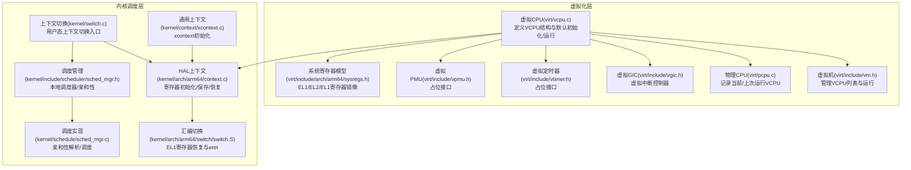
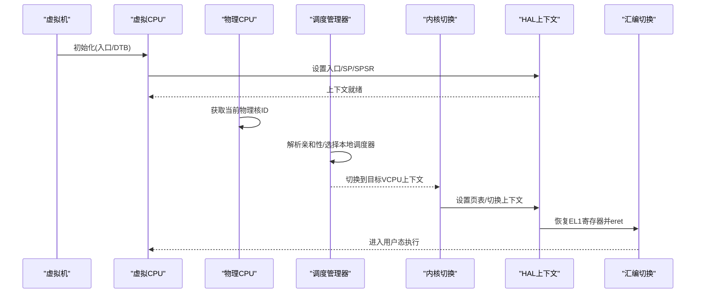
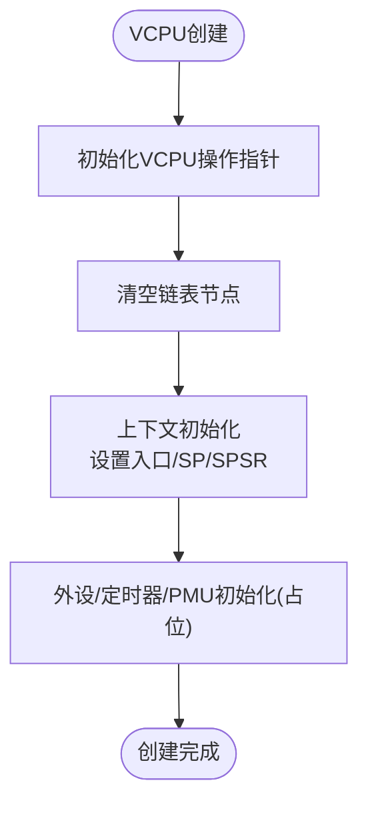
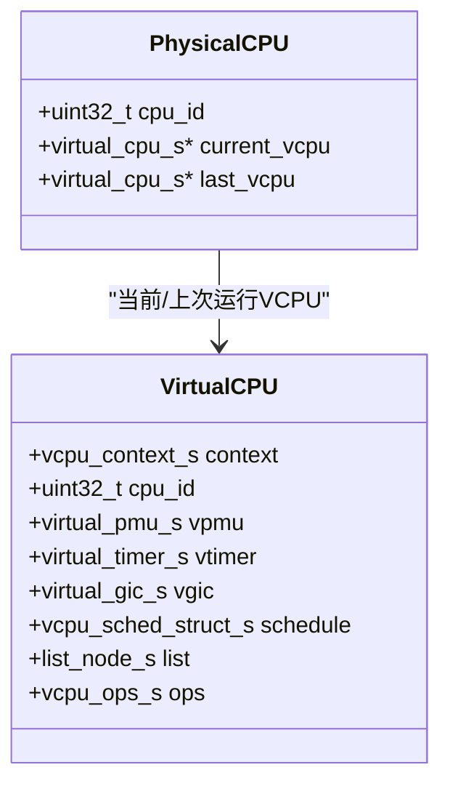
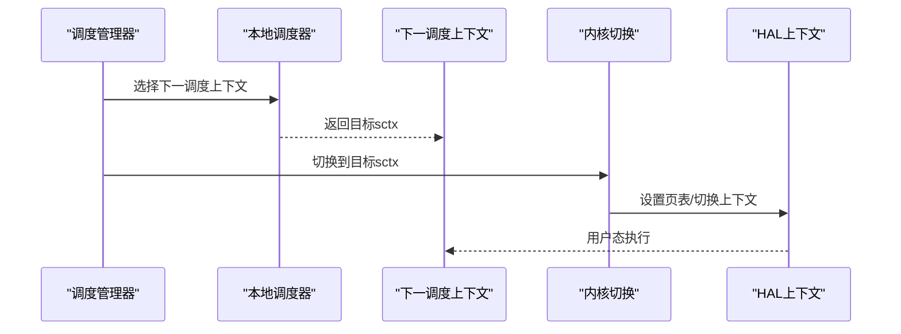
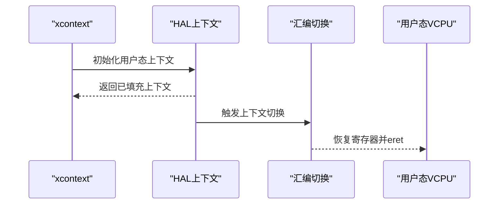
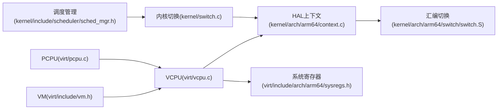

# VCPU管理

<cite>
**本文引用的文件**
- [virt/vcpu.c](file://virt/vcpu.c)
- [virt/include/vcpu.h](file://virt/include/vcpu.h)
- [virt/include/scheduler.h](file://virt/include/scheduler.h)
- [virt/include/vm.h](file://virt/include/vm.h)
- [virt/include/pcpu.h](file://virt/include/pcpu.h)
- [virt/pcpu.c](file://virt/pcpu.c)
- [virt/include/vtimer.h](file://virt/include/vtimer.h)
- [virt/include/vgic.h](file://virt/include/vgic.h)
- [virt/include/vpmu.h](file://virt/include/vpmu.h)
- [virt/include/arch/arm64/sysregs.h](file://virt/include/arch/arm64/sysregs.h)
- [kernel/arch/arm64/context.c](file://kernel/arch/arm64/context.c)
- [kernel/arch/arm64/switch/switch.S](file://kernel/arch/arm64/switch/switch.S)
- [kernel/include/switch.h](file://kernel/include/switch.h)
- [kernel/switch.c](file://kernel/switch.c)
- [kernel/include/scheduler/sched_mgr.h](file://kernel/include/scheduler/sched_mgr.h)
- [kernel/schedule/sched_mgr.c](file://kernel/schedule/sched_mgr.c)
- [kernel/context/xcontext.c](file://kernel/context/xcontext.c)
</cite>

## 目录
1. [引言](#引言)
2. [项目结构](#项目结构)
3. [核心组件](#核心组件)
4. [架构总览](#架构总览)
5. [组件详解](#组件详解)
6. [依赖关系分析](#依赖关系分析)
7. [性能考量](#性能考量)
8. [故障排查指南](#故障排查指南)
9. [结论](#结论)
10. [附录](#附录)

## 引言
本文件面向虚拟化性能优化专家与系统调优人员，围绕TranquilOS的VCPU（虚拟CPU）管理进行系统性说明。内容涵盖VCPU的创建、调度与上下文切换机制，VCPU状态与寄存器保存/恢复流程，VCPU与物理CPU的映射关系及负载均衡策略，优先级与时间片分配、抢占机制，以及VCPU配置与调试示例（含多核虚拟机的VCPU分配），并提供性能监控与故障诊断方法。

## 项目结构
TranquilOS在hypervisor层实现了VCPU、VM、物理CPU（pcpu）等关键抽象，并通过内核侧的调度框架完成跨VCPU的任务调度与上下文切换。下图展示了与VCPU管理直接相关的模块关系：

图表来源
- [virt/vcpu.c](file://virt/vcpu.c#L1-L66)
- [virt/include/vcpu.h](file://virt/include/vcpu.h#L1-L49)
- [virt/include/vm.h](file://virt/include/vm.h#L1-L39)
- [virt/pcpu.c](file://virt/pcpu.c#L1-L22)
- [virt/include/vgic.h](file://virt/include/vgic.h#L1-L66)
- [virt/include/vtimer.h](file://virt/include/vtimer.h#L1-L8)
- [virt/include/vpmu.h](file://virt/include/vpmu.h#L1-L8)
- [virt/include/arch/arm64/sysregs.h](file://virt/include/arch/arm64/sysregs.h#L1-L110)
- [kernel/switch.c](file://kernel/switch.c#L1-L29)
- [kernel/context/xcontext.c](file://kernel/context/xcontext.c#L1-L15)
- [kernel/arch/arm64/context.c](file://kernel/arch/arm64/context.c#L1-L98)
- [kernel/arch/arm64/switch/switch.S](file://kernel/arch/arm64/switch/switch.S#L1-L37)
- [kernel/include/scheduler/sched_mgr.h](file://kernel/include/scheduler/sched_mgr.h#L1-L49)
- [kernel/schedule/sched_mgr.c](file://kernel/schedule/sched_mgr.c#L131-L162)

章节来源
- [virt/vcpu.c](file://virt/vcpu.c#L1-L66)
- [virt/include/vcpu.h](file://virt/include/vcpu.h#L1-L49)
- [virt/include/vm.h](file://virt/include/vm.h#L1-L39)
- [virt/pcpu.c](file://virt/pcpu.c#L1-L22)
- [virt/include/vgic.h](file://virt/include/vgic.h#L1-L66)
- [virt/include/vtimer.h](file://virt/include/vtimer.h#L1-L8)
- [virt/include/vpmu.h](file://virt/include/vpmu.h#L1-L8)
- [virt/include/arch/arm64/sysregs.h](file://virt/include/arch/arm64/sysregs.h#L1-L110)
- [kernel/switch.c](file://kernel/switch.c#L1-L29)
- [kernel/context/xcontext.c](file://kernel/context/xcontext.c#L1-L15)
- [kernel/arch/arm64/context.c](file://kernel/arch/arm64/context.c#L1-L98)
- [kernel/arch/arm64/switch/switch.S](file://kernel/arch/arm64/switch/switch.S#L1-L37)
- [kernel/include/scheduler/sched_mgr.h](file://kernel/include/scheduler/sched_mgr.h#L1-L49)
- [kernel/schedule/sched_mgr.c](file://kernel/schedule/sched_mgr.c#L131-L162)

## 核心组件
- 虚拟CPU（VCPU）
  - 结构体定义包含执行上下文、系统寄存器镜像、虚拟PMU/定时器/GIC、调度链表节点与操作函数指针。
  - 默认初始化流程设置入口地址、栈指针、SPSR等；默认运行流程委托给架构切换函数。
- 虚拟机（VM）
  - 维护VCPU链表，提供初始化、运行、附加VCPU与停止等操作。
- 物理CPU（PCPU）
  - 记录当前与上次运行的VCPU，基于MPIDR_EL1获取当前物理核ID。
- 调度与上下文切换
  - 内核提供xcontext初始化与HAL上下文接口，最终通过汇编实现从内核态到用户态的寄存器恢复与返回。
  - 调度管理器支持按亲和性选择本地调度器，实现VCPU到物理核的绑定与迁移。

章节来源
- [virt/include/vcpu.h](file://virt/include/vcpu.h#L26-L44)
- [virt/vcpu.c](file://virt/vcpu.c#L15-L53)
- [virt/include/vm.h](file://virt/include/vm.h#L25-L34)
- [virt/pcpu.c](file://virt/pcpu.c#L8-L21)
- [kernel/context/xcontext.c](file://kernel/context/xcontext.c#L4-L11)
- [kernel/arch/arm64/context.c](file://kernel/arch/arm64/context.c#L7-L33)
- [kernel/arch/arm64/switch/switch.S](file://kernel/arch/arm64/switch/switch.S#L20-L37)
- [kernel/include/scheduler/sched_mgr.h](file://kernel/include/scheduler/sched_mgr.h#L23-L43)
- [kernel/schedule/sched_mgr.c](file://kernel/schedule/sched_mgr.c#L131-L162)

## 架构总览
下图展示VCPU从创建到运行的关键路径，以及与物理CPU、调度器和上下文切换子系统的交互：

图表来源
- [virt/vcpu.c](file://virt/vcpu.c#L19-L33)
- [virt/pcpu.c](file://virt/pcpu.c#L8-L21)
- [kernel/context/xcontext.c](file://kernel/context/xcontext.c#L4-L11)
- [kernel/arch/arm64/context.c](file://kernel/arch/arm64/context.c#L12-L33)
- [kernel/arch/arm64/switch/switch.S](file://kernel/arch/arm64/switch/switch.S#L20-L37)
- [kernel/switch.c](file://kernel/switch.c#L8-L22)
- [kernel/include/scheduler/sched_mgr.h](file://kernel/include/scheduler/sched_mgr.h#L23-L43)
- [kernel/schedule/sched_mgr.c](file://kernel/schedule/sched_mgr.c#L131-L162)

## 组件详解

### VCPU创建与初始化
- 创建流程
  - 初始化VCPU操作函数指针，清空链表节点，返回VCPU实例。
- 上下文初始化
  - 清零通用寄存器，设置x0为DTB地址，分配一页作为SP_EL0栈，设置PC为入口，SPSR为EL0T模式。
- 外设/定时器/PMU初始化
  - 当前版本为占位实现，后续可扩展VGIC、虚拟定时器与PMU初始化逻辑。
- 运行流程
  - 默认运行流程调用架构上下文切换，进入用户态执行。

图表来源
- [virt/vcpu.c](file://virt/vcpu.c#L47-L65)
- [virt/vcpu.c](file://virt/vcpu.c#L19-L33)

章节来源
- [virt/vcpu.c](file://virt/vcpu.c#L15-L65)
- [virt/include/vcpu.h](file://virt/include/vcpu.h#L26-L44)

### VCPU与物理CPU映射及负载均衡
- 物理CPU映射
  - 通过读取MPIDR_EL1获取当前物理核ID，维护当前/上次运行VCPU指针，便于快速上下文切换与统计。
- 负载均衡策略
  - 当前未实现显式负载均衡算法，建议结合调度管理器的亲和性解析与本地调度器队列长度进行启发式迁移。
- 多核VCPU分配
  - 在VM初始化时遍历VCPU链表，逐个调用VCPU初始化；调度层面可通过亲和性位图将不同VCPU绑定至不同物理核。

图表来源
- [virt/include/pcpu.h](file://virt/include/pcpu.h#L8-L12)
- [virt/pcpu.c](file://virt/pcpu.c#L8-L21)
- [virt/include/vcpu.h](file://virt/include/vcpu.h#L31-L44)

章节来源
- [virt/pcpu.c](file://virt/pcpu.c#L8-L21)
- [virt/include/pcpu.h](file://virt/include/pcpu.h#L8-L12)
- [virt/include/vm.h](file://virt/include/vm.h#L5-L33)
- [kernel/schedule/sched_mgr.c](file://kernel/schedule/sched_mgr.c#L131-L162)

### 调度与抢占机制
- 调度框架
  - 调度管理器提供本地调度器数组，按CPU索引访问；支持添加/移除/选择下一个调度上下文，并注册调度框架。
- 亲和性与绑定
  - 通过解析亲和性位图选择目标物理核，将VCPU绑定到对应本地调度器。
- 抢占与切换
  - 切换入口设置目标进程地址空间、刷新TLB、切换页表并调用HAL上下文切换至用户态。

图表来源
- [kernel/include/scheduler/sched_mgr.h](file://kernel/include/scheduler/sched_mgr.h#L23-L43)
- [kernel/schedule/sched_mgr.c](file://kernel/schedule/sched_mgr.c#L131-L162)
- [kernel/switch.c](file://kernel/switch.c#L8-L22)

章节来源
- [kernel/include/scheduler/sched_mgr.h](file://kernel/include/scheduler/sched_mgr.h#L1-L49)
- [kernel/schedule/sched_mgr.c](file://kernel/schedule/sched_mgr.c#L131-L162)
- [kernel/switch.c](file://kernel/switch.c#L8-L22)

### 上下文切换与寄存器保存/恢复
- xcontext初始化
  - 提供通用寄存器清零与用户态上下文初始化接口，设置链接寄存器与程序计数器。
- HAL上下文
  - 提供寄存器读写、上下文转储、获取SP/PC等能力；用户态切换入口调用架构特定的上下文切换函数。
- 汇编切换
  - 从内核栈恢复EL1寄存器（含ELR_EL1、SP_EL0、TPIDR_EL0/RO、SPSR_EL1等），最后使用eret返回用户态。

图表来源
- [kernel/context/xcontext.c](file://kernel/context/xcontext.c#L4-L11)
- [kernel/arch/arm64/context.c](file://kernel/arch/arm64/context.c#L12-L33)
- [kernel/arch/arm64/context.c](file://kernel/arch/arm64/context.c#L96-L98)
- [kernel/arch/arm64/switch/switch.S](file://kernel/arch/arm64/switch/switch.S#L20-L37)

章节来源
- [kernel/context/xcontext.c](file://kernel/context/xcontext.c#L1-L15)
- [kernel/arch/arm64/context.c](file://kernel/arch/arm64/context.c#L7-L98)
- [kernel/arch/arm64/switch/switch.S](file://kernel/arch/arm64/switch/switch.S#L1-L37)

### 系统寄存器镜像与虚拟化支持
- 系统寄存器模型
  - 定义了大量AArch64系统寄存器字段，用于在虚拟化场景中保存/恢复EL1/EL2/EL1状态，便于异常处理与调试。
- 与VCPU的关系
  - VCPU上下文包含系统寄存器镜像结构，配合默认初始化流程设置入口参数与SPSR，为异常返回与虚拟化切换提供基础。

章节来源
- [virt/include/arch/arm64/sysregs.h](file://virt/include/arch/arm64/sysregs.h#L7-L104)
- [virt/vcpu.c](file://virt/vcpu.c#L19-L33)

### 虚拟GIC、定时器与PMU
- 虚拟GIC
  - 定义分发器与CPU接口寄存器布局，支持通过阶段2页表将虚拟接口访问映射到物理地址。
- 虚拟定时器/PMU
  - 当前为占位接口，后续可扩展为虚拟化的时间源与性能监控单元。

章节来源
- [virt/include/vgic.h](file://virt/include/vgic.h#L4-L63)
- [virt/include/vtimer.h](file://virt/include/vtimer.h#L1-L8)
- [virt/include/vpmu.h](file://virt/include/vpmu.h#L1-L8)

## 依赖关系分析
- 组件耦合
  - VCPU依赖HAL上下文与系统寄存器模型；VM负责VCPU生命周期管理；PCPU提供物理核映射；调度管理器负责VCPU到物理核的绑定。
- 外部依赖
  - 汇编切换依赖具体架构寄存器恢复序列；内核切换依赖地址空间与TLB刷新。
- 可能的循环依赖
  - 当前各模块以头文件声明为主，未见直接循环包含；VCPU与VM通过链表连接，属于弱耦合。

图表来源
- [virt/vcpu.c](file://virt/vcpu.c#L1-L66)
- [kernel/arch/arm64/context.c](file://kernel/arch/arm64/context.c#L1-L98)
- [kernel/arch/arm64/switch/switch.S](file://kernel/arch/arm64/switch/switch.S#L1-L37)
- [virt/include/arch/arm64/sysregs.h](file://virt/include/arch/arm64/sysregs.h#L1-L110)
- [virt/include/vm.h](file://virt/include/vm.h#L1-L39)
- [virt/pcpu.c](file://virt/pcpu.c#L1-L22)
- [kernel/include/scheduler/sched_mgr.h](file://kernel/include/scheduler/sched_mgr.h#L1-L49)
- [kernel/switch.c](file://kernel/switch.c#L1-L29)

章节来源
- [virt/vcpu.c](file://virt/vcpu.c#L1-L66)
- [virt/include/vm.h](file://virt/include/vm.h#L1-L39)
- [virt/pcpu.c](file://virt/pcpu.c#L1-L22)
- [kernel/arch/arm64/context.c](file://kernel/arch/arm64/context.c#L1-L98)
- [kernel/arch/arm64/switch/switch.S](file://kernel/arch/arm64/switch/switch.S#L1-L37)
- [kernel/include/scheduler/sched_mgr.h](file://kernel/include/scheduler/sched_mgr.h#L1-L49)
- [kernel/switch.c](file://kernel/switch.c#L1-L29)

## 性能考量
- 上下文切换开销
  - 汇编切换仅恢复必要寄存器并eret，避免不必要的状态保存；建议在VCPU数量较多时减少无效切换。
- 地址空间切换
  - 切换前刷新TLB并更新页表，确保安全但带来一定开销；可考虑按需刷新或批量处理。
- 调度亲和性
  - 使用亲和性位图将VCPU绑定到物理核，降低跨核迁移成本；建议根据工作负载特征动态调整。
- 中断与定时器
  - 虚拟GIC与定时器的延迟直接影响VCPU响应；建议优化中断分发与计时精度。

## 故障排查指南
- 常见问题定位
  - VCPU初始化失败：检查DTB地址与入口是否正确，确认页分配器可用。
  - 上下文切换异常：核对SP/PC/SPSR设置，确保EL0/EL1状态一致。
  - 调度无响应：检查亲和性位图与本地调度器状态，确认目标sctx有效。
- 调试建议
  - 使用上下文转储接口输出关键寄存器值，辅助定位异常。
  - 在VM初始化与运行路径增加日志，记录VCPU链表遍历与操作结果。
  - 对物理核映射进行验证，确保MPIDR_EL1读取正确。

章节来源
- [virt/vcpu.c](file://virt/vcpu.c#L19-L33)
- [kernel/arch/arm64/context.c](file://kernel/arch/arm64/context.c#L35-L48)
- [virt/vcpu.c](file://virt/vcpu.c#L55-L58)
- [virt/pcpu.c](file://virt/pcpu.c#L8-L21)

## 结论
TranquilOS的VCPU管理以清晰的模块划分与接口设计为基础，结合内核调度框架与HAL上下文切换，实现了从VCPU创建、初始化到运行与上下文切换的完整闭环。当前版本在VCPU与物理CPU映射、调度亲和性方面具备良好基础，VGIC、虚拟定时器与PMU等功能仍处于占位阶段，建议后续重点完善虚拟外设与性能监控能力，以满足多核虚拟机场景下的高性能与可观测性需求。

## 附录
- 实践示例（步骤说明）
  - 创建VM并附加多个VCPU：在VM结构中设置VCPU数量与名称，调用attach_vcpu将VCPU加入链表。
  - 设置亲和性：在调度管理器中传入亲和性位图，将不同VCPU绑定到不同物理核。
  - 启动运行：调用VM的run操作，内部遍历VCPU并依次执行其run操作。
- 配置要点
  - 入口地址与DTB地址需正确传递至VCPU初始化流程。
  - SPSR应设置为允许EL0执行的异常级别。
  - 若启用虚拟GIC，请在VCPU初始化中完成VGIC映射与寄存器配置。

章节来源
- [virt/include/vm.h](file://virt/include/vm.h#L5-L33)
- [kernel/schedule/sched_mgr.c](file://kernel/schedule/sched_mgr.c#L131-L162)
- [virt/vcpu.c](file://virt/vcpu.c#L19-L33)