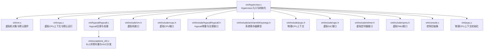
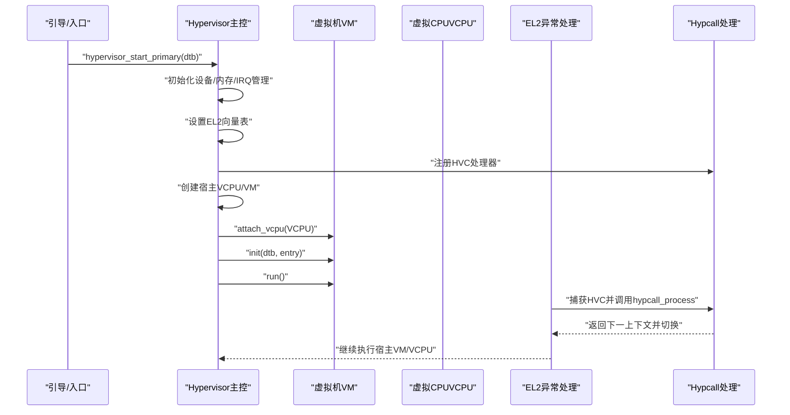
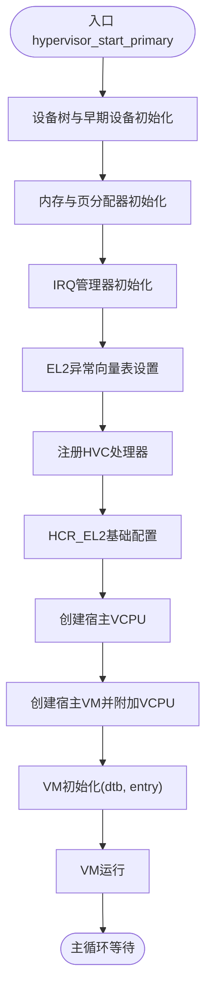
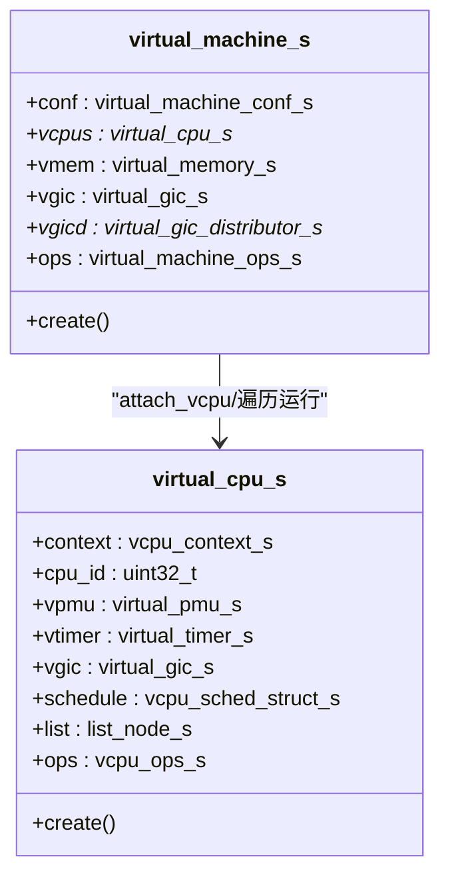
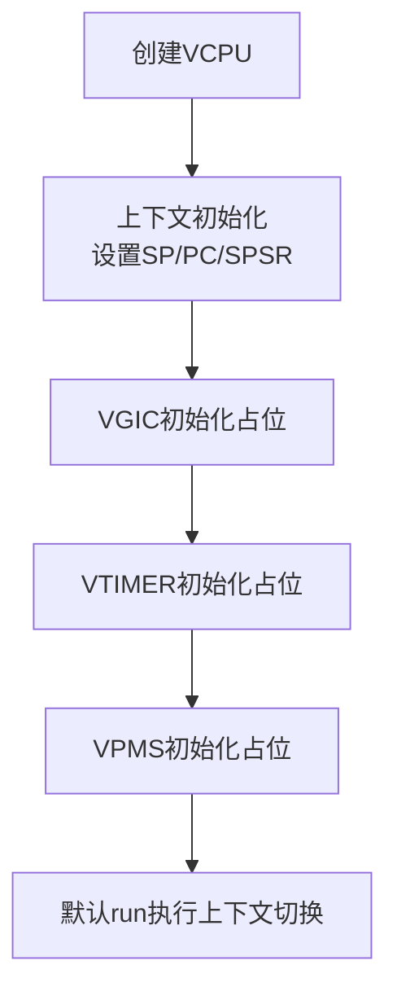
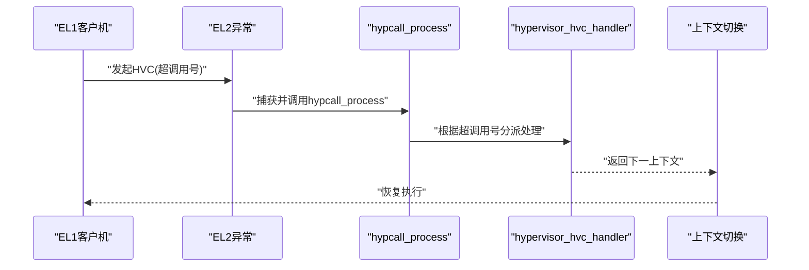
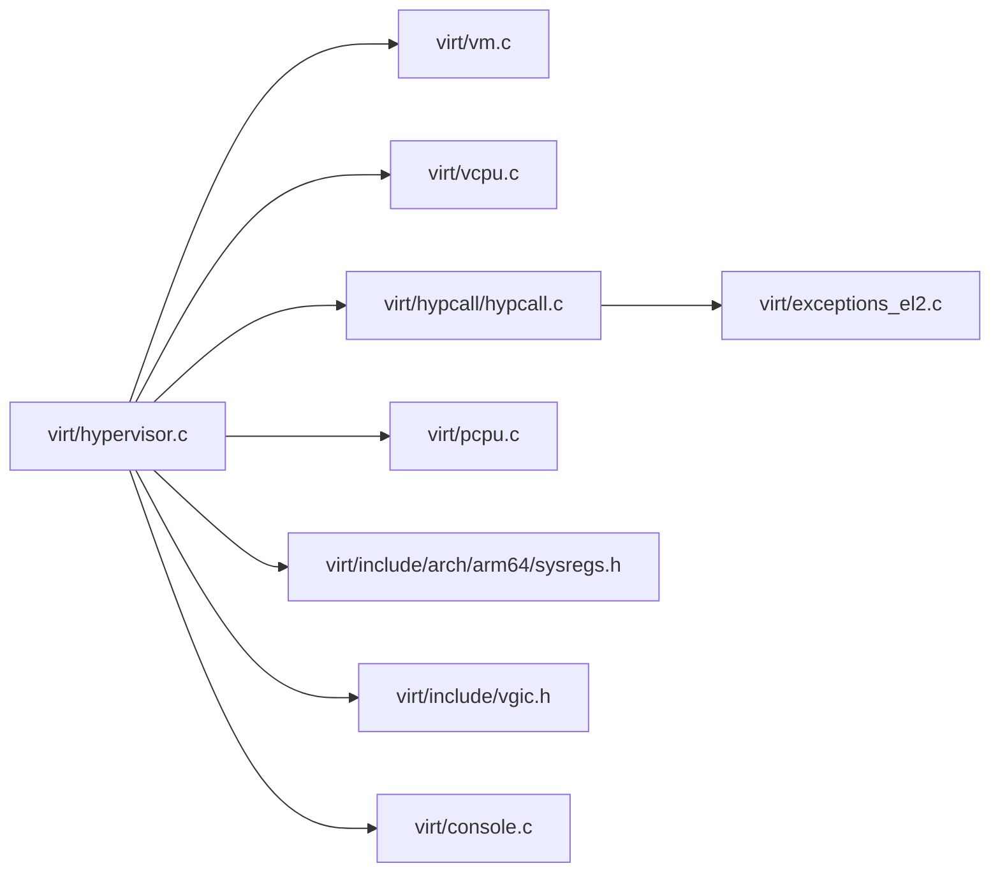

# 虚拟化支持

<cite>
**本文引用的文件**
- [virt/hypervisor.c](file://virt/hypervisor.c)
- [virt/vm.c](file://virt/vm.c)
- [virt/vcpu.c](file://virt/vcpu.c)
- [virt/hypcall/hypcall.c](file://virt/hypcall/hypcall.c)
- [virt/include/vm.h](file://virt/include/vm.h)
- [virt/include/vcpu.h](file://virt/include/vcpu.h)
- [virt/include/hypcall/hypcall.h](file://virt/include/hypcall/hypcall.h)
- [virt/include/arch/arm64/sysregs.h](file://virt/include/arch/arm64/sysregs.h)
- [virt/include/pcpu.h](file://virt/include/pcpu.h)
- [virt/include/vgic.h](file://virt/include/vgic.h)
- [virt/include/vtimer.h](file://virt/include/vtimer.h)
- [virt/include/vpmu.h](file://virt/include/vpmu.h)
- [virt/exceptions_el2.c](file://virt/exceptions_el2.c)
- [virt/console.c](file://virt/console.c)
- [virt/pcpu.c](file://virt/pcpu.c)
</cite>

## 目录
1. [引言](#引言)
2. [项目结构](#项目结构)
3. [核心组件](#核心组件)
4. [架构总览](#架构总览)
5. [详细组件分析](#详细组件分析)
6. [依赖关系分析](#依赖关系分析)
7. [性能考量](#性能考量)
8. [故障排查指南](#故障排查指南)
9. [结论](#结论)
10. [附录：配置与管理示例](#附录配置与管理示例)

## 引言
本文件面向TranquilOS的虚拟化支持，系统性阐述Hypervisor架构设计、虚拟化初始化流程、VM创建机制、VCPU管理与资源分配策略、Hypcall接口与虚拟机控制、内存管理与设备模拟、中断处理、性能优化与安全注意事项，并提供可操作的配置与管理示例及常见问题排查方法。目标读者包括虚拟化开发者与系统集成工程师。

## 项目结构
TranquilOS在独立的virt子树中实现了虚拟化层，围绕Hypervisor主控、VM/Vcpu模型、Hypcall分发、异常向量表与EL2处理、物理/虚拟CPU上下文等模块组织。关键目录与职责概览如下：
- virt/hypervisor.c：Hypervisor入口、初始化、宿主VM与VCPU创建、HVC处理注册与启动运行。
- virt/vm.c：虚拟机对象与默认操作（初始化、运行、附加VCPU、停止）。
- virt/vcpu.c：虚拟CPU上下文初始化、默认运行、VGIC/VTIMER/VPMS占位。
- virt/hypcall/hypcall.c：Hypcall注册与统一处理流程。
- virt/include/*.h：虚拟机/VCPU数据结构、系统寄存器、物理CPU上下文、虚拟GIC/定时器/PMU等接口定义。
- virt/exceptions_el2.c：EL2异常向量表初始化与各类异常入口（含HVC捕获与分发）。
- virt/console.c、virt/pcpu.c：控制台与物理CPU上下文辅助。

图表来源
- [virt/hypervisor.c](file://virt/hypervisor.c#L101-L145)
- [virt/vm.c](file://virt/vm.c#L48-L59)
- [virt/vcpu.c](file://virt/vcpu.c#L55-L66)
- [virt/hypcall/hypcall.c](file://virt/hypcall/hypcall.c#L15-L25)
- [virt/exceptions_el2.c](file://virt/exceptions_el2.c#L127-L137)
- [virt/include/vm.h](file://virt/include/vm.h#L25-L34)
- [virt/include/vcpu.h](file://virt/include/vcpu.h#L31-L44)
- [virt/include/hypcall/hypcall.h](file://virt/include/hypcall/hypcall.h#L6-L16)
- [virt/include/arch/arm64/sysregs.h](file://virt/include/arch/arm64/sysregs.h#L7-L104)
- [virt/include/pcpu.h](file://virt/include/pcpu.h#L8-L12)
- [virt/include/vgic.h](file://virt/include/vgic.h#L60-L63)
- [virt/include/vtimer.h](file://virt/include/vtimer.h#L4-L5)
- [virt/include/vpmu.h](file://virt/include/vpmu.h#L4-L5)
- [virt/console.c](file://virt/console.c#L11-L22)
- [virt/pcpu.c](file://virt/pcpu.c#L8-L21)

章节来源
- [virt/hypervisor.c](file://virt/hypervisor.c#L101-L145)
- [virt/vm.c](file://virt/vm.c#L48-L59)
- [virt/vcpu.c](file://virt/vcpu.c#L55-L66)
- [virt/hypcall/hypcall.c](file://virt/hypcall/hypcall.c#L15-L25)
- [virt/exceptions_el2.c](file://virt/exceptions_el2.c#L127-L137)

## 核心组件
- Hypervisor主控：负责初始化、注册HVC处理、创建宿主VM与VCPU、启动运行。
- 虚拟机VM：封装配置、VCPU集合、虚拟内存与虚拟GIC等资源，提供默认init/run/attach/stop操作。
- 虚拟CPU VCPU：保存执行上下文与系统寄存器快照，提供默认init/run操作；预留VGIC/VTIMER/VPMS初始化点。
- Hypcall接口：定义超调用号与注册机制，统一从EL1发起的HVC请求分发到Hypervisor处理。
- EL2异常处理：设置EL2向量表，捕获HVC并交由hypcall处理，其他异常记录日志或转储。
- 物理CPU上下文：基于MPIDR识别当前物理核，维护当前/上次VCPU指针，便于多核调度与切换。
- 控制台抽象：提供空实现以避免未初始化时的输出问题。

章节来源
- [virt/hypervisor.c](file://virt/hypervisor.c#L35-L45)
- [virt/vm.c](file://virt/vm.c#L55-L59)
- [virt/vcpu.c](file://virt/vcpu.c#L60-L66)
- [virt/hypcall/hypcall.c](file://virt/hypcall/hypcall.c#L15-L25)
- [virt/exceptions_el2.c](file://virt/exceptions_el2.c#L51-L85)
- [virt/include/pcpu.h](file://virt/include/pcpu.h#L8-L12)
- [virt/console.c](file://virt/console.c#L11-L22)

## 架构总览
下图展示从Hypervisor入口到VM/VCPU初始化与运行的关键交互路径，以及HVC进入EL2后的处理链路。

图表来源
- [virt/hypervisor.c](file://virt/hypervisor.c#L101-L145)
- [virt/vm.c](file://virt/vm.c#L55-L59)
- [virt/vcpu.c](file://virt/vcpu.c#L60-L66)
- [virt/hypcall/hypcall.c](file://virt/hypcall/hypcall.c#L19-L25)
- [virt/exceptions_el2.c](file://virt/exceptions_el2.c#L51-L85)

## 详细组件分析

### Hypervisor主控与初始化流程
- 初始化阶段完成设备树解析、早期设备初始化、内存银行与页分配器初始化、本地IRQ管理器初始化、EL2异常向量表设置、Hypcall处理器注册、HCR_EL2基础配置。
- 创建宿主VCPU与宿主VM，将其关联并执行init与run，随后进入主循环。
- HVC初始化通过HCR_EL2字段控制虚拟中断/异常路由策略，RW/E2H/NV等位用于指定异常状态与宿主模式。

图表来源
- [virt/hypervisor.c](file://virt/hypervisor.c#L101-L145)
- [virt/pcpu.c](file://virt/pcpu.c#L8-L21)

章节来源
- [virt/hypervisor.c](file://virt/hypervisor.c#L47-L76)
- [virt/hypervisor.c](file://virt/hypervisor.c#L101-L145)

### 虚拟机VM模型与操作
- VM结构体包含配置、VCPU列表、虚拟内存与虚拟GIC等成员；默认操作提供init、attach_vcpu、run、stop。
- init阶段会初始化虚拟内存并逐个VCPU执行其init；run阶段遍历VCPU并触发其run。
- attach_vcpu支持单VCPU或链式VCPU挂载，便于多VCPU场景。

图表来源
- [virt/include/vm.h](file://virt/include/vm.h#L25-L34)
- [virt/include/vcpu.h](file://virt/include/vcpu.h#L31-L44)
- [virt/vm.c](file://virt/vm.c#L55-L59)
- [virt/vcpu.c](file://virt/vcpu.c#L60-L66)

章节来源
- [virt/include/vm.h](file://virt/include/vm.h#L19-L34)
- [virt/vm.c](file://virt/vm.c#L5-L33)

### 虚拟CPUVCPU上下文与运行
- VCPU上下文包含执行上下文与AArch64系统寄存器快照；默认init会清空通用寄存器、设置SP/PC/SPSR，并预留VGIC/VTIMER/VPMS初始化位置。
- 默认run直接进行上下文切换至VCPU的执行上下文。

图表来源
- [virt/vcpu.c](file://virt/vcpu.c#L19-L53)
- [virt/include/vcpu.h](file://virt/include/vcpu.h#L26-L29)

章节来源
- [virt/vcpu.c](file://virt/vcpu.c#L15-L53)
- [virt/include/vcpu.h](file://virt/include/vcpu.h#L14-L44)

### Hypcall接口与虚拟机控制
- Hypcall常量定义了Hypervisor初始化、VM初始化、VCPU创建/运行/停止、VM停止等调用号。
- hypcall_register用于注册HVC回调，hypcall_process在EL2捕获HVC后统一调用回调并切换上下文。
- 当前HVC处理函数对部分调用号留空，后续可扩展VM生命周期与VCPU调度控制。

图表来源
- [virt/include/hypcall/hypcall.h](file://virt/include/hypcall/hypcall.h#L6-L16)
- [virt/hypcall/hypcall.c](file://virt/hypcall/hypcall.c#L19-L25)
- [virt/exceptions_el2.c](file://virt/exceptions_el2.c#L75-L78)
- [virt/hypervisor.c](file://virt/hypervisor.c#L78-L99)

章节来源
- [virt/include/hypcall/hypcall.h](file://virt/include/hypcall/hypcall.h#L6-L16)
- [virt/hypcall/hypcall.c](file://virt/hypcall/hypcall.c#L15-L25)
- [virt/hypervisor.c](file://virt/hypervisor.c#L78-L99)

### 内存管理与虚拟地址转换
- VM初始化阶段会调用虚拟内存初始化接口，VCPU初始化时设置栈指针与入口地址，结合页分配器与页表机制实现客户机内存映射。
- 虚拟GIC结构体预留了分发器与CPU接口寄存器布局，为后续Stage-2页表与GIC仿真奠定基础。

章节来源
- [virt/vm.c](file://virt/vm.c#L11-L18)
- [virt/vcpu.c](file://virt/vcpu.c#L19-L33)
- [virt/include/vgic.h](file://virt/include/vgic.h#L4-L63)

### 设备模拟与中断处理
- EL2异常入口对不同异常类型进行分类处理，其中HVC被捕获并交由hypcall处理；IRQ入口通过本地IRQ管理器处理。
- 物理CPU上下文提供当前核ID与VCPU指针，便于多核场景下的VCPU调度与切换。

章节来源
- [virt/exceptions_el2.c](file://virt/exceptions_el2.c#L51-L101)
- [virt/include/pcpu.h](file://virt/include/pcpu.h#L8-L12)
- [virt/pcpu.c](file://virt/pcpu.c#L8-L21)

## 依赖关系分析
- 组件内聚与耦合
  - Hypervisor主控与VM/VCPU紧密耦合，负责生命周期编排。
  - Hypcall处理与EL2异常处理解耦，通过统一接口对接。
  - 物理CPU上下文与VCPU上下文通过调度结构连接，便于多核切换。
- 外部依赖
  - ARM64系统寄存器访问宏与EL2异常向量表。
  - 设备树解析、页分配器、IRQ管理器等内核基础设施。

图表来源
- [virt/hypervisor.c](file://virt/hypervisor.c#L1-L20)
- [virt/vm.c](file://virt/vm.c#L1-L5)
- [virt/vcpu.c](file://virt/vcpu.c#L1-L8)
- [virt/hypcall/hypcall.c](file://virt/hypcall/hypcall.c#L1-L8)
- [virt/exceptions_el2.c](file://virt/exceptions_el2.c#L1-L10)
- [virt/pcpu.c](file://virt/pcpu.c#L1-L5)
- [virt/include/arch/arm64/sysregs.h](file://virt/include/arch/arm64/sysregs.h#L1-L10)
- [virt/include/vgic.h](file://virt/include/vgic.h#L1-L10)
- [virt/console.c](file://virt/console.c#L1-L5)

章节来源
- [virt/hypervisor.c](file://virt/hypervisor.c#L1-L20)
- [virt/include/arch/arm64/sysregs.h](file://virt/include/arch/arm64/sysregs.h#L1-L10)
- [virt/include/vgic.h](file://virt/include/vgic.h#L1-L10)

## 性能考量
- 上下文切换成本：VCPU默认run直接切换上下文，建议在多VCPU场景引入轻量调度器与缓存友好队列。
- 中断延迟：EL2 IRQ入口应尽量减少处理逻辑，必要时采用快速路径与批处理。
- 内存映射：合理规划Stage-2页表与TLB刷新策略，避免频繁刷新导致抖动。
- 日志与调试：异常路径使用日志记录，生产环境可按级别裁剪以降低开销。

## 故障排查指南
- EL2异常未对齐：EL2向量表需按规范对齐，否则初始化失败。检查向量表地址与对齐要求。
- HVC未被处理：确认HCR_EL2中VM/IMO/FMO/AMO等位设置正确，且已注册HVC处理器。
- 无VCPU可运行：VM初始化前需确保至少一个VCPU已附加，否则init将跳过。
- 控制台输出为空：console_get可能返回空指针，需先注册有效console再使用。

章节来源
- [virt/exceptions_el2.c](file://virt/exceptions_el2.c#L127-L137)
- [virt/hypcall/hypcall.c](file://virt/hypcall/hypcall.c#L15-L25)
- [virt/vm.c](file://virt/vm.c#L5-L18)
- [virt/console.c](file://virt/console.c#L17-L22)

## 结论
TranquilOS的虚拟化层以Hypervisor为核心，围绕VM/VCPU模型与Hypcall接口构建了清晰的控制面与数据面分离架构。当前实现完成了基础初始化、异常向量与HVC处理、VCPU上下文与宿主VM运行路径。后续可在Stage-2页表、GIC仿真、VCPU调度与资源隔离等方面进一步完善，以满足更复杂的虚拟化场景需求。

## 附录：配置与管理示例
- 启动流程
  - 在引导阶段调用Hypervisor入口函数，传入设备树地址，完成初始化与运行。
  - 宿主VM创建后，附加宿主VCPU并执行init与run。
- Hypcall调用序列
  - 客户机在EL1发起HVC，携带超调用号；EL2捕获后由hypcall处理分派，最终切换回客户机继续执行。
- 资源分配建议
  - 按VM配置分配VCPU数量与物理内存大小，确保页分配器可用。
  - 预留VGIC/VTIMER/VPMS初始化空间，逐步完善设备仿真与计时/性能监控能力。

章节来源
- [virt/hypervisor.c](file://virt/hypervisor.c#L101-L145)
- [virt/include/hypcall/hypcall.h](file://virt/include/hypcall/hypcall.h#L6-L16)
- [virt/exceptions_el2.c](file://virt/exceptions_el2.c#L75-L78)