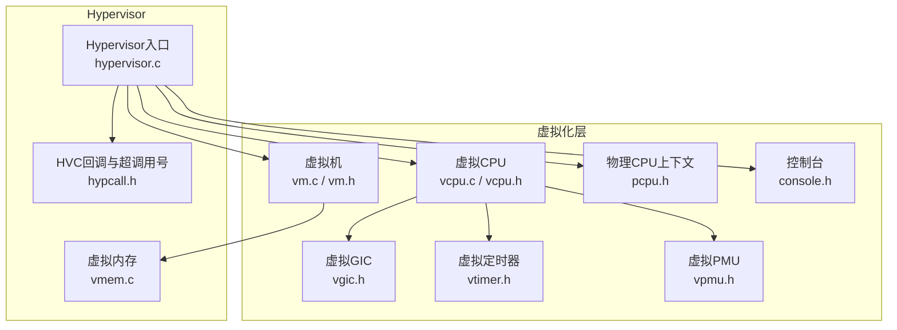
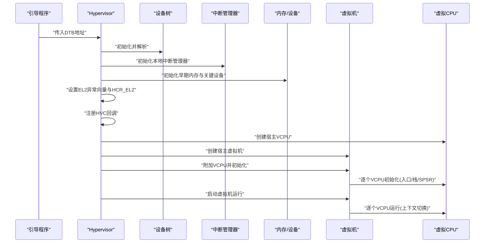
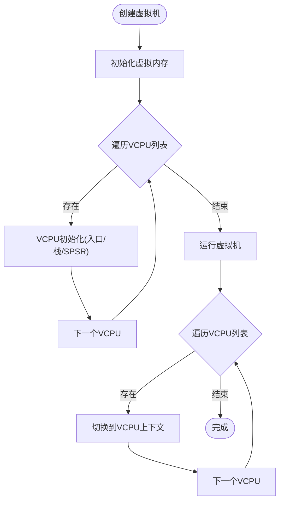
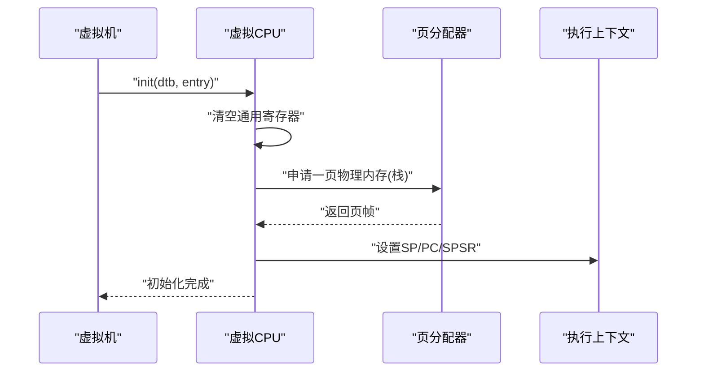
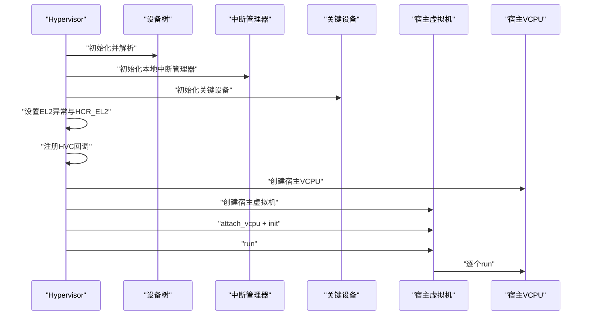
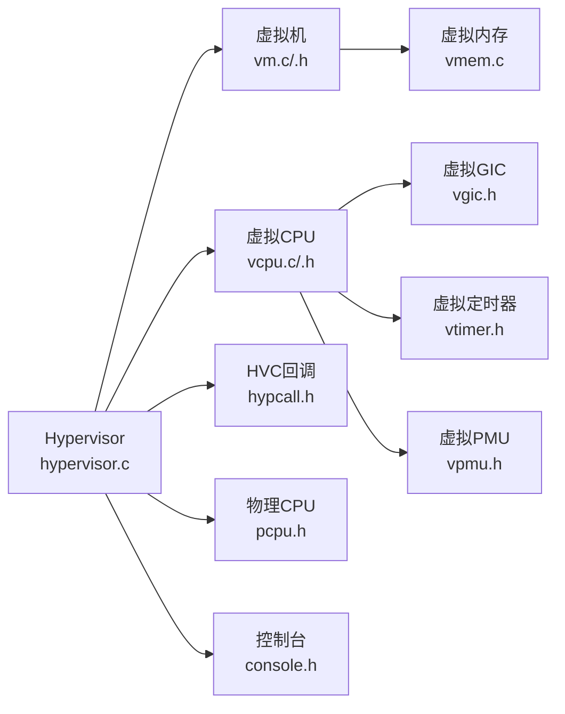

# 虚拟机管理

<cite>
**本文引用的文件**
- [virt/vm.c](file://virt/vm.c)
- [virt/include/vm.h](file://virt/include/vm.h)
- [virt/vcpu.c](file://virt/vcpu.c)
- [virt/include/vcpu.h](file://virt/include/vcpu.h)
- [virt/hypervisor.c](file://virt/hypervisor.c)
- [virt/include/vgic.h](file://virt/include/vgic.h)
- [virt/include/vtimer.h](file://virt/include/vtimer.h)
- [virt/include/vpmu.h](file://virt/include/vpmu.h)
- [virt/include/pcpu.h](file://virt/include/pcpu.h)
- [virt/include/console.h](file://virt/include/console.h)
- [virt/include/hypcall/hypcall.h](file://virt/include/hypcall/hypcall.h)
- [virt/mm/vmem.c](file://virt/mm/vmem.c)
- [ulibs/libc/malloc.c](file://ulibs/libc/malloc.c)
</cite>

## 目录
1. [简介](#简介)
2. [项目结构](#项目结构)
3. [核心组件](#核心组件)
4. [架构总览](#架构总览)
5. [详细组件分析](#详细组件分析)
6. [依赖关系分析](#依赖关系分析)
7. [性能考量](#性能考量)
8. [故障排除指南](#故障排除指南)
9. [结论](#结论)
10. [附录：实践示例与最佳实践](#附录实践示例与最佳实践)

## 简介
本文件面向虚拟化管理员与系统集成工程师，系统性阐述 TranquilOS 的虚拟机（VM）管理实现与使用方式。内容覆盖虚拟机生命周期（创建、初始化、运行、停止）、配置参数与资源分配策略、内存管理机制、VCPU 与虚拟机的关系及调度现状、状态管理与迁移能力说明，并提供可操作的实践示例与排障建议。由于当前代码库中虚拟机迁移与复杂调度尚未实现，本文在相应章节明确标注“待实现”或“概念性说明”，帮助读者正确理解当前能力边界。

## 项目结构
TranquilOS 的虚拟化子系统位于 virt/ 目录，核心由以下模块组成：
- 虚拟机与 VCPU：定义虚拟机与虚拟 CPU 的数据结构与操作接口，负责生命周期管理与上下文初始化。
- Hypervisor 启动流程：完成平台初始化、异常向量设置、HVC 回调注册与宿主 VM 的启动。
- 中断与虚拟 GIC：提供虚拟中断控制器的数据结构抽象，支持虚拟 CPU 的中断接入。
- 内存管理：虚拟内存子系统提供页表与映射接口，当前默认实现为空，需结合具体平台完善。
- 控制台与物理 CPU：控制台用于早期输出，pcpu 提供物理 CPU 与当前/上次 VCPU 的映射。

图示来源
- [virt/hypervisor.c](file://virt/hypervisor.c#L101-L145)
- [virt/vm.c](file://virt/vm.c#L55-L59)
- [virt/vcpu.c](file://virt/vcpu.c#L60-L66)
- [virt/include/vm.h](file://virt/include/vm.h#L19-L34)
- [virt/include/vcpu.h](file://virt/include/vcpu.h#L31-L44)
- [virt/include/vgic.h](file://virt/include/vgic.h#L60-L63)
- [virt/include/vtimer.h](file://virt/include/vtimer.h#L1-L8)
- [virt/include/vpmu.h](file://virt/include/vpmu.h#L1-L8)
- [virt/include/pcpu.h](file://virt/include/pcpu.h#L8-L12)
- [virt/include/console.h](file://virt/include/console.h#L8-L11)
- [virt/include/hypcall/hypcall.h](file://virt/include/hypcall/hypcall.h#L6-L11)
- [virt/mm/vmem.c](file://virt/mm/vmem.c#L4-L16)

章节来源
- [virt/hypervisor.c](file://virt/hypervisor.c#L101-L145)
- [virt/vm.c](file://virt/vm.c#L55-L59)
- [virt/vcpu.c](file://virt/vcpu.c#L60-L66)
- [virt/include/vm.h](file://virt/include/vm.h#L19-L34)
- [virt/include/vcpu.h](file://virt/include/vcpu.h#L31-L44)
- [virt/include/vgic.h](file://virt/include/vgic.h#L60-L63)
- [virt/include/vtimer.h](file://virt/include/vtimer.h#L1-L8)
- [virt/include/vpmu.h](file://virt/include/vpmu.h#L1-L8)
- [virt/include/pcpu.h](file://virt/include/pcpu.h#L8-L12)
- [virt/include/console.h](file://virt/include/console.h#L8-L11)
- [virt/include/hypcall/hypcall.h](file://virt/include/hypcall/hypcall.h#L6-L11)
- [virt/mm/vmem.c](file://virt/mm/vmem.c#L4-L16)

## 核心组件
- 虚拟机（virtual_machine_s）
  - 包含配置项（名称、VCPU 数、物理内存大小）、VCPU 链表、虚拟内存对象、虚拟 GIC 分发器与 CPU 接口等。
  - 提供初始化、附加 VCPU、运行、停止等操作接口。
- 虚拟 CPU（virtual_cpu_s）
  - 包含执行上下文、系统寄存器、调度节点、以及与虚拟 GIC/定时器/PMU 的关联。
  - 提供初始化（设置入口、栈、SPSR）与运行（切换到该 VCPU 上下文）。
- Hypervisor 入口
  - 完成设备树初始化、中断管理器初始化、早期内存与设备初始化、异常向量设置、HVC 回调注册。
  - 创建宿主 VM 与宿主 VCPU，附加并初始化后进入运行态。
- 虚拟内存（virtual_memory_s）
  - 当前默认实现为空，需结合平台完善映射与页表管理。
- 中断与虚拟 GIC
  - 提供虚拟 GIC 分发器与 CPU 接口的数据结构，用于虚拟 CPU 的中断接入。
- 物理 CPU 与控制台
  - 物理 CPU 结构记录当前/上次 VCPU；控制台提供统一输出接口。

章节来源
- [virt/include/vm.h](file://virt/include/vm.h#L19-L34)
- [virt/include/vcpu.h](file://virt/include/vcpu.h#L31-L44)
- [virt/vm.c](file://virt/vm.c#L5-L53)
- [virt/vcpu.c](file://virt/vcpu.c#L15-L65)
- [virt/hypervisor.c](file://virt/hypervisor.c#L101-L145)
- [virt/mm/vmem.c](file://virt/mm/vmem.c#L4-L16)
- [virt/include/vgic.h](file://virt/include/vgic.h#L60-L63)
- [virt/include/pcpu.h](file://virt/include/pcpu.h#L8-L12)
- [virt/include/console.h](file://virt/include/console.h#L8-L11)

## 架构总览
下图展示从 Hypervisor 启动到宿主 VM 运行的关键流程，包括设备树解析、内存与设备初始化、异常处理、VCPU 初始化与运行。

图示来源
- [virt/hypervisor.c](file://virt/hypervisor.c#L101-L145)
- [virt/vm.c](file://virt/vm.c#L5-L53)
- [virt/vcpu.c](file://virt/vcpu.c#L15-L65)

章节来源
- [virt/hypervisor.c](file://virt/hypervisor.c#L101-L145)
- [virt/vm.c](file://virt/vm.c#L5-L53)
- [virt/vcpu.c](file://virt/vcpu.c#L15-L65)

## 详细组件分析

### 虚拟机生命周期与操作接口
- 创建
  - 通过工厂函数初始化 VM 操作集与 VCPU 列表，返回已准备的虚拟机实例。
- 初始化
  - 初始化虚拟内存子系统，随后遍历 VCPU 列表逐个调用其初始化接口（设置入口地址、设备树地址、栈指针、异常状态寄存器等）。
- 运行
  - 遍历 VCPU 列表逐个触发运行，实际切换到对应 VCPU 的执行上下文。
- 停止
  - 当前默认实现为空，后续可扩展为清理资源、解除映射、释放内存等。

图示来源
- [virt/vm.c](file://virt/vm.c#L5-L53)
- [virt/vcpu.c](file://virt/vcpu.c#L15-L65)

章节来源
- [virt/vm.c](file://virt/vm.c#L5-L53)
- [virt/vcpu.c](file://virt/vcpu.c#L15-L65)

### 虚拟 CPU 初始化与上下文
- 初始化阶段
  - 清空通用寄存器集合，设置 x0 为设备树地址，申请一页物理内存作为 SP_EL1 栈顶，设置 PC 为入口地址，设置 SPSR 为允许异常进入 EL1。
  - 后续可扩展：虚拟 GIC、虚拟定时器、虚拟 PMU 初始化（当前为占位）。
- 运行阶段
  - 通过上下文切换函数切换到该 VCPU 的执行上下文，进入用户态或内核态执行。

图示来源
- [virt/vcpu.c](file://virt/vcpu.c#L19-L53)

章节来源
- [virt/vcpu.c](file://virt/vcpu.c#L19-L53)

### Hypervisor 启动与宿主 VM
- 启动流程要点
  - 解析设备树、初始化中断管理器、早期内存与关键设备。
  - 设置 EL2 异常向量与 HCR_EL2 寄存器，注册 HVC 回调。
  - 创建宿主 VCPU 与宿主虚拟机，附加并初始化，最后运行。
- HVC 超调用号
  - 当前仅实现“Hypervisor 初始化”分支，其他 VM/Vcpu 相关超调用号为占位，需后续完善。

图示来源
- [virt/hypervisor.c](file://virt/hypervisor.c#L101-L145)
- [virt/include/hypcall/hypcall.h](file://virt/include/hypcall/hypcall.h#L6-L11)

章节来源
- [virt/hypervisor.c](file://virt/hypervisor.c#L101-L145)
- [virt/include/hypcall/hypcall.h](file://virt/include/hypcall/hypcall.h#L6-L11)

### 中断与虚拟 GIC
- 数据结构
  - 虚拟 GIC 分发器与 CPU 接口分别维护一组寄存器字段，用于模拟物理 GIC 行为。
- 作用
  - 为虚拟 CPU 提供中断源接入与优先级、目标路由等虚拟化能力。
- 当前状态
  - 虚拟 CPU 初始化中预留了虚拟 GIC 初始化位置，当前未实现具体映射逻辑。

章节来源
- [virt/include/vgic.h](file://virt/include/vgic.h#L4-L63)
- [virt/vcpu.c](file://virt/vcpu.c#L35-L41)

### 虚拟内存与映射
- 虚拟内存对象
  - 提供初始化与映射接口，默认实现为空，需结合平台完善页表与映射逻辑。
- 实际内存分配
  - 用户态内存分配示例展示了在固定区域进行块链表管理的简化实现，可用于理解内存布局与碎片管理思路。

章节来源
- [virt/mm/vmem.c](file://virt/mm/vmem.c#L4-L16)
- [ulibs/libc/malloc.c](file://ulibs/libc/malloc.c#L5-L92)

### 调度与多 VCPU 绑定
- 当前实现
  - VCPU 结构包含调度节点，但调度框架尚为空实现，当前运行时采用顺序遍历所有 VCPU 并逐一运行。
- 绑定策略
  - 代码中未体现物理 CPU 与虚拟 CPU 的绑定策略，当前为“轮询式”运行。
- 扩展建议
  - 可基于调度框架实现公平调度、时间片轮转或优先级队列；绑定策略可考虑 NUMA/亲和性与负载均衡。

章节来源
- [virt/include/vcpu.h](file://virt/include/vcpu.h#L22-L44)
- [virt/vm.c](file://virt/vm.c#L21-L33)
- [virt/include/scheduler.h](file://virt/include/scheduler.h#L1-L8)

## 依赖关系分析
- 组件耦合
  - VM 对 VCPU、虚拟内存、虚拟 GIC 存在直接依赖；VCPU 对执行上下文、系统寄存器、调度节点有内部依赖。
- 外部依赖
  - Hypervisor 依赖设备树、中断管理器、早期内存与关键设备；VCPU 初始化依赖页分配器。
- 待完善点
  - 虚拟内存映射、虚拟 GIC 映射、调度框架、HVC 具体实现均处于占位状态，需要按平台补充。

图示来源
- [virt/hypervisor.c](file://virt/hypervisor.c#L101-L145)
- [virt/vm.c](file://virt/vm.c#L55-L59)
- [virt/vcpu.c](file://virt/vcpu.c#L60-L66)
- [virt/include/vm.h](file://virt/include/vm.h#L19-L34)
- [virt/include/vcpu.h](file://virt/include/vcpu.h#L31-L44)
- [virt/include/vgic.h](file://virt/include/vgic.h#L60-L63)
- [virt/include/vtimer.h](file://virt/include/vtimer.h#L1-L8)
- [virt/include/vpmu.h](file://virt/include/vpmu.h#L1-L8)
- [virt/include/pcpu.h](file://virt/include/pcpu.h#L8-L12)
- [virt/include/console.h](file://virt/include/console.h#L8-L11)
- [virt/include/hypcall/hypcall.h](file://virt/include/hypcall/hypcall.h#L6-L11)
- [virt/mm/vmem.c](file://virt/mm/vmem.c#L4-L16)

章节来源
- [virt/hypervisor.c](file://virt/hypervisor.c#L101-L145)
- [virt/vm.c](file://virt/vm.c#L55-L59)
- [virt/vcpu.c](file://virt/vcpu.c#L60-L66)
- [virt/include/vm.h](file://virt/include/vm.h#L19-L34)
- [virt/include/vcpu.h](file://virt/include/vcpu.h#L31-L44)
- [virt/include/vgic.h](file://virt/include/vgic.h#L60-L63)
- [virt/include/vtimer.h](file://virt/include/vtimer.h#L1-L8)
- [virt/include/vpmu.h](file://virt/include/vpmu.h#L1-L8)
- [virt/include/pcpu.h](file://virt/include/pcpu.h#L8-L12)
- [virt/include/console.h](file://virt/include/console.h#L8-L11)
- [virt/include/hypcall/hypcall.h](file://virt/include/hypcall/hypcall.h#L6-L11)
- [virt/mm/vmem.c](file://virt/mm/vmem.c#L4-L16)

## 性能考量
- 上下文切换开销
  - VCPU 运行采用顺序遍历，若 VCPU 数较多，可能带来调度延迟。建议引入轻量级调度器以减少切换成本。
- 内存分配与碎片
  - 用户态内存分配示例展示了固定区域的块链表管理，适合小规模场景；大规模应用建议结合伙伴分配器或 slab 分配器。
- 中断处理
  - 虚拟 GIC 尚未实现映射，中断路径仍走物理中断。建议尽快完善虚拟 GIC 映射以降低中断延迟与提高隔离性。
- 缓存与 TLB
  - 在切换 VCPU 时注意缓存与 TLB 的一致性，避免脏数据导致的性能回退。

[本节为通用性能建议，不直接分析具体文件]

## 故障排除指南
- 启动无输出
  - 检查控制台初始化是否成功，确认设备树解析与控制台设备节点匹配。
- VCPU 无法运行
  - 确认 VCPU 初始化是否完成（入口地址、栈、SPSR 是否正确设置），检查页分配器是否可用。
- HVC 回调无效
  - 确认 HVC 回调注册是否成功，检查超调用号是否匹配。
- 虚拟内存映射失败
  - 当前虚拟内存默认实现为空，需检查平台映射逻辑是否正确实现。
- 中断异常
  - 若中断未到达虚拟 CPU，检查虚拟 GIC 映射与 HCR_EL2 配置。

章节来源
- [virt/hypervisor.c](file://virt/hypervisor.c#L101-L145)
- [virt/vcpu.c](file://virt/vcpu.c#L19-L53)
- [virt/mm/vmem.c](file://virt/mm/vmem.c#L4-L16)
- [virt/include/vgic.h](file://virt/include/vgic.h#L60-L63)
- [virt/include/hypcall/hypcall.h](file://virt/include/hypcall/hypcall.h#L6-L11)

## 结论
TranquilOS 的虚拟机管理已具备基础框架：宿主 VM 的创建、VCPU 初始化与运行、Hypervisor 启动流程与 HVC 回调注册。当前版本在虚拟内存映射、虚拟 GIC、调度框架与迁移等方面仍属占位或概念阶段。建议优先完善映射与中断虚拟化，再逐步引入调度与迁移能力，以满足生产环境对隔离性、性能与可运维性的要求。

[本节为总结性内容，不直接分析具体文件]

## 附录：实践示例与最佳实践

### 示例一：创建与运行宿主虚拟机（概念性步骤）
- 步骤
  - 准备设备树与引导镜像，获取 DTB 地址与内核入口地址。
  - 调用 Hypervisor 启动函数，传入 DTB 地址。
  - Hypervisor 完成初始化后，自动创建宿主 VM 与 VCPU 并运行。
- 注意事项
  - 确保设备树节点与引导设备匹配。
  - 确认 HCR_EL2 配置与平台能力一致。

章节来源
- [virt/hypervisor.c](file://virt/hypervisor.c#L101-L145)

### 示例二：配置虚拟机参数（概念性说明）
- 参数说明
  - 名称：虚拟机标识字符串。
  - VCPU 数：影响并发执行与调度策略选择。
  - 物理内存大小：决定宿主内存池与映射范围。
- 建议
  - VCPU 数应与宿主物理核心数匹配或按需裁剪，避免过度竞争。
  - 物理内存大小需留有余量以容纳页表、设备映射与运行时增长。

章节来源
- [virt/include/vm.h](file://virt/include/vm.h#L19-L23)

### 示例三：内存分配与碎片管理（参考）
- 参考实现
  - 用户态内存分配示例展示了固定起始地址与大小的连续区域管理，采用块链表进行分配与回收。
- 建议
  - 生产环境建议使用更高效的分配器（如伙伴/SLAB），并结合 NUMA 亲和性优化。

章节来源
- [ulibs/libc/malloc.c](file://ulibs/libc/malloc.c#L5-L92)

### 示例四：VCPU 绑定与调度（当前限制与建议）
- 当前限制
  - 未实现物理 CPU 与 VCPU 的显式绑定，调度为顺序遍历。
- 建议
  - 引入调度框架，实现时间片轮转或优先级队列；必要时引入亲和性与负载均衡策略。

章节来源
- [virt/vm.c](file://virt/vm.c#L21-L33)
- [virt/include/vcpu.h](file://virt/include/vcpu.h#L22-L44)
- [virt/include/scheduler.h](file://virt/include/scheduler.h#L1-L8)

### 示例五：虚拟内存映射（当前状态与扩展）
- 当前状态
  - 默认实现为空，需结合平台完善映射与页表管理。
- 扩展方向
  - 实现 stage-2 页表、内存保护、热插拔与迁移支持。

章节来源
- [virt/mm/vmem.c](file://virt/mm/vmem.c#L4-L16)

### 示例六：中断虚拟化（当前状态与扩展）
- 当前状态
  - 虚拟 GIC 数据结构已定义，初始化占位。
- 扩展方向
  - 实现分发器与 CPU 接口的寄存器映射，支持中断路由与优先级管理。

章节来源
- [virt/include/vgic.h](file://virt/include/vgic.h#L4-L63)
- [virt/vcpu.c](file://virt/vcpu.c#L35-L41)