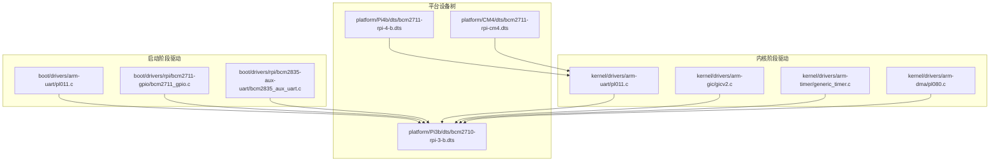
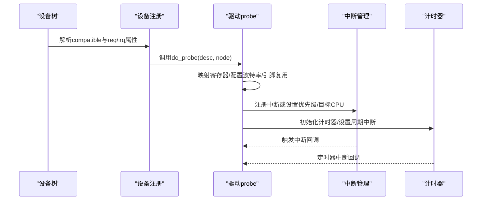
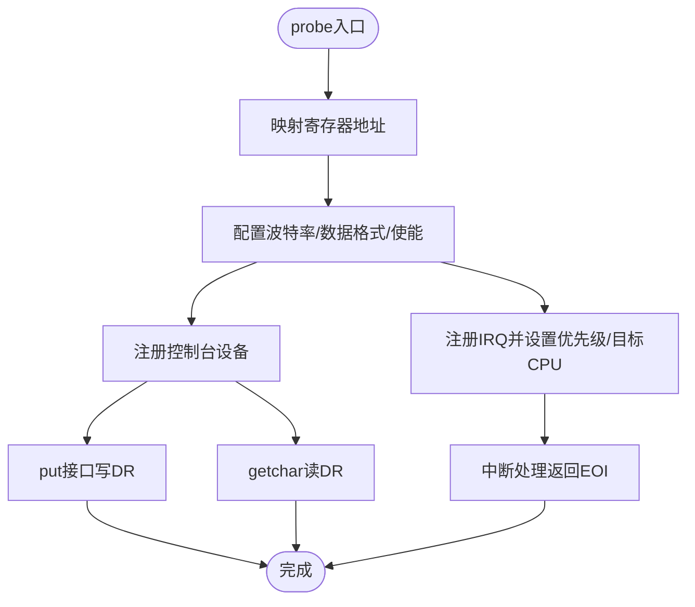
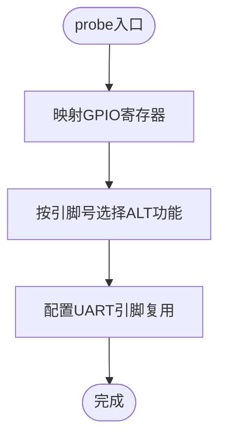
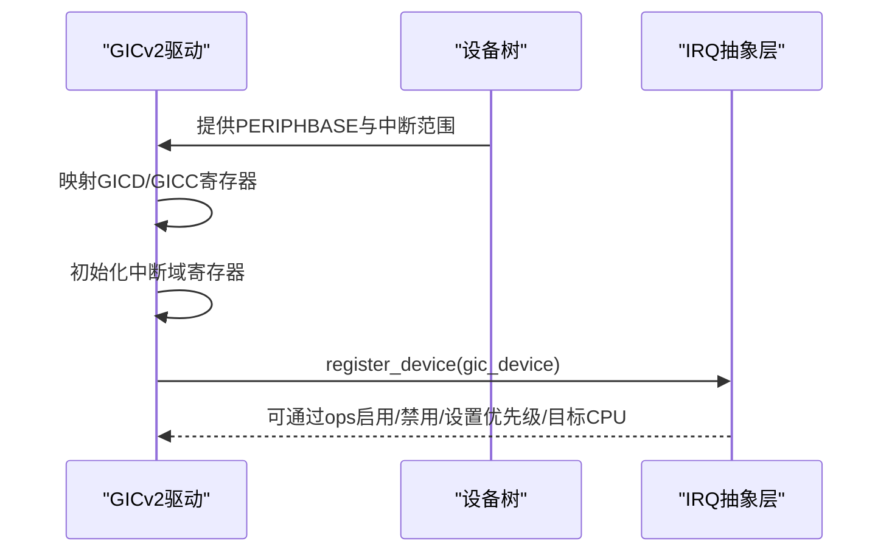
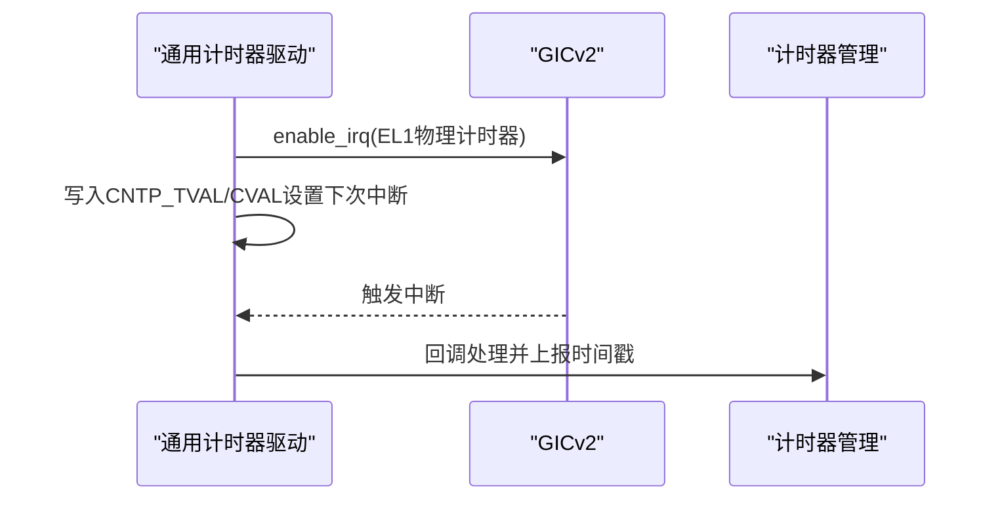
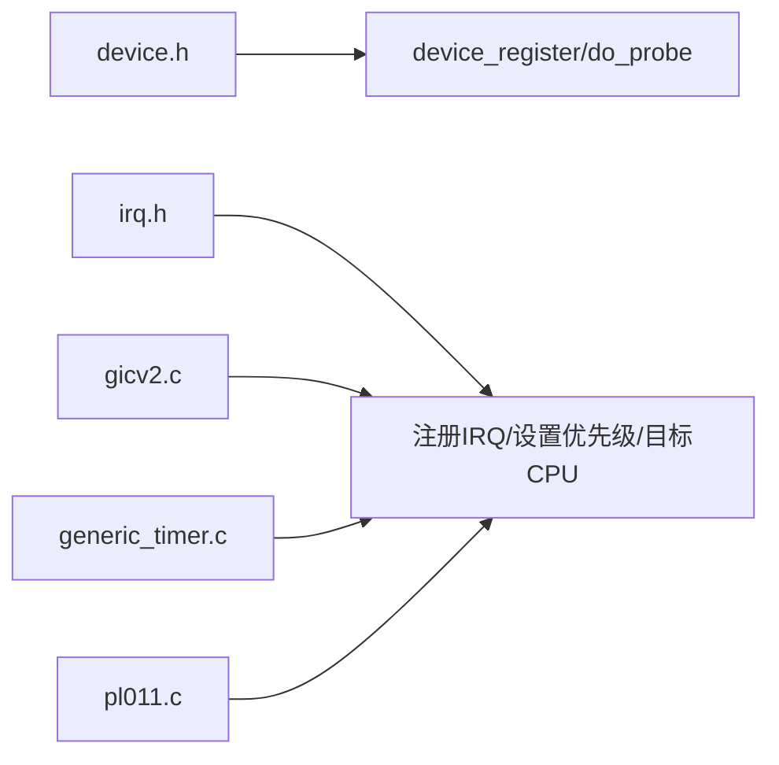

# ARM平台驱动

<cite>
**本文档引用的文件**
- [pl011.c](file://boot/drivers/arm-uart/pl011.c)
- [pl011.h](file://boot/drivers/arm-uart/pl011.h)
- [pl011.c](file://kernel/drivers/arm-uart/pl011.c)
- [gicv2.c](file://kernel/drivers/arm-gic/gicv2.c)
- [gicv2.h](file://kernel/drivers/arm-gic/gicv2.h)
- [generic_timer.c](file://kernel/drivers/arm-timer/generic_timer.c)
- [pl080.c](file://kernel/drivers/arm-dma/pl080.c)
- [bcm2711_gpio.c](file://boot/drivers/rpi/bcm2711-gpio/bcm2711_gpio.c)
- [bcm2711_gpio.h](file://boot/drivers/rpi/bcm2711-gpio/bcm2711_gpio.h)
- [bcm2835_aux_uart.c](file://boot/drivers/rpi/bcm2835-aux-uart/bcm2835_aux_uart.c)
- [bcm2835_aux.h](file://boot/drivers/rpi/bcm2835-aux-uart/bcm2835_aux.h)
- [bcm2711-rpi-cm4.dts](file://platform/CM4/dts/bcm2711-rpi-cm4.dts)
- [bcm2710-rpi-3-b.dts](file://platform/Pi3b/dts/bcm2710-rpi-3-b.dts)
- [bcm2711-rpi-4-b.dts](file://platform/Pi4b/dts/bcm2711-rpi-4-b.dts)
- [irq.h](file://kernel/include/interrupt/irq.h)
- [device.h](file://kernel/include/device/device.h)
</cite>

## 目录
1. [引言](#引言)
2. [项目结构](#项目结构)
3. [核心组件](#核心组件)
4. [架构总览](#架构总览)
5. [详细组件分析](#详细组件分析)
6. [依赖关系分析](#依赖关系分析)
7. [性能考虑](#性能考虑)
8. [故障排查指南](#故障排查指南)
9. [结论](#结论)
10. [附录](#附录)

## 引言
本文件面向ARM平台驱动开发者，系统性梳理仓库中与ARM架构相关的设备驱动实现，覆盖UART、GPIO、中断控制器（GIC）、通用计时器以及DMA控制器等关键子系统。文档结合树莓派系列平台的设备树配置，解释驱动的设计模式、寄存器操作与中断处理机制，并给出最佳实践、配置示例与调试方法，帮助读者在不同ARM硬件平台上快速适配与扩展。

## 项目结构
仓库采用“内核态驱动 + 启动阶段驱动 + 平台设备树”的分层组织方式：
- 启动阶段驱动：位于 boot/ 目录，负责早期硬件初始化与最小化控制台输出。
- 内核阶段驱动：位于 kernel/drivers/ 目录，提供完整的设备管理、中断与计时能力。
- 平台设备树：位于 platform/*/dts/ 目录，描述SoC外设地址、中断与兼容性信息。

图表来源
- [pl011.c](file://boot/drivers/arm-uart/pl011.c#L1-L95)
- [bcm2711_gpio.c](file://boot/drivers/rpi/bcm2711-gpio/bcm2711_gpio.c#L1-L67)
- [bcm2835_aux_uart.c](file://boot/drivers/rpi/bcm2835-aux-uart/bcm2835_aux_uart.c#L1-L37)
- [pl011.c](file://kernel/drivers/arm-uart/pl011.c#L1-L138)
- [gicv2.c](file://kernel/drivers/arm-gic/gicv2.c#L1-L379)
- [generic_timer.c](file://kernel/drivers/arm-timer/generic_timer.c#L1-L284)
- [pl080.c](file://kernel/drivers/arm-dma/pl080.c#L1-L20)
- [bcm2710-rpi-3-b.dts](file://platform/Pi3b/dts/bcm2710-rpi-3-b.dts#L1-L800)
- [bcm2711-rpi-4-b.dts](file://platform/Pi4b/dts/bcm2711-rpi-4-b.dts#L1-L800)
- [bcm2711-rpi-cm4.dts](file://platform/CM4/dts/bcm2711-rpi-cm4.dts#L1-L800)

章节来源
- [pl011.c](file://boot/drivers/arm-uart/pl011.c#L1-L95)
- [pl011.c](file://kernel/drivers/arm-uart/pl011.c#L1-L138)
- [gicv2.c](file://kernel/drivers/arm-gic/gicv2.c#L1-L379)
- [generic_timer.c](file://kernel/drivers/arm-timer/generic_timer.c#L1-L284)
- [pl080.c](file://kernel/drivers/arm-dma/pl080.c#L1-L20)
- [bcm2710-rpi-3-b.dts](file://platform/Pi3b/dts/bcm2710-rpi-3-b.dts#L1-L800)
- [bcm2711-rpi-4-b.dts](file://platform/Pi4b/dts/bcm2711-rpi-4-b.dts#L1-L800)
- [bcm2711-rpi-cm4.dts](file://platform/CM4/dts/bcm2711-rpi-cm4.dts#L1-L800)

## 核心组件
本节概述ARM平台驱动的关键模块及其职责：
- UART驱动（PL011）：提供串口收发、波特率配置与控制台集成。
- GPIO控制器（BCM2711）：提供引脚功能选择、上拉/下拉与外设复用。
- 中断控制器（GICv2）：提供中断分发、优先级与目标CPU设置。
- 通用计时器（ARMv8物理计时器）：提供高精度定时与周期性中断。
- DMA控制器（PL080）：占位实现，用于后续扩展。

章节来源
- [pl011.c](file://boot/drivers/arm-uart/pl011.c#L1-L95)
- [pl011.c](file://kernel/drivers/arm-uart/pl011.c#L1-L138)
- [bcm2711_gpio.c](file://boot/drivers/rpi/bcm2711-gpio/bcm2711_gpio.c#L1-L67)
- [gicv2.c](file://kernel/drivers/arm-gic/gicv2.c#L1-L379)
- [generic_timer.c](file://kernel/drivers/arm-timer/generic_timer.c#L1-L284)
- [pl080.c](file://kernel/drivers/arm-dma/pl080.c#L1-L20)

## 架构总览
下图展示从设备树到驱动初始化、再到中断与计时路径的整体流程：

图表来源
- [device.h](file://kernel/include/device/device.h#L18-L35)
- [pl011.c](file://kernel/drivers/arm-uart/pl011.c#L92-L125)
- [gicv2.c](file://kernel/drivers/arm-gic/gicv2.c#L216-L276)
- [generic_timer.c](file://kernel/drivers/arm-timer/generic_timer.c#L174-L186)

## 详细组件分析

### UART驱动（PL011）
- 设计要点
  - 寄存器映射与波特率计算：通过IBRD/FBRD设置分频，LCR_H配置数据位与使能位，CR控制收发与回环。
  - 控制台集成：实现put/get接口，使用自旋锁保证并发安全。
  - 中断支持：注册IRQ并提供中断处理入口，便于异步收发场景。
- 关键流程
  - 探针阶段解析设备节点地址，完成寄存器映射与初始化。
  - 控制台输出通过put接口写入DR，输入通过getchar读取DR并等待就绪标志。
  - 可选地注册中断，处理接收/发送缓冲区事件。

图表来源
- [pl011.c](file://kernel/drivers/arm-uart/pl011.c#L92-L125)
- [pl011.c](file://kernel/drivers/arm-uart/pl011.c#L54-L90)
- [pl011.h](file://kernel/drivers/arm-uart/pl011.h#L9-L41)

章节来源
- [pl011.c](file://boot/drivers/arm-uart/pl011.c#L1-L95)
- [pl011.c](file://kernel/drivers/arm-uart/pl011.c#L1-L138)
- [pl011.h](file://kernel/drivers/arm-uart/pl011.h#L1-L44)

### GPIO控制器（BCM2711）
- 设计要点
  - 引脚功能选择：通过GPFSELx寄存器按每组10个引脚的方式设置ALT功能。
  - UART引脚复用：针对特定GPIO编号设置ALT功能以启用UART。
  - 设备树集成：通过compatible匹配，由设备树提供基地址与引脚配置。
- 关键流程
  - 探针阶段读取GPIO基地址并映射寄存器。
  - 针对UART引脚调用功能选择函数进行复用配置。

图表来源
- [bcm2711_gpio.c](file://boot/drivers/rpi/bcm2711-gpio/bcm2711_gpio.c#L49-L53)
- [bcm2711_gpio.c](file://boot/drivers/rpi/bcm2711-gpio/bcm2711_gpio.c#L9-L42)
- [bcm2711_gpio.h](file://boot/drivers/rpi/bcm2711-gpio/bcm2711_gpio.h#L52-L95)

章节来源
- [bcm2711_gpio.c](file://boot/drivers/rpi/bcm2711-gpio/bcm2711_gpio.c#L1-L67)
- [bcm2711_gpio.h](file://boot/drivers/rpi/bcm2711-gpio/bcm2711_gpio.h#L1-L98)

### 中断控制器（GICv2）
- 设计要点
  - 分发器与CPU接口分离：GICD负责中断使能/优先级/目标，GICC负责当前CPU的中断处理。
  - 中断使能/禁止/挂起/活动状态管理：通过IS/IC寄存器集合操作。
  - 与抽象层对接：注册IRQ设备，提供enable/disable/ack/eoi等操作。
- 关键流程
  - 探针阶段解析设备树中的PERIPHBASE，映射GICD/GICC寄存器。
  - 初始化各中断域寄存器，设置默认优先级与目标CPU。
  - 注册IRQ设备到抽象层，供其他驱动使用。

图表来源
- [gicv2.c](file://kernel/drivers/arm-gic/gicv2.c#L216-L276)
- [gicv2.c](file://kernel/drivers/arm-gic/gicv2.c#L201-L214)
- [gicv2.h](file://kernel/drivers/arm-gic/gicv2.h#L15-L102)

章节来源
- [gicv2.c](file://kernel/drivers/arm-gic/gicv2.c#L1-L379)
- [gicv2.h](file://kernel/drivers/arm-gic/gicv2.h#L1-L105)

### 通用计时器（ARMv8物理计时器）
- 设计要点
  - 使用CNTP_TVAL/CVAL寄存器设置下一次中断时间，CNTFRQ获取频率。
  - 与GICv2配合：设置物理计时器中断号，配置优先级与目标CPU。
  - 时间换算：提供硬件计数到纳秒的转换接口。
- 关键流程
  - 探针阶段读取硬件计数频率，注册计时器设备。
  - 设置中断处理回调，响应定时器中断并调用上层处理器。

图表来源
- [generic_timer.c](file://kernel/drivers/arm-timer/generic_timer.c#L174-L186)
- [generic_timer.c](file://kernel/drivers/arm-timer/generic_timer.c#L227-L236)
- [gicv2.c](file://kernel/drivers/arm-gic/gicv2.c#L153-L161)

章节来源
- [generic_timer.c](file://kernel/drivers/arm-timer/generic_timer.c#L1-L284)

### DMA控制器（PL080）
- 设计要点
  - 当前为占位实现，仅完成设备注册，未实现具体通道与传输逻辑。
  - 后续可在此基础上扩展通道管理、链表传输与中断处理。
- 关键流程
  - 探针阶段注册设备描述符，等待上层请求后初始化DMA通道。

章节来源
- [pl080.c](file://kernel/drivers/arm-dma/pl080.c#L1-L20)

### 树莓派特定驱动与设备树适配
- BCM2835辅助UART（Mini UART）
  - 通过auxiliary_peripherals_regs访问AUX寄存器，启用mini UART并设置波特率。
  - 兼容字符串同时覆盖bcm2835与bcm2711，便于多平台共用。
- 设备树适配
  - Pi3B/Pi4B/CM4设备树定义了GPIO、UART、AUX等外设的reg与中断信息。
  - 通过compatible字段与驱动匹配，确保不同SoC型号的统一接入。

章节来源
- [bcm2835_aux_uart.c](file://boot/drivers/rpi/bcm2835-aux-uart/bcm2835_aux_uart.c#L1-L37)
- [bcm2835_aux.h](file://boot/drivers/rpi/bcm2835-aux-uart/bcm2835_aux.h#L7-L31)
- [bcm2710-rpi-3-b.dts](file://platform/Pi3b/dts/bcm2710-rpi-3-b.dts#L593-L746)
- [bcm2711-rpi-4-b.dts](file://platform/Pi4b/dts/bcm2711-rpi-4-b.dts#L220-L444)
- [bcm2711-rpi-cm4.dts](file://platform/CM4/dts/bcm2711-rpi-cm4.dts#L166-L380)

## 依赖关系分析
- 设备模型与初始化
  - 设备描述符通过device_register注册，遵循initcall阶段顺序（early/key/normal）。
  - 驱动通过device_get_property读取设备树属性，完成资源绑定。
- 中断抽象
  - IRQ结构体定义中断号、名称、处理模式与回调；驱动通过IRQ抽象层注册与管理。
- 关键依赖关系

图表来源
- [device.h](file://kernel/include/device/device.h#L18-L35)
- [irq.h](file://kernel/include/interrupt/irq.h#L28-L37)
- [gicv2.c](file://kernel/drivers/arm-gic/gicv2.c#L201-L214)
- [generic_timer.c](file://kernel/drivers/arm-timer/generic_timer.c#L238-L254)
- [pl011.c](file://kernel/drivers/arm-uart/pl011.c#L132-L138)

章节来源
- [device.h](file://kernel/include/device/device.h#L1-L37)
- [irq.h](file://kernel/include/interrupt/irq.h#L1-L38)
- [gicv2.c](file://kernel/drivers/arm-gic/gicv2.c#L1-L379)
- [generic_timer.c](file://kernel/drivers/arm-timer/generic_timer.c#L1-L284)
- [pl011.c](file://kernel/drivers/arm-uart/pl011.c#L1-L138)

## 性能考虑
- UART
  - 使用自旋锁保护串口收发，避免上下文切换开销；在高负载下建议结合DMA或批量写入策略。
  - 波特率配置应尽量使用整数分频，减少误差累积。
- GPIO
  - 批量设置/清除寄存器时注意位掩码与偏移，避免不必要的读改写。
- GICv2
  - 合理设置中断优先级与目标CPU，避免热点中断导致的CPU亲和性问题。
- 计时器
  - 定时器重编程时预留最小间隔，防止过短周期导致抖动。
  - 利用硬件频率直接换算，减少浮点运算。

## 故障排查指南
- UART无输出/无法接收
  - 检查波特率分频参数是否正确，确认LCR_H与CR寄存器配置。
  - 确认FR标志位，检查DR是否已满/空。
  - 若启用中断，检查IRQ是否注册成功且优先级设置合理。
- GPIO引脚无效
  - 确认GPFSELx寄存器对应位已正确设置ALT功能。
  - 检查设备树中的pin配置与引脚编号是否一致。
- 中断不触发
  - 确认GICv2已映射并初始化，中断号在有效范围内。
  - 检查IRQ抽象层注册与优先级设置，确认EOI返回。
- 计时器不工作
  - 确认CNTP_TVAL/CVAL已写入，CNTFRQ读数正常。
  - 检查GICv2对物理计时器中断的使能与优先级。

章节来源
- [pl011.c](file://kernel/drivers/arm-uart/pl011.c#L54-L90)
- [bcm2711_gpio.c](file://boot/drivers/rpi/bcm2711-gpio/bcm2711_gpio.c#L9-L42)
- [gicv2.c](file://kernel/drivers/arm-gic/gicv2.c#L129-L137)
- [generic_timer.c](file://kernel/drivers/arm-timer/generic_timer.c#L119-L150)

## 结论
本仓库提供了ARM平台驱动的完整骨架：从启动阶段的最小化串口输出，到内核阶段的中断、计时与外设驱动。通过设备树与驱动的解耦设计，能够方便地适配树莓派系列不同SoC型号。建议在实际项目中遵循硬件抽象、错误处理与性能优化的最佳实践，逐步扩展DMA、I2C/SPI等外设驱动，形成稳定可靠的ARM平台驱动体系。

## 附录

### 驱动配置示例（基于设备树）
- UART（PL011）
  - compatible: "arm,pl011"
  - reg: 基址与大小
  - interrupts: 中断号
  - clocks/clock-names: 时钟源
  - pinctrl-names/pinctrl-0: 引脚复用配置
- GPIO（BCM2711）
  - compatible: "brcm,bcm2711-gpio"
  - reg: 基址与大小
  - interrupts: 中断号
  - gpio-controller与#gpio-cells
  - pinctrl-names/pinctrl-0: 引脚功能选择
- GICv2
  - compatible: "arm,cortex-a15-gic" 或 "arm,gic-400"
  - reg: 分发器与CPU接口基址
- 计时器（ARMv8物理计时器）
  - compatible: "arm,armv8-timer" 或 "arm,armv7-timer"
  - 通过设备树指定irqs与频率

章节来源
- [bcm2710-rpi-3-b.dts](file://platform/Pi3b/dts/bcm2710-rpi-3-b.dts#L593-L746)
- [bcm2711-rpi-4-b.dts](file://platform/Pi4b/dts/bcm2711-rpi-4-b.dts#L220-L444)
- [bcm2711-rpi-cm4.dts](file://platform/CM4/dts/bcm2711-rpi-cm4.dts#L166-L380)