# 硬件抽象层

<cite>
**本文引用的文件**
- [hal_cpu.h](file://kernel/include/arch/generic/hal_cpu.h)
- [hal_interrupt.h](file://kernel/include/arch/generic/hal_interrupt.h)
- [hal_mmu.h](file://kernel/include/arch/generic/hal_mmu.h)
- [hal_page_table.h](file://kernel/include/arch/generic/hal_page_table.h)
- [hal_tlb.h](file://kernel/include/arch/generic/hal_tlb.h)
- [hal_exception.h](file://kernel/include/arch/generic/hal_exception.h)
- [hal_context.h](file://kernel/include/arch/generic/hal_context.h)
- [hal_atomic.h](file://kernel/include/arch/generic/hal_atomic.h)
- [cpu.c](file://kernel/arch/arm64/cpu.c)
- [interrupt.c](file://kernel/arch/arm64/interrupt.c)
- [mmu.c](file://kernel/arch/arm64/mmu.c)
- [page_table.c](file://kernel/arch/arm64/page_table.c)
- [tlb.c](file://kernel/arch/arm64/tlb.c)
- [context.c](file://kernel/arch/arm64/context.c)
- [atomic.c](file://kernel/arch/arm64/atomic.c)
- [arm64_cpu.h](file://kernel/include/arch/arm64/cpu.h)
- [exception.h](file://kernel/include/arch/arm64/exception.h)
- [exception.c](file://kernel/exception/exception.c)
</cite>

## 目录
1. [引言](#引言)
2. [项目结构](#项目结构)
3. [核心组件](#核心组件)
4. [架构总览](#架构总览)
5. [详细组件分析](#详细组件分析)
6. [依赖分析](#依赖分析)
7. [性能考虑](#性能考虑)
8. [故障排查指南](#故障排查指南)
9. [结论](#结论)
10. [附录：扩展与适配指南](#附录扩展与适配指南)

## 引言
本文件系统性梳理硬件抽象层（HAL）的设计理念、架构模式与抽象层次，聚焦于CPU抽象、中断处理抽象、内存管理抽象与上下文切换抽象，并阐明HAL如何屏蔽底层硬件差异，向上层提供统一接口。文档同时给出接口规范、数据结构定义、函数原型路径、扩展方法、性能优化建议以及与微内核其他模块的交互关系。

## 项目结构
HAL位于“kernel/include/arch/generic”目录下，提供通用接口；ARM64具体实现位于“kernel/arch/arm64”。异常、上下文、原子等子系统在各自目录中实现，但通过HAL接口与通用层对接。

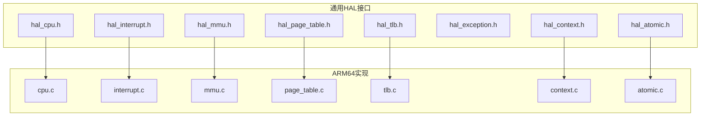

图示来源
- [hal_cpu.h](file://kernel/include/arch/generic/hal_cpu.h#L1-L38)
- [hal_interrupt.h](file://kernel/include/arch/generic/hal_interrupt.h#L1-L30)
- [hal_mmu.h](file://kernel/include/arch/generic/hal_mmu.h#L1-L28)
- [hal_page_table.h](file://kernel/include/arch/generic/hal_page_table.h#L1-L12)
- [hal_tlb.h](file://kernel/include/arch/generic/hal_tlb.h#L1-L15)
- [hal_exception.h](file://kernel/include/arch/generic/hal_exception.h#L1-L24)
- [hal_context.h](file://kernel/include/arch/generic/hal_context.h#L1-L24)
- [hal_atomic.h](file://kernel/include/arch/generic/hal_atomic.h#L1-L33)
- [cpu.c](file://kernel/arch/arm64/cpu.c#L1-L44)
- [interrupt.c](file://kernel/arch/arm64/interrupt.c#L1-L66)
- [mmu.c](file://kernel/arch/arm64/mmu.c#L1-L231)
- [page_table.c](file://kernel/arch/arm64/page_table.c#L1-L167)
- [tlb.c](file://kernel/arch/arm64/tlb.c#L1-L68)
- [context.c](file://kernel/arch/arm64/context.c#L1-L98)
- [atomic.c](file://kernel/arch/arm64/atomic.c#L1-L181)

章节来源
- [hal_cpu.h](file://kernel/include/arch/generic/hal_cpu.h#L1-L38)
- [hal_interrupt.h](file://kernel/include/arch/generic/hal_interrupt.h#L1-L30)
- [hal_mmu.h](file://kernel/include/arch/generic/hal_mmu.h#L1-L28)
- [hal_page_table.h](file://kernel/include/arch/generic/hal_page_table.h#L1-L12)
- [hal_tlb.h](file://kernel/include/arch/generic/hal_tlb.h#L1-L15)
- [hal_exception.h](file://kernel/include/arch/generic/hal_exception.h#L1-L24)
- [hal_context.h](file://kernel/include/arch/generic/hal_context.h#L1-L24)
- [hal_atomic.h](file://kernel/include/arch/generic/hal_atomic.h#L1-L33)
- [cpu.c](file://kernel/arch/arm64/cpu.c#L1-L44)
- [interrupt.c](file://kernel/arch/arm64/interrupt.c#L1-L66)
- [mmu.c](file://kernel/arch/arm64/mmu.c#L1-L231)
- [page_table.c](file://kernel/arch/arm64/page_table.c#L1-L167)
- [tlb.c](file://kernel/arch/arm64/tlb.c#L1-L68)
- [context.c](file://kernel/arch/arm64/context.c#L1-L98)
- [atomic.c](file://kernel/arch/arm64/atomic.c#L1-L181)

## 核心组件
- CPU抽象：提供特权级查询、CPU编号、本地存储访问、事件等待/广播等能力。
- 中断抽象：提供全局与分类中断开关、状态保存恢复、中断类型枚举。
- 内存管理抽象：提供MMU初始化、使能/禁用、页表设置、配置查询、页映射尝试与扩展。
- TLB抽象：提供全量/按页/按ASID失效。
- 上下文抽象：提供通用寄存器初始化、用户态上下文初始化、寄存器读写、栈/指令指针读取、用户态切换。
- 原子与屏障：提供原子交换/比较交换/读写与不同内存序屏障。
- 异常调试：提供异常调试信息采集、寄存器快照打印、异常初始化。

章节来源
- [hal_cpu.h](file://kernel/include/arch/generic/hal_cpu.h#L1-L38)
- [hal_interrupt.h](file://kernel/include/arch/generic/hal_interrupt.h#L1-L30)
- [hal_mmu.h](file://kernel/include/arch/generic/hal_mmu.h#L1-L28)
- [hal_page_table.h](file://kernel/include/arch/generic/hal_page_table.h#L1-L12)
- [hal_tlb.h](file://kernel/include/arch/generic/hal_tlb.h#L1-L15)
- [hal_context.h](file://kernel/include/arch/generic/hal_context.h#L1-L24)
- [hal_atomic.h](file://kernel/include/arch/generic/hal_atomic.h#L1-L33)
- [hal_exception.h](file://kernel/include/arch/generic/hal_exception.h#L1-L24)

## 架构总览
HAL采用“通用接口 + 体系结构实现”的分层设计。通用头文件定义跨平台接口与数据结构，ARM64实现直接调用体系结构寄存器与汇编指令完成具体功能，保证上层对底层硬件细节透明。

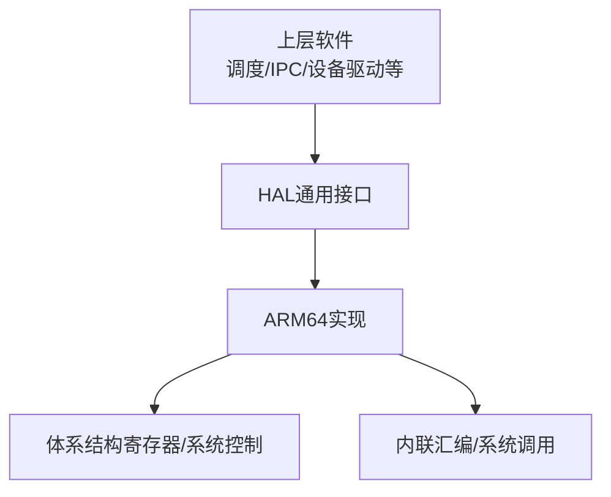

图示来源
- [hal_cpu.h](file://kernel/include/arch/generic/hal_cpu.h#L1-L38)
- [cpu.c](file://kernel/arch/arm64/cpu.c#L1-L44)
- [interrupt.c](file://kernel/arch/arm64/interrupt.c#L1-L66)
- [mmu.c](file://kernel/arch/arm64/mmu.c#L1-L231)
- [page_table.c](file://kernel/arch/arm64/page_table.c#L1-L167)
- [tlb.c](file://kernel/arch/arm64/tlb.c#L1-L68)
- [context.c](file://kernel/arch/arm64/context.c#L1-L98)
- [atomic.c](file://kernel/arch/arm64/atomic.c#L1-L181)

## 详细组件分析

### CPU抽象
- 职责：查询当前特权级、获取CPU编号/数量、设置/获取本地存储、事件等待/广播。
- 关键接口路径：
  - 获取特权级：[hal_cpu_get_privilege_level](file://kernel/arch/arm64/cpu.c#L9-L20)
  - CPU编号/数量：[hal_cpu_id](file://kernel/arch/arm64/cpu.c#L22-L28)
  - 本地存储：[hal_cpu_set_local_storage](file://kernel/arch/arm64/cpu.c#L30-L36), [hal_cpu_get_local_storage](file://kernel/arch/arm64/cpu.c#L30-L36)
  - 事件同步：[hal_cpu_event_wait](file://kernel/arch/arm64/cpu.c#L38-L40), [hal_cpu_event_broadcast](file://kernel/arch/arm64/cpu.c#L42-L44)
- 数据结构：特权级枚举见 [hal_privilege_level_t](file://kernel/include/arch/generic/hal_cpu.h#L7-L12)。

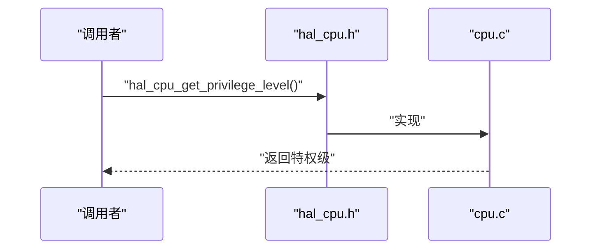

图示来源
- [hal_cpu.h](file://kernel/include/arch/generic/hal_cpu.h#L24-L24)
- [cpu.c](file://kernel/arch/arm64/cpu.c#L9-L20)

章节来源
- [hal_cpu.h](file://kernel/include/arch/generic/hal_cpu.h#L1-L38)
- [cpu.c](file://kernel/arch/arm64/cpu.c#L1-L44)

### 中断处理抽象
- 职责：全局与分类中断开关、状态查询与保存恢复、中断类型分类。
- 关键接口路径：
  - 全局开关：[hal_irq_enable_all](file://kernel/arch/arm64/interrupt.c#L7-L9), [hal_irq_disable_all](file://kernel/arch/arm64/interrupt.c#L11-L13)
  - 分类开关：[hal_irq_enable](file://kernel/arch/arm64/interrupt.c#L15-L30), [hal_irq_disable](file://kernel/arch/arm64/interrupt.c#L32-L47)
  - 查询与保存恢复：[hal_irq_is_enabled](file://kernel/arch/arm64/interrupt.c#L49-L52), [hal_irq_get_state](file://kernel/arch/arm64/interrupt.c#L54-L56), [hal_irq_save_and_disable](file://kernel/arch/arm64/interrupt.c#L58-L62), [hal_irq_restore](file://kernel/arch/arm64/interrupt.c#L64-L66)
- 中断类型：见 [hal_irq_type_t](file://kernel/include/arch/generic/hal_interrupt.h#L7-L12)。

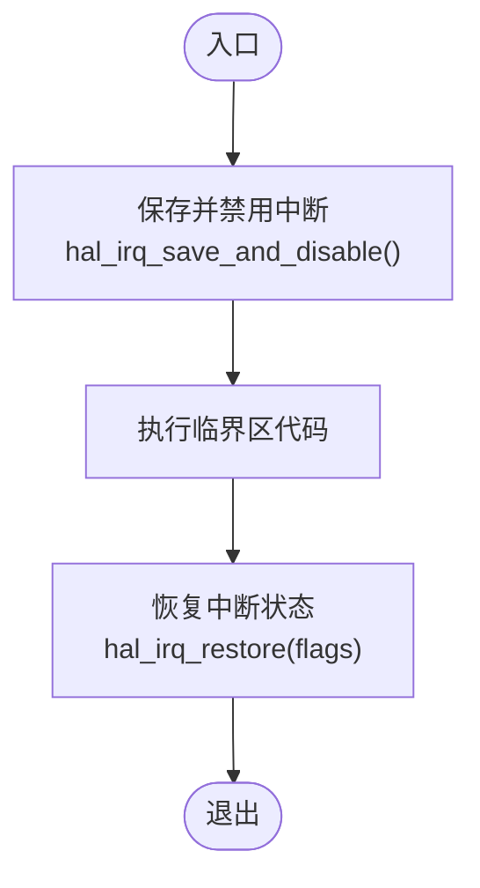

图示来源
- [hal_interrupt.h](file://kernel/include/arch/generic/hal_interrupt.h#L26-L28)
- [interrupt.c](file://kernel/arch/arm64/interrupt.c#L58-L66)

章节来源
- [hal_interrupt.h](file://kernel/include/arch/generic/hal_interrupt.h#L1-L30)
- [interrupt.c](file://kernel/arch/arm64/interrupt.c#L1-L66)

### 内存管理抽象（MMU）
- 职责：初始化MMU、使能/禁用、设置内核/用户页表、创建身份映射、查询配置。
- 关键接口路径：
  - 初始化与开关：[hal_mmu_init](file://kernel/arch/arm64/mmu.c#L62-L126), [hal_mmu_enable](file://kernel/arch/arm64/mmu.c#L128-L139), [hal_mmu_disable](file://kernel/arch/arm64/mmu.c#L141-L151)
  - 设置页表：[hal_mmu_set_kernel_page_table](file://kernel/arch/arm64/mmu.c#L153-L155), [hal_mmu_set_user_page_table](file://kernel/arch/arm64/mmu.c#L157-L159)
  - 身份映射：[hal_mmu_create_identity_map](file://kernel/arch/arm64/mmu.c#L161-L222)
  - 配置查询：[hal_mmu_get_config](file://kernel/arch/arm64/mmu.c#L224-L231)
- 配置结构：见 [hal_mmu_config](file://kernel/include/arch/generic/hal_mmu.h#L7-L12)。

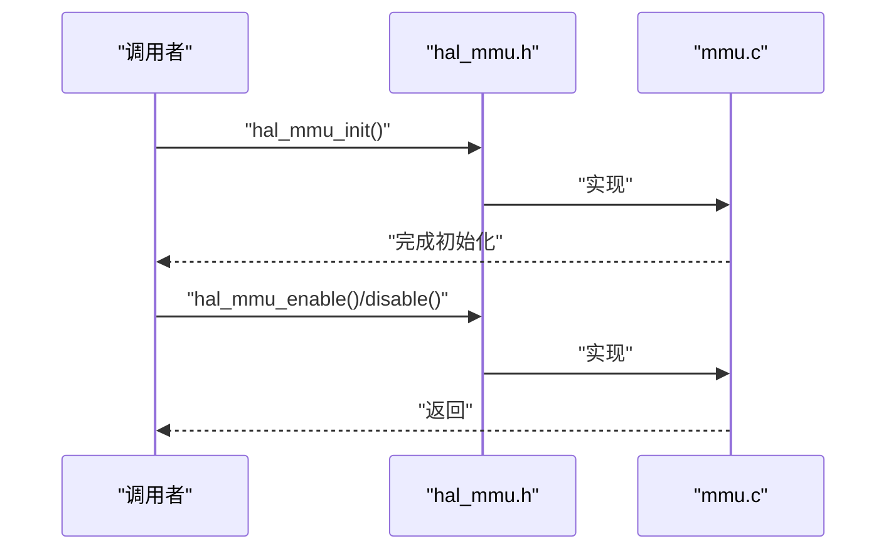

图示来源
- [hal_mmu.h](file://kernel/include/arch/generic/hal_mmu.h#L14-L20)
- [mmu.c](file://kernel/arch/arm64/mmu.c#L62-L151)

章节来源
- [hal_mmu.h](file://kernel/include/arch/generic/hal_mmu.h#L1-L28)
- [mmu.c](file://kernel/arch/arm64/mmu.c#L1-L231)

### 页表抽象
- 职责：尝试映射单页、扩展中间层级页表。
- 关键接口路径：
  - 映射单页：[hal_page_table_try_map_page](file://kernel/arch/arm64/page_table.c#L9-L94)
  - 扩展页表：[hal_page_table_extend](file://kernel/arch/arm64/page_table.c#L96-L167)
- 返回码（示例）：映射失败的若干场景在实现中以特定错误码表示，用于上层决策。

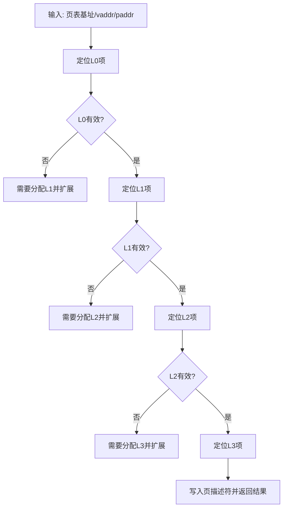

图示来源
- [hal_page_table.h](file://kernel/include/arch/generic/hal_page_table.h#L8-L11)
- [page_table.c](file://kernel/arch/arm64/page_table.c#L9-L167)

章节来源
- [hal_page_table.h](file://kernel/include/arch/generic/hal_page_table.h#L1-L12)
- [page_table.c](file://kernel/arch/arm64/page_table.c#L1-L167)

### TLB抽象
- 职责：全量/按页/按范围/按ASID失效。
- 关键接口路径：
  - 失效全量：[hal_tlb_invalidate_all](file://kernel/arch/arm64/tlb.c#L44-L48)
  - 按页失效：[hal_tlb_invalidate_page](file://kernel/arch/arm64/tlb.c#L50-L54)
  - 按范围失效：[hal_tlb_invalidate_range](file://kernel/arch/arm64/tlb.c#L56-L62)
  - 按ASID失效：[hal_tlb_invalidate_asid](file://kernel/arch/arm64/tlb.c#L64-L68)

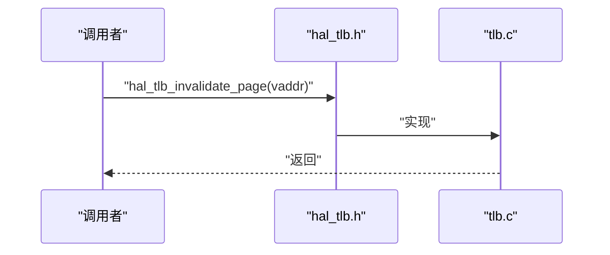

图示来源
- [hal_tlb.h](file://kernel/include/arch/generic/hal_tlb.h#L7-L14)
- [tlb.c](file://kernel/arch/arm64/tlb.c#L44-L68)

章节来源
- [hal_tlb.h](file://kernel/include/arch/generic/hal_tlb.h#L1-L15)
- [tlb.c](file://kernel/arch/arm64/tlb.c#L1-L68)

### 上下文抽象
- 职责：通用寄存器初始化、用户态上下文初始化、寄存器读写、栈/指令指针读取、用户态切换。
- 关键接口路径：
  - 初始化与读写：[hal_context_init_common_regs](file://kernel/arch/arm64/context.c#L7-L10), [hal_context_init_user](file://kernel/arch/arm64/context.c#L12-L33), [hal_context_get_reg](file://kernel/arch/arm64/context.c#L50-L66), [hal_context_set_reg](file://kernel/arch/arm64/context.c#L68-L84)
  - 寄存器读取：[hal_context_get_sp](file://kernel/arch/arm64/context.c#L86-L94), [hal_context_get_pc](file://kernel/arch/arm64/context.c#L86-L94)
  - 切换到用户态：[hal_context_switch_to_user](file://kernel/arch/arm64/context.c#L96-L98)
- ARM64上下文数据结构：见 [arm64_cpu_context_s](file://kernel/include/arch/arm64/cpu.h#L85-L89)。

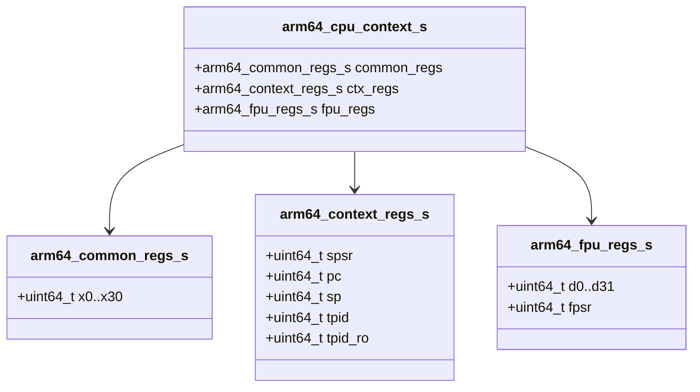

图示来源
- [arm64_cpu.h](file://kernel/include/arch/arm64/cpu.h#L7-L89)
- [context.c](file://kernel/arch/arm64/context.c#L7-L33)

章节来源
- [hal_context.h](file://kernel/include/arch/generic/hal_context.h#L1-L24)
- [context.c](file://kernel/arch/arm64/context.c#L1-L98)
- [arm64_cpu.h](file://kernel/include/arch/arm64/cpu.h#L1-L94)

### 原子与屏障
- 职责：提供原子交换、比较交换、读写与不同内存序屏障。
- 关键接口路径：
  - 交换与CAS：[hal_atomic_xchg/_acq/_rel/_rlx](file://kernel/arch/arm64/atomic.c#L3-L56), [hal_atomic_cmpxchg/_acq/_rel/_rlx](file://kernel/arch/arm64/atomic.c#L58-L135)
  - 读写：[hal_atomic_read/_rlx](file://kernel/arch/arm64/atomic.c#L137-L153), [hal_atomic_write/_rlx](file://kernel/arch/arm64/atomic.c#L155-L165)
  - 屏障：[hal_barrier_fence/_acq/_rel/_rlx](file://kernel/arch/arm64/atomic.c#L167-L181)
- 数据结构：见 [atomic_s](file://kernel/include/arch/generic/hal_atomic.h#L7-L9)。

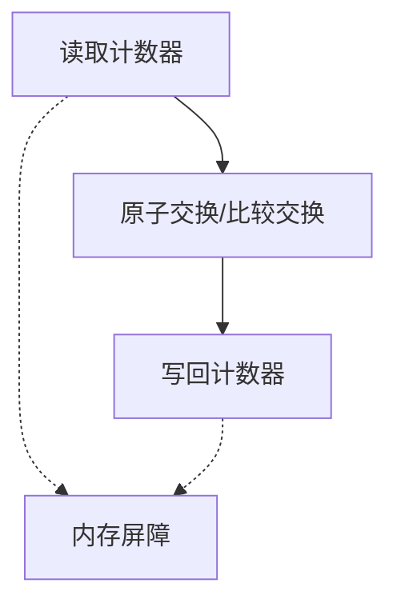

图示来源
- [hal_atomic.h](file://kernel/include/arch/generic/hal_atomic.h#L11-L31)
- [atomic.c](file://kernel/arch/arm64/atomic.c#L3-L181)

章节来源
- [hal_atomic.h](file://kernel/include/arch/generic/hal_atomic.h#L1-L33)
- [atomic.c](file://kernel/arch/arm64/atomic.c#L1-L181)

### 异常调试与处理
- 职责：采集异常调试信息、打印寄存器快照、初始化异常处理、同步异常处理。
- 关键接口路径：
  - 调试信息与打印：[hal_exception_get_debug_info](file://kernel/include/arch/generic/hal_exception.h#L18-L18), [hal_exception_dump_registers](file://kernel/include/arch/generic/hal_exception.h#L20-L20), [hal_exception_init](file://kernel/include/arch/generic/hal_exception.h#L22-L22)
  - 同步异常处理：[sync_exception_handle](file://kernel/exception/exception.c#L26-L36)
- ARM64异常EC常量：见 [exception.h](file://kernel/include/arch/arm64/exception.h#L4-L37)。

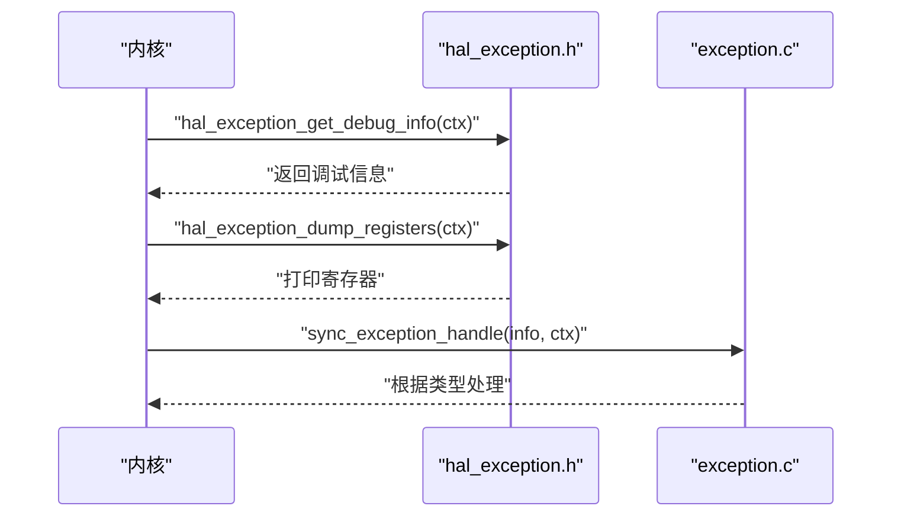

图示来源
- [hal_exception.h](file://kernel/include/arch/generic/hal_exception.h#L18-L23)
- [exception.c](file://kernel/exception/exception.c#L11-L36)
- [exception.h](file://kernel/include/arch/arm64/exception.h#L4-L37)

章节来源
- [hal_exception.h](file://kernel/include/arch/generic/hal_exception.h#L1-L24)
- [exception.c](file://kernel/exception/exception.c#L1-L36)
- [exception.h](file://kernel/include/arch/arm64/exception.h#L1-L113)

## 依赖分析
- 组件耦合：HAL通用接口被ARM64实现强依赖；ARM64实现依赖体系结构寄存器与内联汇编。
- 外部依赖：异常处理依赖调度、回调与转储模块；上下文切换依赖体系结构切换实现。
- 可能的循环依赖：未发现直接循环；通用接口不依赖实现，避免反向耦合。

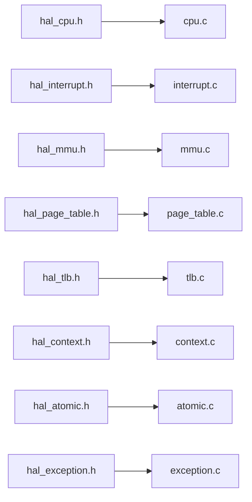

图示来源
- [hal_cpu.h](file://kernel/include/arch/generic/hal_cpu.h#L1-L38)
- [cpu.c](file://kernel/arch/arm64/cpu.c#L1-L44)
- [hal_interrupt.h](file://kernel/include/arch/generic/hal_interrupt.h#L1-L30)
- [interrupt.c](file://kernel/arch/arm64/interrupt.c#L1-L66)
- [hal_mmu.h](file://kernel/include/arch/generic/hal_mmu.h#L1-L28)
- [mmu.c](file://kernel/arch/arm64/mmu.c#L1-L231)
- [hal_page_table.h](file://kernel/include/arch/generic/hal_page_table.h#L1-L12)
- [page_table.c](file://kernel/arch/arm64/page_table.c#L1-L167)
- [hal_tlb.h](file://kernel/include/arch/generic/hal_tlb.h#L1-L15)
- [tlb.c](file://kernel/arch/arm64/tlb.c#L1-L68)
- [hal_context.h](file://kernel/include/arch/generic/hal_context.h#L1-L24)
- [context.c](file://kernel/arch/arm64/context.c#L1-L98)
- [hal_atomic.h](file://kernel/include/arch/generic/hal_atomic.h#L1-L33)
- [atomic.c](file://kernel/arch/arm64/atomic.c#L1-L181)
- [hal_exception.h](file://kernel/include/arch/generic/hal_exception.h#L1-L24)
- [exception.c](file://kernel/exception/exception.c#L1-L36)

章节来源
- [hal_cpu.h](file://kernel/include/arch/generic/hal_cpu.h#L1-L38)
- [cpu.c](file://kernel/arch/arm64/cpu.c#L1-L44)
- [hal_interrupt.h](file://kernel/include/arch/generic/hal_interrupt.h#L1-L30)
- [interrupt.c](file://kernel/arch/arm64/interrupt.c#L1-L66)
- [hal_mmu.h](file://kernel/include/arch/generic/hal_mmu.h#L1-L28)
- [mmu.c](file://kernel/arch/arm64/mmu.c#L1-L231)
- [hal_page_table.h](file://kernel/include/arch/generic/hal_page_table.h#L1-L12)
- [page_table.c](file://kernel/arch/arm64/page_table.c#L1-L167)
- [hal_tlb.h](file://kernel/include/arch/generic/hal_tlb.h#L1-L15)
- [tlb.c](file://kernel/arch/arm64/tlb.c#L1-L68)
- [hal_context.h](file://kernel/include/arch/generic/hal_context.h#L1-L24)
- [context.c](file://kernel/arch/arm64/context.c#L1-L98)
- [hal_atomic.h](file://kernel/include/arch/generic/hal_atomic.h#L1-L33)
- [atomic.c](file://kernel/arch/arm64/atomic.c#L1-L181)
- [hal_exception.h](file://kernel/include/arch/generic/hal_exception.h#L1-L24)
- [exception.c](file://kernel/exception/exception.c#L1-L36)

## 性能考虑
- 中断批量保护：使用保存并禁用接口减少频繁开关带来的开销。
- 页表映射策略：优先复用已分配的中间页表，避免重复分配；按需扩展，降低碎片化。
- TLB失效粒度：按页或按范围失效优于全量失效，减少缓存抖动。
- 原子操作：选择合适的内存序（acquire/release/relaxed）平衡正确性与性能。
- MMU配置：合理设置TTBR寄存器与属性索引，减少属性切换成本。

## 故障排查指南
- 中断无法恢复：检查保存标志位是否正确、恢复时是否写回DAIF寄存器。
- 页映射失败：确认各级页表项有效性与nextLevelTableAddr是否已分配；检查返回码定位失败阶段。
- TLB未生效：确认失效后是否执行了必要的内存屏障与同步指令。
- 上下文切换异常：检查用户态SP/PC/SPSR设置是否符合目标异常级别要求。
- 异常定位困难：利用异常调试信息接口打印关键寄存器与故障地址，结合EC码分析原因。

章节来源
- [interrupt.c](file://kernel/arch/arm64/interrupt.c#L58-L66)
- [page_table.c](file://kernel/arch/arm64/page_table.c#L9-L94)
- [tlb.c](file://kernel/arch/arm64/tlb.c#L44-L68)
- [context.c](file://kernel/arch/arm64/context.c#L12-L33)
- [exception.c](file://kernel/exception/exception.c#L11-L36)
- [exception.h](file://kernel/include/arch/arm64/exception.h#L4-L37)

## 结论
HAL通过清晰的接口与ARM64实现分离，屏蔽了底层硬件差异，向上层提供了稳定一致的能力面。其在中断、内存管理、上下文与原子操作等方面均具备可移植性与高性能特性，是微内核可靠运行的关键基础。

## 附录：扩展与适配指南
- 新增体系结构实现步骤
  - 在“kernel/arch/<arch>/”下创建对应源文件，实现通用HAL接口。
  - 使用体系结构寄存器与内联汇编完成具体功能。
  - 提供数据结构定义与必要的头文件。
- 适配新平台
  - 定义平台相关的页表格式、TLB指令集合与异常EC码。
  - 实现上下文切换与特权级切换逻辑。
  - 在MMU初始化中读取平台能力并配置相应寄存器。
- 接口扩展建议
  - 保持接口签名与语义不变，新增能力以扩展枚举或新增函数形式引入。
  - 对外暴露的接口尽量只依赖通用头文件，避免耦合具体实现。
- 最佳实践
  - 严格区分内存序，必要时使用屏障。
  - 将错误处理与日志记录纳入HAL边界，便于定位问题。
  - 对关键路径进行性能回归测试，确保扩展不影响整体吞吐。