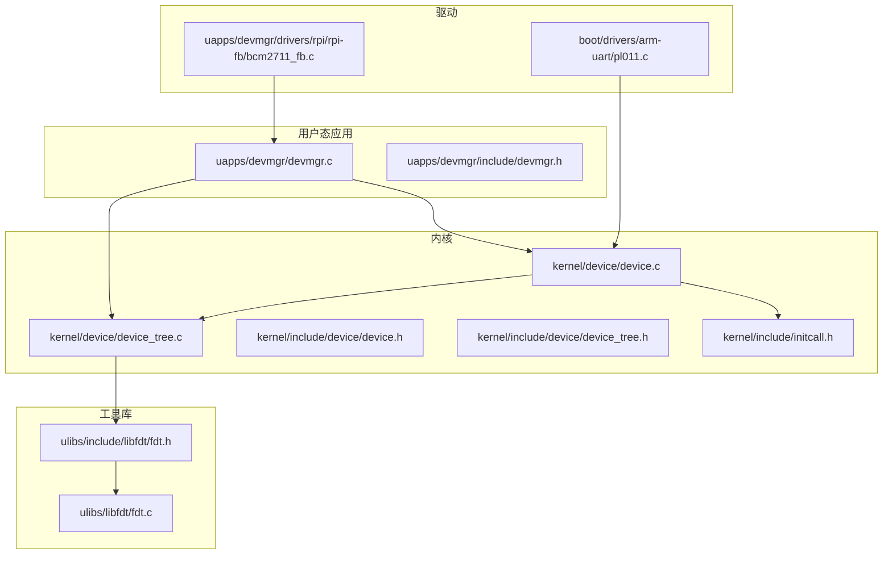
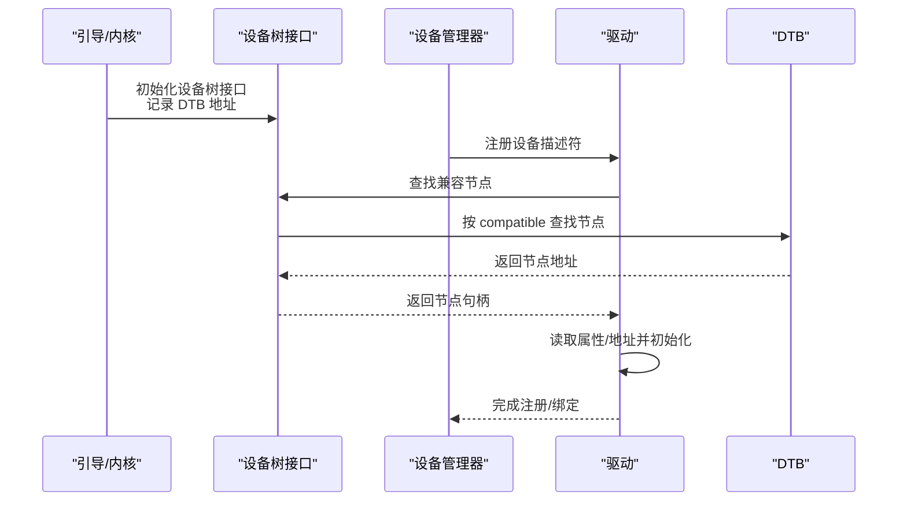
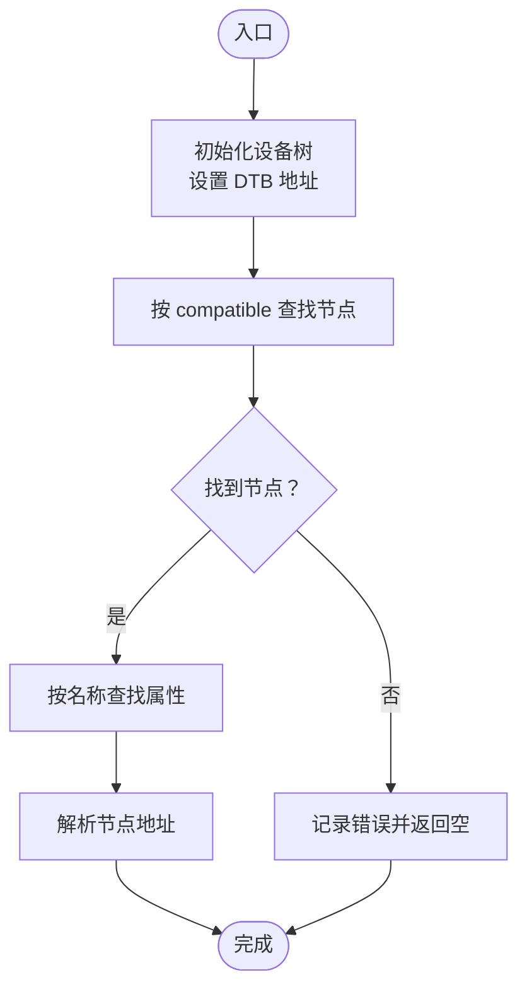
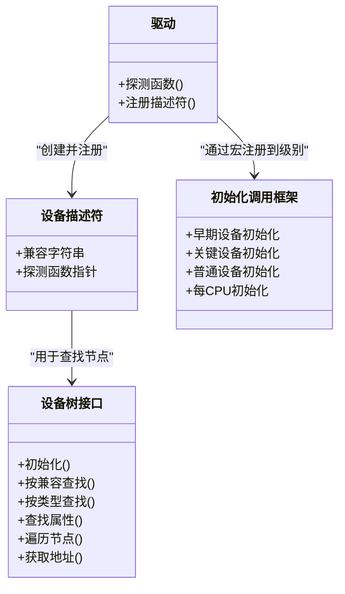
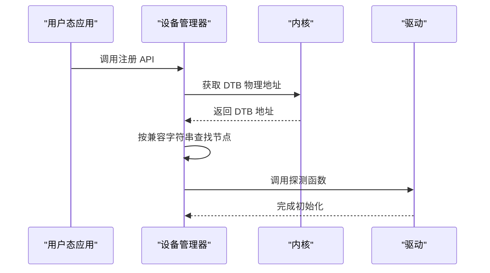
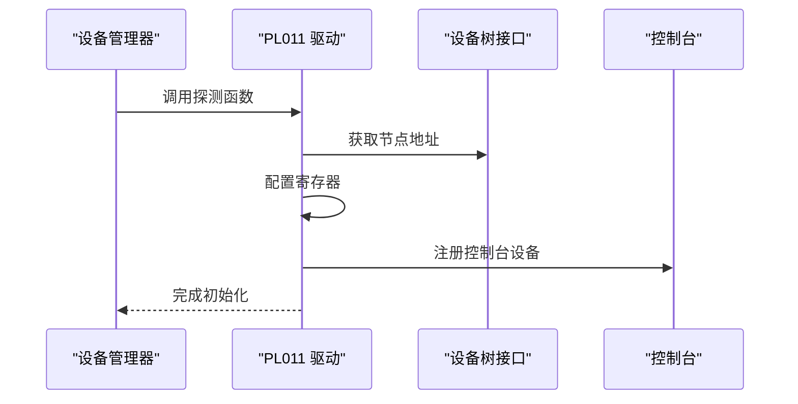
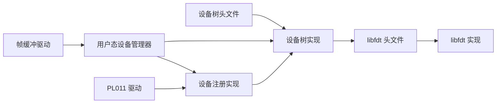

# 设备发现与注册

<cite>
**本文引用的文件**
- [kernel/device/device.c](file://kernel/device/device.c)
- [kernel/device/device_tree.c](file://kernel/device/device_tree.c)
- [kernel/include/device/device.h](file://kernel/include/device/device.h)
- [kernel/include/device/device_tree.h](file://kernel/include/device/device_tree.h)
- [kernel/include/initcall.h](file://kernel/include/initcall.h)
- [uapps/devmgr/devmgr.c](file://uapps/devmgr/devmgr.c)
- [uapps/devmgr/include/devmgr.h](file://uapps/devmgr/include/devmgr.h)
- [ulibs/include/libfdt/fdt.h](file://ulibs/include/libfdt/fdt.h)
- [ulibs/libfdt/fdt.c](file://ulibs/libfdt/fdt.c)
- [boot/drivers/arm-uart/pl011.c](file://boot/drivers/arm-uart/pl011.c)
- [uapps/devmgr/drivers/rpi/rpi-fb/bcm2711_fb.c](file://uapps/devmgr/drivers/rpi/rpi-fb/bcm2711_fb.c)
</cite>

## 目录
1. [引言](#引言)
2. [项目结构](#项目结构)
3. [核心组件](#核心组件)
4. [架构总览](#架构总览)
5. [详细组件分析](#详细组件分析)
6. [依赖关系分析](#依赖关系分析)
7. [性能考虑](#性能考虑)
8. [故障排除指南](#故障排除指南)
9. [结论](#结论)
10. [附录](#附录)

## 引言
本文件围绕设备发现与注册机制展开，系统性阐述以下主题：
- 设备自动发现：基于设备树（Device Tree Blob, DTB）的兼容属性匹配与节点遍历。
- 设备枚举策略：按设备类型与兼容字符串进行筛选，以及对节点属性的访问。
- 注册流程：驱动通过描述符向系统注册，由设备管理器在启动阶段调用探测函数完成初始化。
- 设备类型识别：通过 compatible、device_type 等属性进行识别。
- 资源分配与驱动绑定：解析节点地址、调用探测函数完成外设初始化与控制台等资源绑定。
- 生命周期管理：从创建、初始化到运行与销毁的阶段划分与触发点。
- 注册 API 使用指南：参数说明、调用方式与典型用法。
- 匹配算法与绑定策略：基于 DTB 的匹配与探测回调绑定。
- 调试方法与故障排除：日志输出、DTB 导出与常见问题定位。
- 扩展指南：如何新增硬件类型的设备发现与注册。

## 项目结构
该内核采用分层设计：
- 内核层：设备树解析、设备注册与初始化调用框架。
- 用户态应用层：设备管理器（devmgr）负责在用户态发起注册与初始化。
- 驱动层：具体硬件驱动以“设备描述符 + 探测函数”的形式注册，驱动内部完成资源映射与功能初始化。
- 工具库：libfdt 提供 DTB 解析能力。

**图表来源**
- [kernel/device/device.c](file://kernel/device/device.c#L1-L55)
- [kernel/device/device_tree.c](file://kernel/device/device_tree.c#L1-L95)
- [kernel/include/device/device.h](file://kernel/include/device/device.h#L1-L37)
- [kernel/include/device/device_tree.h](file://kernel/include/device/device_tree.h#L1-L25)
- [kernel/include/initcall.h](file://kernel/include/initcall.h#L1-L44)
- [uapps/devmgr/devmgr.c](file://uapps/devmgr/devmgr.c#L1-L62)
- [uapps/devmgr/include/devmgr.h](file://uapps/devmgr/include/devmgr.h#L1-L30)
- [ulibs/include/libfdt/fdt.h](file://ulibs/include/libfdt/fdt.h#L1-L55)
- [ulibs/libfdt/fdt.c](file://ulibs/libfdt/fdt.c#L48-L334)
- [boot/drivers/arm-uart/pl011.c](file://boot/drivers/arm-uart/pl011.c#L1-L95)
- [uapps/devmgr/drivers/rpi/rpi-fb/bcm2711_fb.c](file://uapps/devmgr/drivers/rpi/rpi-fb/bcm2711_fb.c#L1-L173)

**章节来源**
- [kernel/device/device.c](file://kernel/device/device.c#L1-L55)
- [kernel/device/device_tree.c](file://kernel/device/device_tree.c#L1-L95)
- [kernel/include/device/device.h](file://kernel/include/device/device.h#L1-L37)
- [kernel/include/device/device_tree.h](file://kernel/include/device/device_tree.h#L1-L25)
- [kernel/include/initcall.h](file://kernel/include/initcall.h#L1-L44)
- [uapps/devmgr/devmgr.c](file://uapps/devmgr/devmgr.c#L1-L62)
- [uapps/devmgr/include/devmgr.h](file://uapps/devmgr/include/devmgr.h#L1-L30)
- [ulibs/include/libfdt/fdt.h](file://ulibs/include/libfdt/fdt.h#L1-L55)
- [ulibs/libfdt/fdt.c](file://ulibs/libfdt/fdt.c#L48-L334)
- [boot/drivers/arm-uart/pl011.c](file://boot/drivers/arm-uart/pl011.c#L1-L95)
- [uapps/devmgr/drivers/rpi/rpi-fb/bcm2711_fb.c](file://uapps/devmgr/drivers/rpi/rpi-fb/bcm2711_fb.c#L1-L173)

## 核心组件
- 设备树接口：封装 DTB 地址设置、节点查找、属性查询与遍历。
- 设备注册与初始化：提供设备描述符结构体与注册函数；通过初始化调用框架在不同阶段执行驱动探测。
- 用户态设备管理器：在用户态发起设备注册与初始化，桥接内核与驱动。
- 驱动示例：ARM PL011 串口驱动与树莓派帧缓冲驱动，演示探测函数与资源绑定。

**章节来源**
- [kernel/device/device_tree.c](file://kernel/device/device_tree.c#L10-L95)
- [kernel/device/device.c](file://kernel/device/device.c#L13-L30)
- [kernel/include/device/device.h](file://kernel/include/device/device.h#L11-L36)
- [uapps/devmgr/devmgr.c](file://uapps/devmgr/devmgr.c#L33-L62)
- [boot/drivers/arm-uart/pl011.c](file://boot/drivers/arm-uart/pl011.c#L51-L95)
- [uapps/devmgr/drivers/rpi/rpi-fb/bcm2711_fb.c](file://uapps/devmgr/drivers/rpi/rpi-fb/bcm2711_fb.c#L159-L173)

## 架构总览
设备发现与注册的整体流程如下：
- 启动阶段：内核初始化设备树接口，记录 DTB 物理地址。
- 驱动注册：驱动以“设备描述符”形式注册，描述符包含兼容字符串与探测函数指针。
- 发现匹配：系统根据兼容字符串在 DTB 中查找对应节点。
- 属性访问：通过节点句柄访问属性，如基地址等。
- 探测执行：调用驱动的探测函数完成硬件初始化与资源绑定。
- 初始化调用：通过初始化调用框架在不同阶段（早期、关键、普通）执行驱动注册。

**图表来源**
- [kernel/device/device_tree.c](file://kernel/device/device_tree.c#L10-L37)
- [kernel/device/device.c](file://kernel/device/device.c#L13-L26)
- [uapps/devmgr/devmgr.c](file://uapps/devmgr/devmgr.c#L33-L55)
- [ulibs/libfdt/fdt.c](file://ulibs/libfdt/fdt.c#L152-L203)

**章节来源**
- [kernel/device/device_tree.c](file://kernel/device/device_tree.c#L10-L37)
- [kernel/device/device.c](file://kernel/device/device.c#L13-L26)
- [uapps/devmgr/devmgr.c](file://uapps/devmgr/devmgr.c#L33-L55)
- [ulibs/libfdt/fdt.c](file://ulibs/libfdt/fdt.c#L152-L203)

## 详细组件分析

### 设备树接口与发现算法
- 设备树初始化：设置打印回调与 DTB 地址，校验有效性。
- 节点查找：按兼容字符串或设备类型查找节点；未找到时返回空并记录错误。
- 属性查询：按名称在节点中查找属性，返回属性地址。
- 遍历：支持对所有节点或指定类型的节点进行迭代。
- 地址解析：从节点字符串中提取物理地址。

**图表来源**
- [kernel/device/device_tree.c](file://kernel/device/device_tree.c#L10-L95)
- [ulibs/libfdt/fdt.c](file://ulibs/libfdt/fdt.c#L152-L203)

**章节来源**
- [kernel/device/device_tree.c](file://kernel/device/device_tree.c#L10-L95)
- [ulibs/include/libfdt/fdt.h](file://ulibs/include/libfdt/fdt.h#L40-L55)
- [ulibs/libfdt/fdt.c](file://ulibs/libfdt/fdt.c#L152-L203)

### 设备注册与初始化调用框架
- 设备描述符：包含兼容字符串与探测函数指针。
- 注册函数：根据兼容字符串查找节点，若存在则调用探测函数。
- 初始化调用：定义多个初始化级别（早期、关键、普通），分别在不同阶段执行。
- 驱动宏：提供便捷宏将函数注册到相应初始化级别。

**图表来源**
- [kernel/include/device/device.h](file://kernel/include/device/device.h#L11-L36)
- [kernel/device/device.c](file://kernel/device/device.c#L13-L30)
- [kernel/include/initcall.h](file://kernel/include/initcall.h#L7-L44)

**章节来源**
- [kernel/include/device/device.h](file://kernel/include/device/device.h#L11-L36)
- [kernel/device/device.c](file://kernel/device/device.c#L13-L30)
- [kernel/include/initcall.h](file://kernel/include/initcall.h#L7-L44)

### 用户态设备管理器与服务
- 用户态注册：从内核获取 DTB 物理地址，按兼容字符串查找节点，调用探测函数。
- 初始化列表：扫描 .dev.init 段中的初始化函数并依次执行。
- 服务集成：通过 IPC 获取服务引用，提供共享内存表面提交等操作（与设备发现相关但非直接绑定）。

**图表来源**
- [uapps/devmgr/devmgr.c](file://uapps/devmgr/devmgr.c#L33-L55)
- [uapps/devmgr/include/devmgr.h](file://uapps/devmgr/include/devmgr.h#L22-L30)

**章节来源**
- [uapps/devmgr/devmgr.c](file://uapps/devmgr/devmgr.c#L33-L62)
- [uapps/devmgr/include/devmgr.h](file://uapps/devmgr/include/devmgr.h#L7-L30)

### 驱动示例：ARM PL011 串口
- 描述符：声明兼容字符串与探测函数。
- 探测函数：从节点获取物理地址，配置寄存器，初始化控制台设备。
- 注册：通过早期初始化宏注册到早期设备初始化链。

**图表来源**
- [boot/drivers/arm-uart/pl011.c](file://boot/drivers/arm-uart/pl011.c#L51-L95)
- [kernel/device/device.c](file://kernel/device/device.c#L13-L26)

**章节来源**
- [boot/drivers/arm-uart/pl011.c](file://boot/drivers/arm-uart/pl011.c#L51-L95)
- [kernel/device/device.c](file://kernel/device/device.c#L13-L26)

### 驱动示例：树莓派帧缓冲
- 描述符：声明兼容字符串与探测函数。
- 探测函数：通过邮箱通信获取帧缓冲信息，配置缓冲区与像素格式。
- 注册：通过用户态设备管理器的初始化宏注册到 .dev.init 段。

**章节来源**
- [uapps/devmgr/drivers/rpi/rpi-fb/bcm2711_fb.c](file://uapps/devmgr/drivers/rpi/rpi-fb/bcm2711_fb.c#L159-L173)

## 依赖关系分析
- 设备树接口依赖 libfdt 实现 DTB 解析。
- 设备注册与初始化调用框架相互协作，驱动通过宏注册到不同初始化级别。
- 用户态设备管理器依赖内核提供的 DTB 地址与设备树接口。
- 驱动通过设备树接口获取节点地址与属性，完成硬件初始化。

**图表来源**
- [ulibs/include/libfdt/fdt.h](file://ulibs/include/libfdt/fdt.h#L1-L55)
- [ulibs/libfdt/fdt.c](file://ulibs/libfdt/fdt.c#L48-L334)
- [kernel/include/device/device_tree.h](file://kernel/include/device/device_tree.h#L1-L25)
- [kernel/device/device_tree.c](file://kernel/device/device_tree.c#L1-L95)
- [kernel/device/device.c](file://kernel/device/device.c#L1-L55)
- [uapps/devmgr/devmgr.c](file://uapps/devmgr/devmgr.c#L1-L62)
- [boot/drivers/arm-uart/pl011.c](file://boot/drivers/arm-uart/pl011.c#L1-L95)
- [uapps/devmgr/drivers/rpi/rpi-fb/bcm2711_fb.c](file://uapps/devmgr/drivers/rpi/rpi-fb/bcm2711_fb.c#L1-L173)

**章节来源**
- [ulibs/include/libfdt/fdt.h](file://ulibs/include/libfdt/fdt.h#L1-L55)
- [ulibs/libfdt/fdt.c](file://ulibs/libfdt/fdt.c#L48-L334)
- [kernel/include/device/device_tree.h](file://kernel/include/device/device_tree.h#L1-L25)
- [kernel/device/device_tree.c](file://kernel/device/device_tree.c#L1-L95)
- [kernel/device/device.c](file://kernel/device/device.c#L1-L55)
- [uapps/devmgr/devmgr.c](file://uapps/devmgr/devmgr.c#L1-L62)
- [boot/drivers/arm-uart/pl011.c](file://boot/drivers/arm-uart/pl011.c#L1-L95)
- [uapps/devmgr/drivers/rpi/rpi-fb/bcm2711_fb.c](file://uapps/devmgr/drivers/rpi/rpi-fb/bcm2711_fb.c#L1-L173)

## 性能考虑
- DTB 解析：libfdt 在内核侧解析 DTB，避免重复加载与解析开销。
- 初始化阶段化：通过初始化调用框架将设备初始化拆分为多个阶段，减少启动时间峰值。
- 驱动注册：驱动以描述符形式注册，按需匹配与探测，降低全局扫描成本。
- 资源绑定：驱动在探测阶段完成寄存器映射与初始化，避免后续运行时频繁切换。

[本节为通用指导，无需列出具体文件来源]

## 故障排除指南
- DTB 地址无效：检查设备树初始化是否成功，确认 DTB 物理地址有效。
- 兼容字符串不匹配：核对设备树节点的 compatible 值与驱动描述符一致。
- 节点未找到：使用设备树转储功能查看节点是否存在，确认设备树构建正确。
- 属性缺失：检查节点属性是否完整，必要时在设备树中补充。
- 探测失败：查看驱动探测函数的日志输出，确认寄存器配置与硬件状态。

**章节来源**
- [kernel/device/device_tree.c](file://kernel/device/device_tree.c#L10-L23)
- [kernel/device/device.c](file://kernel/device/device.c#L13-L26)
- [uapps/devmgr/devmgr.c](file://uapps/devmgr/devmgr.c#L33-L55)

## 结论
该设备发现与注册机制以设备树为核心，结合内核与用户态的协同工作，实现了对硬件设备的自动发现、匹配与初始化。通过描述符与探测函数的解耦设计，系统具备良好的可扩展性；通过初始化调用框架与阶段化处理，保证了启动效率与稳定性。对于新硬件类型，只需提供兼容字符串与探测函数，并遵循现有注册流程即可快速接入。

[本节为总结性内容，无需列出具体文件来源]

## 附录

### 设备注册 API 使用指南
- 设备描述符字段
  - 兼容字符串：与设备树节点的 compatible 属性匹配。
  - 探测函数指针：指向驱动的探测函数，完成硬件初始化与资源绑定。
- 注册流程
  - 在驱动中构造设备描述符并调用注册函数。
  - 系统根据兼容字符串在 DTB 中查找节点，若存在则调用探测函数。
- 初始化宏
  - 通过宏将驱动注册到不同初始化级别（早期、关键、普通），并在相应阶段执行。

**章节来源**
- [kernel/include/device/device.h](file://kernel/include/device/device.h#L11-L36)
- [kernel/device/device.c](file://kernel/device/device.c#L13-L26)
- [kernel/include/initcall.h](file://kernel/include/initcall.h#L19-L34)

### 设备类型识别与资源分配
- 类型识别：通过设备树节点的 device_type 或 compatible 属性进行识别。
- 资源分配：从节点中解析物理地址，映射到驱动虚拟地址空间，完成寄存器与内存资源的绑定。
- 属性访问：通过属性名在节点中查找属性值，用于配置中断、时钟等资源。

**章节来源**
- [kernel/device/device_tree.c](file://kernel/device/device_tree.c#L25-L60)
- [ulibs/libfdt/fdt.c](file://ulibs/libfdt/fdt.c#L205-L240)

### 扩展设备发现机制
- 新增硬件类型步骤
  - 在设备树中添加节点，设置 compatible 与必要属性。
  - 编写驱动，提供探测函数与资源初始化逻辑。
  - 通过初始化宏将驱动注册到合适的初始化级别。
  - 若需要用户态参与，使用用户态设备管理器的注册接口完成最终绑定。

**章节来源**
- [uapps/devmgr/include/devmgr.h](file://uapps/devmgr/include/devmgr.h#L7-L11)
- [uapps/devmgr/devmgr.c](file://uapps/devmgr/devmgr.c#L57-L62)
- [boot/drivers/arm-uart/pl011.c](file://boot/drivers/arm-uart/pl011.c#L85-L95)