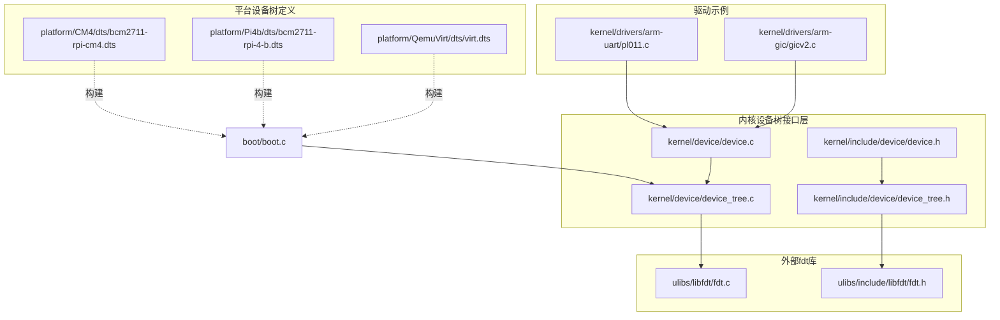
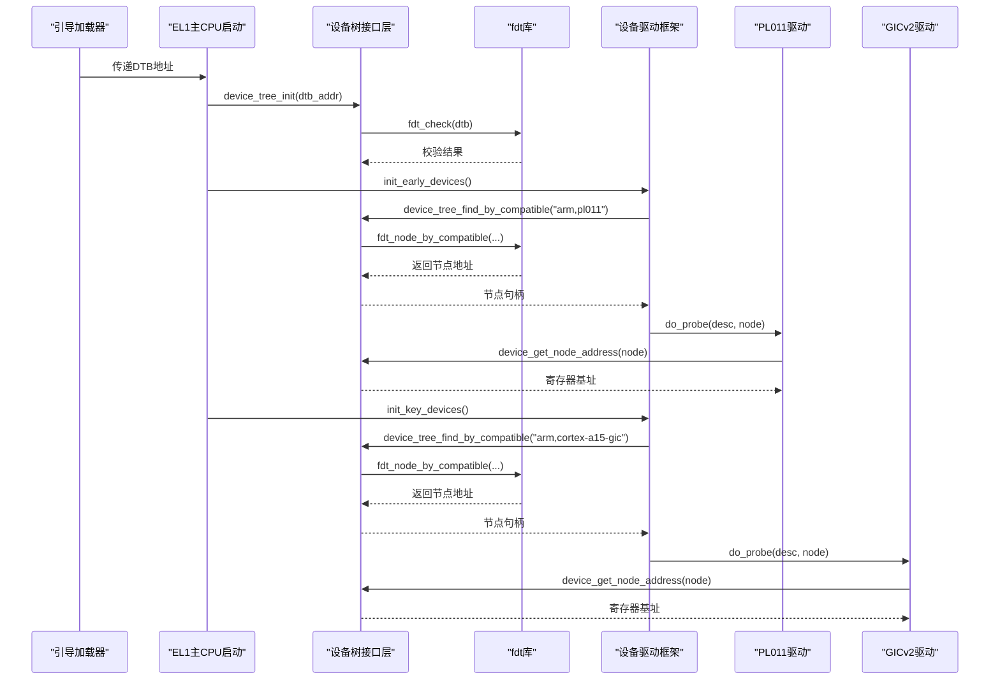
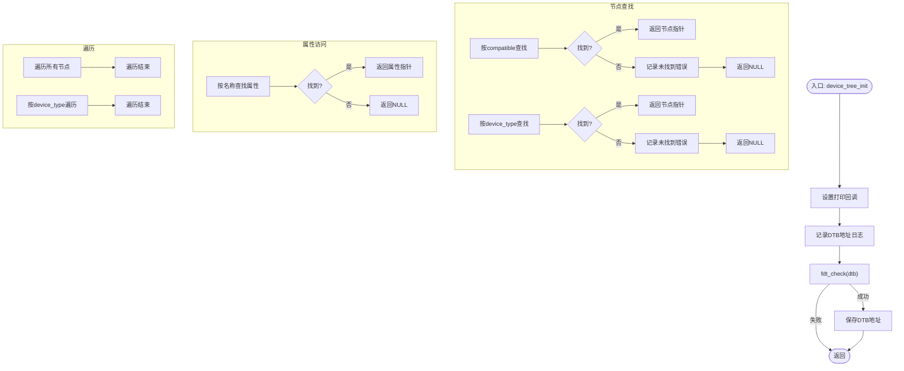
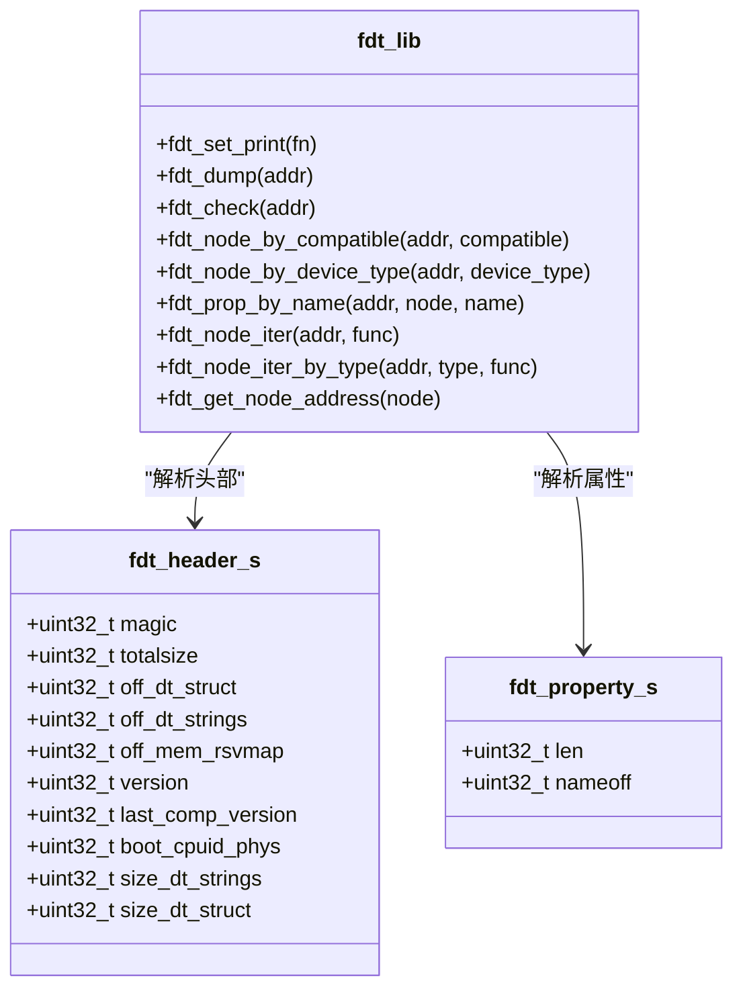
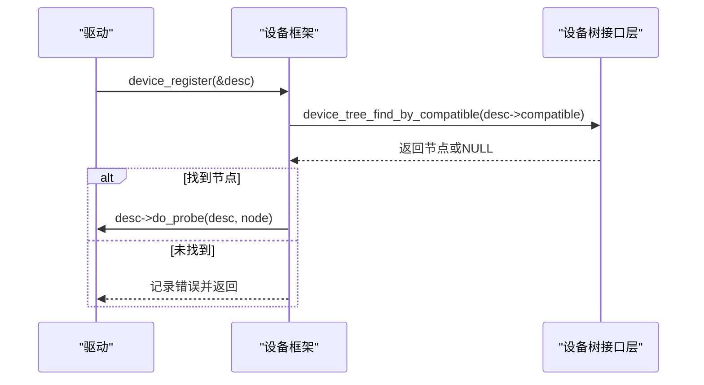
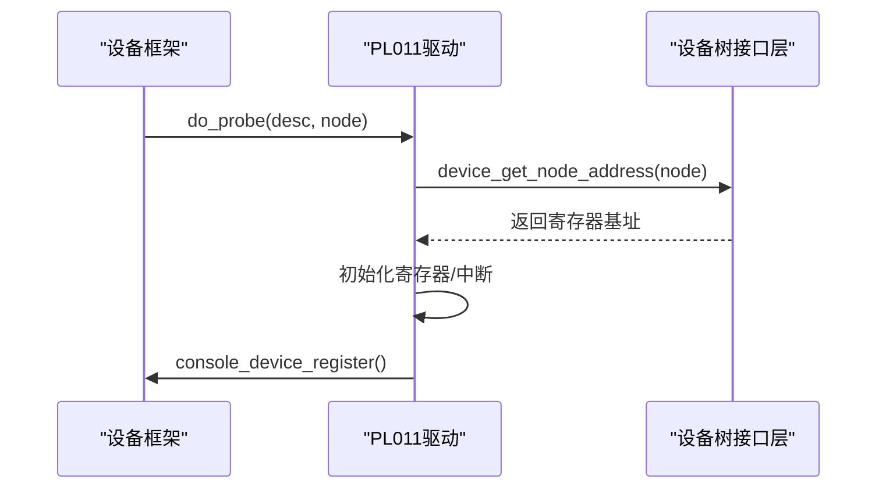
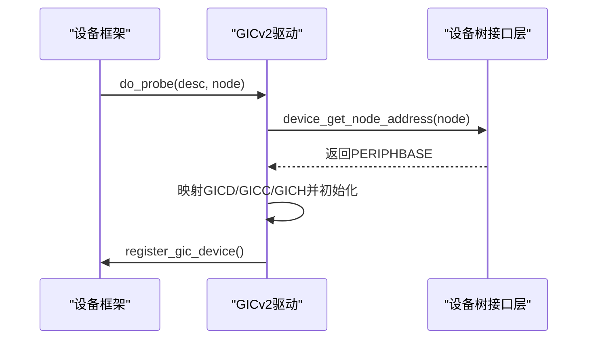
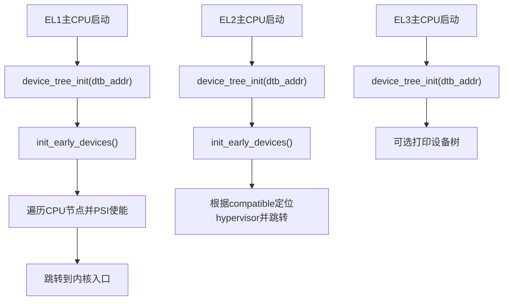
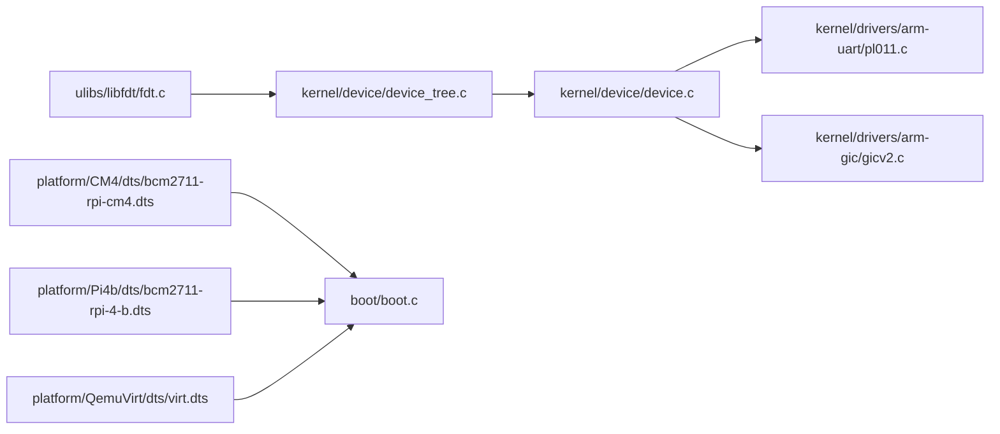

# 设备树支持

<cite>
**本文引用的文件**
- [kernel/device/device_tree.c](file://kernel/device/device_tree.c)
- [kernel/include/device/device_tree.h](file://kernel/include/device/device_tree.h)
- [ulibs/libfdt/fdt.c](file://ulibs/libfdt/fdt.c)
- [ulibs/include/libfdt/fdt.h](file://ulibs/include/libfdt/fdt.h)
- [kernel/device/device.c](file://kernel/device/device.c)
- [kernel/include/device/device.h](file://kernel/include/device/device.h)
- [kernel/drivers/arm-uart/pl011.c](file://kernel/drivers/arm-uart/pl011.c)
- [kernel/drivers/arm-gic/gicv2.c](file://kernel/drivers/arm-gic/gicv2.c)
- [boot/boot.c](file://boot/boot.c)
- [platform/CM4/dts/bcm2711-rpi-cm4.dts](file://platform/CM4/dts/bcm2711-rpi-cm4.dts)
- [platform/Pi4b/dts/bcm2711-rpi-4-b.dts](file://platform/Pi4b/dts/bcm2711-rpi-4-b.dts)
- [platform/QemuVirt/dts/virt.dts](file://platform/QemuVirt/dts/virt.dts)
</cite>

## 目录
1. [简介](#简介)
2. [项目结构](#项目结构)
3. [核心组件](#核心组件)
4. [架构总览](#架构总览)
5. [详细组件分析](#详细组件分析)
6. [依赖关系分析](#依赖关系分析)
7. [性能考虑](#性能考虑)
8. [故障排查指南](#故障排查指南)
9. [结论](#结论)
10. [附录](#附录)

## 简介
本文件系统化梳理TranquilOS的设备树（Device Tree）支持模块，覆盖从设备树初始化、节点与属性解析、遍历与匹配，到与内核驱动框架的集成、跨平台配置与调试实践。文档面向不同技术背景读者，既提供高层架构视图，也给出代码级实现细节与可视化图示，帮助开发者快速理解并高效使用设备树能力。

## 项目结构
TranquilOS的设备树支持由“内核设备树接口层”和“外部fdt库”共同构成，并通过“设备注册与探测框架”与具体驱动对接。平台侧提供多套.dts定义，用于不同硬件平台的设备描述。

图表来源
- [kernel/device/device_tree.c](file://kernel/device/device_tree.c#L1-L95)
- [kernel/include/device/device_tree.h](file://kernel/include/device/device_tree.h#L1-L25)
- [ulibs/libfdt/fdt.c](file://ulibs/libfdt/fdt.c#L1-L334)
- [ulibs/include/libfdt/fdt.h](file://ulibs/include/libfdt/fdt.h#L1-L55)
- [kernel/device/device.c](file://kernel/device/device.c#L1-L54)
- [kernel/include/device/device.h](file://kernel/include/device/device.h#L1-L37)
- [kernel/drivers/arm-uart/pl011.c](file://kernel/drivers/arm-uart/pl011.c#L1-L138)
- [kernel/drivers/arm-gic/gicv2.c](file://kernel/drivers/arm-gic/gicv2.c#L1-L379)
- [boot/boot.c](file://boot/boot.c#L82-L107)
- [platform/CM4/dts/bcm2711-rpi-cm4.dts](file://platform/CM4/dts/bcm2711-rpi-cm4.dts#L1-L800)
- [platform/Pi4b/dts/bcm2711-rpi-4-b.dts](file://platform/Pi4b/dts/bcm2711-rpi-4-b.dts#L1-L800)
- [platform/QemuVirt/dts/virt.dts](file://platform/QemuVirt/dts/virt.dts#L1-L468)

章节来源
- [kernel/device/device_tree.c](file://kernel/device/device_tree.c#L1-L95)
- [ulibs/libfdt/fdt.c](file://ulibs/libfdt/fdt.c#L1-L334)
- [kernel/device/device.c](file://kernel/device/device.c#L1-L54)
- [boot/boot.c](file://boot/boot.c#L82-L107)

## 核心组件
- 设备树接口层：封装fdt库，提供初始化、节点查找、属性读取、节点遍历等API。
- fdt库：对设备树二进制格式进行校验、解析与打印。
- 设备注册框架：基于compatible字符串匹配节点，触发驱动probe函数完成初始化。
- 驱动示例：PL011串口、GICv2中断控制器等，演示如何从设备树读取寄存器地址、中断号等信息。
- 平台定义：多套.dts，覆盖树莓派、QEMU虚拟机等平台。

章节来源
- [kernel/include/device/device_tree.h](file://kernel/include/device/device_tree.h#L1-L25)
- [ulibs/include/libfdt/fdt.h](file://ulibs/include/libfdt/fdt.h#L1-L55)
- [kernel/include/device/device.h](file://kernel/include/device/device.h#L1-L37)

## 架构总览
设备树支持的整体流程：
- 启动阶段：引导加载器将DTB地址传入内核，内核在EL1主CPU路径中调用设备树初始化。
- 设备树解析：初始化后，内核通过fdt库进行魔数校验、结构解析与可选打印。
- 驱动注册：驱动以compatible字符串声明，内核按顺序运行早期、关键、普通设备初始化。
- 节点匹配：根据compatible或device_type在设备树中查找对应节点，读取属性（如reg、interrupts等），完成硬件初始化。

图表来源
- [boot/boot.c](file://boot/boot.c#L82-L107)
- [kernel/device/device_tree.c](file://kernel/device/device_tree.c#L10-L17)
- [ulibs/libfdt/fdt.c](file://ulibs/libfdt/fdt.c#L25-L33)
- [kernel/device/device.c](file://kernel/device/device.c#L13-L26)
- [kernel/drivers/arm-uart/pl011.c](file://kernel/drivers/arm-uart/pl011.c#L92-L125)
- [kernel/drivers/arm-gic/gicv2.c](file://kernel/drivers/arm-gic/gicv2.c#L216-L276)

## 详细组件分析

### 设备树接口层（kernel/device/device_tree.c）
- 初始化与校验：设置打印回调、记录DTB地址、执行魔数校验。
- 节点查找：
  - 按compatible字符串查找首个匹配节点。
  - 按device_type属性查找节点。
- 属性访问：按名称在指定节点下查找属性。
- 遍历：遍历所有节点；按device_type过滤遍历。
- 地址解析：从节点名中的地址段提取物理地址（十六进制字符串）。

图表来源
- [kernel/device/device_tree.c](file://kernel/device/device_tree.c#L10-L95)
- [ulibs/libfdt/fdt.c](file://ulibs/libfdt/fdt.c#L25-L334)

章节来源
- [kernel/device/device_tree.c](file://kernel/device/device_tree.c#L10-L95)

### fdt库（ulibs/libfdt/fdt.c）
- 结构解析：解析头部、结构区、字符串区，按标签（BEGIN_NODE、PROP、END_NODE、END）遍历。
- 校验：检查魔数是否为预期值。
- 打印：递归打印节点与属性，对常见属性进行格式化输出。
- 查找：
  - 按compatible或device_type属性定位节点。
  - 在指定节点范围内按名称查找属性。
- 迭代：遍历所有节点或按device_type过滤遍历。
- 地址解析：从节点名中解析出地址部分（十六进制）。

图表来源
- [ulibs/libfdt/fdt.c](file://ulibs/libfdt/fdt.c#L1-L334)
- [ulibs/include/libfdt/fdt.h](file://ulibs/include/libfdt/fdt.h#L1-L55)

章节来源
- [ulibs/libfdt/fdt.c](file://ulibs/libfdt/fdt.c#L1-L334)
- [ulibs/include/libfdt/fdt.h](file://ulibs/include/libfdt/fdt.h#L1-L55)

### 设备注册与探测框架（kernel/device/device.c）
- 设备描述：包含compatible字符串与probe函数指针。
- 注册流程：根据compatible在设备树中查找节点，若存在则调用驱动的probe函数。
- 属性获取：通过设备树接口层提供的属性查找函数获取节点属性。
- 初始化序列：按优先级分批运行早期、关键、普通设备初始化。

图表来源
- [kernel/device/device.c](file://kernel/device/device.c#L13-L26)
- [kernel/include/device/device.h](file://kernel/include/device/device.h#L18-L30)

章节来源
- [kernel/device/device.c](file://kernel/device/device.c#L1-L54)
- [kernel/include/device/device.h](file://kernel/include/device/device.h#L1-L37)

### 驱动示例：PL011串口（kernel/drivers/arm-uart/pl011.c）
- 兼容性：声明compatible为"arm,pl011"。
- 探针：从设备树节点读取寄存器基址，配置波特率、数据位等，注册控制台设备。
- 中断：注册中断处理函数，便于后续扩展。

图表来源
- [kernel/drivers/arm-uart/pl011.c](file://kernel/drivers/arm-uart/pl011.c#L92-L125)
- [kernel/device/device_tree.c](file://kernel/device/device_tree.c#L82-L95)

章节来源
- [kernel/drivers/arm-uart/pl011.c](file://kernel/drivers/arm-uart/pl011.c#L1-L138)

### 驱动示例：GICv2中断控制器（kernel/drivers/arm-gic/gicv2.c）
- 兼容性：声明compatible为"arm,cortex-a15-gic"或"arm,gic-400"。
- 探针：从设备树节点读取PERIPHBASE，映射GICD/GICC/GICH寄存器，初始化中断控制器。
- 多核：为每个CPU实例化独立的GICC/GICH映射，注册到抽象中断管理器。

图表来源
- [kernel/drivers/arm-gic/gicv2.c](file://kernel/drivers/arm-gic/gicv2.c#L216-L276)
- [kernel/device/device_tree.c](file://kernel/device/device_tree.c#L82-L95)

章节来源
- [kernel/drivers/arm-gic/gicv2.c](file://kernel/drivers/arm-gic/gicv2.c#L1-L379)

### 启动与初始化流程（boot/boot.c）
- EL1主CPU路径：初始化设备树、运行早期设备、遍历CPU节点并通过PSI使能其他CPU。
- EL2/EL3路径：在hypervisor或安全世界中同样初始化设备树，用于平台特定功能。

图表来源
- [boot/boot.c](file://boot/boot.c#L82-L136)

章节来源
- [boot/boot.c](file://boot/boot.c#L82-L136)

## 依赖关系分析
- 内核设备树接口层依赖fdt库，提供更高层的API封装。
- 设备注册框架依赖设备树接口层，用于节点与属性访问。
- 驱动示例依赖设备注册框架与设备树接口层，完成硬件初始化。
- 平台.dts定义通过构建系统生成DTB，供引导加载器注入到内核。

图表来源
- [kernel/device/device_tree.c](file://kernel/device/device_tree.c#L1-L95)
- [ulibs/libfdt/fdt.c](file://ulibs/libfdt/fdt.c#L1-L334)
- [kernel/device/device.c](file://kernel/device/device.c#L1-L54)
- [kernel/drivers/arm-uart/pl011.c](file://kernel/drivers/arm-uart/pl011.c#L1-L138)
- [kernel/drivers/arm-gic/gicv2.c](file://kernel/drivers/arm-gic/gicv2.c#L1-L379)
- [boot/boot.c](file://boot/boot.c#L82-L136)
- [platform/CM4/dts/bcm2711-rpi-cm4.dts](file://platform/CM4/dts/bcm2711-rpi-cm4.dts#L1-L800)
- [platform/Pi4b/dts/bcm2711-rpi-4-b.dts](file://platform/Pi4b/dts/bcm2711-rpi-4-b.dts#L1-L800)
- [platform/QemuVirt/dts/virt.dts](file://platform/QemuVirt/dts/virt.dts#L1-L468)

章节来源
- [kernel/device/device_tree.c](file://kernel/device/device_tree.c#L1-L95)
- [ulibs/libfdt/fdt.c](file://ulibs/libfdt/fdt.c#L1-L334)
- [kernel/device/device.c](file://kernel/device/device.c#L1-L54)

## 性能考虑
- 设备树解析复杂度：线性扫描结构区，时间复杂度O(N)，N为设备树节点与属性数量。建议仅在启动阶段执行，避免频繁重复解析。
- 字符串查找：字符串表偏移通过nameoff索引，查找开销较小。
- 遍历策略：按需遍历（如按device_type）可减少无谓扫描。
- 缓存与复用：DTB地址在内核生命周期内缓存，避免重复校验。

## 故障排查指南
- DTB地址为0：初始化前未正确传入DTB地址或未调用初始化函数。
- 设备树未找到compatible：确认.dts中节点的compatible字符串与驱动一致。
- 设备树未找到device_type：确认.dts中节点的device_type属性值。
- 属性未找到：确认属性名称拼写与.dts一致，且节点确实存在该属性。
- 地址解析异常：确认节点名中包含地址段，且为十六进制格式。
- 打印调试：可启用设备树打印功能，观察结构与关键属性。

章节来源
- [kernel/device/device_tree.c](file://kernel/device/device_tree.c#L25-L95)
- [ulibs/libfdt/fdt.c](file://ulibs/libfdt/fdt.c#L35-L97)

## 结论
TranquilOS的设备树支持以简洁清晰的接口层封装底层fdt库，结合设备注册框架实现了“声明式”的驱动发现与初始化。通过compatible与device_type匹配，内核能够自动识别并初始化硬件资源，同时保留了良好的可移植性与可扩展性。配合多平台.dts定义，可在树莓派、QEMU等多种硬件上稳定运行。

## 附录

### API使用指南（概要）
- 初始化与校验
  - device_tree_init(dtb_addr)：设置打印回调、记录DTB地址、执行魔数校验。
  - device_tree_dump()：打印设备树结构（调试用）。
- 节点查找
  - device_tree_find_by_compatible(compatible)：按compatible查找节点。
  - device_tree_find_by_device_type(type)：按device_type查找节点。
- 属性访问
  - device_tree_find_prop_by_name(node, name)：在指定节点下按名称查找属性。
- 遍历
  - device_tree_iter_node(func)：遍历所有节点。
  - device_tree_iter_node_by_type(type, func)：按device_type过滤遍历。
- 地址解析
  - device_get_node_address(node)：从节点名解析物理地址。
- 驱动集成
  - device_register(&desc)：注册驱动，触发匹配与探测。
  - device_get_property(node, name)：获取节点属性。

章节来源
- [kernel/include/device/device_tree.h](file://kernel/include/device/device_tree.h#L12-L22)
- [kernel/device/device_tree.c](file://kernel/device/device_tree.c#L10-L95)
- [kernel/include/device/device.h](file://kernel/include/device/device.h#L18-L30)
- [kernel/device/device.c](file://kernel/device/device.c#L13-L30)

### 平台配置要点
- 树莓派Compute Module 4（CM4）
  - 关注soc、gpio、uart、i2c、spi等节点的compatible与reg配置。
  - aliases节点提供常用外设别名，便于驱动引用。
- Raspberry Pi 4 Model B（Pi4b）
  - 包含更多内存与外设资源，注意dma-ranges与ranges配置。
  - 提供stdout-path等引导参数。
- QEMU虚拟机（virt）
  - 使用虚拟中断控制器与虚拟外设，便于开发与测试。
  - 提供fw-cfg、virtio_mmio等虚拟设备节点。

章节来源
- [platform/CM4/dts/bcm2711-rpi-cm4.dts](file://platform/CM4/dts/bcm2711-rpi-cm4.dts#L1-L800)
- [platform/Pi4b/dts/bcm2711-rpi-4-b.dts](file://platform/Pi4b/dts/bcm2711-rpi-4-b.dts#L1-L800)
- [platform/QemuVirt/dts/virt.dts](file://platform/QemuVirt/dts/virt.dts#L1-L468)