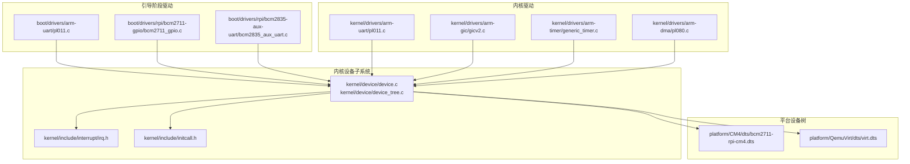
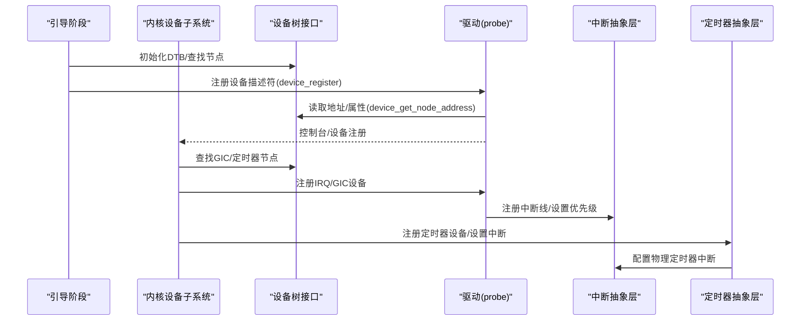
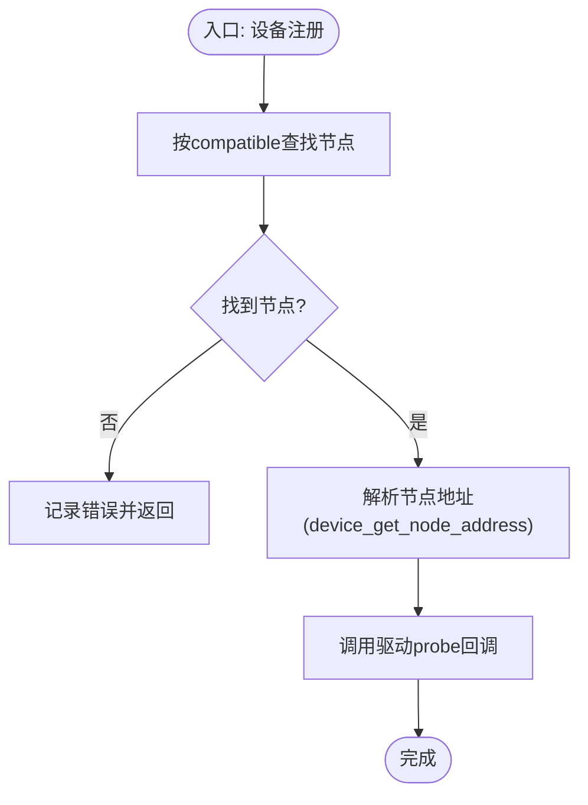
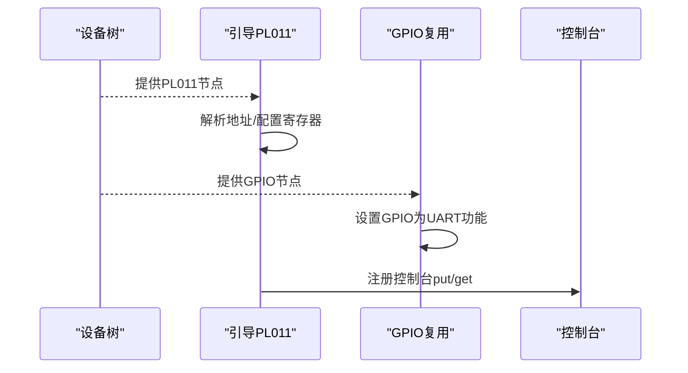
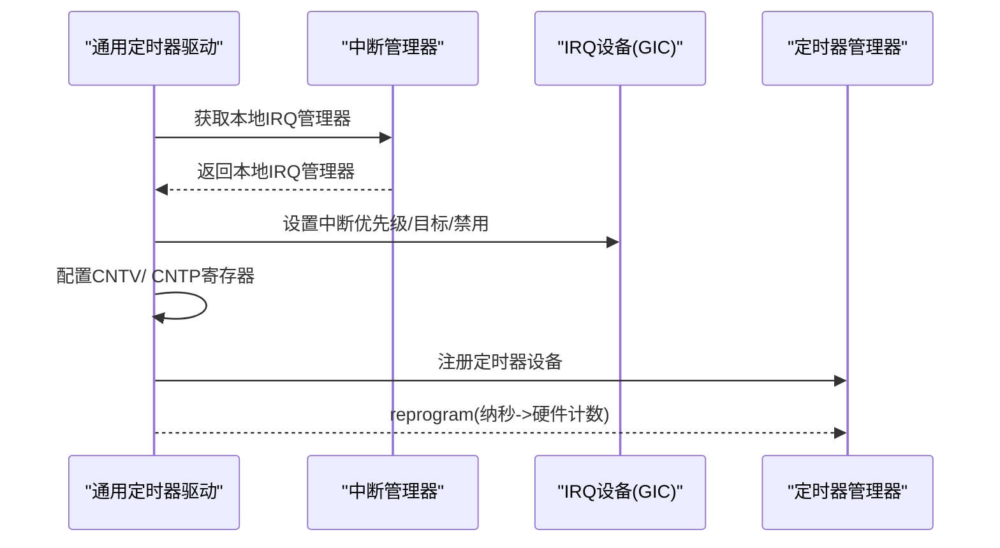
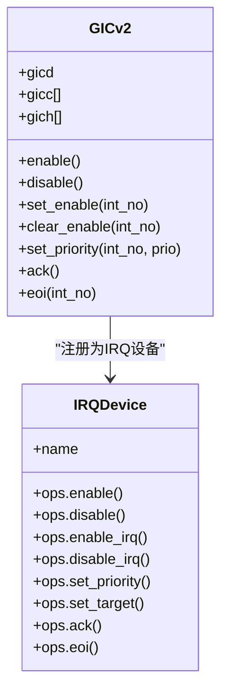
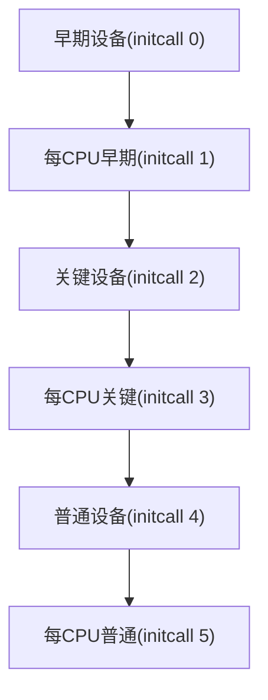
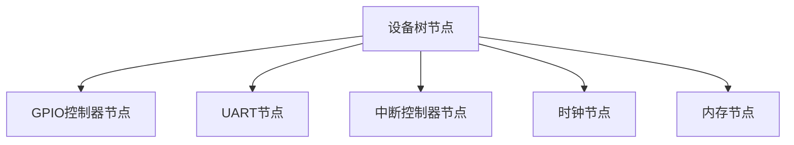
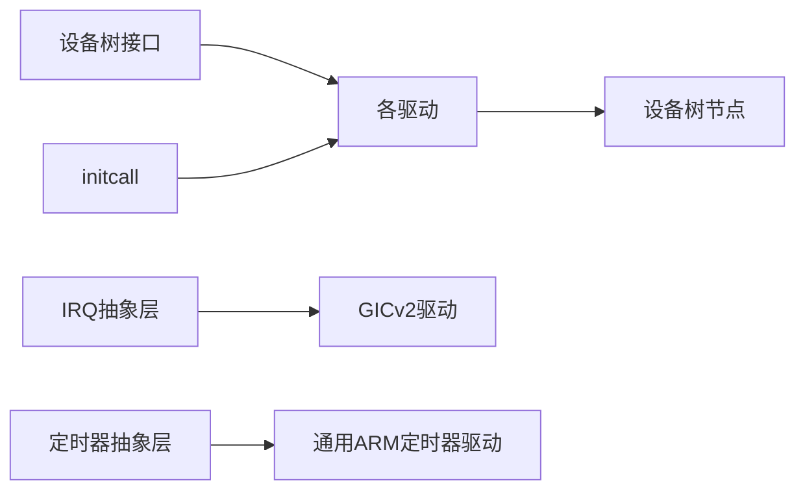

# 设备驱动框架

<cite>
**本文引用的文件**
- [kernel/device/device_tree.c](file://kernel/device/device_tree.c)
- [kernel/device/device.c](file://kernel/device/device.c)
- [kernel/include/device/device_tree.h](file://kernel/include/device/device_tree.h)
- [kernel/include/device/device.h](file://kernel/include/device/device.h)
- [kernel/include/initcall.h](file://kernel/include/initcall.h)
- [kernel/include/interrupt/irq.h](file://kernel/include/interrupt/irq.h)
- [kernel/drivers/arm-gic/gicv2.c](file://kernel/drivers/arm-gic/gicv2.c)
- [kernel/drivers/arm-timer/generic_timer.c](file://kernel/drivers/arm-timer/generic_timer.c)
- [kernel/drivers/arm-uart/pl011.c](file://kernel/drivers/arm-uart/pl011.c)
- [boot/drivers/arm-uart/pl011.c](file://boot/drivers/arm-uart/pl011.c)
- [boot/drivers/rpi/bcm2711-gpio/bcm2711_gpio.c](file://boot/drivers/rpi/bcm2711-gpio/bcm2711_gpio.c)
- [boot/drivers/rpi/bcm2835-aux-uart/bcm2835_aux_uart.c](file://boot/drivers/rpi/bcm2835-aux-uart/bcm2835_aux_uart.c)
- [kernel/drivers/arm-dma/pl080.c](file://kernel/drivers/arm-dma/pl080.c)
- [platform/CM4/dts/bcm2711-rpi-cm4.dts](file://platform/CM4/dts/bcm2711-rpi-cm4.dts)
- [platform/QemuVirt/dts/virt.dts](file://platform/QemuVirt/dts/virt.dts)
</cite>

## 目录
1. [简介](#简介)
2. [项目结构](#项目结构)
3. [核心组件](#核心组件)
4. [架构总览](#架构总览)
5. [详细组件分析](#详细组件分析)
6. [依赖关系分析](#依赖关系分析)
7. [性能考量](#性能考量)
8. [故障排查指南](#故障排查指南)
9. [结论](#结论)
10. [附录：驱动开发指南与最佳实践](#附录驱动开发指南与最佳实践)

## 简介
本文件面向TranquilOS设备驱动框架，系统化阐述设备树支持、设备发现机制、平台特定配置与ARM平台驱动实现（UART、GPIO、时钟与定时器、DMA、中断控制器等）。文档同时提供驱动接口规范、注册机制与生命周期管理说明，并给出设备树解析流程、硬件抽象层设计思路与跨平台兼容策略。最后提供可操作的开发示例与常见问题排查方法，兼顾驱动开发者与系统集成工程师的需求。

## 项目结构
TranquilOS采用“内核态驱动 + 引导阶段驱动”的分层组织方式：
- 内核态驱动位于 kernel/drivers，负责通用设备初始化与系统关键路径（如GIC、通用定时器）。
- 引导阶段驱动位于 boot/drivers，用于早期硬件准备（如PL011、GPIO复用、辅助UART）。
- 平台设备树位于 platform/*/dts，描述具体SoC/板级资源布局与外设节点。

**图示来源**
- [kernel/device/device.c](file://kernel/device/device.c#L1-L55)
- [kernel/device/device_tree.c](file://kernel/device/device_tree.c#L1-L95)
- [kernel/include/device/device.h](file://kernel/include/device/device.h#L1-L37)
- [kernel/include/device/device_tree.h](file://kernel/include/device/device_tree.h#L1-L25)
- [kernel/include/initcall.h](file://kernel/include/initcall.h#L1-L44)
- [kernel/include/interrupt/irq.h](file://kernel/include/interrupt/irq.h#L1-L38)
- [kernel/drivers/arm-gic/gicv2.c](file://kernel/drivers/arm-gic/gicv2.c#L1-L379)
- [kernel/drivers/arm-timer/generic_timer.c](file://kernel/drivers/arm-timer/generic_timer.c#L1-L284)
- [kernel/drivers/arm-uart/pl011.c](file://kernel/drivers/arm-uart/pl011.c#L1-L138)
- [boot/drivers/arm-uart/pl011.c](file://boot/drivers/arm-uart/pl011.c#L1-L95)
- [boot/drivers/rpi/bcm2711-gpio/bcm2711_gpio.c](file://boot/drivers/rpi/bcm2711-gpio/bcm2711_gpio.c#L1-L67)
- [boot/drivers/rpi/bcm2835-aux-uart/bcm2835_aux_uart.c](file://boot/drivers/rpi/bcm2835-aux-uart/bcm2835_aux_uart.c#L1-L37)
- [kernel/drivers/arm-dma/pl080.c](file://kernel/drivers/arm-dma/pl080.c#L1-L20)
- [platform/CM4/dts/bcm2711-rpi-cm4.dts](file://platform/CM4/dts/bcm2711-rpi-cm4.dts#L1-L2622)
- [platform/QemuVirt/dts/virt.dts](file://platform/QemuVirt/dts/virt.dts#L1-L468)

**章节来源**
- [kernel/device/device.c](file://kernel/device/device.c#L1-L55)
- [kernel/device/device_tree.c](file://kernel/device/device_tree.c#L1-L95)
- [platform/CM4/dts/bcm2711-rpi-cm4.dts](file://platform/CM4/dts/bcm2711-rpi-cm4.dts#L1-L2622)
- [platform/QemuVirt/dts/virt.dts](file://platform/QemuVirt/dts/virt.dts#L1-L468)

## 核心组件
- 设备树接口与解析
  - 提供DTB初始化、节点查找（按compatible或device_type）、属性读取、遍历等能力。
  - 支持打印设备树以辅助诊断。
- 设备注册与生命周期
  - 定义设备描述符与探测回调；通过initcall机制在不同阶段执行设备初始化。
  - 按“早期/关键/普通”等优先级分层注册，保证关键路径先于普通设备完成。
- 中断与定时器抽象
  - 通过IRQ抽象层注册中断设备（如GIC），并为定时器提供统一的计数/频率读取与重编程接口。
- 平台特定驱动
  - 引导阶段：PL011、GPIO复用、辅助UART。
  - 内核阶段：GICv2、通用ARM定时器、PL011控制台、DMA控制器占位。

**章节来源**
- [kernel/include/device/device_tree.h](file://kernel/include/device/device_tree.h#L1-L25)
- [kernel/device/device_tree.c](file://kernel/device/device_tree.c#L1-L95)
- [kernel/include/device/device.h](file://kernel/include/device/device.h#L1-L37)
- [kernel/device/device.c](file://kernel/device/device.c#L1-L55)
- [kernel/include/initcall.h](file://kernel/include/initcall.h#L1-L44)
- [kernel/include/interrupt/irq.h](file://kernel/include/interrupt/irq.h#L1-L38)

## 架构总览
下图展示从设备树到驱动注册与初始化的关键流程，以及关键抽象层之间的交互。

**图示来源**
- [kernel/device/device.c](file://kernel/device/device.c#L13-L26)
- [kernel/device/device_tree.c](file://kernel/device/device_tree.c#L25-L68)
- [kernel/drivers/arm-gic/gicv2.c](file://kernel/drivers/arm-gic/gicv2.c#L216-L276)
- [kernel/drivers/arm-timer/generic_timer.c](file://kernel/drivers/arm-timer/generic_timer.c#L174-L186)
- [kernel/include/interrupt/irq.h](file://kernel/include/interrupt/irq.h#L23-L35)

## 详细组件分析

### 设备树解析与设备发现
- 初始化与查询
  - 初始化DTB地址，检查有效性；支持dump输出与节点迭代。
  - 按compatible或device_type定位节点；按名称查找属性。
- 地址解析
  - 从节点字符串中解析基地址，用于后续内存映射与寄存器访问。
- 设备发现
  - 驱动通过device_register传入compatible字符串，由设备树接口匹配对应节点并调用probe。

**图示来源**
- [kernel/device/device.c](file://kernel/device/device.c#L13-L26)
- [kernel/device/device_tree.c](file://kernel/device/device_tree.c#L25-L68)
- [kernel/include/device/device_tree.h](file://kernel/include/device/device_tree.h#L19-L22)

**章节来源**
- [kernel/device/device_tree.c](file://kernel/device/device_tree.c#L1-L95)
- [kernel/device/device.c](file://kernel/device/device.c#L1-L55)

### ARM平台驱动实现

#### UART驱动（PL011）
- 引导阶段PL011
  - 通过device_get_node_address获取寄存器基址，配置波特率、FIFO与控制寄存器，注册控制台设备。
- 内核阶段PL011
  - 在引导阶段基础上增加中断注册与处理框架，便于后续扩展为完整串口驱动。
- RPi GPIO复用
  - 将GPIO引脚切换为UART功能，配合PL011使用。
- 辅助UART（bcm2835-aux）
  - 通过辅助外设块初始化Mini UART，适配树莓派早期硬件。

**图示来源**
- [boot/drivers/arm-uart/pl011.c](file://boot/drivers/arm-uart/pl011.c#L51-L83)
- [kernel/drivers/arm-uart/pl011.c](file://kernel/drivers/arm-uart/pl011.c#L92-L125)
- [boot/drivers/rpi/bcm2711-gpio/bcm2711_gpio.c](file://boot/drivers/rpi/bcm2711-gpio/bcm2711_gpio.c#L49-L53)
- [boot/drivers/rpi/bcm2835-aux-uart/bcm2835_aux_uart.c](file://boot/drivers/rpi/bcm2835-aux-uart/bcm2835_aux_uart.c#L19-L23)

**章节来源**
- [boot/drivers/arm-uart/pl011.c](file://boot/drivers/arm-uart/pl011.c#L1-L95)
- [kernel/drivers/arm-uart/pl011.c](file://kernel/drivers/arm-uart/pl011.c#L1-L138)
- [boot/drivers/rpi/bcm2711-gpio/bcm2711_gpio.c](file://boot/drivers/rpi/bcm2711-gpio/bcm2711_gpio.c#L1-L67)
- [boot/drivers/rpi/bcm2835-aux-uart/bcm2835_aux_uart.c](file://boot/drivers/rpi/bcm2835-aux-uart/bcm2835_aux_uart.c#L1-L37)

#### GPIO控制器
- 功能
  - 提供GPIO复用选择与引脚功能配置，典型用于UART、SPI、I2C等外设引脚分配。
- 实现要点
  - 基于设备树节点地址映射寄存器，按引脚号计算寄存器索引与位偏移，写入功能字段。

**章节来源**
- [boot/drivers/rpi/bcm2711-gpio/bcm2711_gpio.c](file://boot/drivers/rpi/bcm2711-gpio/bcm2711_gpio.c#L1-L67)

#### 时钟与定时器
- 通用ARM定时器
  - 通过系统寄存器读取计数器与频率，配置物理定时器中断，注册定时器设备。
  - 提供重编程接口，将纳秒时间转换为硬件计数并写入比较寄存器。
- 伪RTC
  - 基于定时器计数器实现开机以来的时间戳服务。

**图示来源**
- [kernel/drivers/arm-timer/generic_timer.c](file://kernel/drivers/arm-timer/generic_timer.c#L57-L150)
- [kernel/drivers/arm-timer/generic_timer.c](file://kernel/drivers/arm-timer/generic_timer.c#L174-L186)
- [kernel/include/interrupt/irq.h](file://kernel/include/interrupt/irq.h#L23-L35)

**章节来源**
- [kernel/drivers/arm-timer/generic_timer.c](file://kernel/drivers/arm-timer/generic_timer.c#L1-L284)

#### 中断控制器（GICv2）
- 功能
  - 映射GIC寄存器（分布器与CPU接口），初始化中断使能、挂起、活跃状态与优先级。
  - 向IRQ抽象层注册GIC设备，提供使能/禁用、优先级设置、EOI等操作。
- 实现要点
  - 依据设备树节点地址映射GIC寄存器，按中断号计算寄存器索引与位偏移。
  - 在早期阶段完成GIC分布器初始化，在每CPU阶段完成GICC/GICH映射与启用。

**图示来源**
- [kernel/drivers/arm-gic/gicv2.c](file://kernel/drivers/arm-gic/gicv2.c#L15-L199)
- [kernel/drivers/arm-gic/gicv2.c](file://kernel/drivers/arm-gic/gicv2.c#L216-L276)
- [kernel/drivers/arm-gic/gicv2.c](file://kernel/drivers/arm-gic/gicv2.c#L296-L357)

**章节来源**
- [kernel/drivers/arm-gic/gicv2.c](file://kernel/drivers/arm-gic/gicv2.c#L1-L379)

#### DMA控制器（PL080）
- 当前实现
  - 占位注册，尚未实现具体功能；可用于后续扩展DMA通道管理与中断处理。

**章节来源**
- [kernel/drivers/arm-dma/pl080.c](file://kernel/drivers/arm-dma/pl080.c#L1-L20)

### 设备驱动接口规范与生命周期

#### 接口规范
- 设备描述符
  - 包含compatible字符串与probe回调函数指针。
- 设备属性访问
  - 通过device_get_property按名称获取属性值。
- 控制台接口
  - UART驱动实现put/get接口，注册为控制台设备，供内核打印与输入使用。

**章节来源**
- [kernel/include/device/device.h](file://kernel/include/device/device.h#L18-L30)
- [kernel/include/device/device_tree.h](file://kernel/include/device/device_tree.h#L10-L10)
- [kernel/drivers/arm-uart/pl011.c](file://kernel/drivers/arm-uart/pl011.c#L44-L52)

#### 注册机制与生命周期
- initcall级别
  - 早期设备、每CPU早期设备、关键设备、每CPU关键设备、普通设备、每CPU普通设备。
- 执行顺序
  - 通过initcall_run按级别顺序执行，确保关键路径优先完成。

**图示来源**
- [kernel/include/initcall.h](file://kernel/include/initcall.h#L7-L12)
- [kernel/device/device.c](file://kernel/device/device.c#L32-L54)

**章节来源**
- [kernel/include/initcall.h](file://kernel/include/initcall.h#L1-L44)
- [kernel/device/device.c](file://kernel/device/device.c#L1-L55)

### 平台特定配置与设备树解析
- Raspberry Pi Compute Module 4
  - 设备树定义了GPIO、UART、DMA、Mailbox、定时器、时钟等节点，包含引脚复用与功能选择片段。
- QEMU虚拟平台
  - 设备树定义了GIC、PL011、PL031 RTC、PCIe、CPU等节点，便于在虚拟机上验证驱动与中断路径。

**图示来源**
- [platform/CM4/dts/bcm2711-rpi-cm4.dts](file://platform/CM4/dts/bcm2711-rpi-cm4.dts#L166-L177)
- [platform/CM4/dts/bcm2711-rpi-cm4.dts](file://platform/CM4/dts/bcm2711-rpi-cm4.dts#L132-L139)
- [platform/QemuVirt/dts/virt.dts](file://platform/QemuVirt/dts/virt.dts#L363-L379)
- [platform/QemuVirt/dts/virt.dts](file://platform/QemuVirt/dts/virt.dts#L350-L356)

**章节来源**
- [platform/CM4/dts/bcm2711-rpi-cm4.dts](file://platform/CM4/dts/bcm2711-rpi-cm4.dts#L1-L2622)
- [platform/QemuVirt/dts/virt.dts](file://platform/QemuVirt/dts/virt.dts#L1-L468)

## 依赖关系分析
- 组件耦合
  - 设备树接口被所有驱动依赖，驱动通过设备描述符与initcall与设备子系统解耦。
  - 中断与定时器抽象层向上屏蔽具体中断控制器差异，向下通过IRQ设备接口对接。
- 外部依赖
  - 设备树二进制解析库（libfdt）封装在设备树接口内部。
  - ARM体系寄存器访问宏与系统调用接口用于定时器与GIC寄存器操作。

**图示来源**
- [kernel/device/device_tree.c](file://kernel/device/device_tree.c#L1-L95)
- [kernel/device/device.c](file://kernel/device/device.c#L1-L55)
- [kernel/include/initcall.h](file://kernel/include/initcall.h#L1-L44)
- [kernel/include/interrupt/irq.h](file://kernel/include/interrupt/irq.h#L1-L38)
- [kernel/drivers/arm-gic/gicv2.c](file://kernel/drivers/arm-gic/gicv2.c#L1-L379)
- [kernel/drivers/arm-timer/generic_timer.c](file://kernel/drivers/arm-timer/generic_timer.c#L1-L284)

**章节来源**
- [kernel/device/device_tree.c](file://kernel/device/device_tree.c#L1-L95)
- [kernel/device/device.c](file://kernel/device/device.c#L1-L55)
- [kernel/include/interrupt/irq.h](file://kernel/include/interrupt/irq.h#L1-L38)

## 性能考量
- 中断延迟与抖动
  - 合理设置中断优先级与目标CPU，避免高优先级中断抢占导致抖动。
- 定时器重编程
  - 在重编程时预留最小安全间隔，避免因硬件计数接近当前值而错过中断。
- 资源映射与缓存一致性
  - 对外设寄存器映射应考虑缓存一致性，必要时使用非缓存映射或屏障指令。

[本节为通用指导，无需列出章节来源]

## 故障排查指南
- 设备树相关
  - DTB地址为0或校验失败：确认引导参数正确传递DTB地址，检查设备树dump输出。
  - 节点未找到：核对compatible字符串与设备树节点一致。
- UART无输出/无法接收
  - 检查GPIO是否正确复用为UART功能；确认PL011寄存器配置（波特率、FIFO、控制位）。
  - 若使用辅助UART，确认Mini UART初始化序列正确。
- 中断不触发
  - 检查GIC是否启用、中断优先级与目标设置；确认IRQ设备已注册且中断线映射正确。
- 定时器不工作
  - 检查物理定时器中断是否启用，比较寄存器是否正确写入；确认系统频率读取正常。

**章节来源**
- [kernel/device/device_tree.c](file://kernel/device/device_tree.c#L10-L23)
- [boot/drivers/rpi/bcm2711-gpio/bcm2711_gpio.c](file://boot/drivers/rpi/bcm2711-gpio/bcm2711_gpio.c#L49-L53)
- [kernel/drivers/arm-gic/gicv2.c](file://kernel/drivers/arm-gic/gicv2.c#L139-L151)
- [kernel/drivers/arm-timer/generic_timer.c](file://kernel/drivers/arm-timer/generic_timer.c#L119-L150)

## 结论
TranquilOS设备驱动框架通过设备树抽象与initcall分层机制，实现了平台无关的设备发现与初始化流程。内核态与引导态驱动分工明确：引导态负责早期硬件准备（UART、GPIO、辅助外设），内核态负责关键系统路径（GIC、定时器）。借助IRQ与定时器抽象层，驱动可在不同平台上保持一致的接口与行为。未来可在此基础上扩展DMA、存储控制器与更多外设驱动，持续提升跨平台兼容性与可维护性。

[本节为总结，无需列出章节来源]

## 附录：驱动开发指南与最佳实践

### 开发步骤
- 设计设备描述符
  - 准确填写compatible字符串，确保与设备树节点匹配。
- 实现probe
  - 解析节点地址与属性，完成寄存器映射与基本初始化。
  - 注册控制台/定时器/中断等子系统对象。
- 分层注册
  - 根据初始化依赖关系选择合适initcall级别（早期/关键/普通）。
- 平台验证
  - 使用对应平台设备树进行功能验证，关注中断、时钟与电源域。

### 接口与数据结构建议
- 设备描述符
  - 字段：compatible、do_probe。
- 属性访问
  - 使用device_get_property按名称获取属性值，避免硬编码。
- 中断处理
  - 通过IRQ抽象层注册中断，遵循同步处理模式，及时EOI。

### 跨平台兼容性
- 设备树命名
  - 保持compatible字符串稳定，避免频繁变更。
- 寄存器访问
  - 使用系统寄存器宏与抽象层接口，减少对具体寄存器布局的依赖。
- 平台差异化
  - 通过设备树节点属性区分平台差异（如时钟频率、中断号），在驱动中做条件分支。

### 示例与模板
- UART驱动模板
  - 参考引导阶段PL011与内核阶段PL011实现，结合GPIO复用与控制台注册。
- GIC驱动模板
  - 参考GICv2驱动的寄存器映射与IRQ设备注册流程。
- 定时器驱动模板
  - 参考通用ARM定时器驱动的系统寄存器访问与重编程逻辑。

**章节来源**
- [kernel/include/device/device.h](file://kernel/include/device/device.h#L18-L30)
- [kernel/include/initcall.h](file://kernel/include/initcall.h#L19-L34)
- [boot/drivers/arm-uart/pl011.c](file://boot/drivers/arm-uart/pl011.c#L85-L93)
- [kernel/drivers/arm-gic/gicv2.c](file://kernel/drivers/arm-gic/gicv2.c#L201-L214)
- [kernel/drivers/arm-timer/generic_timer.c](file://kernel/drivers/arm-timer/generic_timer.c#L160-L172)