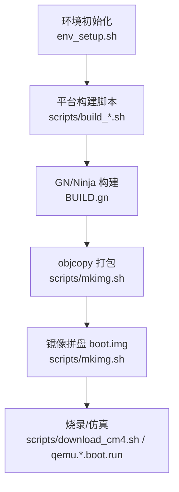
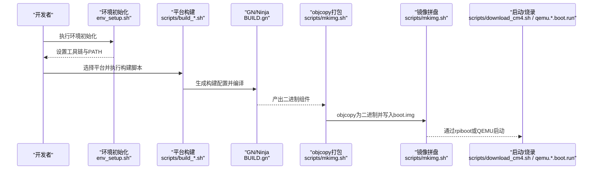
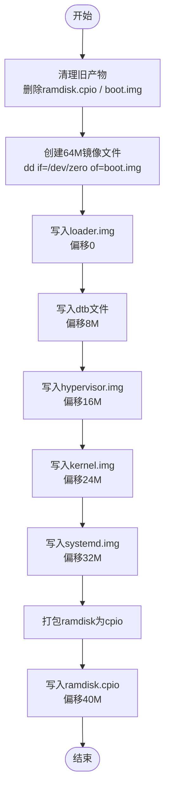
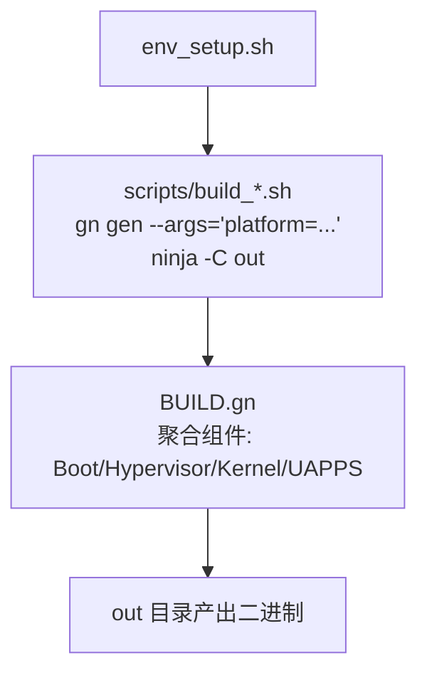
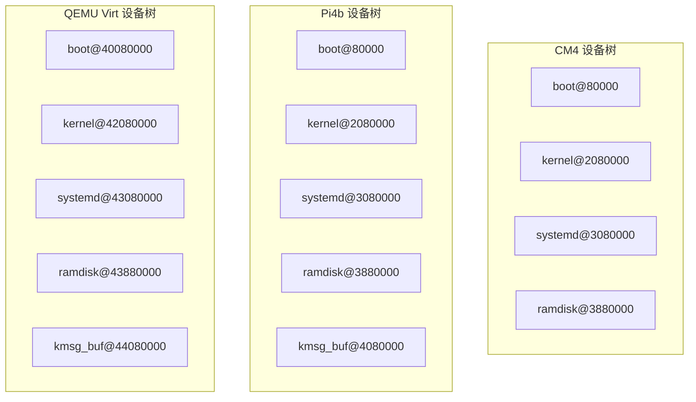
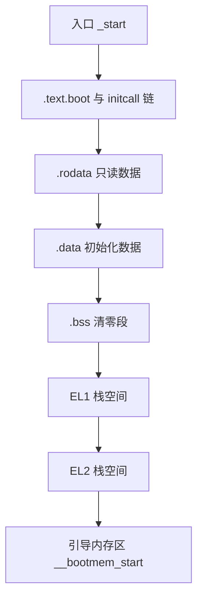
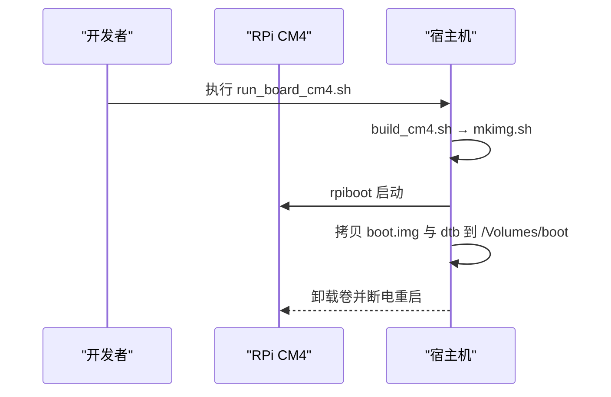
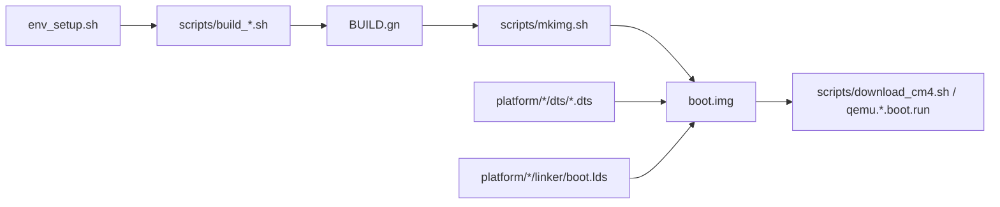

# 部署与运维

<cite>
**本文引用的文件**
- [README.md](file://README.md)
- [env_setup.sh](file://env_setup.sh)
- [scripts/build_cm4.sh](file://scripts/build_cm4.sh)
- [scripts/build_pi3b.sh](file://scripts/build_pi3b.sh)
- [scripts/build_pi4b.sh](file://scripts/build_pi4b.sh)
- [scripts/build_qemu.sh](file://scripts/build_qemu.sh)
- [scripts/mkimg.sh](file://scripts/mkimg.sh)
- [scripts/download_cm4.sh](file://scripts/download_cm4.sh)
- [scripts/qemu.virt.boot.run](file://scripts/qemu.virt.boot.run)
- [run_board_cm4.sh](file://run_board_cm4.sh)
- [run_qemu_virt.sh](file://run_qemu_virt.sh)
- [run_qemu_pi3b.sh](file://run_qemu_pi3b.sh)
- [run_qemu_pi4b.sh](file://run_qemu_pi4b.sh)
- [platform/CM4/dts/bcm2711-rpi-cm4.dts](file://platform/CM4/dts/bcm2711-rpi-cm4.dts)
- [platform/Pi4b/dts/bcm2711-rpi-4-b.dts](file://platform/Pi4b/dts/bcm2711-rpi-4-b.dts)
- [platform/QemuVirt/dts/virt.dts](file://platform/QemuVirt/dts/virt.dts)
- [platform/CM4/linker/boot.lds](file://platform/CM4/linker/boot.lds)
- [BUILD.gn](file://BUILD.gn)
</cite>

## 目录
1. [简介](#简介)
2. [项目结构](#项目结构)
3. [核心组件](#核心组件)
4. [架构总览](#架构总览)
5. [详细组件分析](#详细组件分析)
6. [依赖关系分析](#依赖关系分析)
7. [性能考虑](#性能考虑)
8. [故障排查指南](#故障排查指南)
9. [结论](#结论)
10. [附录](#附录)

## 简介
本文件面向系统管理员与产品部署工程师，提供TranquilOS从镜像制作到部署、运维监控、升级维护与故障诊断的全流程指导。内容覆盖：
- 系统镜像制作流程与工具使用（GN/Ninja构建、objcopy打包、dd拼盘、cpio打包ramdisk）
- 烧录工具配置与硬件准备要求（以RPi Compute Module为例）
- 不同平台的部署策略与注意事项（树莓派4B、树莓派3B、QEMU虚拟机）
- 运维监控、错误处理与故障诊断方法
- 升级与维护最佳实践
- 常见问题与解决方案

## 项目结构
TranquilOS采用GN/Ninja构建系统，按“内核/引导/系统守护”分层产出可启动镜像，并通过脚本完成镜像拼盘与烧录。关键目录与文件：
- scripts：构建与打包脚本（build_*、mkimg.sh、download_cm4.sh、qemu.*.boot.run）
- platform：各平台设备树与链接器脚本（CM4、Pi3b、Pi4b、QemuVirt）
- out：构建产物输出目录（由GN生成）
- ramdisk：用户态服务打包目录（用于生成cpio）

**图示来源**
- [env_setup.sh](file://env_setup.sh#L1-L5)
- [scripts/build_cm4.sh](file://scripts/build_cm4.sh#L1-L6)
- [BUILD.gn](file://BUILD.gn#L1-L9)
- [scripts/mkimg.sh](file://scripts/mkimg.sh#L1-L38)
- [scripts/download_cm4.sh](file://scripts/download_cm4.sh#L1-L27)
- [scripts/qemu.virt.boot.run](file://scripts/qemu.virt.boot.run#L1-L19)

**章节来源**
- [README.md](file://README.md#L35-L42)
- [env_setup.sh](file://env_setup.sh#L1-L5)
- [BUILD.gn](file://BUILD.gn#L1-L9)

## 核心组件
- 构建与打包链路
  - 环境初始化：设置工具链与GN路径
  - 平台构建：根据平台参数生成构建配置并编译
  - 镜像打包：将各组件objcopy为二进制并拼盘为boot.img
  - 烧录/仿真：通过rpiboot或QEMU启动
- 设备树与链接器
  - 各平台dts定义内存布局与分区映射
  - boot.lds定义引导阶段内存与栈布局
- 用户态服务打包
  - 将DevMgr、FSMgr、NetMgr、Idle、Shell等服务打包为cpio，作为ramdisk注入

**章节来源**
- [scripts/mkimg.sh](file://scripts/mkimg.sh#L1-L38)
- [platform/CM4/linker/boot.lds](file://platform/CM4/linker/boot.lds#L1-L73)
- [platform/CM4/dts/bcm2711-rpi-cm4.dts](file://platform/CM4/dts/bcm2711-rpi-cm4.dts#L11-L34)
- [platform/Pi4b/dts/bcm2711-rpi-4-b.dts](file://platform/Pi4b/dts/bcm2711-rpi-4-b.dts#L17-L45)
- [platform/QemuVirt/dts/virt.dts](file://platform/QemuVirt/dts/virt.dts#L15-L43)

## 架构总览
下图展示从源码到可启动镜像的关键步骤与交互。

**图示来源**
- [env_setup.sh](file://env_setup.sh#L1-L5)
- [scripts/build_cm4.sh](file://scripts/build_cm4.sh#L1-L6)
- [BUILD.gn](file://BUILD.gn#L1-L9)
- [scripts/mkimg.sh](file://scripts/mkimg.sh#L1-L38)
- [scripts/download_cm4.sh](file://scripts/download_cm4.sh#L1-L27)
- [scripts/qemu.virt.boot.run](file://scripts/qemu.virt.boot.run#L1-L19)

## 详细组件分析

### 镜像制作流程（mkimg.sh）
该脚本负责将多个二进制组件转换为原始二进制并按固定偏移拼盘到boot.img中，同时生成ramdisk并注入到镜像末尾。流程要点：
- 使用objcopy将Boot、Hypervisor、Kernel、SystemDaemon分别导出为二进制
- 清理旧产物并创建64M大小的boot.img
- 按顺序写入loader、dtb、hypervisor、kernel、systemd
- 将ramdisk服务复制到ramdisk目录，打包为cpio并写入镜像末尾

**图示来源**
- [scripts/mkimg.sh](file://scripts/mkimg.sh#L1-L38)

**章节来源**
- [scripts/mkimg.sh](file://scripts/mkimg.sh#L1-L38)

### 平台构建与参数化
- 环境初始化：设置OS_BASE_DIR与工具链PATH
- 平台构建：通过gn gen传入platform参数，ninja编译对应目标
- 入口脚本：run_board_cm4.sh、run_qemu_virt.sh、run_qemu_pi3b.sh、run_qemu_pi4b.sh

**图示来源**
- [env_setup.sh](file://env_setup.sh#L1-L5)
- [scripts/build_cm4.sh](file://scripts/build_cm4.sh#L1-L6)
- [scripts/build_pi3b.sh](file://scripts/build_pi3b.sh#L1-L6)
- [scripts/build_pi4b.sh](file://scripts/build_pi4b.sh#L1-L6)
- [scripts/build_qemu.sh](file://scripts/build_qemu.sh#L1-L6)
- [BUILD.gn](file://BUILD.gn#L1-L9)

**章节来源**
- [env_setup.sh](file://env_setup.sh#L1-L5)
- [scripts/build_cm4.sh](file://scripts/build_cm4.sh#L1-L6)
- [scripts/build_pi3b.sh](file://scripts/build_pi3b.sh#L1-L6)
- [scripts/build_pi4b.sh](file://scripts/build_pi4b.sh#L1-L6)
- [scripts/build_qemu.sh](file://scripts/build_qemu.sh#L1-L6)
- [BUILD.gn](file://BUILD.gn#L1-L9)

### 设备树与内存布局
- CM4：定义boot/kern/systemd/ramdisk等分区的起始地址与大小
- Pi4b：与CM4类似，但包含kmsg_buf等额外保留区域
- QEMU Virt：定义内存、GIC、PCIe、UART、定时器等虚拟硬件资源

**图示来源**
- [platform/CM4/dts/bcm2711-rpi-cm4.dts](file://platform/CM4/dts/bcm2711-rpi-cm4.dts#L11-L34)
- [platform/Pi4b/dts/bcm2711-rpi-4-b.dts](file://platform/Pi4b/dts/bcm2711-rpi-4-b.dts#L17-L51)
- [platform/QemuVirt/dts/virt.dts](file://platform/QemuVirt/dts/virt.dts#L15-L49)

**章节来源**
- [platform/CM4/dts/bcm2711-rpi-cm4.dts](file://platform/CM4/dts/bcm2711-rpi-cm4.dts#L11-L34)
- [platform/Pi4b/dts/bcm2711-rpi-4-b.dts](file://platform/Pi4b/dts/bcm2711-rpi-4-b.dts#L17-L51)
- [platform/QemuVirt/dts/virt.dts](file://platform/QemuVirt/dts/virt.dts#L15-L49)

### 引导阶段链接器脚本（boot.lds）
该脚本定义引导阶段的内存布局、初始化调用链与EL1/EL2栈空间分配，确保从Boot到Kernel的平滑过渡。

**图示来源**
- [platform/CM4/linker/boot.lds](file://platform/CM4/linker/boot.lds#L3-L72)

**章节来源**
- [platform/CM4/linker/boot.lds](file://platform/CM4/linker/boot.lds#L1-L73)

### 烧录工具与硬件准备（RPi Compute Module）
- 工具链：aarch64-elf-objcopy用于二进制导出
- 烧录流程：构建→mkimg→rpiboot→拷贝boot.img与dtb→卸载卷
- 硬件准备：确保RPi Compute Module已正确连接USB至PC，且目标存储介质挂载为/boot

**图示来源**
- [run_board_cm4.sh](file://run_board_cm4.sh#L1-L5)
- [scripts/download_cm4.sh](file://scripts/download_cm4.sh#L1-L27)

**章节来源**
- [scripts/download_cm4.sh](file://scripts/download_cm4.sh#L1-L27)
- [README.md](file://README.md#L40-L42)

### 平台部署策略与注意事项
- 树莓派4B（Pi4b）
  - 使用bcm2711-rpi-4-b.dts，包含kmsg_buf等保留区域
  - 注意与CM4不同的内存布局与外设命名
- 树莓派3B（Pi3b）
  - 使用bcm2710-rpi-3-b.dts，dtb路径不同
  - QEMU仿真时通过run_qemu_pi3b.sh指定dtb并启动
- QEMU虚拟机（QemuVirt）
  - 使用virt.dts，定义GIC、PCIe、UART、定时器等
  - run_qemu_virt.sh直接加载boot.img与dtb启动

**章节来源**
- [platform/Pi4b/dts/bcm2711-rpi-4-b.dts](file://platform/Pi4b/dts/bcm2711-rpi-4-b.dts#L17-L51)
- [platform/QemuVirt/dts/virt.dts](file://platform/QemuVirt/dts/virt.dts#L15-L49)
- [run_qemu_virt.sh](file://run_qemu_virt.sh#L1-L5)
- [run_qemu_pi3b.sh](file://run_qemu_pi3b.sh#L1-L5)

## 依赖关系分析
- 构建依赖
  - env_setup.sh提供工具链PATH
  - scripts/build_*.sh依赖GN参数platform
  - BUILD.gn聚合Boot/Hypervisor/Kernel/UAPPS
- 镜像依赖
  - mkimg.sh依赖各组件objcopy输出与dtb路径
  - download_cm4.sh依赖rpiboot与目标卷挂载点
- 平台依赖
  - 各平台dts决定内存布局与分区
  - boot.lds影响引导阶段内存与栈分配

**图示来源**
- [env_setup.sh](file://env_setup.sh#L1-L5)
- [scripts/build_cm4.sh](file://scripts/build_cm4.sh#L1-L6)
- [BUILD.gn](file://BUILD.gn#L1-L9)
- [scripts/mkimg.sh](file://scripts/mkimg.sh#L1-L38)
- [scripts/download_cm4.sh](file://scripts/download_cm4.sh#L1-L27)
- [platform/CM4/dts/bcm2711-rpi-cm4.dts](file://platform/CM4/dts/bcm2711-rpi-cm4.dts#L11-L34)
- [platform/CM4/linker/boot.lds](file://platform/CM4/linker/boot.lds#L1-L73)

**章节来源**
- [env_setup.sh](file://env_setup.sh#L1-L5)
- [scripts/build_cm4.sh](file://scripts/build_cm4.sh#L1-L6)
- [BUILD.gn](file://BUILD.gn#L1-L9)
- [scripts/mkimg.sh](file://scripts/mkimg.sh#L1-L38)
- [scripts/download_cm4.sh](file://scripts/download_cm4.sh#L1-L27)
- [platform/CM4/dts/bcm2711-rpi-cm4.dts](file://platform/CM4/dts/bcm2711-rpi-cm4.dts#L11-L34)
- [platform/CM4/linker/boot.lds](file://platform/CM4/linker/boot.lds#L1-L73)

## 性能考虑
- 镜像拼盘顺序与对齐：确保各组件按固定块大小写入，避免碎片与读取延迟
- ramdisk大小：控制在合理范围，避免占用过多镜像空间导致加载时间增加
- QEMU仿真参数：适当调整CPU核数、内存大小与显示设备，平衡性能与资源占用
- 设备树分区：合理规划保留区与可用内存，避免运行期内存不足

## 故障排查指南
- 构建失败
  - 检查环境变量是否正确设置（工具链与PATH）
  - 确认GN参数platform与目标平台一致
- 镜像无法启动
  - 核对dtb路径与平台匹配
  - 检查mkimg.sh中各组件偏移是否与dts一致
- 烧录失败（RPi CM4）
  - 确认rpiboot已安装并运行
  - 检查目标卷是否正确挂载为/Volumes/boot
  - 验证boot.img与dtb拷贝成功后卸载卷再断电重启
- QEMU启动异常
  - 检查qemu命令行参数（机器类型、CPU、内存、内核与dtb路径）
  - 关注串口输出与显示设备配置

**章节来源**
- [env_setup.sh](file://env_setup.sh#L1-L5)
- [scripts/mkimg.sh](file://scripts/mkimg.sh#L1-L38)
- [scripts/download_cm4.sh](file://scripts/download_cm4.sh#L1-L27)
- [scripts/qemu.virt.boot.run](file://scripts/qemu.virt.boot.run#L1-L19)

## 结论
TranquilOS的部署与运维围绕“构建—打包—烧录/仿真”三步法展开。通过GN/Ninja统一构建、mkimg.sh标准化镜像拼盘、以及针对不同平台的dts与启动脚本，实现了跨平台的一致性与可重复性。建议在生产环境中严格遵循镜像制作流程、做好版本管理与回滚预案，并结合QEMU进行充分验证后再进入物理部署。

## 附录
- 快速开始（QEMU虚拟机）
  - 初始化环境：执行环境脚本
  - 构建与启动：执行run_qemu_virt.sh
- 快速开始（RPi CM4）
  - 构建与烧录：执行run_board_cm4.sh，随后按提示操作
- 工具链下载
  - 参考README中的工具链链接

**章节来源**
- [README.md](file://README.md#L35-L42)
- [run_qemu_virt.sh](file://run_qemu_virt.sh#L1-L5)
- [run_board_cm4.sh](file://run_board_cm4.sh#L1-L5)