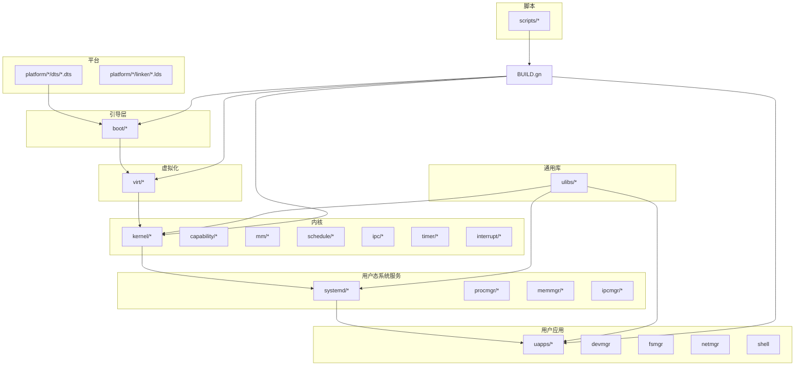
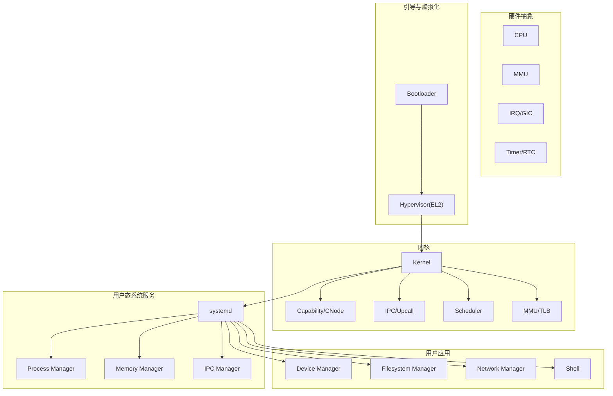
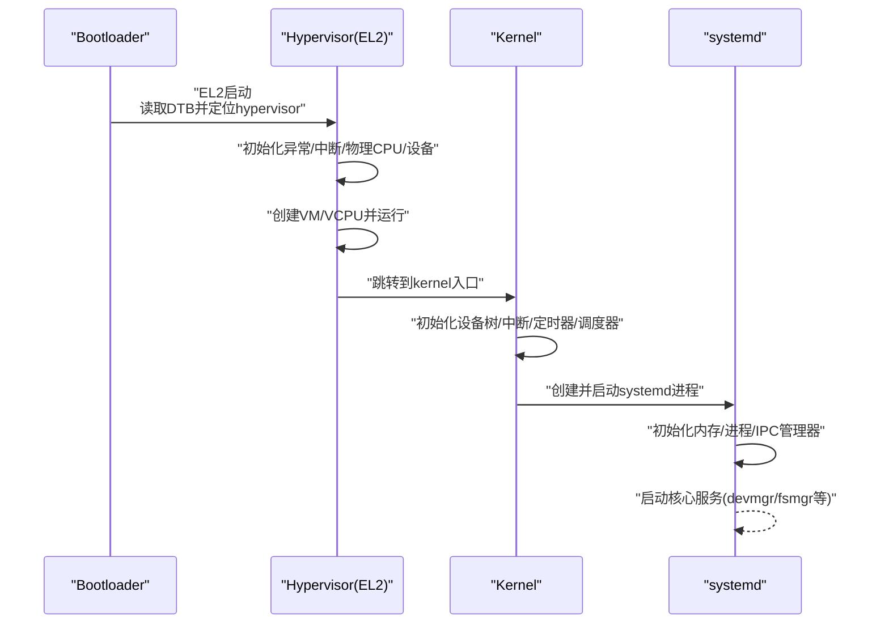
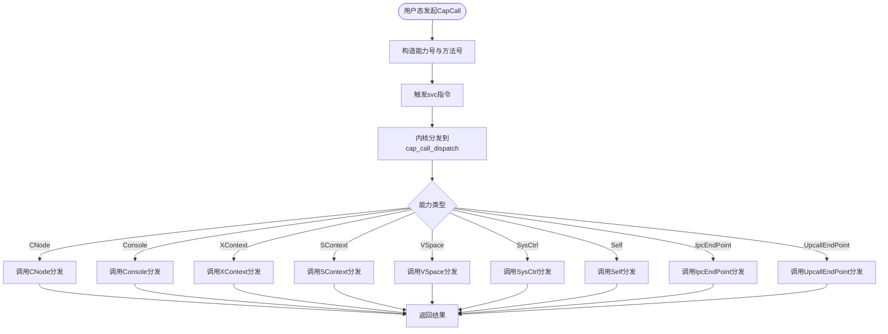
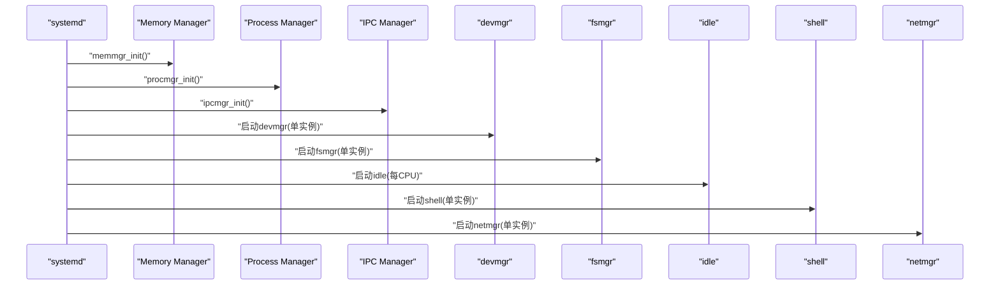
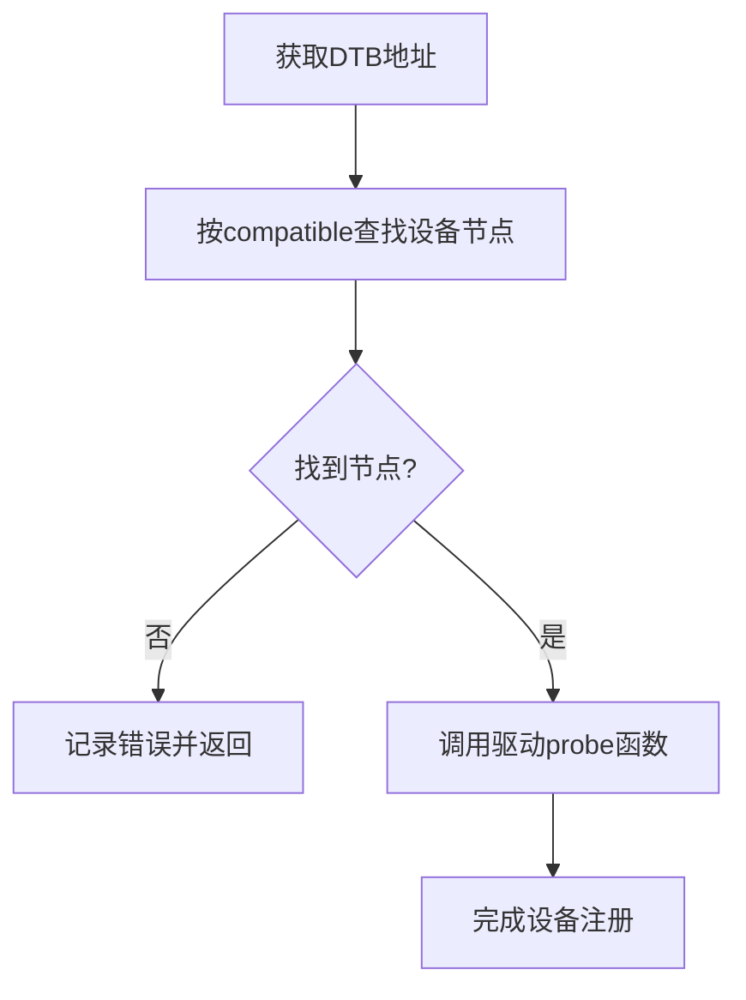
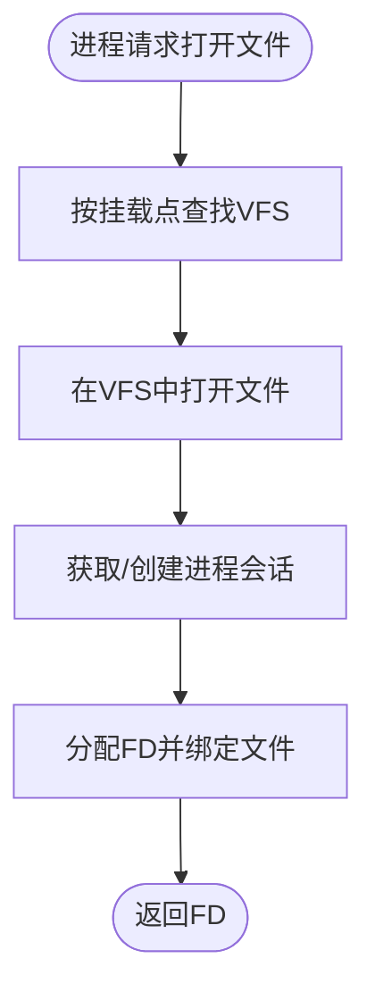
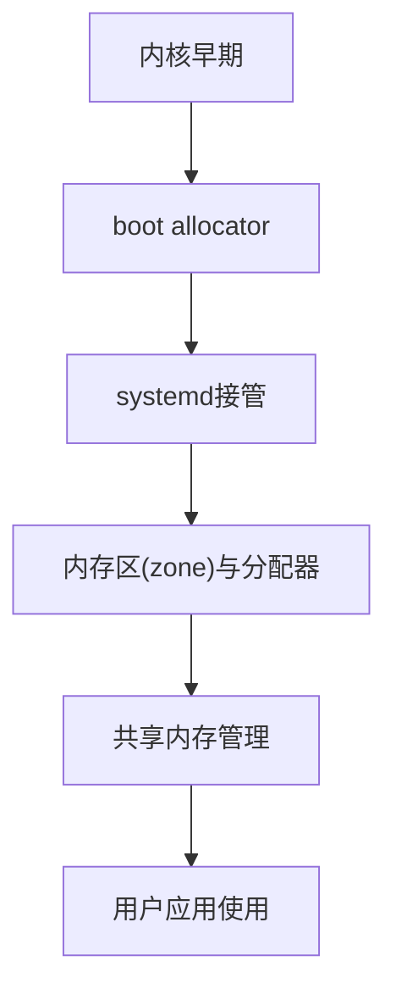
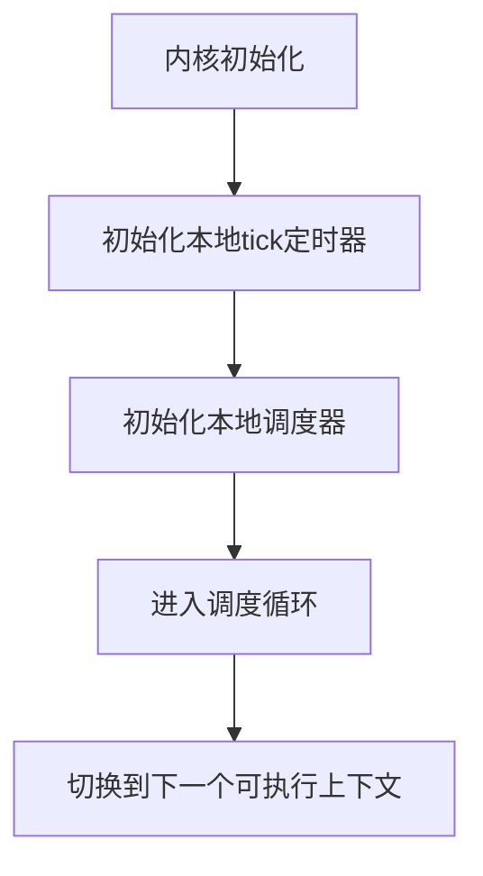
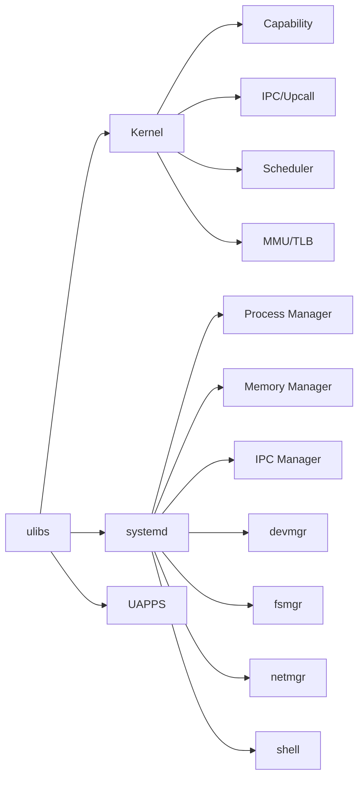

# 发展路线图

<cite>
**本文引用的文件**
- [README.md](file://README.md)
- [BUILD.gn](file://BUILD.gn)
- [docs/microkernel_design.md](file://docs/microkernel_design.md)
- [docs/kernel/microkernel_design.md](file://docs/kernel/microkernel_design.md)
- [kernel/kernel.c](file://kernel/kernel.c)
- [kernel/systemd/systemd.c](file://kernel/systemd/systemd.c)
- [uapps/devmgr/devmgr.c](file://uapps/devmgr/devmgr.c)
- [uapps/fsmgr/fsmgr.c](file://uapps/fsmgr/fsmgr.c)
- [scripts/build_qemu.sh](file://scripts/build_qemu.sh)
- [ulibs/include/libkernel/capcall.h](file://ulibs/include/libkernel/capcall.h)
- [kernel/capability/capability.c](file://kernel/capability/capability.c)
- [platform/QemuVirt/dts/virt.dts](file://platform/QemuVirt/dts/virt.dts)
- [platform/Pi4b/dts/bcm2711-rpi-4-b.dts](file://platform/Pi4b/dts/bcm2711-rpi-4-b.dts)
- [virt/hypervisor.c](file://virt/hypervisor.c)
- [virt/arch/arm64/boot/exception_el2.S](file://virt/arch/arm64/boot/exception_el2.S)
- [kernel/include/arch/arm64/registers/hcr.h](file://kernel/include/arch/arm64/registers/hcr.h)
- [virt/mm/mm.c](file://virt/mm/mm.c)
- [kernel/systemd/include/memmgr/memmgr.h](file://kernel/systemd/include/memmgr/memmgr.h)
- [kernel/systemd/memmgr/memmgr.c](file://kernel/systemd/memmgr/memmgr.c)
- [ulibs/libalgorithm/darray.c](file://ulibs/libalgorithm/darray.c)
- [kernel/mm/page_struct_tbl.c](file://kernel/mm/page_struct_tbl.c)
- [kernel/mm/impl/buddy_page_allocator.c](file://kernel/mm/impl/buddy_page_allocator.c)
- [kernel/schedule/sched_mgr.c](file://kernel/schedule/sched_mgr.c)
</cite>

## 目录
1. [简介](#简介)
2. [项目结构](#项目结构)
3. [核心组件](#核心组件)
4. [架构总览](#架构总览)
5. [详细组件分析](#详细组件分析)
6. [依赖关系分析](#依赖关系分析)
7. [性能考量](#性能考量)
8. [故障排查指南](#故障排查指南)
9. [结论](#结论)
10. [附录](#附录)

## 简介
本发展路线图面向TranquilOS项目，基于仓库现有代码与文档，梳理当前功能状态与完成度，明确短期、中期与长期目标，给出可落地的时间表与里程碑节点，并阐述技术演进方向、架构改进计划、社区协作与开源策略，以及性能优化、功能扩展与平台适配的重点方向。目标是为开发者与用户提供清晰的发展指引。

## 项目结构
TranquilOS采用分层模块化组织：引导层（boot）、内核（kernel）、虚拟化（virt）、用户态系统服务（systemd）、用户应用（uapps）、通用库（ulibs）、平台设备树（platform）、脚本工具（scripts）。构建通过GN/Ninja进行，支持多平台（QEMU虚拟机、树莓派4B等）。

图表来源
- [BUILD.gn](file://BUILD.gn#L1-L9)
- [kernel/kernel.c](file://kernel/kernel.c#L125-L224)
- [kernel/systemd/systemd.c](file://kernel/systemd/systemd.c#L217-L246)
- [virt/hypervisor.c](file://virt/hypervisor.c#L101-L145)

章节来源
- [BUILD.gn](file://BUILD.gn#L1-L9)
- [README.md](file://README.md#L1-L42)

## 核心组件
- 微内核与引导链路：支持EL2 Type-1虚拟化，引导链路从bootloader到hypervisor再到kernel与systemd；支持多平台设备树映射。
- 能力机制（Capability）：统一的内核对象与细粒度权限模型，配合CNode存储能力节点。
- 用户态系统服务（systemd）：负责内存管理、进程/线程管理、IPC管理、服务部署与启动。
- 用户应用：设备管理（devmgr）、文件系统（fsmgr）、网络（netmgr）、Shell等。
- 架构与寄存器：HCR_EL2配置、异常处理、中断管理、定时器、页表与内存管理框架。
- 构建与平台：GN/Ninja构建，支持QEMU与树莓派平台。

章节来源
- [docs/microkernel_design.md](file://docs/microkernel_design.md#L1-L43)
- [kernel/kernel.c](file://kernel/kernel.c#L125-L224)
- [kernel/systemd/systemd.c](file://kernel/systemd/systemd.c#L15-L74)
- [virt/hypervisor.c](file://virt/hypervisor.c#L47-L76)
- [kernel/include/arch/arm64/registers/hcr.h](file://kernel/include/arch/arm64/registers/hcr.h#L6-L70)

## 架构总览
TranquilOS采用“微内核+用户态核心服务”的架构。内核提供最小化内核能力（中断、MMU、调度、定时器、IPC、upcall、能力机制），其余如内存管理、进程/线程、文件系统、设备管理等由systemd及其子模块在用户态完成。系统支持EL2虚拟化，可在虚拟机或裸机上运行。

图表来源
- [docs/microkernel_design.md](file://docs/microkernel_design.md#L28-L37)
- [kernel/kernel.c](file://kernel/kernel.c#L125-L224)
- [kernel/systemd/systemd.c](file://kernel/systemd/systemd.c#L217-L246)
- [virt/hypervisor.c](file://virt/hypervisor.c#L101-L145)

## 详细组件分析

### 引导与启动流程（EL2/EL1）
- EL2启动：从设备树查找hypervisor镜像地址，跳转至hypervisor入口，初始化异常、中断、物理CPU、页表与设备，随后创建VM与VCPU并运行。
- EL1启动：直接从设备树定位kernel镜像并启动systemd。
- 关键路径：boot.el2_start_primary → hypervisor_start → vm.init/run → kernel_start_primary → systemd启动。

图表来源
- [boot/boot.c](file://boot/boot.c#L114-L136)
- [virt/hypervisor.c](file://virt/hypervisor.c#L101-L145)
- [kernel/kernel.c](file://kernel/kernel.c#L125-L224)
- [kernel/systemd/systemd.c](file://kernel/systemd/systemd.c#L217-L246)

章节来源
- [boot/boot.c](file://boot/boot.c#L114-L175)
- [virt/hypervisor.c](file://virt/hypervisor.c#L101-L145)
- [kernel/kernel.c](file://kernel/kernel.c#L125-L224)
- [kernel/systemd/systemd.c](file://kernel/systemd/systemd.c#L217-L246)

### 能力机制与系统调用（CapCall）
- CapCall定义了统一的系统调用封装宏，通过svc指令传递能力号与方法号，内核侧根据能力类型分发到对应能力对象的方法。
- 内核在cap_call_dispatch中解析能力号并分发到具体能力对象（如CNode、Console、XContext、SContext、VSpace、SysCtrl、Self、IpcEndPoint、UpcallEndPoint）。

图表来源
- [ulibs/include/libkernel/capcall.h](file://ulibs/include/libkernel/capcall.h#L15-L134)
- [kernel/capability/capability.c](file://kernel/capability/capability.c#L14-L58)

章节来源
- [ulibs/include/libkernel/capcall.h](file://ulibs/include/libkernel/capcall.h#L1-L134)
- [kernel/capability/capability.c](file://kernel/capability/capability.c#L1-L58)

### 用户态系统服务（systemd）
- systemd负责初始化内存管理、进程/线程管理、IPC管理，并按配置启动核心服务（devmgr、fsmgr、idle、shell、netmgr）。
- 服务部署模式支持单实例与每CPU实例两种；服务二进制从ramdisk加载并映射到进程地址空间，建立名称服务端点与控制台。

图表来源
- [kernel/systemd/systemd.c](file://kernel/systemd/systemd.c#L15-L74)
- [kernel/systemd/systemd.c](file://kernel/systemd/systemd.c#L217-L246)

章节来源
- [kernel/systemd/systemd.c](file://kernel/systemd/systemd.c#L15-L74)
- [kernel/systemd/systemd.c](file://kernel/systemd/systemd.c#L217-L246)

### 设备管理（devmgr）
- 通过设备树匹配兼容字符串定位设备节点，注册驱动并探测设备；支持DTB地址获取与节点地址查询。

图表来源
- [uapps/devmgr/devmgr.c](file://uapps/devmgr/devmgr.c#L10-L55)

章节来源
- [uapps/devmgr/devmgr.c](file://uapps/devmgr/devmgr.c#L1-L62)

### 文件系统管理（fsmgr）
- 支持挂载多个VFS，按挂载点选择对应文件系统；为每个进程维护会话与文件描述符表，提供open/read/write/close操作。

图表来源
- [uapps/fsmgr/fsmgr.c](file://uapps/fsmgr/fsmgr.c#L65-L108)

章节来源
- [uapps/fsmgr/fsmgr.c](file://uapps/fsmgr/fsmgr.c#L1-L216)

### 内存管理与页表
- 内核早期使用boot allocator，systemd接管后提供更完整的内存管理；支持稀疏内存布局、页结构表更新与伙伴分配器占位。
- 用户态systemd提供共享内存管理接口，用于跨进程共享数据。

图表来源
- [kernel/mm/page_struct_tbl.c](file://kernel/mm/page_struct_tbl.c#L104-L113)
- [kernel/mm/impl/buddy_page_allocator.c](file://kernel/mm/impl/buddy_page_allocator.c#L6-L27)
- [kernel/systemd/include/memmgr/memmgr.h](file://kernel/systemd/include/memmgr/memmgr.h#L10-L30)
- [kernel/systemd/memmgr/memmgr.c](file://kernel/systemd/memmgr/memmgr.c#L161-L211)

章节来源
- [kernel/mm/page_struct_tbl.c](file://kernel/mm/page_struct_tbl.c#L81-L113)
- [kernel/mm/impl/buddy_page_allocator.c](file://kernel/mm/impl/buddy_page_allocator.c#L1-L27)
- [kernel/systemd/include/memmgr/memmgr.h](file://kernel/systemd/include/memmgr/memmgr.h#L1-L30)
- [kernel/systemd/memmgr/memmgr.c](file://kernel/systemd/memmgr/memmgr.c#L153-L211)

### 调度与时间管理
- 调度器框架支持多队列与优先级，当前版本对实时/普通调度器的区分尚为占位；定时器提供高精度计时。
- 早期初始化中启用tick timer与本地定时器管理器，确保系统时钟可用。

图表来源
- [kernel/kernel.c](file://kernel/kernel.c#L159-L170)
- [kernel/kernel.c](file://kernel/kernel.c#L192-L201)
- [kernel/schedule/sched_mgr.c](file://kernel/schedule/sched_mgr.c#L74-L87)

章节来源
- [kernel/kernel.c](file://kernel/kernel.c#L159-L170)
- [kernel/kernel.c](file://kernel/kernel.c#L192-L201)
- [kernel/schedule/sched_mgr.c](file://kernel/schedule/sched_mgr.c#L1-L167)

### 平台与设备树
- QEMU虚拟机平台提供丰富的virtio设备与GIC、UART、RTC等外设；树莓派4B平台提供更贴近真实硬件的设备树布局。
- 平台DTS中定义了保留区域、镜像段与设备节点，便于引导与虚拟化。

章节来源
- [platform/QemuVirt/dts/virt.dts](file://platform/QemuVirt/dts/virt.dts#L1-L468)
- [platform/Pi4b/dts/bcm2711-rpi-4-b.dts](file://platform/Pi4b/dts/bcm2711-rpi-4-b.dts#L1-L800)

## 依赖关系分析
- 组件耦合：内核与systemd通过CapCall/IPC交互；systemd内部模块（内存、进程、IPC）相互协作；用户应用通过systemd提供的客户端接口访问系统服务。
- 外部依赖：GN/Ninja构建系统、交叉编译工具链、QEMU仿真器、树莓派固件配置。
- 可能的循环依赖：当前结构以systemd为中心向外辐射，未见明显循环依赖迹象。

图表来源
- [BUILD.gn](file://BUILD.gn#L1-L9)
- [kernel/systemd/systemd.c](file://kernel/systemd/systemd.c#L15-L74)

章节来源
- [BUILD.gn](file://BUILD.gn#L1-L9)
- [kernel/systemd/systemd.c](file://kernel/systemd/systemd.c#L15-L74)

## 性能考量
- 虚拟化路径：EL2虚拟化减少内核复杂度，但需关注HCR_EL2配置与异常开销；建议逐步引入Stage-2页表与VGIC虚拟化以提升I/O性能。
- 内存管理：伙伴分配器目前为占位实现，建议尽快完善以降低碎片与提升分配效率；稀疏内存布局与页结构表更新需避免热点竞争。
- 调度与中断：优先级队列与抢占策略需结合实际负载测试；spinlock与原子操作应尽量减少临界区长度。
- IPC与Upcall：控制流立即切换的IPC具备低延迟优势，但需评估消息大小与序列化成本；建议引入零拷贝共享缓冲区。
- 缓存与算法：动态数组等数据结构已具备多级扩展能力，建议结合SLAB/SLUB思想优化小对象分配。

## 故障排查指南
- 启动失败
  - 检查设备树中各镜像段是否正确映射（dtb/boot/hypervisor/kernel/systemd/ramdisk/kmsg_buf）。
  - 确认EL2/Hypervisor初始化流程与HCR_EL2配置。
- systemd启动异常
  - 查看内存管理器初始化与进程管理器初始化日志。
  - 确认ramdisk中服务二进制存在且可解析。
- 设备管理问题
  - 使用compatible字符串匹配设备节点，确认驱动probe流程。
- 内存与共享内存
  - 检查共享内存分配与查找逻辑，避免重复分配或泄漏。
- 构建与运行
  - 使用QEMU构建脚本生成out目录并执行ninja编译；确认工具链与环境变量设置。

章节来源
- [platform/QemuVirt/dts/virt.dts](file://platform/QemuVirt/dts/virt.dts#L9-L51)
- [virt/hypervisor.c](file://virt/hypervisor.c#L47-L76)
- [kernel/systemd/systemd.c](file://kernel/systemd/systemd.c#L217-L246)
- [uapps/devmgr/devmgr.c](file://uapps/devmgr/devmgr.c#L10-L55)
- [kernel/systemd/memmgr/memmgr.c](file://kernel/systemd/memmgr/memmgr.c#L161-L211)
- [scripts/build_qemu.sh](file://scripts/build_qemu.sh#L1-L6)

## 结论
TranquilOS已形成清晰的微内核+用户态核心服务架构，具备EL2虚拟化、能力机制、基础IPC与调度能力，并在QEMU与树莓派平台上具备可运行性。下一阶段应聚焦于补齐内存分配器、完善文件系统与网络栈、增强虚拟化I/O与安全隔离、推进社区协作与文档建设，以实现稳定、高性能与可扩展的AI-OS平台。

## 附录

### 当前版本功能状态与完成度
- 已完成
  - aarch64、MMU/虚拟内存、IRQ、调度、时间与定时器、多进程/线程、UART/控制台、能力机制、自旋锁、SMP、IPC、Upcall、EL2虚拟化、systemd核心服务框架
- 进行中
  - 伙伴内存分配器、文件系统管理器、网络管理器、共享内存管理、设备驱动框架
- 计划实现
  - futex、根文件系统与ext支持、图形与多媒体管理器、系统UI与渲染器、安全沙箱与权限模型强化、跨平台适配（x86/ARMv7）

章节来源
- [README.md](file://README.md#L4-L29)

### 时间表与里程碑
- 短期（1-3个月）
  - 完成伙伴内存分配器实现与性能优化
  - 实现基础文件系统（procfs/sysfs/rootfs）与VFS框架
  - 完善网络管理器与基本网络协议栈
  - 修复与优化EL2虚拟化I/O路径
- 中期（3-6个月）
  - 引入共享内存与零拷贝IPC优化
  - 完善设备驱动框架与关键外设支持
  - 增强安全模型与权限控制
  - 推进树莓派平台稳定性与性能
- 长期（6-12个月）
  - 实现图形与多媒体子系统
  - 构建系统UI与渲染器
  - 扩展跨平台支持与容器/虚拟化生态
  - 建立完善的社区协作与开源发布流程

### 技术演进方向与架构改进
- 架构演进
  - 逐步引入Stage-2页表与虚拟GIC，提升I/O虚拟化性能
  - 优化IPC路径，支持零拷贝与批量传输
  - 强化能力机制的安全边界，引入命名服务与权限继承
- 内存与存储
  - 完善伙伴分配器与SLAB缓存，降低碎片与提升吞吐
  - 实现VFS与多种文件系统（ext、FAT等）
- 调度与实时性
  - 引入RT/CFS调度器组合，满足不同负载需求
  - 优化tickless与频率调节策略
- 平台适配
  - 扩展x86与ARMv7平台支持
  - 适配更多SoC与设备树

### 社区贡献与开源协作
- 开源策略
  - 采用宽松许可证，鼓励学术与工业合作
  - 建立Issue模板与PR规范，明确贡献流程
- 协作机制
  - 分层评审：内核与systemd关键改动需双人评审
  - 文档同步：新功能必须配套设计文档与用户手册
  - 测试覆盖：CI集成单元测试、性能基准与平台回归测试

### 性能优化、功能扩展与平台适配重点
- 性能优化
  - 减少内核态与用户态切换次数，优化IPC路径
  - 优化页表遍历与TLB刷新，减少内存管理开销
  - 引入NUMA感知与亲和调度
- 功能扩展
  - 文件系统与网络栈完善
  - 图形与多媒体子系统
  - 系统UI与渲染器
- 平台适配
  - 多SoC与设备树支持
  - 虚拟化平台（KVM/QEMU）与裸机平台并重
  - 移动与嵌入式平台适配