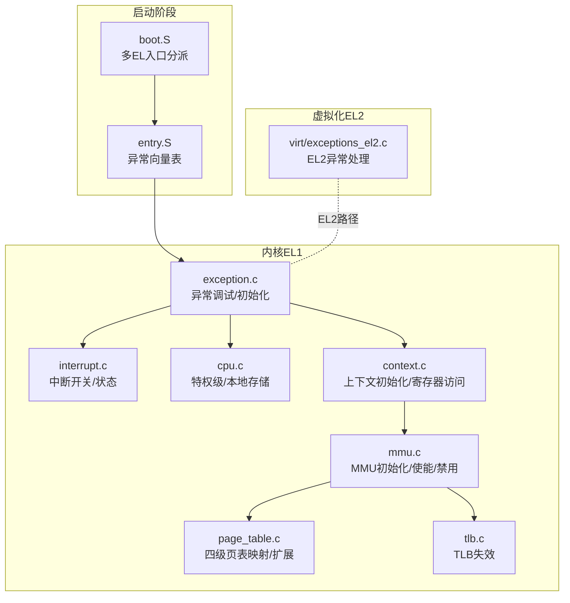
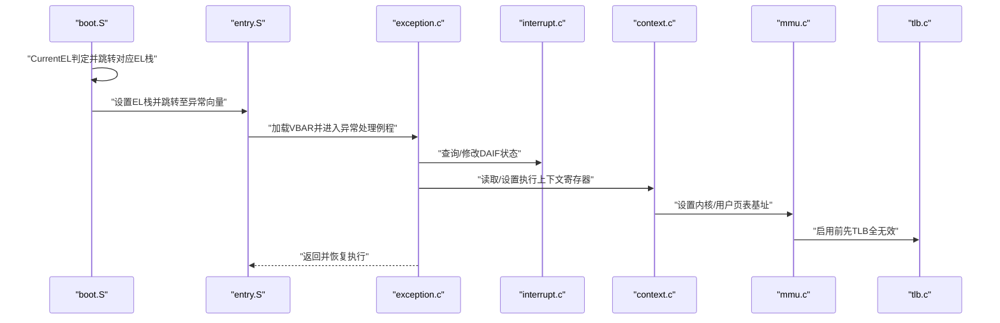
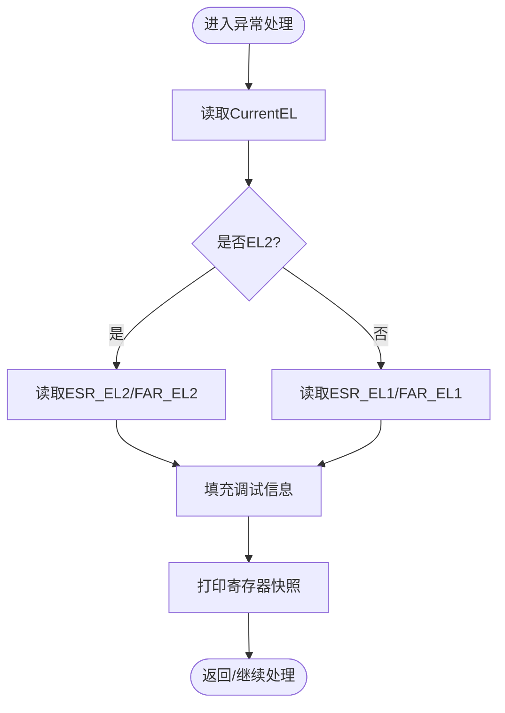
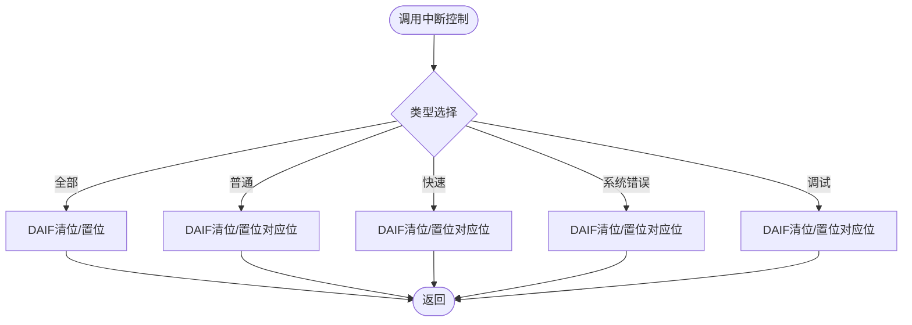
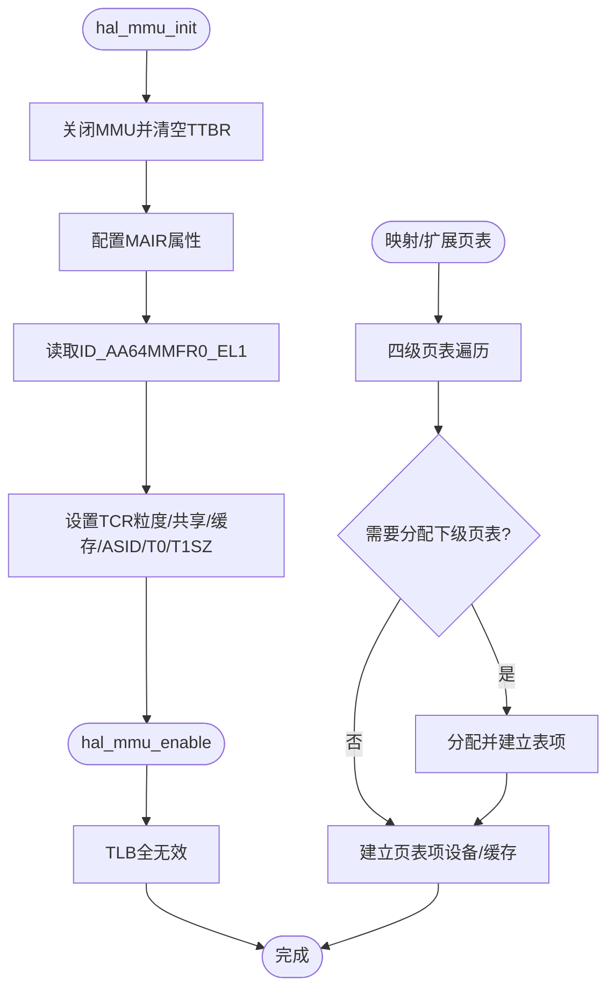
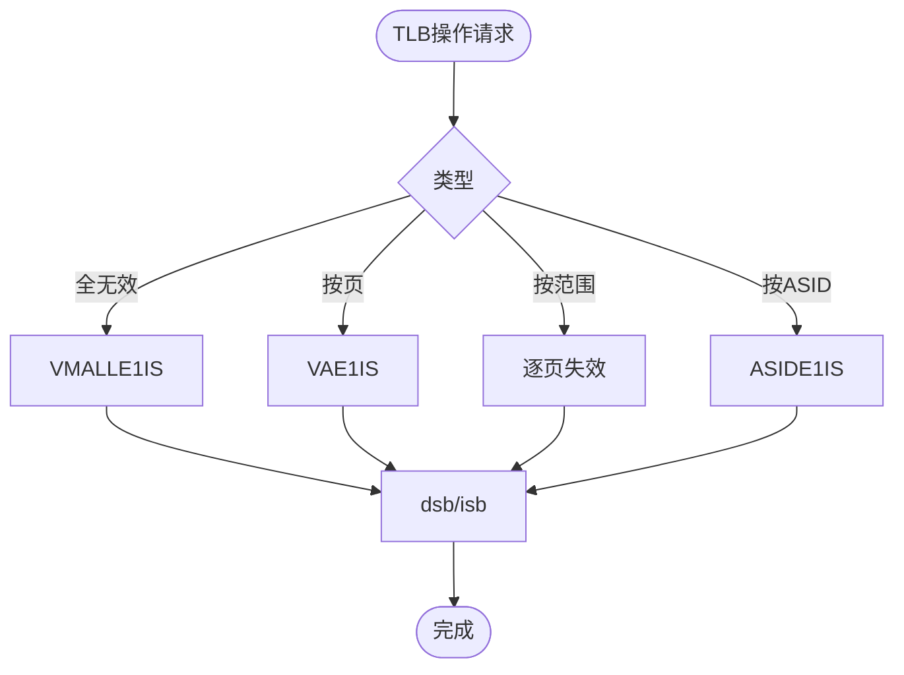
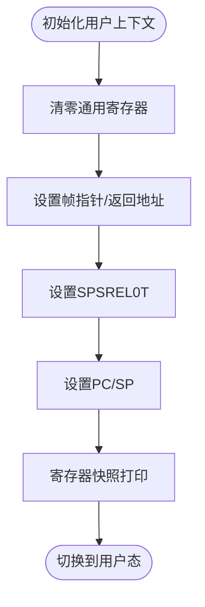
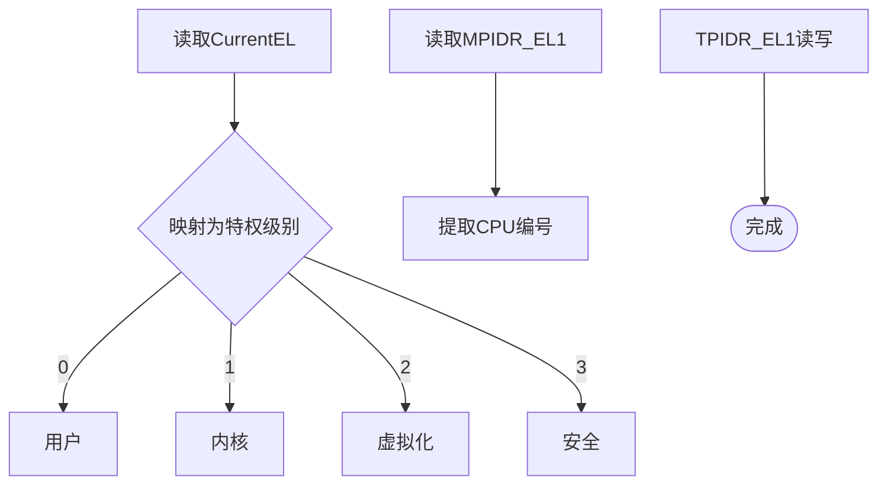
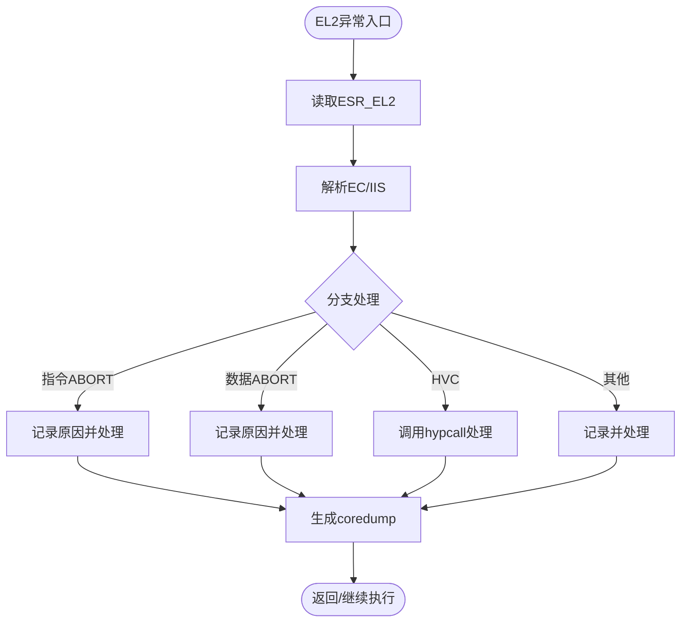
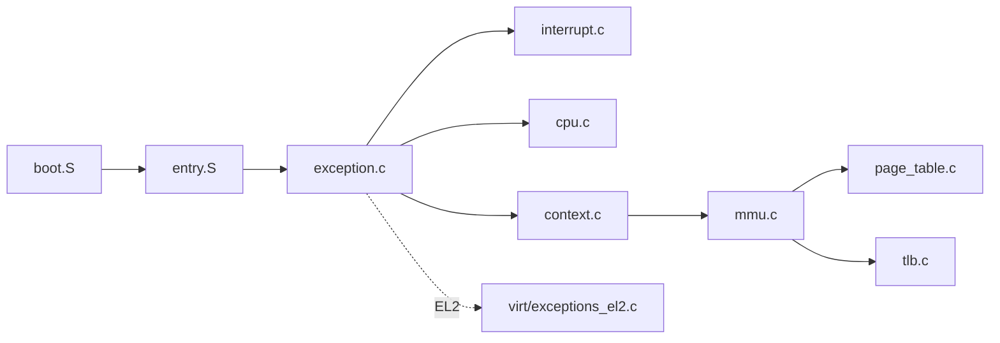

# ARM64架构支持

<cite>
**本文引用的文件**
- [boot.S](file://boot/arch/arm64/boot.S)
- [entry.S](file://kernel/arch/arm64/entry/entry.S)
- [exception.c](file://kernel/arch/arm64/exception.c)
- [interrupt.c](file://kernel/arch/arm64/interrupt.c)
- [mmu.c](file://kernel/arch/arm64/mmu.c)
- [page_table.c](file://kernel/arch/arm64/page_table.c)
- [tlb.c](file://kernel/arch/arm64/tlb.c)
- [cpu.c](file://kernel/arch/arm64/cpu.c)
- [context.c](file://kernel/arch/arm64/context.c)
- [mmu.h](file://kernel/include/arch/arm64/mmu.h)
- [exception.h](file://kernel/include/arch/arm64/exception.h)
- [exceptions_el2.c](file://virt/exceptions_el2.c)
</cite>

## 目录
1. [简介](#简介)
2. [项目结构](#项目结构)
3. [核心组件](#核心组件)
4. [架构总览](#架构总览)
5. [详细组件分析](#详细组件分析)
6. [依赖关系分析](#依赖关系分析)
7. [性能考虑](#性能考虑)
8. [故障排查指南](#故障排查指南)
9. [结论](#结论)
10. [附录：配置与平台适配](#附录配置与平台适配)

## 简介
本文件系统性梳理TranquilOS在ARM64架构上的完整支持，覆盖异常处理、内存管理（MMU）、寄存器与上下文管理、中断控制、TLB操作、虚拟化（EL2）以及平台启动流程。文档以代码为依据，结合架构规范，帮助读者快速理解各模块职责、数据流与控制流，并提供性能优化与安全机制的实践建议。

## 项目结构
ARM64相关实现主要分布在以下位置：
- 启动与入口：boot/arch/arm64/boot.S、kernel/arch/arm64/entry/entry.S
- 异常与中断：kernel/arch/arm64/exception.c、kernel/arch/arm64/interrupt.c
- 内存管理：kernel/arch/arm64/mmu.c、kernel/arch/arm64/page_table.c、kernel/arch/arm64/tlb.c
- 上下文与CPU：kernel/arch/arm64/context.c、kernel/arch/arm64/cpu.c
- 虚拟化（EL2）：virt/exceptions_el2.c
- 头文件与常量：kernel/include/arch/arm64/*.h

图表来源
- [boot.S](file://boot/arch/arm64/boot.S#L1-L115)
- [entry.S](file://kernel/arch/arm64/entry/entry.S#L65-L108)
- [exception.c](file://kernel/arch/arm64/exception.c#L108-L119)
- [interrupt.c](file://kernel/arch/arm64/interrupt.c#L7-L66)
- [cpu.c](file://kernel/arch/arm64/cpu.c#L9-L36)
- [context.c](file://kernel/arch/arm64/context.c#L12-L33)
- [mmu.c](file://kernel/arch/arm64/mmu.c#L62-L126)
- [page_table.c](file://kernel/arch/arm64/page_table.c#L9-L94)
- [tlb.c](file://kernel/arch/arm64/tlb.c#L44-L68)
- [exceptions_el2.c](file://virt/exceptions_el2.c#L127-L137)

章节来源
- [boot.S](file://boot/arch/arm64/boot.S#L1-L115)
- [entry.S](file://kernel/arch/arm64/entry/entry.S#L65-L108)

## 核心组件
- 异常与调试信息：根据当前特权级选择EL1或EL2寄存器读取异常信息，初始化VBAR向量基址并校验对齐。
- 中断控制：通过DAIF标志位分别屏蔽/允许普通、快速、系统错误与调试中断。
- MMU与页表：配置MAIR、TCR、TTBR寄存器；实现内核/用户页表设置；支持四级页表映射与扩展。
- TLB管理：提供多种TLB失效指令封装，确保缓存一致性。
- 上下文与寄存器：初始化用户态上下文（SP、PC、SPSR），提供通用寄存器读写接口。
- CPU特性：获取当前EL、CPU编号、本地存储指针；事件等待/广播。
- 虚拟化EL2：配置EL2向量表，解析EC/IIS，处理HVC、数据/指令ABORT等。

章节来源
- [exception.c](file://kernel/arch/arm64/exception.c#L22-L119)
- [interrupt.c](file://kernel/arch/arm64/interrupt.c#L7-L66)
- [mmu.c](file://kernel/arch/arm64/mmu.c#L62-L159)
- [page_table.c](file://kernel/arch/arm64/page_table.c#L9-L167)
- [tlb.c](file://kernel/arch/arm64/tlb.c#L4-L68)
- [context.c](file://kernel/arch/arm64/context.c#L12-L98)
- [cpu.c](file://kernel/arch/arm64/cpu.c#L9-L44)
- [exceptions_el2.c](file://virt/exceptions_el2.c#L127-L137)

## 架构总览
下图展示从启动到异常处理的关键交互，包括EL入口分派、异常向量加载、EL1/EL2异常处理与上下文保存。

图表来源
- [boot.S](file://boot/arch/arm64/boot.S#L78-L104)
- [entry.S](file://kernel/arch/arm64/entry/entry.S#L65-L108)
- [exception.c](file://kernel/arch/arm64/exception.c#L108-L119)
- [interrupt.c](file://kernel/arch/arm64/interrupt.c#L49-L66)
- [context.c](file://kernel/arch/arm64/context.c#L12-L33)
- [mmu.c](file://kernel/arch/arm64/mmu.c#L128-L159)
- [tlb.c](file://kernel/arch/arm64/tlb.c#L44-L48)

## 详细组件分析

### 异常与调试（EL1/EL2）
- 功能要点
  - 自动识别当前EL（通过寄存器读取），分别读取EL1/EL2的ESR/FAR，填充调试信息。
  - 初始化VBAR_EL1（或EL2）并进行对齐检查，确保异常向量表按要求对齐。
  - 提供寄存器快照打印，便于定位问题。
- 关键流程

图表来源
- [exception.c](file://kernel/arch/arm64/exception.c#L22-L106)

章节来源
- [exception.c](file://kernel/arch/arm64/exception.c#L22-L119)

### 中断控制（EL1）
- 功能要点
  - 支持全局开启/关闭所有中断，以及按类型（普通/快速/系统错误/调试）分别控制。
  - 提供保存与恢复DAIF状态的原子接口。
- 关键流程

图表来源
- [interrupt.c](file://kernel/arch/arm64/interrupt.c#L7-L66)

章节来源
- [interrupt.c](file://kernel/arch/arm64/interrupt.c#L7-L66)

### MMU与页表（EL1）
- 功能要点
  - 初始化MAIR（内存属性索引），配置TCR（转换控制寄存器），设置TTBR0/TTBR1。
  - 启用/禁用MMU时先进行TLB全无效，保证一致性。
  - 实现内核/用户页表设置与四层页表映射/扩展逻辑，区分设备内存与普通缓存内存。
- 关键流程

图表来源
- [mmu.c](file://kernel/arch/arm64/mmu.c#L62-L126)
- [page_table.c](file://kernel/arch/arm64/page_table.c#L9-L167)

章节来源
- [mmu.c](file://kernel/arch/arm64/mmu.c#L62-L159)
- [mmu.h](file://kernel/include/arch/arm64/mmu.h#L1-L168)
- [page_table.c](file://kernel/arch/arm64/page_table.c#L9-L167)

### TLB管理
- 功能要点
  - 提供多种TLB失效指令封装，包括按VA、ASID、范围等不同粒度。
  - 全局失效后执行内存屏障与指令同步。
- 关键流程

图表来源
- [tlb.c](file://kernel/arch/arm64/tlb.c#L44-L68)

章节来源
- [tlb.c](file://kernel/arch/arm64/tlb.c#L4-L68)

### 上下文与寄存器（EL1）
- 功能要点
  - 初始化用户态上下文（SP、PC、SPSR），设置TPID寄存器。
  - 提供通用寄存器读写接口与上下文寄存器快照打印。
  - 提供切换到用户态的入口。
- 关键流程

图表来源
- [context.c](file://kernel/arch/arm64/context.c#L12-L98)

章节来源
- [context.c](file://kernel/arch/arm64/context.c#L12-L98)

### CPU特性与本地存储（EL1）
- 功能要点
  - 获取当前EL、CPU编号、本地存储指针。
  - 提供WFE/SEV事件等待与广播。
- 关键流程

图表来源
- [cpu.c](file://kernel/arch/arm64/cpu.c#L9-L44)

章节来源
- [cpu.c](file://kernel/arch/arm64/cpu.c#L9-L44)

### 虚拟化（EL2）异常处理
- 功能要点
  - 配置VBAR_EL2并校验对齐。
  - 解析EC/IIS，处理指令/数据ABORT、HVC等。
  - 在EL2捕获到IRQ时交由本地IRQ管理器处理。
- 关键流程

图表来源
- [exceptions_el2.c](file://virt/exceptions_el2.c#L51-L101)

章节来源
- [exceptions_el2.c](file://virt/exceptions_el2.c#L127-L137)

## 依赖关系分析
- 模块耦合
  - 异常模块依赖CPU特权级判断与寄存器读写宏。
  - MMU模块依赖页表描述符定义与MAIR/TCR寄存器配置。
  - TLB模块直接使用汇编指令封装，与MMU配合保证一致性。
  - 上下文模块依赖寄存器定义与SPSR配置。
  - 虚拟化EL2模块与异常模块共享EC/IIS解析表。
- 外部依赖
  - 汇编入口与向量表由entry.S提供。
  - 平台启动由boot.S完成EL入口分派。

图表来源
- [boot.S](file://boot/arch/arm64/boot.S#L78-L104)
- [entry.S](file://kernel/arch/arm64/entry/entry.S#L65-L108)
- [exception.c](file://kernel/arch/arm64/exception.c#L22-L119)
- [interrupt.c](file://kernel/arch/arm64/interrupt.c#L7-L66)
- [cpu.c](file://kernel/arch/arm64/cpu.c#L9-L44)
- [context.c](file://kernel/arch/arm64/context.c#L12-L98)
- [mmu.c](file://kernel/arch/arm64/mmu.c#L62-L159)
- [page_table.c](file://kernel/arch/arm64/page_table.c#L9-L167)
- [tlb.c](file://kernel/arch/arm64/tlb.c#L44-L68)
- [exceptions_el2.c](file://virt/exceptions_el2.c#L127-L137)

章节来源
- [mmu.h](file://kernel/include/arch/arm64/mmu.h#L69-L168)
- [exception.h](file://kernel/include/arch/arm64/exception.h#L1-L113)

## 性能考虑
- 页表与TLB
  - 使用一致的粒度与共享/缓存策略，减少TLB缺失。
  - 批量映射时尽量复用已分配的中间页表，避免频繁分配。
  - 映射完成后统一执行TLB全无效，确保一致性。
- 中断
  - 尽量使用类型化中断控制，避免不必要的全局中断开关。
  - 在高频路径中谨慎使用中断保存/恢复，必要时采用局部屏蔽。
- 缓存与内存属性
  - 设备内存与普通缓存内存分开配置MAIR，避免不必要的缓存污染。
  - 对于DMA/外设区域，优先使用非缓存或弱序属性，降低一致性开销。
- 寄存器与上下文
  - 用户态上下文初始化时仅设置必要寄存器，减少冗余写入。
  - 在切换路径中避免不必要的寄存器保存/恢复。

## 故障排查指南
- 异常向量未对齐
  - 现象：初始化VBAR后检查失败。
  - 排查：确认向量表地址按要求对齐，检查链接脚本与宏定义。
  - 参考：异常初始化与校验逻辑。
- MMU启用失败或映射不生效
  - 现象：启用MMU后仍出现地址访问错误。
  - 排查：确认MAIR/TCR配置正确；映射后执行TLB全无效；检查页表项权限与属性。
  - 参考：MMU初始化、页表映射与TLB失效。
- 中断无法屏蔽/恢复
  - 现象：DAIF状态未按预期变化。
  - 排查：确认DAIF位掩码与类型匹配；检查保存/恢复顺序。
  - 参考：中断控制接口。
- EL2异常未按预期处理
  - 现象：HVC或ABORT未被正确捕获。
  - 排查：检查VBAR_EL2配置与EC/IIS解析；确认异常向量表正确加载。
  - 参考：EL2异常处理与解析。

章节来源
- [exception.c](file://kernel/arch/arm64/exception.c#L108-L119)
- [mmu.c](file://kernel/arch/arm64/mmu.c#L128-L159)
- [page_table.c](file://kernel/arch/arm64/page_table.c#L9-L94)
- [interrupt.c](file://kernel/arch/arm64/interrupt.c#L49-L66)
- [exceptions_el2.c](file://virt/exceptions_el2.c#L127-L137)

## 结论
TranquilOS在ARM64上实现了从启动到异常处理、内存管理、中断控制、上下文切换与虚拟化（EL2）的完整支持。通过明确的寄存器抽象、严格的页表与TLB一致性策略、可配置的内存属性与中断控制，系统在功能完备的同时兼顾了性能与可维护性。后续可在平台适配、大页支持与缓存/TLB优化方面进一步增强。

## 附录：配置与平台适配
- 启动与入口
  - 确保boot.S正确识别CurrentEL并为各EL准备独立栈。
  - entry.S中的异常向量表需与链接脚本对齐。
- MMU配置
  - MAIR属性需与平台内存类型匹配（设备/缓存/非缓存）。
  - TCR配置需与物理地址范围与粒度一致；注意ASID位宽与T0/T1SZ。
- 页表策略
  - 建议在映射前检查并按需扩展中间页表，减少碎片。
  - 对外设MMIO区域使用设备属性，避免缓存一致性问题。
- 中断与异常
  - 在关键路径中使用类型化中断控制，避免全局屏蔽。
  - 异常向量表必须对齐且VBAR正确加载。
- 虚拟化（EL2）
  - 配置VBAR_EL2并对齐检查；根据EC/IIS实现具体处理分支。
  - 对HVC、GIC相关ABORT等进行专门处理与日志记录。

章节来源
- [boot.S](file://boot/arch/arm64/boot.S#L78-L104)
- [entry.S](file://kernel/arch/arm64/entry/entry.S#L65-L108)
- [mmu.h](file://kernel/include/arch/arm64/mmu.h#L1-L168)
- [exception.h](file://kernel/include/arch/arm64/exception.h#L1-L113)
- [exceptions_el2.c](file://virt/exceptions_el2.c#L127-L137)