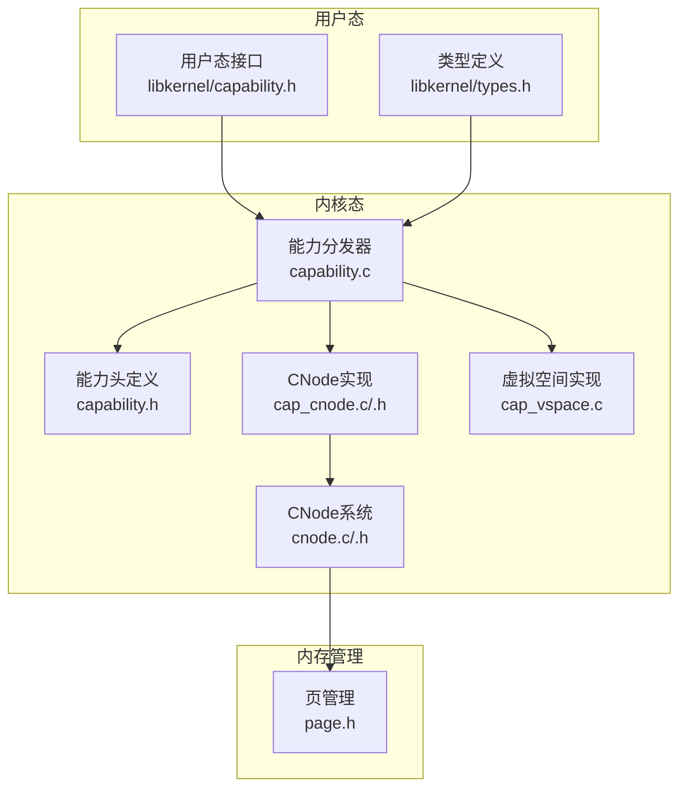
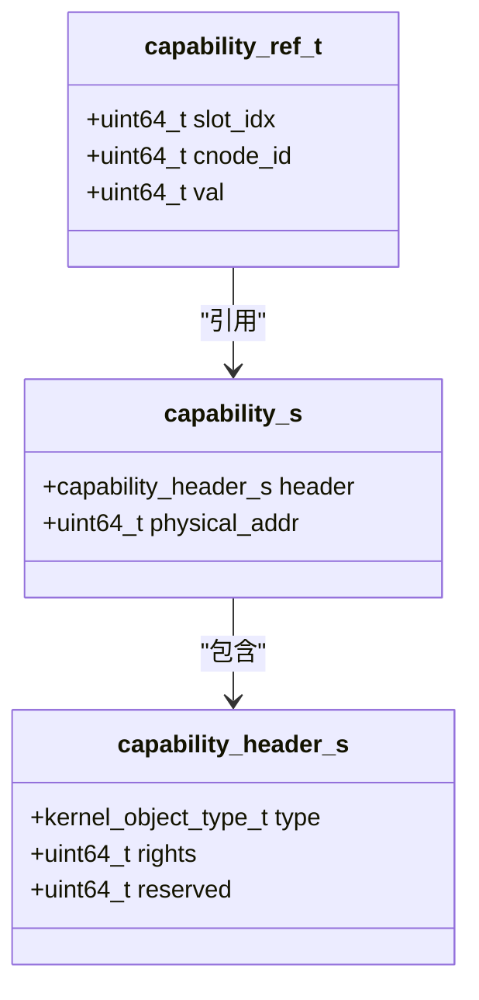
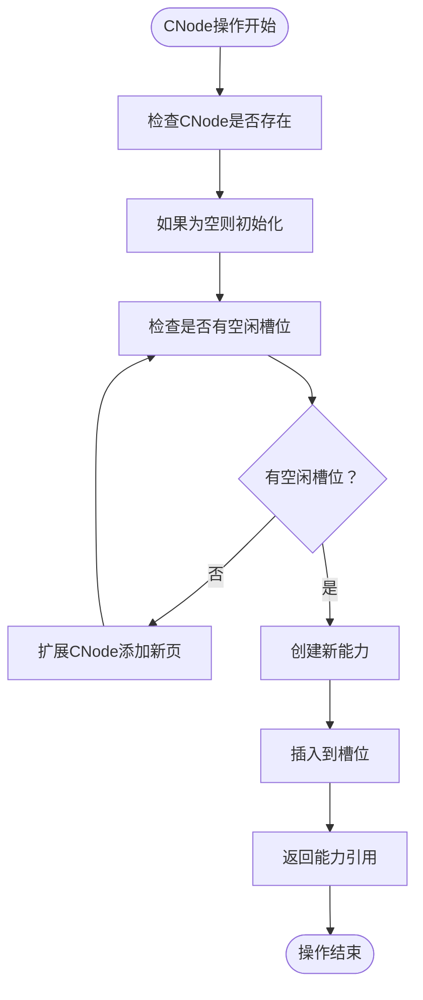
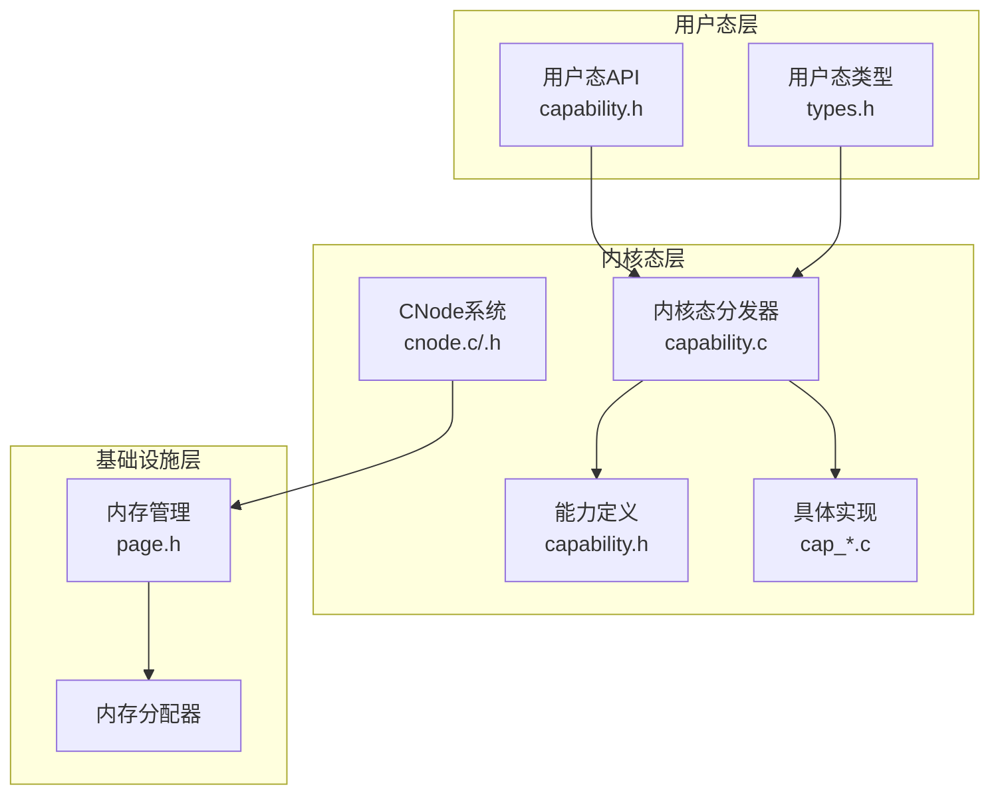
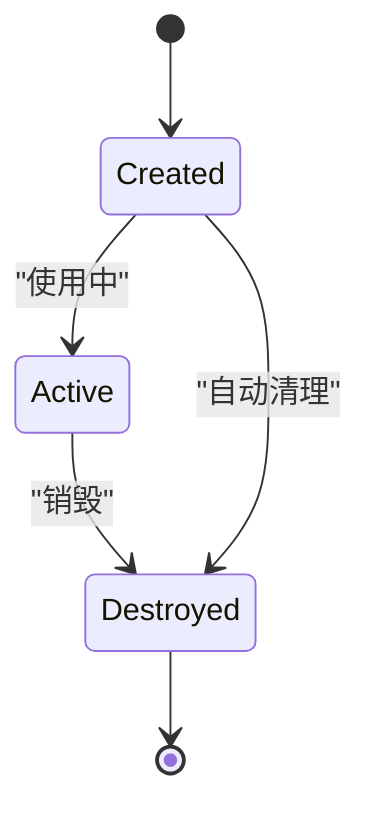
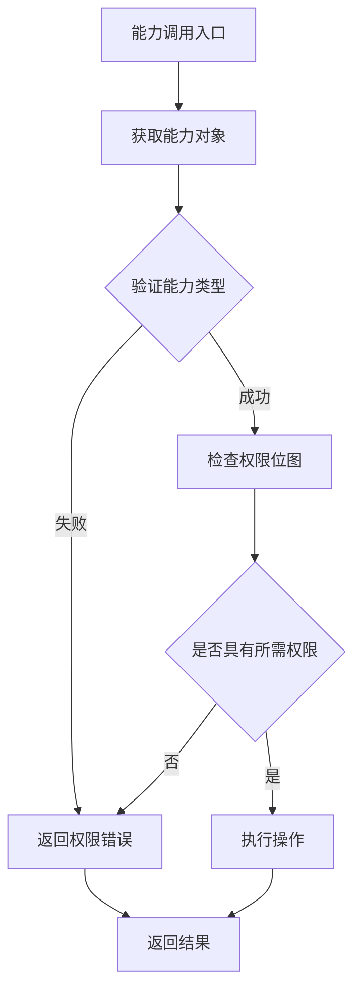
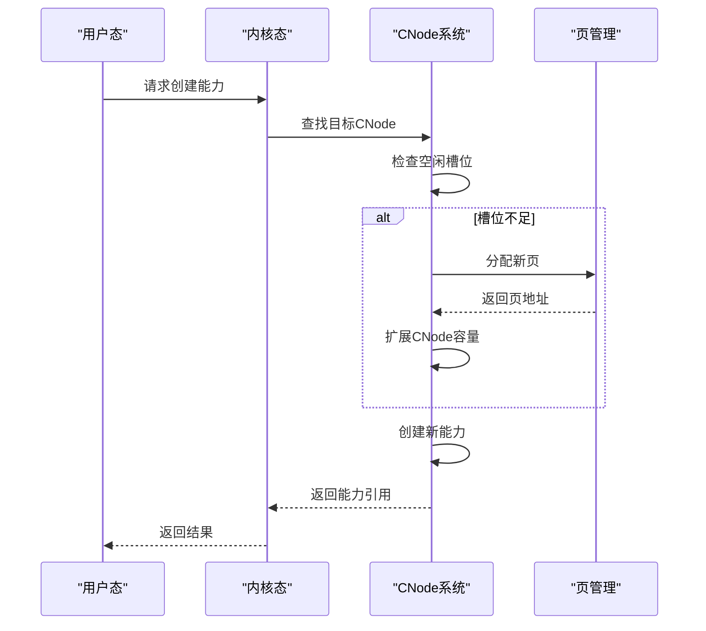
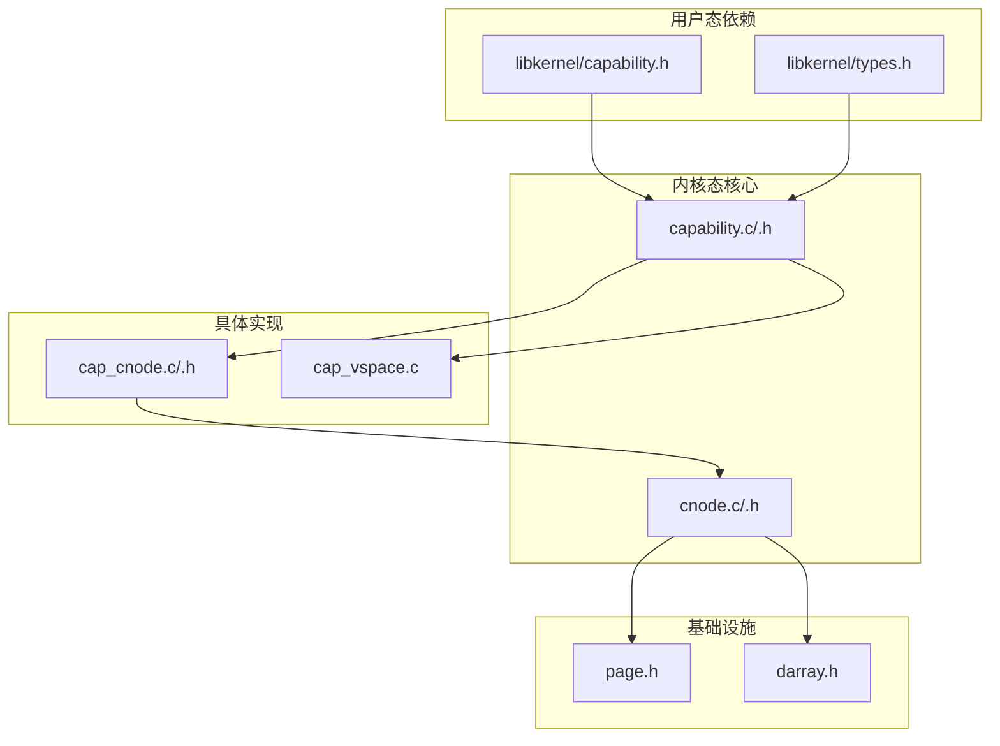

# Capability系统设计

<cite>
**本文档引用的文件**
- [capability.c](file://kernel/capability/capability.c)
- [capability.h](file://kernel/include/capability/capability.h)
- [cnode.c](file://kernel/capability/cnode.c)
- [cnode.h](file://kernel/include/capability/cnode.h)
- [cap_cnode.c](file://kernel/capability/cap_cnode.c)
- [cap_cnode.h](file://kernel/include/capability/cap_cnode.h)
- [cap_vspace.c](file://kernel/capability/cap_vspace.c)
- [capability.h](file://ulibs/include/libkernel/capability.h)
- [types.h](file://ulibs/include/libkernel/types.h)
- [page.h](file://kernel/include/mm/page.h)
</cite>

## 目录
1. [引言](#引言)
2. [项目结构](#项目结构)
3. [核心组件](#核心组件)
4. [架构概览](#架构概览)
5. [详细组件分析](#详细组件分析)
6. [依赖关系分析](#依赖关系分析)
7. [性能考虑](#性能考虑)
8. [故障排除指南](#故障排除指南)
9. [结论](#结论)

## 引言

本文件详细阐述了Kernel中Capability系统的完整设计与实现。Capability机制是微内核架构中的核心安全模型，通过将系统资源的访问权限封装为可传递的凭证（capability），实现了细粒度的安全控制和最小权限原则。该系统支持多种类型的内核对象（如执行上下文、虚拟空间、控制节点等），并通过CNode（Capability Node）提供层次化的资源管理。

本设计文档从概念到实现，从架构到细节，全面解析Capability的结构定义、CNode存储机制、权限管理策略、生命周期管理、引用计数机制以及安全验证过程。同时，深入说明CNode的多级目录结构设计、动态扩展机制，以及Capability在进程间通信、资源访问控制和安全隔离中的关键作用，并提供性能优化建议和安全考虑。

## 项目结构

Capability系统主要分布在以下模块中：

- 内核能力分发与接口层：负责接收来自用户态的capability调用请求，解析调用号并分发到相应的能力处理函数。
- 能力数据结构与通用接口：定义capability的基本结构、头部信息和通用操作接口。
- CNode子系统：实现能力节点的初始化、扩展、能力创建与检索，以及跨CNode的能力引用解析。
- 具体能力类型实现：针对不同内核对象（如虚拟空间、执行上下文、控制节点等）的具体能力实现。
- 用户态接口与类型定义：提供用户态使用的capability类型、方法枚举和返回码定义。
- 内存页管理：为CNode的动态扩展提供物理页分配支持。

**图表来源**
- [capability.c](file://kernel/capability/capability.c#L1-L58)
- [capability.h](file://kernel/include/capability/capability.h#L1-L26)
- [cnode.c](file://kernel/capability/cnode.c#L1-L95)
- [cnode.h](file://kernel/include/capability/cnode.h#L1-L29)
- [cap_cnode.c](file://kernel/capability/cap_cnode.c#L1-L184)
- [cap_cnode.h](file://kernel/include/capability/cap_cnode.h#L1-L12)
- [cap_vspace.c](file://kernel/capability/cap_vspace.c#L42-L85)
- [capability.h](file://ulibs/include/libkernel/capability.h#L1-L141)
- [types.h](file://ulibs/include/libkernel/types.h#L1-L76)
- [page.h](file://kernel/include/mm/page.h#L1-L31)

**章节来源**
- [capability.c](file://kernel/capability/capability.c#L1-L58)
- [capability.h](file://kernel/include/capability/capability.h#L1-L26)
- [cnode.c](file://kernel/capability/cnode.c#L1-L95)
- [cnode.h](file://kernel/include/capability/cnode.h#L1-L29)
- [cap_cnode.c](file://kernel/capability/cap_cnode.c#L1-L184)
- [cap_cnode.h](file://kernel/include/capability/cap_cnode.h#L1-L12)
- [cap_vspace.c](file://kernel/capability/cap_vspace.c#L42-L85)
- [capability.h](file://ulibs/include/libkernel/capability.h#L1-L141)
- [types.h](file://ulibs/include/libkernel/types.h#L1-L76)
- [page.h](file://kernel/include/mm/page.h#L1-L31)

## 核心组件

### 能力结构定义

Capability是Capability系统的核心数据结构，用于封装对内核对象的访问权限和物理地址引用。其结构包含一个固定大小的头部和一个指向具体内核对象物理地址的指针。

能力头部包含以下关键字段：
- 类型标识：8位，标识内核对象类型（如执行上下文、虚拟空间、控制节点等）
- 权限位图：32位，表示对该对象的操作权限集合
- 保留字段：24位，用于未来扩展

能力主体包含：
- 物理地址：指向具体内核对象实例的物理地址

**图表来源**
- [capability.h](file://kernel/include/capability/capability.h#L11-L20)
- [capability.h](file://ulibs/include/libkernel/capability.h#L44-L50)

**章节来源**
- [capability.h](file://kernel/include/capability/capability.h#L9-L20)
- [capability.h](file://ulibs/include/libkernel/capability.h#L44-L50)

### 能力分发器

能力分发器负责接收来自用户态的capability调用请求，解析调用号中的能力类型和方法编号，并将请求路由到相应的处理函数。当前实现中包含对多种能力类型的分发支持，包括控制节点、控制台、执行上下文、调度上下文、虚拟空间、系统控制、自能力、IPC端点和上行调用端点。

分发流程的关键步骤：
1. 从执行上下文中获取调用号
2. 解析能力类型和方法编号
3. 根据能力类型调用对应的分发函数
4. 对未知能力类型进行错误处理

**章节来源**
- [capability.c](file://kernel/capability/capability.c#L14-L54)

### CNode系统

CNode（Capability Node）是Capability系统的核心存储结构，类似于传统操作系统中的目录结构，用于存储和管理各种能力引用。每个CNode都有一个唯一的ID和一组能力槽位。

CNode的主要功能：
- 初始化：设置CNode ID和能力槽位数组
- 扩展：动态添加物理页以增加可用槽位
- 能力创建：在指定CNode中创建新的能力引用
- 能力检索：根据引用获取对应的能力对象
- 跨CNode解析：解析指向其他CNode的能力引用

**图表来源**
- [cnode.c](file://kernel/capability/cnode.c#L23-L58)

**章节来源**
- [cnode.c](file://kernel/capability/cnode.c#L9-L95)
- [cnode.h](file://kernel/include/capability/cnode.h#L11-L26)

### 具体能力类型

系统实现了多种具体的能力类型，每种类型都有其特定的方法集和权限控制：

- 控制节点能力（CNode）：支持创建、准备、扩展、销毁等操作
- 虚拟空间能力（VSpace）：支持映射页面、尝试映射范围等操作
- 执行上下文能力（XContext）：支持创建、初始化、销毁等操作
- 调度上下文能力（SContext）：支持设置CNode、VSpace、XContext等
- 控制台能力（Console）：支持打印等操作
- 系统控制能力（SysCtrl）：支持获取设备树、时间戳等系统信息
- 自能力（Self）：支持让出CPU、睡眠等操作
- IPC端点能力：支持初始化、调用、回复等操作
- 上行调用端点能力：支持初始化、回复等操作

**章节来源**
- [cap_cnode.c](file://kernel/capability/cap_cnode.c#L13-L184)
- [capability.h](file://ulibs/include/libkernel/capability.h#L52-L139)

## 架构概览

Capability系统采用分层架构设计，从用户态接口到底层内核实现形成了清晰的抽象层次：

**图表来源**
- [capability.c](file://kernel/capability/capability.c#L1-L58)
- [capability.h](file://kernel/include/capability/capability.h#L1-L26)
- [cnode.c](file://kernel/capability/cnode.c#L1-L95)
- [page.h](file://kernel/include/mm/page.h#L1-L31)
- [capability.h](file://ulibs/include/libkernel/capability.h#L1-L141)
- [types.h](file://ulibs/include/libkernel/types.h#L1-L76)

## 详细组件分析

### 能力生命周期管理

Capability的生命周期包括创建、使用、销毁三个阶段：

#### 创建阶段
1. 从用户态发起能力创建请求
2. 内核态分发器解析请求参数
3. 在目标CNode中查找空闲槽位
4. 分配物理页扩展CNode容量（如需要）
5. 创建能力对象并填充头部信息
6. 返回能力引用给用户态

#### 使用阶段
1. 用户态通过能力引用访问内核对象
2. 内核态根据能力类型调用相应处理函数
3. 验证能力权限和有效性
4. 执行具体操作并返回结果

#### 销毁阶段
1. 用户态请求销毁能力
2. 内核态验证销毁权限
3. 清理相关资源
4. 释放能力引用

**章节来源**
- [capability.c](file://kernel/capability/capability.c#L14-L54)
- [cnode.c](file://kernel/capability/cnode.c#L23-L58)

### 引用计数机制

当前代码库中未发现显式的引用计数实现。在Capability系统中，引用计数通常用于：
- 追踪能力被多少个上下文或进程持有
- 实现垃圾回收和资源清理
- 防止悬挂引用导致的内存泄漏

建议的实现方案：
1. 在capability_header中添加引用计数字段
2. 每次能力传递时增加计数
3. 每次能力销毁时减少计数
4. 当计数归零时自动清理相关资源

### 安全验证过程

安全验证是Capability系统的核心机制，确保只有拥有适当权限的实体才能访问特定资源：

#### 权限检查流程

**图表来源**
- [capability.h](file://kernel/include/capability/capability.h#L9-L15)

#### 权限模型
- 基于位图的权限控制
- 最小权限原则
- 可传递性但可撤销性
- 细粒度的权限分离

**章节来源**
- [capability.h](file://kernel/include/capability/capability.h#L9-L15)
- [capability.c](file://kernel/capability/capability.c#L20-L21)

### CNode多级目录结构设计

CNode系统实现了类似文件系统的层次化存储结构，支持动态扩展和跨节点引用：

#### 层次结构组织
- 根CNode：系统启动时创建，作为所有其他CNode的根节点
- 子CNode：通过在父CNode中创建CNode类型的能力来建立父子关系
- 能力槽位：每个CNode包含固定数量的能力槽位，用于存储具体的能力引用

#### 动态扩展机制
当CNode的现有槽位不足时，系统会自动分配新的物理页来扩展存储容量：

**图表来源**
- [cnode.c](file://kernel/capability/cnode.c#L42-L48)
- [cnode.c](file://kernel/capability/cnode.c#L15-L21)

**章节来源**
- [cnode.c](file://kernel/capability/cnode.c#L9-L95)
- [cnode.h](file://kernel/include/capability/cnode.h#L9-L14)

### 进程间通信中的作用

Capability在进程间通信中发挥关键作用：

#### 能力传递
- 通过IPC端点传递能力引用
- 支持跨进程的能力共享
- 维护能力的有效性和权限

#### 资源访问控制
- 每个进程拥有独立的CNode
- 通过能力引用精确控制资源访问
- 防止越权访问和资源泄露

#### 安全隔离
- 不同进程间的能力引用不可直接解析
- 需要通过IPC机制进行合法传递
- 实现强隔离的安全边界

**章节来源**
- [capability.h](file://ulibs/include/libkernel/capability.h#L126-L139)
- [capability.h](file://ulibs/include/libkernel/capability.h#L60-L70)

### 资源访问控制策略

系统采用基于能力的访问控制策略，实现最小权限原则：

#### 权限位图设计
- 每个能力类型定义特定的权限位
- 支持组合权限的细粒度控制
- 权限位可以动态授予和撤销

#### 访问验证
- 每次操作前进行权限检查
- 验证能力的有效性和时效性
- 支持运行时权限变更

**章节来源**
- [capability.h](file://kernel/include/capability/capability.h#L9-L15)
- [capability.h](file://ulibs/include/libkernel/capability.h#L72-L85)

## 依赖关系分析

Capability系统各组件之间的依赖关系如下：

**图表来源**
- [capability.c](file://kernel/capability/capability.c#L1-L12)
- [capability.h](file://kernel/include/capability/capability.h#L1-L12)
- [cnode.c](file://kernel/capability/cnode.c#L1-L6)
- [cap_cnode.c](file://kernel/capability/cap_cnode.c#L1-L11)
- [page.h](file://kernel/include/mm/page.h#L1-L31)

**章节来源**
- [capability.c](file://kernel/capability/capability.c#L1-L12)
- [capability.h](file://kernel/include/capability/capability.h#L1-L12)
- [cnode.c](file://kernel/capability/cnode.c#L1-L6)
- [cap_cnode.c](file://kernel/capability/cap_cnode.c#L1-L11)

## 性能考虑

### 内存管理优化

1. **页分配策略**
   - 使用批量页分配减少系统调用开销
   - 实现页缓存池提高分配效率
   - 支持大页映射减少TLB压力

2. **CNode扩展优化**
   - 预分配策略避免频繁的页分配
   - 扩展时采用移动而非复制减少内存碎片
   - 支持部分扩展以平衡内存使用

### 并发性能

1. **无锁设计**
   - 利用CNode的线性化特性避免锁竞争
   - 通过原子操作保证数据一致性
   - 减少上下文切换开销

2. **批处理操作**
   - 支持批量能力创建和销毁
   - 合并多个小操作为单个大操作
   - 减少系统调用次数

### 缓存优化

1. **能力引用缓存**
   - 缓存最近使用的CNode引用
   - 实现LRU替换策略
   - 减少跨CNode查找开销

2. **权限检查缓存**
   - 缓存已验证的权限状态
   - 支持权限状态的快速查询
   - 减少重复验证开销

## 故障排除指南

### 常见问题诊断

#### CNode相关问题
- **CNode为空**：检查CNode初始化是否正确完成
- **槽位不足**：确认CNode扩展机制正常工作
- **跨CNode引用失败**：验证目标CNode的存在和可访问性

#### 能力相关问题
- **能力创建失败**：检查权限位图和可用槽位
- **能力验证失败**：确认能力类型匹配和权限有效
- **能力引用无效**：验证引用格式和目标对象存在

#### 内存相关问题
- **页分配失败**：检查内存管理器状态和可用内存
- **内存泄漏**：跟踪能力引用计数和生命周期
- **内存碎片**：优化页分配策略和合并机制

**章节来源**
- [cnode.c](file://kernel/capability/cnode.c#L16-L18)
- [cnode.c](file://kernel/capability/cnode.c#L42-L48)
- [capability.c](file://kernel/capability/capability.c#L51-L52)

## 结论

Capability系统为微内核提供了强大的安全基础和灵活的资源管理机制。通过层次化的CNode结构、细粒度的权限控制和高效的内存管理，系统实现了安全与性能的平衡。

关键设计亮点：
- **安全性**：基于能力的最小权限原则，实现强隔离和细粒度控制
- **灵活性**：支持动态扩展和跨进程能力传递
- **性能**：优化的内存管理和并发处理机制
- **可维护性**：清晰的分层架构和模块化设计

未来改进方向：
- 实现完整的引用计数机制
- 增强权限审计和监控功能
- 优化大规模能力场景下的性能表现
- 扩展更多能力类型以支持新的内核功能

该系统为构建安全、可靠的操作系统奠定了坚实的基础，其设计理念和实现模式值得在其他微内核系统中借鉴和应用。