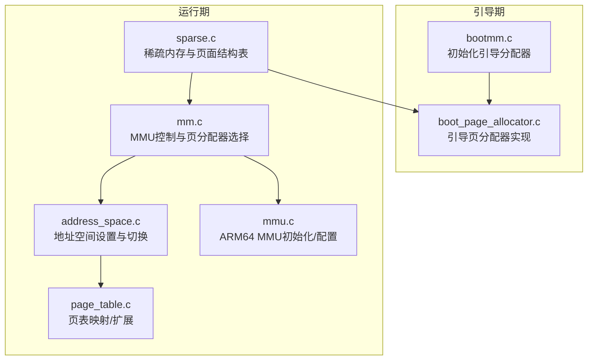
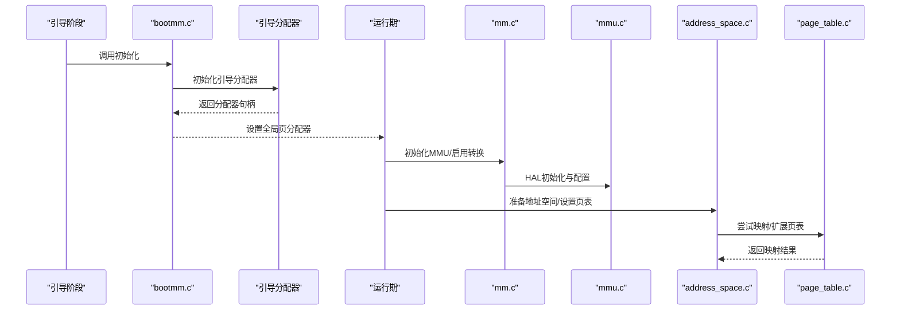
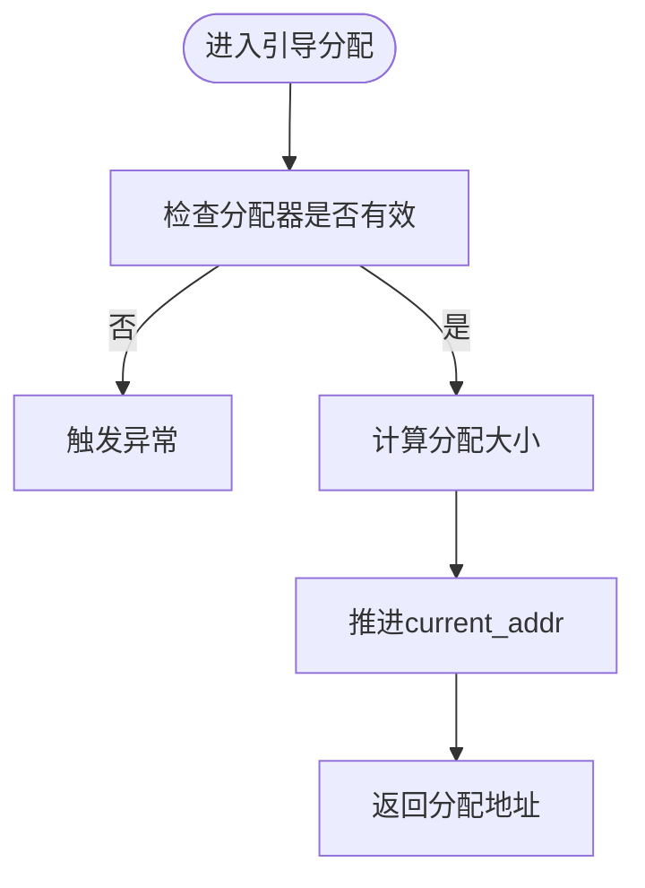
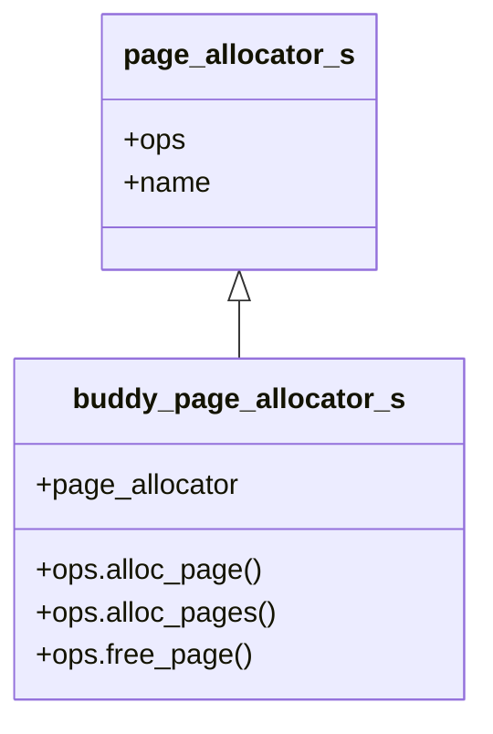
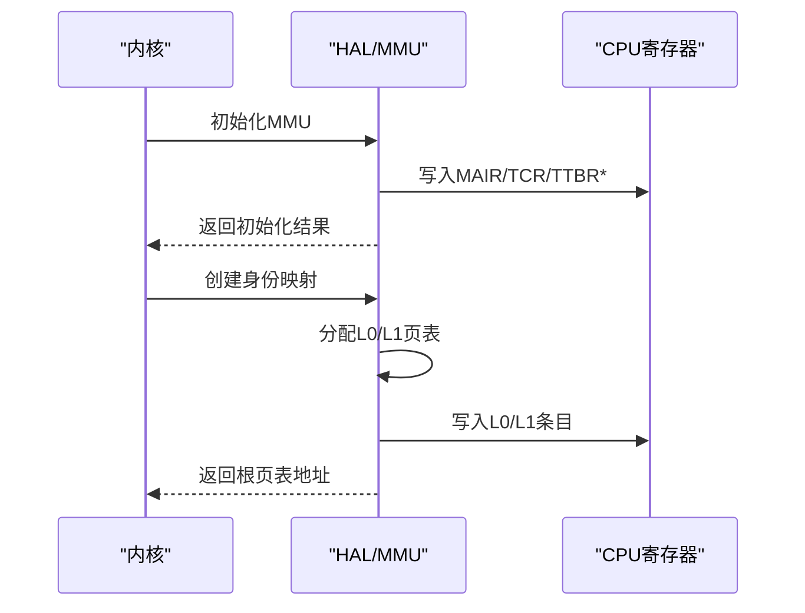
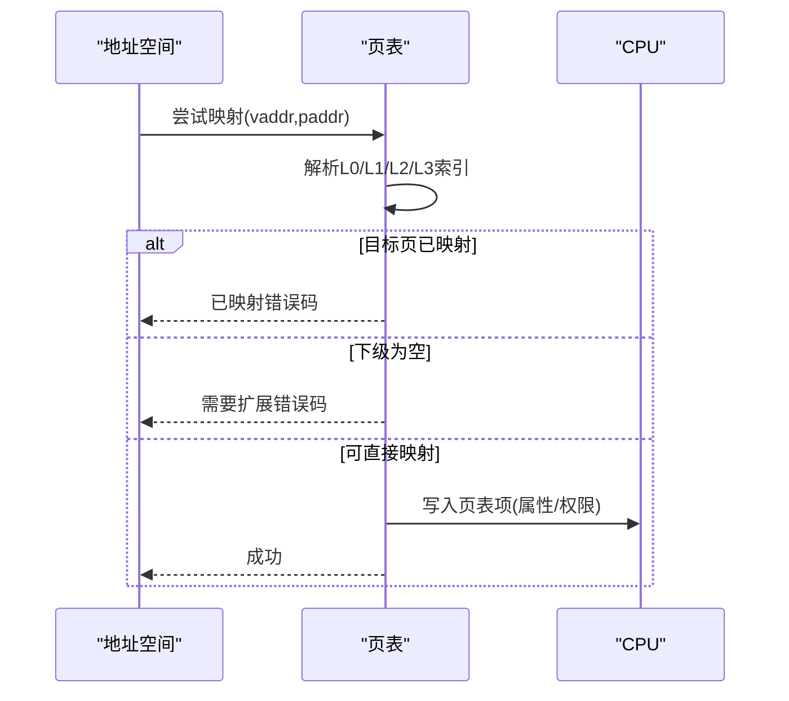
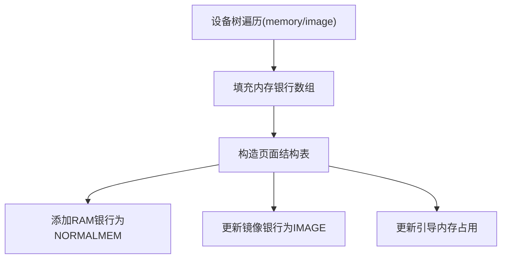

# 内存管理策略

<cite>
**本文引用的文件**
- [bootmm.c](file://boot/mm/bootmm.c)
- [boot_page_allocator.c](file://kernel/mm/impl/boot_page_allocator.c)
- [buddy_page_allocator.c](file://kernel/mm/impl/buddy_page_allocator.c)
- [mm.c](file://kernel/mm/mm.c)
- [address_space.c](file://kernel/mm/address_space.c)
- [sparse.c](file://kernel/mm/sparse.c)
- [bootmm.h](file://kernel/include/mm/bootmm.h)
- [mm.h](file://kernel/include/mm/mm.h)
- [page_allocator.h](file://kernel/include/mm/page_allocator.h)
- [sparse.h](file://kernel/include/mm/sparse.h)
- [page.h](file://kernel/include/mm/page.h)
- [page_struct_tbl.h](file://kernel/include/mm/page_struct_tbl.h)
- [mem_bank.h](file://kernel/include/mm/mem_bank.h)
- [mmu.c](file://kernel/arch/arm64/mmu.c)
- [page_table.c](file://kernel/arch/arm64/page_table.c)
</cite>

## 目录
1. [引言](#引言)
2. [项目结构](#项目结构)
3. [核心组件](#核心组件)
4. [架构总览](#架构总览)
5. [详细组件分析](#详细组件分析)
6. [依赖关系分析](#依赖关系分析)
7. [性能考量](#性能考量)
8. [故障排查指南](#故障排查指南)
9. [结论](#结论)
10. [附录](#附录)

## 引言
本文件系统性梳理 TranquilOS 的内存管理策略，覆盖内核启动阶段的引导分配器与用户态伙伴分配器、分页管理与地址空间组织、内存映射与稀疏内存支持、跨平台内存适配、内存保护与页面权限控制、碎片管理与性能优化、以及内存泄漏防护与配置调优建议。内容以代码为依据，辅以图示帮助理解。

## 项目结构
TranquilOS 将内存管理按“引导期”和“运行期”分层：引导期使用一次性线性增长的引导分配器；运行期通过 HAL 抽象对接具体架构（ARM64），实现页表管理、地址空间切换、映射扩展与去映射等能力，并通过稀疏内存接口组织物理内存银行与页面结构表。

图表来源
- [bootmm.c](file://boot/mm/bootmm.c#L26-L29)
- [boot_page_allocator.c](file://kernel/mm/impl/boot_page_allocator.c#L35-L47)
- [mm.c](file://kernel/mm/mm.c#L29-L45)
- [address_space.c](file://kernel/mm/address_space.c#L51-L81)
- [page_table.c](file://kernel/arch/arm64/page_table.c#L9-L94)
- [mmu.c](file://kernel/arch/arm64/mmu.c#L62-L126)
- [sparse.c](file://kernel/mm/sparse.c#L75-L89)

章节来源
- [bootmm.c](file://boot/mm/bootmm.c#L1-L29)
- [boot_page_allocator.c](file://kernel/mm/impl/boot_page_allocator.c#L1-L47)
- [mm.c](file://kernel/mm/mm.c#L1-L45)
- [address_space.c](file://kernel/mm/address_space.c#L1-L105)
- [page_table.c](file://kernel/arch/arm64/page_table.c#L1-L167)
- [mmu.c](file://kernel/arch/arm64/mmu.c#L1-L231)
- [sparse.c](file://kernel/mm/sparse.c#L1-L104)

## 核心组件
- 引导页分配器：在内核早期阶段提供线性递增的物理页分配，不支持释放，避免复杂性并确保启动路径稳定。
- 运行期页分配器：定义统一的页分配器接口，当前伙伴分配器处于占位实现，后续可替换为实际伙伴算法。
- MMU/HAL 层：抽象出 MMU 初始化、使能/禁用、页表寄存器设置、内存属性配置等通用操作。
- 地址空间管理：负责用户/内核页表切换、TLB 无效化、页映射尝试与扩展。
- 稀疏内存与页面结构表：解析设备树中的内存银行，构建页面类型表，区分镜像、普通 RAM、引导内存等类型。

章节来源
- [page_allocator.h](file://kernel/include/mm/page_allocator.h#L8-L23)
- [boot_page_allocator.c](file://kernel/mm/impl/boot_page_allocator.c#L35-L47)
- [buddy_page_allocator.c](file://kernel/mm/impl/buddy_page_allocator.c#L21-L27)
- [mm.c](file://kernel/mm/mm.c#L29-L45)
- [address_space.c](file://kernel/mm/address_space.c#L9-L49)
- [sparse.h](file://kernel/include/mm/sparse.h#L8-L16)
- [sparse.c](file://kernel/mm/sparse.c#L52-L89)

## 架构总览
TranquilOS 的内存管理采用“引导期一次性分配 + 运行期 HAL 抽象 + 稀疏内存组织”的分层设计。引导期通过引导分配器完成内核早期数据结构与页表的分配；运行期通过 HAL 实现 ARM64 的 MMU 配置与页表操作；稀疏内存模块负责物理内存的发现与分类，为伙伴分配器与映射策略提供基础。

图表来源
- [bootmm.c](file://boot/mm/bootmm.c#L26-L29)
- [boot_page_allocator.c](file://kernel/mm/impl/boot_page_allocator.c#L35-L47)
- [mm.c](file://kernel/mm/mm.c#L29-L45)
- [mmu.c](file://kernel/arch/arm64/mmu.c#L62-L126)
- [address_space.c](file://kernel/mm/address_space.c#L51-L81)
- [page_table.c](file://kernel/arch/arm64/page_table.c#L9-L94)

## 详细组件分析

### 引导页分配器（Boot Page Allocator）
- 设计要点
  - 线性增长的指针推进式分配，不维护空闲链表，适合启动期一次性分配。
  - 不支持释放，避免早期复杂性；后续由伙伴分配器接管。
  - 通过宏或链接脚本确定起始地址，保证分配连续且可被早期映射。
- 关键流程
  - 初始化时填充 ops 指针，标记启用状态。
  - 分配函数根据页数计算偏移并推进 current_addr。
  - 释放函数为空实现，体现“不可回收”。

图表来源
- [boot_page_allocator.c](file://kernel/mm/impl/boot_page_allocator.c#L7-L24)

章节来源
- [boot_page_allocator.c](file://kernel/mm/impl/boot_page_allocator.c#L1-L47)
- [bootmm.c](file://boot/mm/bootmm.c#L20-L29)
- [bootmm.h](file://kernel/include/mm/bootmm.h#L7-L11)

### 运行期页分配器接口与伙伴分配器占位
- 接口设计
  - 统一的页分配器结构体包含分配/批量分配/释放三个函数指针，便于替换实现。
- 伙伴分配器现状
  - 当前实现为占位，尚未完成具体算法；后续需完善空闲块合并、分裂与选择策略。
- 使用方式
  - 启动完成后，运行期通过 HAL 获取页分配器实例进行映射与内核数据结构分配。

图表来源
- [page_allocator.h](file://kernel/include/mm/page_allocator.h#L12-L23)
- [buddy_page_allocator.c](file://kernel/mm/impl/buddy_page_allocator.c#L21-L27)

章节来源
- [page_allocator.h](file://kernel/include/mm/page_allocator.h#L1-L23)
- [buddy_page_allocator.c](file://kernel/mm/impl/buddy_page_allocator.c#L1-L27)

### MMU 初始化与页表配置（ARM64）
- MMU 初始化
  - 清空页表寄存器，配置 MAIR（内存属性），读取 ID_AA64MMFR0 并校验粒度支持。
  - 配置 TCR（转换控制寄存器）：粒度、共享域、缓存属性、地址空间大小等。
  - 使能/禁用 MMU，执行内存屏障同步。
- 页表配置
  - 提供创建“身份映射”的能力，按特权级别设置 UXN/PXN/AP 等位。
  - 返回根页表地址，供上层准备地址空间使用。

图表来源
- [mmu.c](file://kernel/arch/arm64/mmu.c#L62-L126)
- [mmu.c](file://kernel/arch/arm64/mmu.c#L161-L222)

章节来源
- [mmu.c](file://kernel/arch/arm64/mmu.c#L1-L231)

### 地址空间与页表映射
- 地址空间设置
  - 支持切换内核/用户页表，必要时更新 CPU 本地存储的内核地址空间范围。
  - 切换后统一执行 TLB 全部无效化，确保一致性。
- 映射与扩展
  - 尝试映射单页：逐级解析 L0/L1/L2/L3，若目标项无效且下级为空则返回需要先扩展。
  - 扩展页表：在各级未生效的入口处写入指向新页表的条目。
  - 去映射：预留实现，当前返回成功。

图表来源
- [address_space.c](file://kernel/mm/address_space.c#L59-L81)
- [page_table.c](file://kernel/arch/arm64/page_table.c#L9-L94)
- [page_table.c](file://kernel/arch/arm64/page_table.c#L96-L167)

章节来源
- [address_space.c](file://kernel/mm/address_space.c#L1-L105)
- [page_table.c](file://kernel/arch/arm64/page_table.c#L1-L167)

### 稀疏内存与页面结构表
- 内存银行解析
  - 从设备树遍历“memory”节点，收集 RAM 银行；同时收集“image”类型的内存段。
- 页面结构表
  - 构造页面结构表，将 RAM 银行注册为普通内存，将镜像段注册为镜像类型。
  - 更新引导内存占用：基于引导分配器的起始与当前地址，更新为引导内存类型。
- 接口职责
  - 对外暴露获取节点、初始化内存银行、获取引导内存起点、初始化页面结构表等。

图表来源
- [sparse.c](file://kernel/mm/sparse.c#L26-L62)
- [sparse.c](file://kernel/mm/sparse.c#L75-L89)
- [sparse.c](file://kernel/mm/sparse.c#L91-L104)

章节来源
- [sparse.c](file://kernel/mm/sparse.c#L1-L104)
- [sparse.h](file://kernel/include/mm/sparse.h#L8-L16)
- [page_struct_tbl.h](file://kernel/include/mm/page_struct_tbl.h#L7-L47)
- [mem_bank.h](file://kernel/include/mm/mem_bank.h#L8-L21)

### 页面与标志位
- 页面结构
  - 包含魔数、引用计数、物理地址、标志位集合与空闲链表节点。
- 标志位
  - 通过位域组织 GFP 标志，如用户态/内核态、来源子系统、分配阶数等，便于后续伙伴分配器决策。

章节来源
- [page.h](file://kernel/include/mm/page.h#L12-L31)

## 依赖关系分析
- 组件耦合
  - 引导分配器与运行期 MMU/HAL 解耦：引导阶段仅负责一次性分配，不依赖伙伴分配器。
  - 地址空间与页表实现依赖 HAL 抽象，便于移植到不同架构。
  - 稀疏内存模块向上提供页面结构表，向下依赖设备树解析与页分配器。
- 外部依赖
  - ARM64 寄存器与指令集特性（如 MAIR/TCR/TB/TTBR 等）。
  - 设备树（Device Tree）用于发现物理内存布局。

图表来源
- [boot_page_allocator.c](file://kernel/mm/impl/boot_page_allocator.c#L35-L47)
- [mm.c](file://kernel/mm/mm.c#L29-L45)
- [mmu.c](file://kernel/arch/arm64/mmu.c#L62-L126)
- [address_space.c](file://kernel/mm/address_space.c#L51-L81)
- [page_table.c](file://kernel/arch/arm64/page_table.c#L9-L94)
- [sparse.c](file://kernel/mm/sparse.c#L75-L89)

章节来源
- [page_allocator.h](file://kernel/include/mm/page_allocator.h#L1-L23)
- [mm.h](file://kernel/include/mm/mm.h#L1-L23)

## 性能考量
- 启动期分配
  - 引导分配器线性推进，避免锁与碎片，提升早期启动速度。
- 页表映射
  - 逐级查找与扩展，尽量减少重复分配；映射时按地址范围选择合适属性，避免不必要的属性切换。
- 缓存与内存属性
  - MAIR 中区分设备内存与普通缓存内存，合理设置缓存策略以平衡性能与一致性。
- 伙伴分配器优化（待实现）
  - 建议采用多空闲列表（按阶组织）、NUMA 友好分配、延迟合并与碎片控制策略。

## 故障排查指南
- 引导分配器相关
  - 若出现“分配器为空”或“引导分配器未启用”，检查引导初始化顺序与全局分配器设置。
  - 确认链接脚本中引导内存区段的起始地址与对齐。
- MMU/页表相关
  - 若映射失败返回“下级为空”，需先调用扩展页表接口分配并填写下级页表。
  - 若映射失败返回“已映射”，检查虚拟地址冲突或权限设置。
  - 切换地址空间后必须执行 TLB 全部无效化，否则会出现访问异常。
- 稀疏内存相关
  - 若页面结构表未正确登记 RAM/镜像段，检查设备树节点与遍历回调。
  - 引导内存更新失败时，确认引导分配器已初始化且当前地址已推进。

章节来源
- [boot_page_allocator.c](file://kernel/mm/impl/boot_page_allocator.c#L8-L14)
- [address_space.c](file://kernel/mm/address_space.c#L32-L49)
- [page_table.c](file://kernel/arch/arm64/page_table.c#L16-L23)
- [sparse.c](file://kernel/mm/sparse.c#L91-L104)

## 结论
TranquilOS 的内存管理以“引导期一次性分配 + 运行期 HAL 抽象 + 稀疏内存组织”为核心，既保证了早期启动的简洁可靠，又为后续伙伴分配器与更复杂的内存策略预留了清晰接口。ARM64 架构下的 MMU 初始化与页表操作通过 HAL 完成跨平台适配。建议尽快完善伙伴分配器实现与映射去映射逻辑，以满足运行期动态内存管理需求。

## 附录

### 配置选项与调优建议
- MMU 配置
  - MAIR：根据设备内存与普通内存分别设置属性，避免错误缓存策略导致性能下降。
  - TCR：根据平台物理地址位宽与地址空间划分调整粒度与视图大小。
- 页表策略
  - 优先使用大页映射减少页表层级与 TLB 压力；对频繁变更区域保持小页映射灵活性。
- 分配器策略（建议）
  - 伙伴分配器：采用多空闲链表、NUMA 亲和、碎片阈值控制与延迟合并。
  - 分配标志：结合 GFP 标志细化分配策略（如用户态/内核态、可抢占等）。
- 稀疏内存
  - 确保设备树完整，覆盖所有 RAM 与镜像段；定期刷新页面结构表以反映热插拔或动态变化。