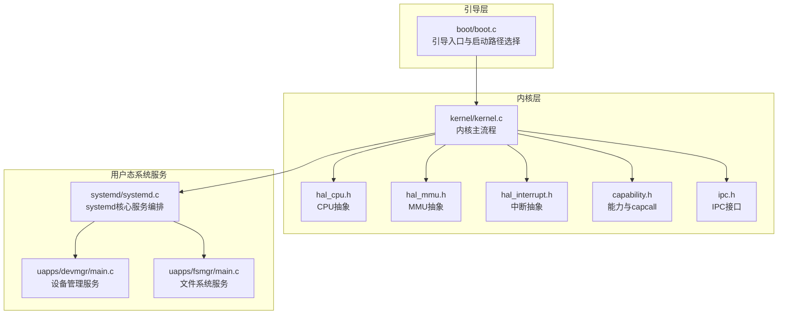
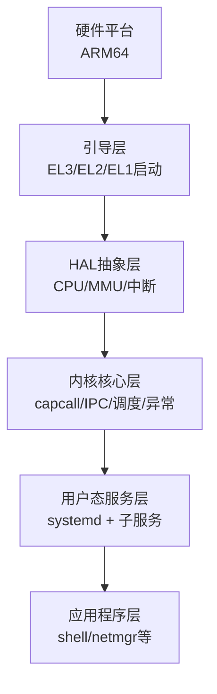
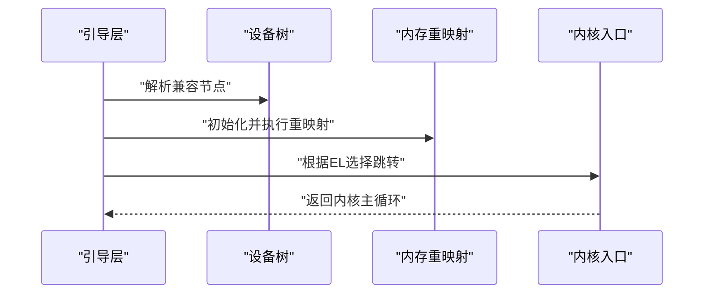
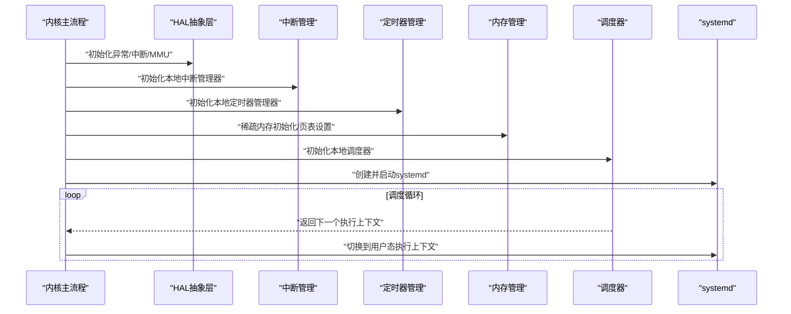
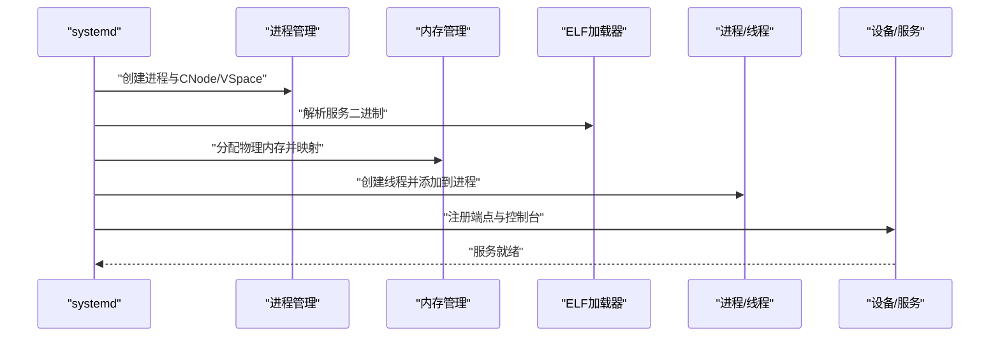
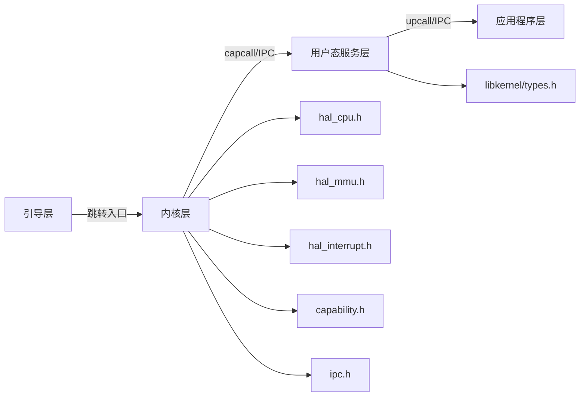

# 分层架构设计

<cite>
**本文引用的文件**
- [README.md](file://README.md)
- [microkernel_design.md](file://docs/kernel/microkernel_design.md)
- [boot.c](file://boot/boot.c)
- [boot.h](file://boot/include/boot.h)
- [kernel.c](file://kernel/kernel.c)
- [core.h](file://kernel/include/core.h)
- [hal_cpu.h](file://kernel/include/arch/generic/hal_cpu.h)
- [hal_mmu.h](file://kernel/include/arch/generic/hal_mmu.h)
- [hal_interrupt.h](file://kernel/include/arch/generic/hal_interrupt.h)
- [capability.h](file://kernel/include/capability/capability.h)
- [ipc.h](file://kernel/include/ipc/ipc.h)
- [systemd.c](file://kernel/systemd/systemd.c)
- [main.c(devmgr)](file://uapps/devmgr/main.c)
- [main.c(fsmgr)](file://uapps/fsmgr/main.c)
- [types.h(libkernel)](file://ulibs/include/libkernel/types.h)
</cite>

## 目录
1. [引言](#引言)
2. [项目结构](#项目结构)
3. [核心组件](#核心组件)
4. [架构总览](#架构总览)
5. [详细组件分析](#详细组件分析)
6. [依赖分析](#依赖分析)
7. [性能考量](#性能考量)
8. [故障排查指南](#故障排查指南)
9. [结论](#结论)
10. [附录](#附录)

## 引言
本文件面向TranquilOS的分层架构设计，系统性梳理从底层硬件抽象层到顶层用户态服务层的技术栈与职责边界，阐明各层接口契约、数据流向与层间通信机制，并给出扩展性与最佳实践建议。TranquilOS采用微内核范式，内核仅保留最小集能力，内存管理、进程/线程管理、设备与文件系统等核心服务由用户态systemd及其子服务完成，形成“内核极简、服务外置”的清晰分层。

## 项目结构
TranquilOS代码库按“引导层 → 内核层 → 用户态系统服务 → 应用程序”进行分层组织：
- 引导层：负责从EL3/EL2/EL1启动路径选择、设备树解析、内存重映射与跳转至内核或hypervisor。
- 内核层：提供HAL抽象、中断/异常/MMU、调度、IPC、能力(capability)与系统调用(capcall)等基础设施。
- 用户态系统服务：systemd作为核心协调者，拉起devmgr、fsmgr、idle、shell、netmgr等服务。
- 应用程序：用户态应用通过systemd提供的客户端接口与服务交互。

图表来源
- [boot.c](file://boot/boot.c#L1-L176)
- [kernel.c](file://kernel/kernel.c#L1-L225)
- [systemd.c](file://kernel/systemd/systemd.c#L1-L247)
- [main.c(devmgr)](file://uapps/devmgr/main.c#L1-L18)
- [main.c(fsmgr)](file://uapps/fsmgr/main.c#L1-L38)
- [hal_cpu.h](file://kernel/include/arch/generic/hal_cpu.h#L1-L38)
- [hal_mmu.h](file://kernel/include/arch/generic/hal_mmu.h#L1-L28)
- [hal_interrupt.h](file://kernel/include/arch/generic/hal_interrupt.h#L1-L30)
- [capability.h](file://kernel/include/capability/capability.h#L1-L26)
- [ipc.h](file://kernel/include/ipc/ipc.h#L1-L13)

章节来源
- [README.md](file://README.md#L1-L42)
- [microkernel_design.md](file://docs/kernel/microkernel_design.md#L1-L37)

## 核心组件
- 引导层组件
  - 启动路径选择：支持EL3/EL2/EL1三种启动路径，依据设备树中的兼容属性决定执行路径。
  - 设备树解析与内存重映射：初始化设备树、早期设备、内存重映射后跳转至内核或hypervisor。
  - 多核唤醒：遍历CPU节点并通过PSCI启用次核。
- 内核层组件
  - HAL抽象：CPU特权级、本地存储、事件同步；MMU配置与页表设置；中断使能/禁用与状态保存恢复。
  - 能力与capcall：内核对象的细粒度权限模型与基于能力的系统调用分发。
  - IPC：快速控制流切换的进程间通信机制，避免依赖调度器行为，提升实时性。
  - 核心初始化：设备树、中断、定时器、内存、调度器、模块初始化，最终启动systemd。
- 用户态系统服务
  - systemd：核心服务编排，负责内存管理、进程/线程管理、IPC管理、服务部署与线性映射、控制台与端点创建、upcall注册等。
  - devmgr：设备管理与显示管理服务。
  - fsmgr：文件系统服务，包含rootfs、procfs、sysfs与upcall处理页面错误。
- 应用程序
  - shell、netmgr等应用通过systemd客户端接口与systemd及各服务交互。

章节来源
- [boot.c](file://boot/boot.c#L1-L176)
- [kernel.c](file://kernel/kernel.c#L1-L225)
- [systemd.c](file://kernel/systemd/systemd.c#L1-L247)
- [main.c(devmgr)](file://uapps/devmgr/main.c#L1-L18)
- [main.c(fsmgr)](file://uapps/fsmgr/main.c#L1-L38)
- [hal_cpu.h](file://kernel/include/arch/generic/hal_cpu.h#L1-L38)
- [hal_mmu.h](file://kernel/include/arch/generic/hal_mmu.h#L1-L28)
- [hal_interrupt.h](file://kernel/include/arch/generic/hal_interrupt.h#L1-L30)
- [capability.h](file://kernel/include/capability/capability.h#L1-L26)
- [ipc.h](file://kernel/include/ipc/ipc.h#L1-L13)

## 架构总览
TranquilOS采用“引导层 → 内核层 → 用户态系统服务 → 应用程序”的四层分层架构：
- 硬件抽象层(HAL)：提供CPU、MMU、中断的通用抽象，屏蔽平台差异。
- 内核核心层：实现capcall、IPC、调度、异常与中断处理、内存管理基础设施。
- 用户态服务层：systemd及其子服务，承担进程/线程、内存、IPC、设备与文件系统等核心功能。
- 应用程序层：用户态应用通过systemd与服务交互，遵循能力模型与IPC协议。

图表来源
- [boot.c](file://boot/boot.c#L1-L176)
- [kernel.c](file://kernel/kernel.c#L1-L225)
- [systemd.c](file://kernel/systemd/systemd.c#L1-L247)
- [hal_cpu.h](file://kernel/include/arch/generic/hal_cpu.h#L1-L38)
- [hal_mmu.h](file://kernel/include/arch/generic/hal_mmu.h#L1-L28)
- [hal_interrupt.h](file://kernel/include/arch/generic/hal_interrupt.h#L1-L30)
- [capability.h](file://kernel/include/capability/capability.h#L1-L26)
- [ipc.h](file://kernel/include/ipc/ipc.h#L1-L13)

## 详细组件分析

### 引导层（Boot）
- 职责
  - 解析设备树，定位内核/Hypervisor镜像地址。
  - 初始化内存重映射，确保内核以虚拟地址访问。
  - 支持多核启动：通过PSCI唤醒次核。
  - 根据当前EL选择跳转路径：EL3/EL2/EL1。
- 接口与数据流
  - 输入：DTB地址、CPU特权级。
  - 输出：跳转至内核或hypervisor入口。
- 关键路径
  - EL1启动：初始化设备树、早期设备、关键设备，打印引导信息，完成内存重映射后跳转内核。
  - EL2启动：从hypervisor入口进入，再跳转内核。
  - EL3启动：初始化安全寄存器，准备后续EL2/EL1流程。

图表来源
- [boot.c](file://boot/boot.c#L34-L107)

章节来源
- [boot.c](file://boot/boot.c#L1-L176)
- [boot.h](file://boot/include/boot.h#L1-L8)

### 内核核心层（Kernel Core）
- 职责
  - HAL抽象：CPU特权级、本地存储、事件同步；MMU配置与页表设置；中断使能/禁用与状态保存恢复。
  - 能力与capcall：内核对象的细粒度权限模型与基于能力的系统调用分发。
  - IPC：快速控制流切换的进程间通信机制。
  - 核心初始化：设备树、中断、定时器、内存、调度器、模块初始化，最终启动systemd。
- 接口与数据流
  - HAL接口：hal_cpu_*、hal_mmu_*、hal_irq_*。
  - 能力接口：capability_header、capability、cap_call_dispatch、cap_call_return。
  - IPC接口：ipc_call_with_args、ipc_reply_with_ret。
  - 数据流：内核主流程初始化各子系统，生成根CNode与地址空间，创建systemd进程并启动。
- 关键路径
  - 主核启动：初始化设备树、中断、定时器、内存、调度器、模块，创建systemd并启动。
  - 次核启动：等待主核完成早期初始化，随后进入调度循环。

图表来源
- [kernel.c](file://kernel/kernel.c#L125-L224)
- [hal_cpu.h](file://kernel/include/arch/generic/hal_cpu.h#L1-L38)
- [hal_mmu.h](file://kernel/include/arch/generic/hal_mmu.h#L1-L28)
- [hal_interrupt.h](file://kernel/include/arch/generic/hal_interrupt.h#L1-L30)
- [capability.h](file://kernel/include/capability/capability.h#L1-L26)
- [ipc.h](file://kernel/include/ipc/ipc.h#L1-L13)

章节来源
- [kernel.c](file://kernel/kernel.c#L1-L225)
- [core.h](file://kernel/include/core.h#L1-L9)
- [hal_cpu.h](file://kernel/include/arch/generic/hal_cpu.h#L1-L38)
- [hal_mmu.h](file://kernel/include/arch/generic/hal_mmu.h#L1-L28)
- [hal_interrupt.h](file://kernel/include/arch/generic/hal_interrupt.h#L1-L30)
- [capability.h](file://kernel/include/capability/capability.h#L1-L26)
- [ipc.h](file://kernel/include/ipc/ipc.h#L1-L13)

### 用户态服务层（Systemd与子服务）
- systemd
  - 职责：内存管理、进程/线程管理、IPC管理、服务部署、线性映射、控制台与端点创建、upcall注册。
  - 服务编排：定义核心服务列表（devmgr、fsmgr、idle、shell、netmgr），按部署模式创建进程、线程并运行。
  - 映射策略：对服务二进制进行物理内存分配与映射，支持线性映射范围。
- 子服务
  - devmgr：初始化显示管理器、设备与服务。
  - fsmgr：初始化rootfs、procfs、sysfs，注册upcall处理页面错误。
- 接口与数据流
  - systemd通过capcall与内核交互，使用ELF加载器解析服务二进制，通过内存管理器分配物理内存并映射到进程虚拟地址空间。
  - 服务通过systemd客户端接口与systemd交互，实现命名服务端点与控制台创建。

图表来源
- [systemd.c](file://kernel/systemd/systemd.c#L76-L205)
- [main.c(devmgr)](file://uapps/devmgr/main.c#L1-L18)
- [main.c(fsmgr)](file://uapps/fsmgr/main.c#L1-L38)

章节来源
- [systemd.c](file://kernel/systemd/systemd.c#L1-L247)
- [main.c(devmgr)](file://uapps/devmgr/main.c#L1-L18)
- [main.c(fsmgr)](file://uapps/fsmgr/main.c#L1-L38)

### 应用程序层（Shell/Netmgr等）
- 职责：通过systemd客户端接口与systemd及各服务交互，实现具体业务逻辑。
- 接口与数据流：应用程序通过systemd提供的客户端库发起请求，systemd转发至对应服务，服务通过upcall或IPC返回结果。

章节来源
- [main.c(fsmgr)](file://uapps/fsmgr/main.c#L1-L38)

## 依赖分析
- 层间依赖
  - 引导层依赖设备树与平台寄存器，输出内核入口地址。
  - 内核层依赖HAL抽象，向上提供capcall与IPC，向下依赖中断/异常/MMU。
  - 用户态服务层依赖内核capcall/IPC，向下依赖systemd客户端接口。
  - 应用程序层依赖systemd客户端接口与服务端点。
- 接口契约
  - HAL接口：CPU特权级查询、事件同步、MMU配置、中断开关与状态保存。
  - 能力接口：capability_header与capability结构体定义权限位与物理地址，cap_call_dispatch/return用于系统调用分发与返回。
  - IPC接口：ipc_call_with_args用于调用端点，ipc_reply_with_ret用于返回结果。
  - 类型约定：libkernel/types.h定义映射结果枚举，便于上层判断映射状态。

图表来源
- [boot.c](file://boot/boot.c#L1-L176)
- [kernel.c](file://kernel/kernel.c#L1-L225)
- [systemd.c](file://kernel/systemd/systemd.c#L1-L247)
- [hal_cpu.h](file://kernel/include/arch/generic/hal_cpu.h#L1-L38)
- [hal_mmu.h](file://kernel/include/arch/generic/hal_mmu.h#L1-L28)
- [hal_interrupt.h](file://kernel/include/arch/generic/hal_interrupt.h#L1-L30)
- [capability.h](file://kernel/include/capability/capability.h#L1-L26)
- [ipc.h](file://kernel/include/ipc/ipc.h#L1-L13)
- [types.h(libkernel)](file://ulibs/include/libkernel/types.h#L1-L76)

章节来源
- [hal_cpu.h](file://kernel/include/arch/generic/hal_cpu.h#L1-L38)
- [hal_mmu.h](file://kernel/include/arch/generic/hal_mmu.h#L1-L28)
- [hal_interrupt.h](file://kernel/include/arch/generic/hal_interrupt.h#L1-L30)
- [capability.h](file://kernel/include/capability/capability.h#L1-L26)
- [ipc.h](file://kernel/include/ipc/ipc.h#L1-L13)
- [types.h(libkernel)](file://ulibs/include/libkernel/types.h#L1-L76)

## 性能考量
- 中断与异常处理
  - 使用HAL中断抽象统一屏蔽平台差异，减少上下文切换开销。
- IPC优化
  - 基于能力的IPC避免调度器参与，降低延迟，提升实时性。
- 内存映射
  - 早期使用boot allocator，systemd接管后采用伙伴分配器与稀疏内存管理，平衡碎片与性能。
- 调度与多核
  - 多核通过PSCI唤醒，配合本地定时器与tick timer，保证时钟一致性与负载均衡。

## 故障排查指南
- 启动失败
  - 检查设备树中兼容节点是否存在，确认内核/Hypervisor地址解析正确。
  - 确认内存重映射是否成功，虚拟地址访问是否可用。
- 服务启动失败
  - 查看systemd日志，确认进程创建、CNode/VSpace创建、线性映射与控制台创建是否成功。
  - 检查ELF解析与物理内存分配是否成功，映射结果枚举值是否为成功。
- 页面错误与upcall
  - 在fsmgr中注册upcall处理页面错误，确认upcall入口与回复流程正常。
- 权限与能力
  - 检查capability权限位设置，确保调用方具备相应rights。

章节来源
- [boot.c](file://boot/boot.c#L34-L107)
- [systemd.c](file://kernel/systemd/systemd.c#L76-L205)
- [main.c(fsmgr)](file://uapps/fsmgr/main.c#L10-L15)
- [types.h(libkernel)](file://ulibs/include/libkernel/types.h#L4-L26)

## 结论
TranquilOS通过清晰的四层分层架构实现了“内核极简、服务外置”。引导层负责启动与重映射，内核层提供HAL与capcall/IPC基础设施，用户态systemd及其子服务承担核心系统功能，应用程序通过systemd客户端接口与服务交互。该设计提升了模块化与可维护性，同时通过能力模型与IPC优化保障了性能与实时性。未来可在服务热插拔、内存回收策略与跨平台移植方面进一步增强扩展性。

## 附录
- 扩展性考虑
  - 平台抽象：新增平台只需实现HAL接口，保持内核与服务层不变。
  - 服务扩展：通过systemd服务清单与部署模式扩展新服务。
  - 内存管理：在systemd中引入更精细的内存回收与压缩策略。
- 最佳实践
  - 严格遵循能力模型，最小权限原则授予服务与应用。
  - 使用upcall处理缺页等异常，避免阻塞式等待。
  - 统一使用IPC进行跨进程通信，避免共享内核数据结构。