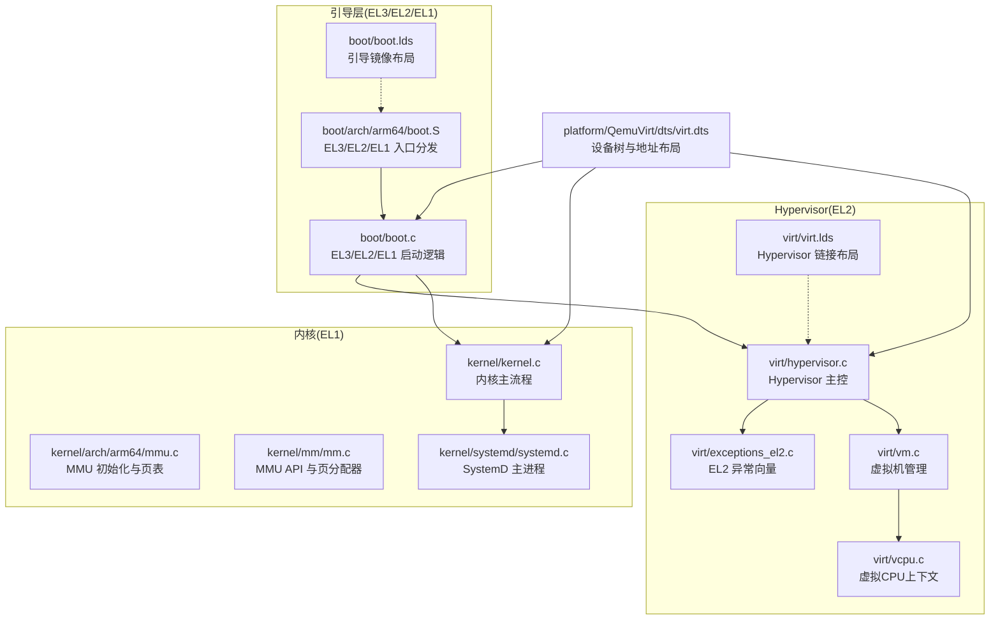
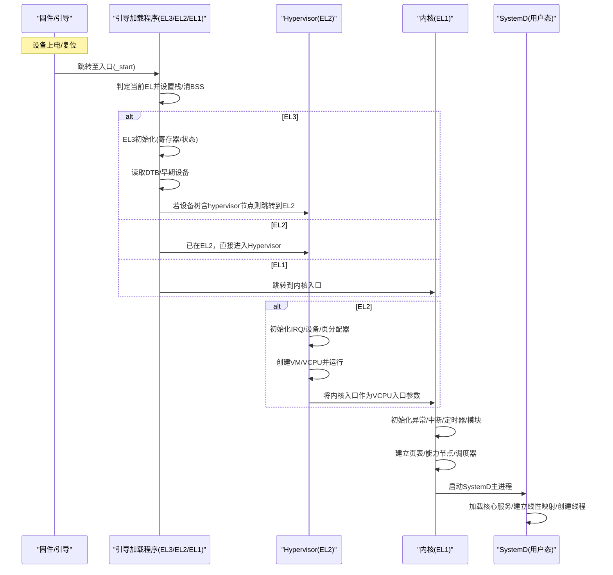
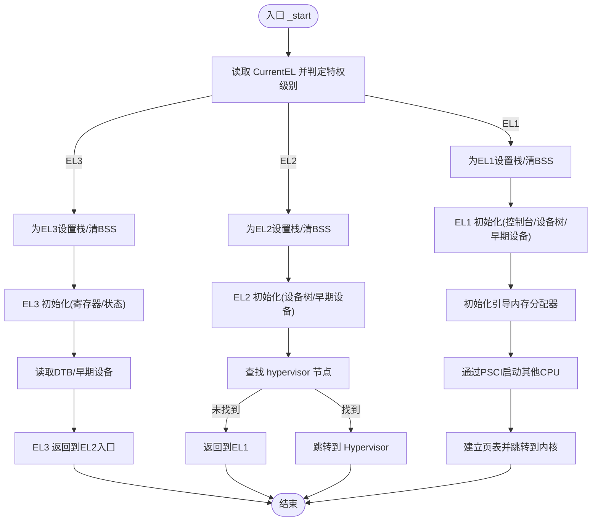
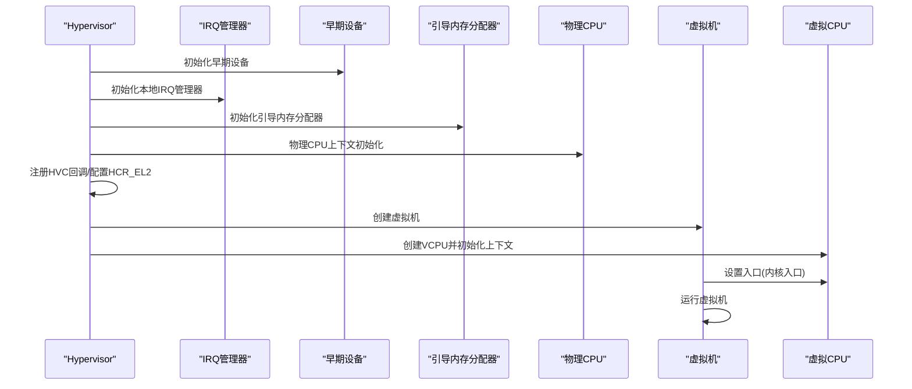
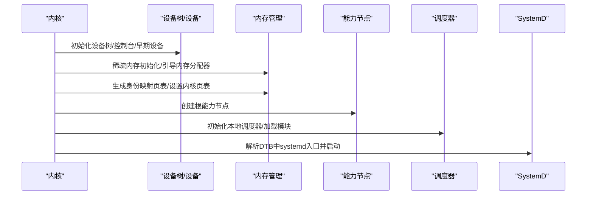
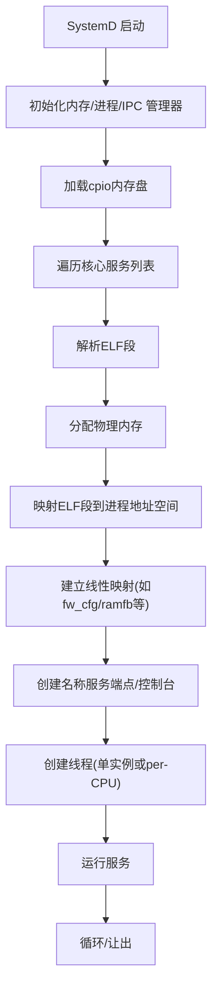
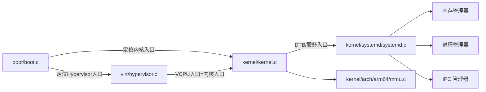

# 启动流程架构

<cite>
**本文引用的文件**
- [boot/boot.c](file://boot/boot.c)
- [boot/arch/arm64/boot.S](file://boot/arch/arm64/boot.S)
- [boot/boot.lds](file://boot/boot.lds)
- [kernel/kernel.c](file://kernel/kernel.c)
- [kernel/arch/arm64/mmu.c](file://kernel/arch/arm64/mmu.c)
- [kernel/mm/mm.c](file://kernel/mm/mm.c)
- [virt/hypervisor.c](file://virt/hypervisor.c)
- [virt/vm.c](file://virt/vm.c)
- [virt/vcpu.c](file://virt/vcpu.c)
- [virt/exceptions_el2.c](file://virt/exceptions_el2.c)
- [virt/virt.lds](file://virt/virt.lds)
- [kernel/systemd/systemd.c](file://kernel/systemd/systemd.c)
- [platform/QemuVirt/dts/virt.dts](file://platform/QemuVirt/dts/virt.dts)
- [README.md](file://README.md)
</cite>

## 目录
1. [引言](#引言)
2. [项目结构](#项目结构)
3. [核心组件](#核心组件)
4. [架构总览](#架构总览)
5. [详细组件分析](#详细组件分析)
6. [依赖关系分析](#依赖关系分析)
7. [性能考量](#性能考量)
8. [故障排查指南](#故障排查指南)
9. [结论](#结论)
10. [附录](#附录)

## 引言
本文件系统性阐述 TranquilOS 的启动流程与架构设计，覆盖以下关键主题：
- 引导加载程序在 EL3/EL2/EL1 多级特权入口的分支逻辑与职责
- Hypervisor（EL2）类型-1 虚拟化启动路径与传统 EL1 启动路径的差异
- 内核初始化：硬件初始化、内存映射建立、中断与定时器子系统、调度器与模块框架
- SystemD 用户态系统服务的装载与启动序列
- 启动阶段的错误处理、故障恢复与调试支持
- 性能分析与优化策略

## 项目结构
TranquilOS 的启动涉及多段代码与链接脚本，按特权级别与功能域划分如下：
- 引导加载程序（EL3/EL2/EL1）：位于 boot/ 目录，包含汇编入口与 C 启动逻辑
- 内核（EL1）：位于 kernel/ 目录，负责硬件抽象、内存管理、调度与系统服务集成
- Hypervisor（EL2）：位于 virt/ 目录，实现类型-1 虚拟化宿主与虚拟机/VCPU 管理
- 设备树与平台定义：位于 platform/QemuVirt/dts/ 与各平台链接脚本
- SystemD 用户态服务：位于 kernel/systemd/ 目录，负责核心系统服务的加载与运行

**图表来源**
- [boot/arch/arm64/boot.S](file://boot/arch/arm64/boot.S#L1-L115)
- [boot/boot.c](file://boot/boot.c#L1-L176)
- [boot/boot.lds](file://boot/boot.lds#L1-L73)
- [kernel/kernel.c](file://kernel/kernel.c#L1-L225)
- [kernel/arch/arm64/mmu.c](file://kernel/arch/arm64/mmu.c#L1-L231)
- [kernel/mm/mm.c](file://kernel/mm/mm.c#L1-L45)
- [virt/hypervisor.c](file://virt/hypervisor.c#L1-L149)
- [virt/vm.c](file://virt/vm.c#L1-L59)
- [virt/vcpu.c](file://virt/vcpu.c#L1-L66)
- [virt/exceptions_el2.c](file://virt/exceptions_el2.c#L1-L138)
- [virt/virt.lds](file://virt/virt.lds#L1-L70)
- [kernel/systemd/systemd.c](file://kernel/systemd/systemd.c#L1-L247)
- [platform/QemuVirt/dts/virt.dts](file://platform/QemuVirt/dts/virt.dts#L1-L468)

**章节来源**
- [boot/arch/arm64/boot.S](file://boot/arch/arm64/boot.S#L1-L115)
- [boot/boot.c](file://boot/boot.c#L1-L176)
- [boot/boot.lds](file://boot/boot.lds#L1-L73)
- [kernel/kernel.c](file://kernel/kernel.c#L1-L225)
- [kernel/arch/arm64/mmu.c](file://kernel/arch/arm64/mmu.c#L1-L231)
- [kernel/mm/mm.c](file://kernel/mm/mm.c#L1-L45)
- [virt/hypervisor.c](file://virt/hypervisor.c#L1-L149)
- [virt/vm.c](file://virt/vm.c#L1-L59)
- [virt/vcpu.c](file://virt/vcpu.c#L1-L66)
- [virt/exceptions_el2.c](file://virt/exceptions_el2.c#L1-L138)
- [virt/virt.lds](file://virt/virt.lds#L1-L70)
- [kernel/systemd/systemd.c](file://kernel/systemd/systemd.c#L1-L247)
- [platform/QemuVirt/dts/virt.dts](file://platform/QemuVirt/dts/virt.dts#L1-L468)

## 核心组件
- 引导加载程序（EL3/EL2/EL1）
  - 汇编入口根据当前特权级别选择对应启动路径，完成栈设置、BSS 清零与 CPU 编号计算
  - C 层实现 EL3/EL2/EL1 的差异化初始化与跳转逻辑
- Hypervisor（EL2）
  - 解析设备树，初始化中断与早期设备，建立物理 CPU 上下文
  - 注册 HVC 回调，配置 HCR_EL2，创建虚拟机与 VCPU 并运行
- 内核（EL1）
  - 初始化异常、中断、定时器、本地设备与模块框架
  - 建立身份映射页表，设置内核/用户页表，创建根能力节点与调度器
  - 启动 SystemD 主进程
- SystemD（用户态）
  - 初始化内存/进程/IPC 管理器，解析核心服务列表，从 cpio 内存盘装载 ELF，建立线性映射与控制端点，创建线程并运行

**章节来源**
- [boot/arch/arm64/boot.S](file://boot/arch/arm64/boot.S#L1-L115)
- [boot/boot.c](file://boot/boot.c#L1-L176)
- [virt/hypervisor.c](file://virt/hypervisor.c#L1-L149)
- [kernel/kernel.c](file://kernel/kernel.c#L1-L225)
- [kernel/systemd/systemd.c](file://kernel/systemd/systemd.c#L1-L247)

## 架构总览
下图展示两种启动模式的总体流程：传统 EL1 启动与 EL2 类型-1 虚拟化启动。

**图表来源**
- [boot/arch/arm64/boot.S](file://boot/arch/arm64/boot.S#L1-L115)
- [boot/boot.c](file://boot/boot.c#L1-L176)
- [virt/hypervisor.c](file://virt/hypervisor.c#L1-L149)
- [kernel/kernel.c](file://kernel/kernel.c#L1-L225)
- [kernel/systemd/systemd.c](file://kernel/systemd/systemd.c#L1-L247)

## 详细组件分析

### 组件A：引导加载程序（EL3/EL2/EL1）
- 功能职责
  - 汇编入口根据 CurrentEL 分派到对应 EL 的启动函数
  - 为每个 EL 分配独立栈空间，清零 BSS 区域
  - EL1/EL2/EL3 分别执行差异化初始化：设备树解析、早期设备、页分配器等
  - 在 EL1 下定位内核入口并跳转；在 EL2 下定位 Hypervisor 并跳转
- 关键流程
  - EL3：初始化安全寄存器与异常返回地址，读取 DTB 并打印调试信息
  - EL2：解析 DTB，查找“tranquil,hypervisor”节点，若存在则跳转到 Hypervisor
  - EL1：初始化控制台、设备树、早期设备与关键设备；初始化引导内存分配器；遍历 CPU 节点并通过 PSCI 启动其他 CPU；建立页表并跳转到内核入口

**图表来源**
- [boot/arch/arm64/boot.S](file://boot/arch/arm64/boot.S#L1-L115)
- [boot/boot.c](file://boot/boot.c#L1-L176)

**章节来源**
- [boot/arch/arm64/boot.S](file://boot/arch/arm64/boot.S#L1-L115)
- [boot/boot.c](file://boot/boot.c#L1-L176)

### 组件B：Hypervisor（EL2 类型-1 虚拟化）
- 功能职责
  - 解析设备树，初始化 IRQ 管理器与早期设备
  - 注册 HVC 回调，配置 HCR_EL2，创建物理 CPU 上下文
  - 构建虚拟机与 VCPU，将内核入口作为 VCPU 入口参数，运行虚拟机
- 关键流程
  - 初始化阶段：禁用中断，打印版本信息，初始化 IRQ 与早期设备，引导内存分配器，物理 CPU 初始化
  - 异常向量：注册 EL2 异常表，启用异常处理
  - 运行阶段：创建 VM/VCPU，解析 DTB 与“tranquil,boot”入口，运行 VM 并等待

**图表来源**
- [virt/hypervisor.c](file://virt/hypervisor.c#L1-L149)
- [virt/vm.c](file://virt/vm.c#L1-L59)
- [virt/vcpu.c](file://virt/vcpu.c#L1-L66)
- [virt/exceptions_el2.c](file://virt/exceptions_el2.c#L1-L138)

**章节来源**
- [virt/hypervisor.c](file://virt/hypervisor.c#L1-L149)
- [virt/vm.c](file://virt/vm.c#L1-L59)
- [virt/vcpu.c](file://virt/vcpu.c#L1-L66)
- [virt/exceptions_el2.c](file://virt/exceptions_el2.c#L1-L138)

### 组件C：内核（EL1）
- 功能职责
  - 初始化异常、中断、定时器、本地设备与模块框架
  - 建立身份映射页表，设置内核/用户页表，创建根能力节点与调度器
  - 通过设备树定位 SystemD 入口并启动
- 关键流程
  - 主核启动：初始化控制台、设备树、异常、中断、早期设备与本地设备
  - 内存子系统：稀疏内存银行初始化、引导内存分配器、生成身份映射页表、设置页表
  - 能力与调度：创建根能力节点，初始化调度器，加载模块与每核模块
  - 启动 SystemD：解析 DTB 中“tranquil,systemd”节点，初始化系统进程并启动

**图表来源**
- [kernel/kernel.c](file://kernel/kernel.c#L1-L225)
- [kernel/arch/arm64/mmu.c](file://kernel/arch/arm64/mmu.c#L1-L231)
- [kernel/mm/mm.c](file://kernel/mm/mm.c#L1-L45)

**章节来源**
- [kernel/kernel.c](file://kernel/kernel.c#L1-L225)
- [kernel/arch/arm64/mmu.c](file://kernel/arch/arm64/mmu.c#L1-L231)
- [kernel/mm/mm.c](file://kernel/mm/mm.c#L1-L45)

### 组件D：SystemD（用户态系统服务）
- 功能职责
  - 初始化内存管理器、进程管理器、IPC 管理器与服务注册
  - 从 cpio 内存盘读取核心服务 ELF，解析段并映射到进程地址空间
  - 为服务创建线性映射区域，建立控制端点与控制台，创建线程并运行
- 关键流程
  - 服务定义：核心服务列表包含设备管理、文件系统、空闲进程、Shell、网络管理等
  - ELF 加载：解析 ELF 段，分配物理内存，拷贝并映射到进程虚拟地址
  - 映射与端点：为特定范围建立线性映射，创建名称服务端点与控制台
  - 线程创建：单实例或 per-CPU 实例，设置亲和性并运行

**图表来源**
- [kernel/systemd/systemd.c](file://kernel/systemd/systemd.c#L1-L247)

**章节来源**
- [kernel/systemd/systemd.c](file://kernel/systemd/systemd.c#L1-L247)

### 组件E：内存映射与页表（EL1）
- 功能职责
  - 初始化 MAIR、TCR、TTBR0/TTBR1，使能 MMU
  - 生成身份映射页表，设置内核与用户页表，记录 VA/BITS 等配置
- 关键流程
  - HAL 层初始化：清空页表寄存器，配置内存属性与 TCR 参数
  - 使能/禁用 MMU：触发 TLB 无效化与同步
  - 页表生成：分配 L1/L2 表项，填充块/表项描述符，输出页表基址

**章节来源**
- [kernel/arch/arm64/mmu.c](file://kernel/arch/arm64/mmu.c#L1-L231)
- [kernel/mm/mm.c](file://kernel/mm/mm.c#L1-L45)

### 组件F：设备树与地址布局
- 功能职责
  - 定义各镜像（DTB、boot、hypervisor、kernel、systemd、ramdisk、kmsg_buf）的地址区间
  - 提供 PSCI、GIC、UART、PCIe、Flash 等外设节点
- 关键要点
  - 引导加载程序与 Hypervisor/内核/系统服务的入口地址由设备树节点“compatible”与“reg”决定
  - QEMU 虚拟平台提供丰富的外设与中断控制器，便于调试与验证

**章节来源**
- [platform/QemuVirt/dts/virt.dts](file://platform/QemuVirt/dts/virt.dts#L1-L468)

## 依赖关系分析
- 引导加载程序对设备树强依赖：通过“tranquil,hypervisor”“tranquil,kernel”“tranquil,systemd”等兼容字符串定位镜像入口
- Hypervisor 依赖内核入口作为 VCPU 入口参数，形成 EL2->EL1 的衔接
- 内核依赖 MMU 子系统建立页表，依赖调度器与模块框架组织系统资源
- SystemD 依赖 cpio 内存盘与 ELF 解析库，依赖内存/进程/IPC 管理器

**图表来源**
- [boot/boot.c](file://boot/boot.c#L1-L176)
- [virt/hypervisor.c](file://virt/hypervisor.c#L1-L149)
- [kernel/kernel.c](file://kernel/kernel.c#L1-L225)
- [kernel/systemd/systemd.c](file://kernel/systemd/systemd.c#L1-L247)
- [kernel/arch/arm64/mmu.c](file://kernel/arch/arm64/mmu.c#L1-L231)

**章节来源**
- [boot/boot.c](file://boot/boot.c#L1-L176)
- [virt/hypervisor.c](file://virt/hypervisor.c#L1-L149)
- [kernel/kernel.c](file://kernel/kernel.c#L1-L225)
- [kernel/systemd/systemd.c](file://kernel/systemd/systemd.c#L1-L247)
- [kernel/arch/arm64/mmu.c](file://kernel/arch/arm64/mmu.c#L1-L231)

## 性能考量
- 启动阶段的内存与页表初始化
  - 使用引导内存分配器在早期阶段快速分配页表与临时缓冲，避免复杂分配器开销
  - 采用身份映射一次性建立内核页表，减少后续映射切换成本
- 中断与定时器
  - 在 EL1/EL2 初始化阶段尽早启用本地定时器与 IRQ，缩短中断延迟
- SystemD 服务加载
  - 优先加载轻量级服务（如 idle），再逐步加载重负载服务（如网络/文件系统）
  - 对 ELF 段进行批量映射与物理内存对齐，降低映射次数与碎片
- 调度与上下文切换
  - 通过本地调度器与 per-CPU 线程减少跨核迁移与锁竞争
- 优化建议
  - 合理安排链接布局，减少冷启动阶段的页表扫描
  - 将高频访问的内核数据结构放置在连续物理页，提升 TLB 命中率
  - 在 Hypervisor 侧尽量减少虚拟化开销（如 GIC/VTimer 映射），必要时采用直通策略

[本节为通用性能指导，不直接分析具体文件]

## 故障排查指南
- 启动卡死于引导阶段
  - 检查设备树中“compatible”节点是否存在且地址正确
  - 确认引导加载程序是否正确识别当前 EL 并设置栈/清 BSS
- Hypervisor 无法启动或返回到 EL1
  - 检查“tranquil,hypervisor”节点是否存在，确认入口地址与 DTB 传递
  - 查看 EL2 异常向量是否正确写入 VBAR_EL2，确保对齐要求满足
- 内核启动后无输出或中断异常
  - 确认 MMU 初始化成功，页表已设置，内核/用户页表均已就绪
  - 检查本地 IRQ 管理器初始化与中断使能
- SystemD 服务加载失败
  - 确认 cpio 内存盘已正确挂载，服务路径与线性映射配置正确
  - 检查 ELF 解析与段映射日志，关注物理内存分配与映射失败
- 调试支持
  - 使用 kmsg_buf 与 UART 控制台输出关键路径日志
  - 在关键路径添加 PANIC 或错误回退逻辑，便于定位问题

**章节来源**
- [boot/boot.c](file://boot/boot.c#L1-L176)
- [virt/exceptions_el2.c](file://virt/exceptions_el2.c#L1-L138)
- [kernel/arch/arm64/mmu.c](file://kernel/arch/arm64/mmu.c#L1-L231)
- [kernel/systemd/systemd.c](file://kernel/systemd/systemd.c#L1-L247)

## 结论
TranquilOS 的启动流程以设备树为中心，围绕 EL3/EL2/EL1 三层特权路径构建：EL3 负责安全初始化，EL2 提供类型-1 虚拟化宿主，EL1 承担内核初始化与系统服务集成。通过清晰的职责划分与模块化设计，系统在保证兼容性的同时具备良好的可扩展性与可维护性。结合合理的内存映射策略与服务加载机制，启动性能与稳定性得到显著提升。

[本节为总结性内容，不直接分析具体文件]

## 附录
- 快速开始与构建
  - 参考仓库说明，使用提供的脚本在 QEMU 虚拟平台上构建与运行系统
- 平台与工具链
  - 平台定义与工具链下载信息见仓库根目录说明

**章节来源**
- [README.md](file://README.md#L1-L42)