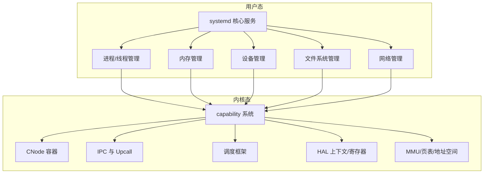
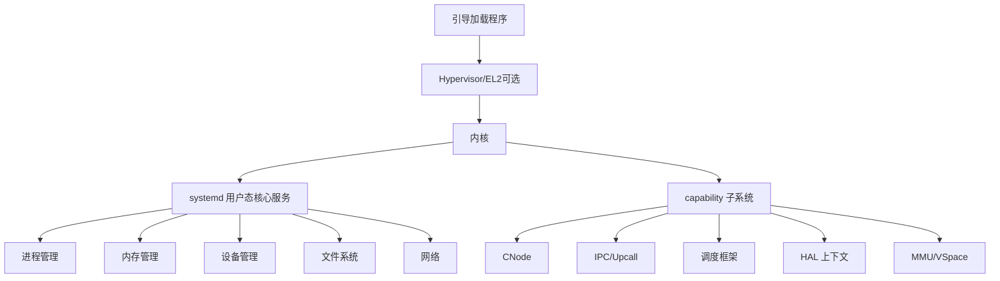
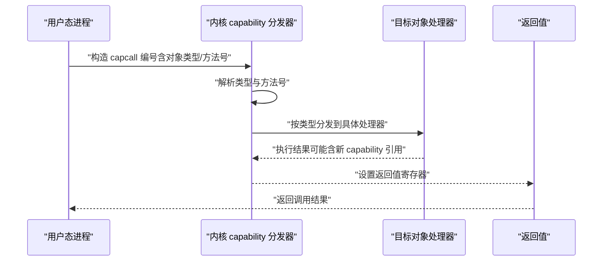
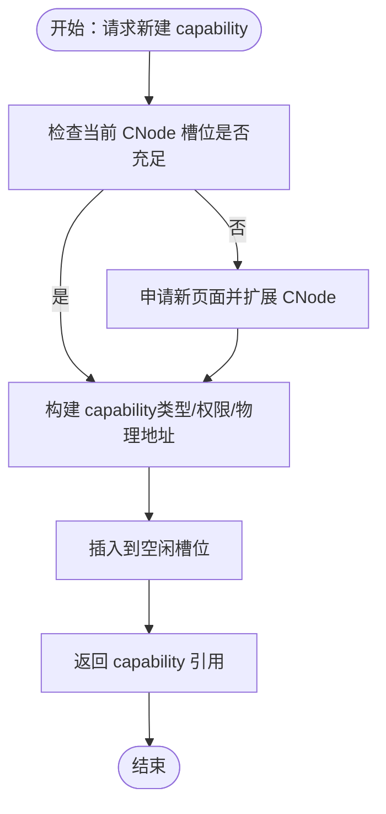
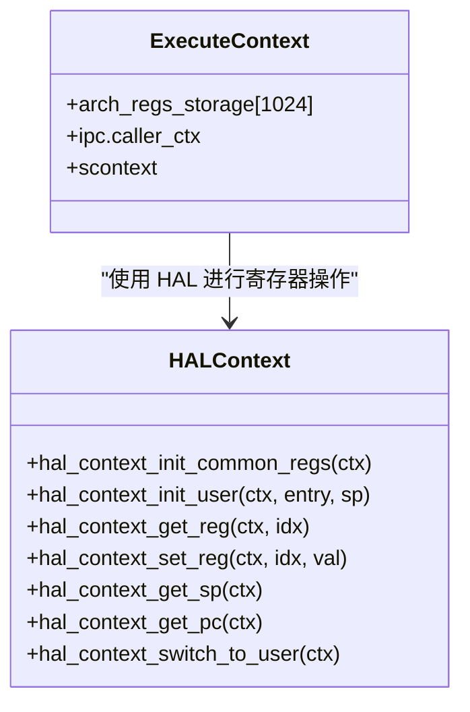
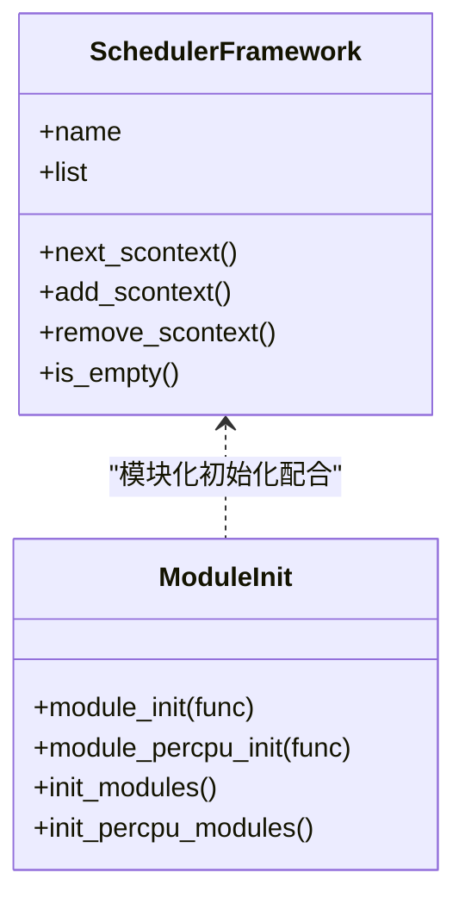
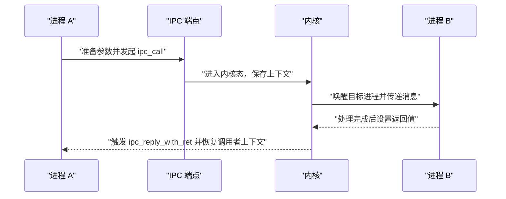
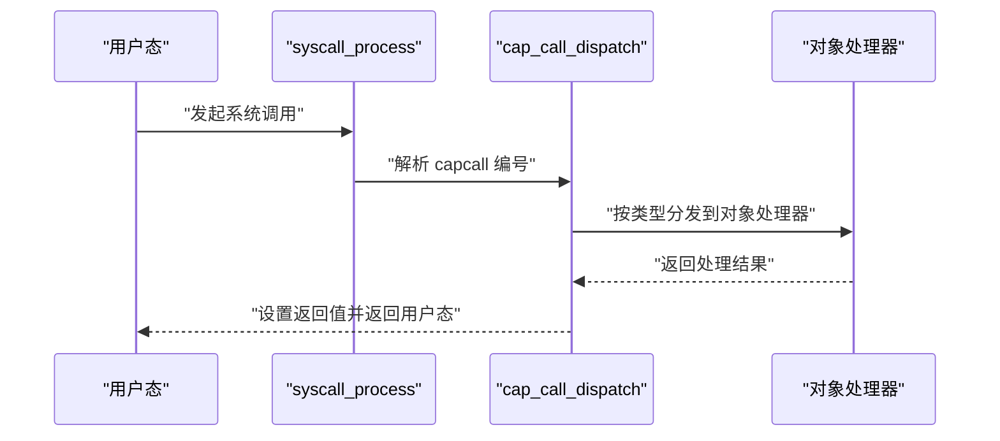
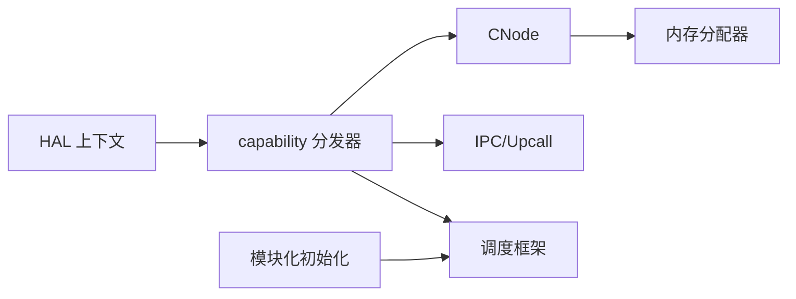

# 微内核设计原理

<cite>
**本文引用的文件**
- [docs/microkernel_design.md](file://docs/microkernel_design.md)
- [docs/kernel/microkernel_design.md](file://docs/kernel/microkernel_design.md)
- [kernel/include/capability/capability.h](file://kernel/include/capability/capability.h)
- [kernel/capability/capability.c](file://kernel/capability/capability.c)
- [kernel/include/capability/cnode.h](file://kernel/include/capability/cnode.h)
- [kernel/capability/cnode.c](file://kernel/capability/cnode.c)
- [kernel/include/arch/generic/hal_context.h](file://kernel/include/arch/generic/hal_context.h)
- [kernel/include/xcontext/xcontext.h](file://kernel/include/xcontext/xcontext.h)
- [kernel/include/scheduler/sched_framework.h](file://kernel/include/scheduler/sched_framework.h)
- [kernel/include/syscall/syscall.h](file://kernel/include/syscall/syscall.h)
- [kernel/include/ipc/ipc.h](file://kernel/include/ipc/ipc.h)
- [kernel/include/module/module.h](file://kernel/include/module/module.h)
- [README.md](file://README.md)
</cite>

## 目录
1. [引言](#引言)
2. [项目结构](#项目结构)
3. [核心组件](#核心组件)
4. [架构总览](#架构总览)
5. [详细组件分析](#详细组件分析)
6. [依赖关系分析](#依赖关系分析)
7. [性能考量](#性能考量)
8. [故障排查指南](#故障排查指南)
9. [结论](#结论)
10. [附录](#附录)

## 引言
本文件系统性阐述 TranquilOS 的微内核设计原理与实现要点，重点覆盖以下方面：
- 最小特权原则：通过 capability 与权限位掩码实现细粒度权限控制。
- 类型安全：capability 头部包含类型字段，分发器按类型路由调用，避免越权与误用。
- 模块化设计：capability 分发器按对象类型解耦，新增对象类型仅需扩展分发表与对应处理函数。
- capability 系统借鉴：参考 seL4 等微内核的 capability 思想，结合 CNode 结构管理 capability。
- 微内核与宏内核差异：强调内核最小化、用户态服务化、IPC 实时性与 upcall 机制。
- 内核对象管理、权限控制与资源隔离：基于 capability 与地址空间视图（VSpace）实现。
- 优势与适用场景：安全性、可验证性、可维护性与可扩展性。

## 项目结构
TranquilOS 将“内核”与“用户态核心服务”清晰分离：
- 内核层：最小化实现，保留内存引导分配器、中断/异常、上下文切换、基础调度框架、capability 与 IPC、upcall 等。
- 用户态核心服务（systemd）：负责进程/线程管理、内存管理、设备管理、文件系统、网络等。

图表来源
- [docs/microkernel_design.md](file://docs/microkernel_design.md#L1-L43)
- [docs/kernel/microkernel_design.md](file://docs/kernel/microkernel_design.md#L1-L37)
- [README.md](file://README.md#L1-L42)

章节来源
- [docs/microkernel_design.md](file://docs/microkernel_design.md#L1-L43)
- [docs/kernel/microkernel_design.md](file://docs/kernel/microkernel_design.md#L1-L37)
- [README.md](file://README.md#L1-L42)

## 核心组件
- capability 与 capability 头部：定义 capability 的类型与权限位掩码，并承载物理地址以便对象访问。
- CNode：capability 的容器，支持动态扩展与线性索引，进程的所有能力通过 CNode 管理。
- capability 分发器：根据 capability 类型与方法号进行分发，实现最小特权与类型安全。
- 执行上下文与 HAL 上下文：抽象寄存器状态与用户态入口切换。
- 调度框架：提供调度器插件化接口，便于扩展不同调度策略。
- IPC 与 Upcall：提供快速控制流切换的 IPC 通道与回调机制。
- 系统调用入口：统一的 syscall 处理流程，最终进入 capability 调用路径。

章节来源
- [kernel/include/capability/capability.h](file://kernel/include/capability/capability.h#L1-L26)
- [kernel/capability/capability.c](file://kernel/capability/capability.c#L1-L58)
- [kernel/include/capability/cnode.h](file://kernel/include/capability/cnode.h#L1-L29)
- [kernel/capability/cnode.c](file://kernel/capability/cnode.c#L1-L95)
- [kernel/include/arch/generic/hal_context.h](file://kernel/include/arch/generic/hal_context.h#L1-L24)
- [kernel/include/xcontext/xcontext.h](file://kernel/include/xcontext/xcontext.h#L1-L24)
- [kernel/include/scheduler/sched_framework.h](file://kernel/include/scheduler/sched_framework.h#L1-L20)
- [kernel/include/ipc/ipc.h](file://kernel/include/ipc/ipc.h#L1-L13)
- [kernel/include/syscall/syscall.h](file://kernel/include/syscall/syscall.h#L1-L8)

## 架构总览
TranquilOS 的微内核采用“内核最小化 + 用户态服务化”的模式：
- 内核仅保留必要能力：内存引导分配、中断/异常、上下文切换、capability、IPC、upcall、基础调度框架。
- 用户态 systemd 负责进程/线程生命周期、内存管理、设备驱动、文件系统、网络等。
- capability 作为统一的内核对象与权限抽象，贯穿 IPC、upcall、VSpace 等子系统。

图表来源
- [docs/microkernel_design.md](file://docs/microkernel_design.md#L34-L43)
- [docs/kernel/microkernel_design.md](file://docs/kernel/microkernel_design.md#L28-L37)
- [README.md](file://README.md#L19-L30)

## 详细组件分析

### capability 与最小特权原则
- capability 头部包含类型与权限位掩码，确保调用方只能使用被授予的权限。
- capability 分发器依据类型进行路由，未授权类型或方法将被拒绝，从而实现最小特权。
- capability 返回值通过寄存器约定返回，便于快速响应与错误传播。

图表来源
- [kernel/capability/capability.c](file://kernel/capability/capability.c#L14-L54)
- [kernel/include/arch/generic/hal_context.h](file://kernel/include/arch/generic/hal_context.h#L14-L22)
- [kernel/include/capability/capability.h](file://kernel/include/capability/capability.h#L22-L24)

章节来源
- [kernel/include/capability/capability.h](file://kernel/include/capability/capability.h#L9-L25)
- [kernel/capability/capability.c](file://kernel/capability/capability.c#L14-L54)

### CNode：capability 容器与动态扩展
- CNode 作为进程的 capability 目录，支持动态扩展，避免复制开销。
- 新建 capability 时，若槽位不足则自动申请页面并扩展；插入后返回 capability 引用。
- 支持通过引用定位任意 CNode，形成多级目录结构，便于资源组织与权限传递。

图表来源
- [kernel/capability/cnode.c](file://kernel/capability/cnode.c#L23-L58)
- [kernel/include/capability/cnode.h](file://kernel/include/capability/cnode.h#L20-L26)

章节来源
- [kernel/include/capability/cnode.h](file://kernel/include/capability/cnode.h#L1-L29)
- [kernel/capability/cnode.c](file://kernel/capability/cnode.c#L1-L95)

### 执行上下文与 HAL 上下文
- 执行上下文保存架构相关寄存器状态与调度上下文指针，用于切换与调试。
- HAL 上下文提供通用寄存器读写与用户态入口初始化，屏蔽底层差异。
- 用户态入口切换通过 HAL 接口完成，确保最小内核面。

图表来源
- [kernel/include/xcontext/xcontext.h](file://kernel/include/xcontext/xcontext.h#L7-L22)
- [kernel/include/arch/generic/hal_context.h](file://kernel/include/arch/generic/hal_context.h#L8-L23)

章节来源
- [kernel/include/xcontext/xcontext.h](file://kernel/include/xcontext/xcontext.h#L1-L24)
- [kernel/include/arch/generic/hal_context.h](file://kernel/include/arch/generic/hal_context.h#L1-L24)

### 调度框架与模块化
- 调度框架以函数指针形式暴露 next/add/remove/is_empty 等接口，便于替换与扩展。
- 模块化初始化接口允许在不同阶段注册初始化函数，增强内核扩展性。

图表来源
- [kernel/include/scheduler/sched_framework.h](file://kernel/include/scheduler/sched_framework.h#L6-L18)
- [kernel/include/module/module.h](file://kernel/include/module/module.h#L6-L11)

章节来源
- [kernel/include/scheduler/sched_framework.h](file://kernel/include/scheduler/sched_framework.h#L1-L20)
- [kernel/include/module/module.h](file://kernel/include/module/module.h#L1-L12)

### IPC 与 Upcall：实时控制流切换
- IPC 提供带参数的调用与带返回值的回复，减少对调度器的依赖，提高实时性。
- Upcall 作为异步事件回调机制，与 capability 系统协同工作，实现高效事件处理。

图表来源
- [kernel/include/ipc/ipc.h](file://kernel/include/ipc/ipc.h#L9-L12)

章节来源
- [kernel/include/ipc/ipc.h](file://kernel/include/ipc/ipc.h#L1-L13)

### 系统调用入口与 capability 调用
- 系统调用统一入口负责解析调用参数与返回值，最终进入 capability 调用路径。
- capability 调用通过寄存器约定传递 capcall 编号，分发器按类型路由到具体处理器。

图表来源
- [kernel/include/syscall/syscall.h](file://kernel/include/syscall/syscall.h#L6)
- [kernel/capability/capability.c](file://kernel/capability/capability.c#L14-L54)
- [kernel/include/arch/generic/hal_context.h](file://kernel/include/arch/generic/hal_context.h#L14-L22)

章节来源
- [kernel/include/syscall/syscall.h](file://kernel/include/syscall/syscall.h#L1-L8)
- [kernel/capability/capability.c](file://kernel/capability/capability.c#L14-L54)

## 依赖关系分析
- capability 分发器依赖 HAL 上下文读取/设置寄存器，以获取 capcall 编号与返回值。
- CNode 依赖内存分配器进行动态扩展，保障 capability 的可伸缩性。
- IPC 与 upcall 依赖 capability 系统提供的端点与回调能力。
- 调度框架与模块化初始化共同支撑内核的可扩展性与生命周期管理。

图表来源
- [kernel/capability/capability.c](file://kernel/capability/capability.c#L1-L58)
- [kernel/capability/cnode.c](file://kernel/capability/cnode.c#L1-L95)
- [kernel/include/arch/generic/hal_context.h](file://kernel/include/arch/generic/hal_context.h#L14-L22)
- [kernel/include/module/module.h](file://kernel/include/module/module.h#L6-L11)

章节来源
- [kernel/capability/capability.c](file://kernel/capability/capability.c#L1-L58)
- [kernel/capability/cnode.c](file://kernel/capability/cnode.c#L1-L95)
- [kernel/include/arch/generic/hal_context.h](file://kernel/include/arch/generic/hal_context.h#L1-L24)
- [kernel/include/module/module.h](file://kernel/include/module/module.h#L1-L12)

## 性能考量
- 减少内核态工作量：将内存管理、设备驱动、文件系统等移至用户态，降低内核复杂度与路径长度。
- 快速 IPC：通过直接控制流切换减少调度器参与，提升 IPC 实时性与吞吐。
- 动态扩展：CNode 在槽位不足时按需扩展，避免预分配浪费，兼顾性能与灵活性。
- 最小特权：权限位掩码与类型检查在内核边界处完成，减少越权访问导致的重试与回退成本。

## 故障排查指南
- capability 类型未知：当分发器遇到未知类型时会记录错误日志，应检查调用方传入的类型编号与权限位掩码。
- CNode 扩展失败：若页面分配失败，系统会触发异常，需检查内存分配器初始化与可用内存。
- 上下文寄存器访问：HAL 接口提供寄存器读写与用户态入口初始化，若出现异常，优先检查寄存器状态与入口地址。
- IPC 回复：若调用无返回或返回值异常，检查内核侧是否正确设置返回值寄存器并恢复调用者上下文。

章节来源
- [kernel/capability/capability.c](file://kernel/capability/capability.c#L50-L54)
- [kernel/capability/cnode.c](file://kernel/capability/cnode.c#L27-L48)
- [kernel/include/arch/generic/hal_context.h](file://kernel/include/arch/generic/hal_context.h#L14-L22)

## 结论
TranquilOS 的微内核设计以 capability 为核心，结合最小特权、类型安全与模块化，实现了内核最小化与用户态服务化的平衡。通过 CNode 动态扩展、快速 IPC 与 upcall 机制，系统在安全性、可维护性与实时性方面具备显著优势。相比宏内核，微内核将复杂逻辑下沉至用户态，提升了系统的可验证性与稳定性，适用于对安全与可靠性要求较高的嵌入式与实时场景。

## 附录
- 参考资料与设计思想：参考 seL4 等微内核的 capability 思想，结合 CNode 结构实现细粒度权限与对象管理。
- 适用场景：高安全性、强隔离、可维护性优先的系统，如工业控制、边缘计算、可信执行环境等。