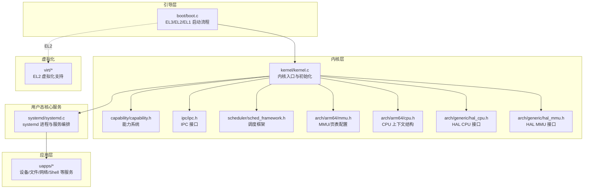
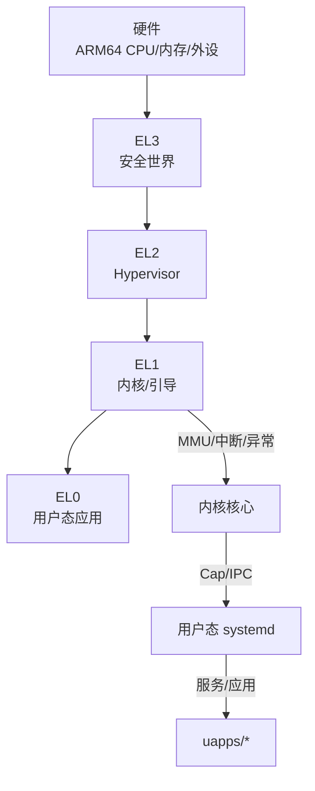
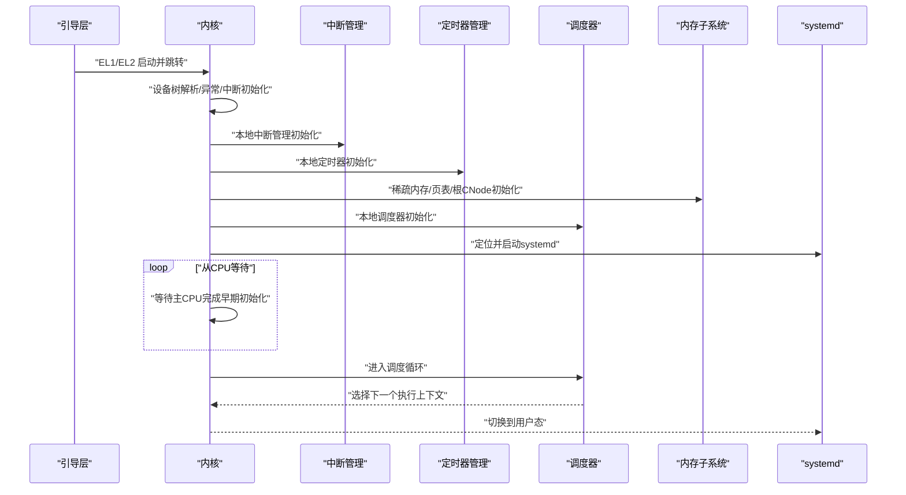
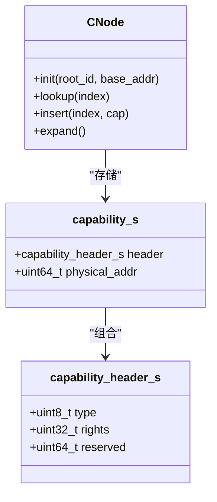
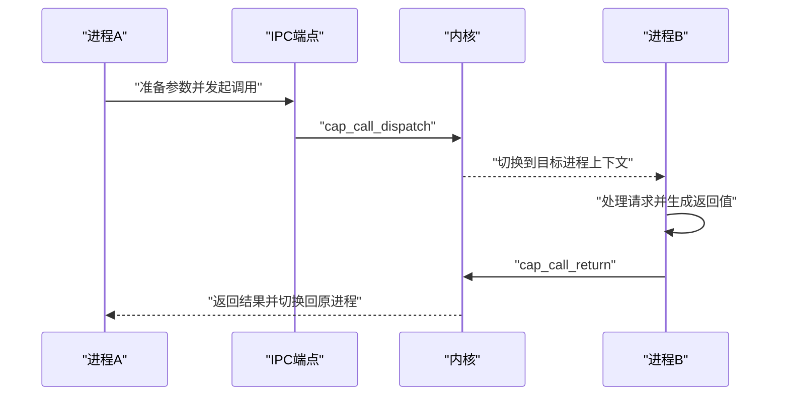
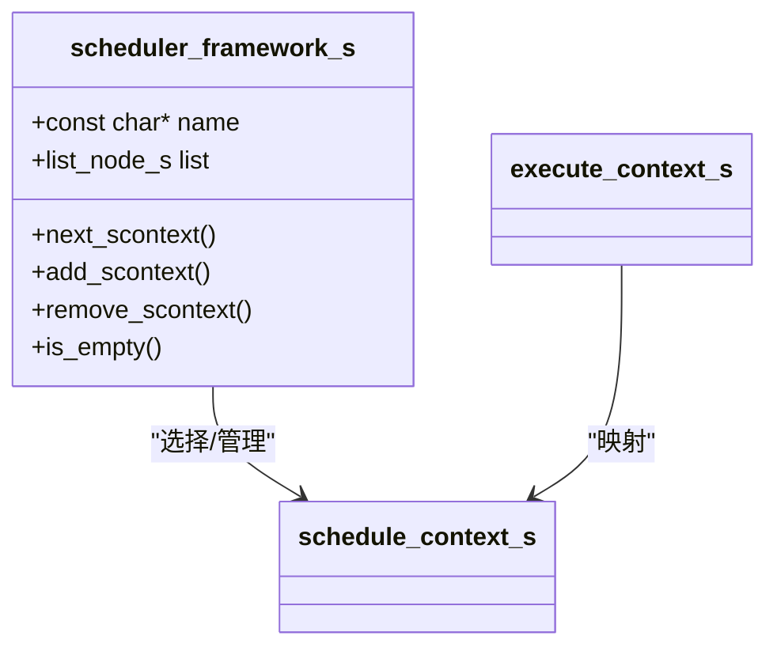
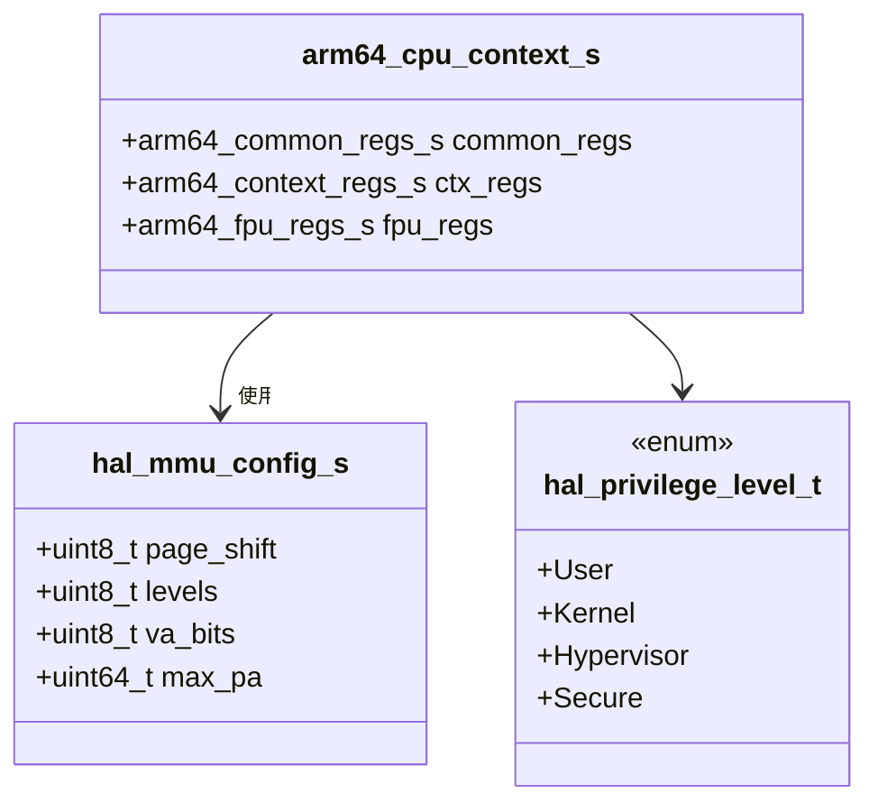
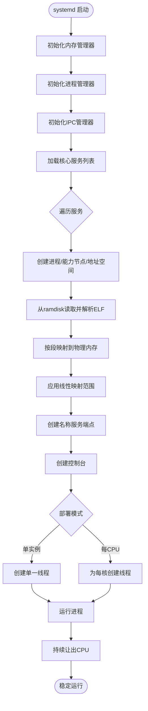
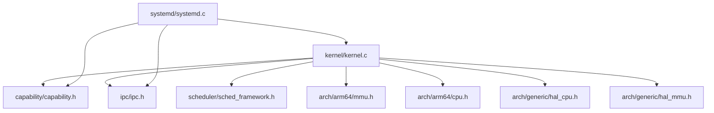

# 技术架构概览

<cite>
**本文引用的文件**
- [README.md](file://README.md)
- [microkernel_design.md](file://docs/microkernel_design.md)
- [kernel.c](file://kernel/kernel.c)
- [boot.c](file://boot/boot.c)
- [systemd.c](file://kernel/systemd/systemd.c)
- [core.h](file://kernel/include/core.h)
- [cpu.h](file://kernel/include/arch/arm64/cpu.h)
- [mmu.h](file://kernel/include/arch/arm64/mmu.h)
- [capability.h](file://kernel/include/capability/capability.h)
- [hal_cpu.h](file://kernel/include/arch/generic/hal_cpu.h)
- [hal_mmu.h](file://kernel/include/arch/generic/hal_mmu.h)
- [sched_framework.h](file://kernel/include/scheduler/sched_framework.h)
- [ipc.h](file://kernel/include/ipc/ipc.h)
</cite>

## 目录
1. [简介](#简介)
2. [项目结构](#项目结构)
3. [核心组件](#核心组件)
4. [架构总览](#架构总览)
5. [详细组件分析](#详细组件分析)
6. [依赖关系分析](#依赖关系分析)
7. [性能考量](#性能考量)
8. [故障排查指南](#故障排查指南)
9. [结论](#结论)
10. [附录](#附录)

## 简介
本文件面向TranquilOS的微内核架构，系统性梳理其设计原理、实现细节与平台适配策略，重点覆盖以下方面：
- 微内核设计思想：最小特权、类型安全、模块化与内核-用户态分离
- 内核与用户态服务的协作机制及安全与性能收益
- ARM64平台下的内存管理、异常/中断、特权级与页表配置
- 分层架构：从引导层、内核核心、用户态systemd到应用层的完整技术栈
- 架构决策的技术权衡与系统边界

## 项目结构
TranquilOS采用“微内核 + 用户态核心服务”的分层组织方式：
- 引导层（boot）：负责EL3/EL2/EL1启动路径、设备树解析、早期内存与外设初始化、跳转至内核或hypervisor
- 内核层（kernel）：微内核核心，提供调度、中断、异常、内存管理框架、能力系统、IPC、上下文切换等
- 用户态核心服务（systemd）：在内核之上运行，负责进程/线程管理、内存管理、IPC管理、服务编排等
- 应用层（uapps）：具体系统服务与用户应用，如设备管理、文件系统、网络、Shell等
- 虚拟化子系统（virt）：支持EL2 Type-1虚拟化，用于QEMU仿真与宿主环境

图表来源
- [boot.c](file://boot/boot.c#L108-L136)
- [kernel.c](file://kernel/kernel.c#L125-L224)
- [systemd.c](file://kernel/systemd/systemd.c#L217-L246)
- [capability.h](file://kernel/include/capability/capability.h#L11-L25)
- [ipc.h](file://kernel/include/ipc/ipc.h#L9-L12)
- [sched_framework.h](file://kernel/include/scheduler/sched_framework.h#L11-L18)
- [mmu.h](file://kernel/include/arch/arm64/mmu.h#L69-L166)
- [cpu.h](file://kernel/include/arch/arm64/cpu.h#L85-L89)
- [hal_cpu.h](file://kernel/include/arch/generic/hal_cpu.h#L7-L22)
- [hal_mmu.h](file://kernel/include/arch/generic/hal_mmu.h#L7-L27)

章节来源
- [README.md](file://README.md#L1-L42)
- [microkernel_design.md](file://docs/microkernel_design.md#L1-L43)

## 核心组件
- 微内核入口与初始化：内核主从CPU在不同特权级下完成设备树解析、中断/定时器初始化、页表建立、根CNode与地址空间初始化，并启动systemd
- 能力系统（Capability）：内核对象与细粒度权限的统一抽象，通过capability结构承载类型与权限位，配合CNode进行进程内资源管理
- IPC与Upcall：提供快速控制流切换的IPC通道，支持端点与回调机制，减少对调度器的依赖，提升实时性
- 调度框架：将执行上下文与调度上下文解耦，支持多调度器框架扩展
- 内存管理：HAL抽象屏蔽平台差异，ARM64侧定义页表项格式、缓存/共享属性与地址区间划分
- 用户态systemd：作为核心服务容器，负责物理内存、进程/线程、IPC、服务部署与运行

章节来源
- [kernel.c](file://kernel/kernel.c#L125-L224)
- [capability.h](file://kernel/include/capability/capability.h#L11-L25)
- [ipc.h](file://kernel/include/ipc/ipc.h#L9-L12)
- [sched_framework.h](file://kernel/include/scheduler/sched_framework.h#L11-L18)
- [mmu.h](file://kernel/include/arch/arm64/mmu.h#L69-L166)
- [systemd.c](file://kernel/systemd/systemd.c#L217-L246)

## 架构总览
TranquilOS采用“微内核 + 用户态核心服务”的经典分层架构：
- 最小特权：内核仅保留必要设施（中断、异常、调度、基础内存管理、能力与IPC），其余功能下沉至用户态
- 类型安全：通过capability头中的类型字段与权限位，确保对象访问受控
- 模块化：HAL接口与平台无关，ARM64实现位于arch/arm64目录；调度、内存、IPC等以框架/接口形式提供
- 安全性：内核-用户态分离、能力传递、最小权限面；EL2虚拟化可选，便于隔离与调试
- 性能：快速IPC、低开销上下文切换、HAL抽象减少分支与重复实现

图表来源
- [boot.c](file://boot/boot.c#L138-L175)
- [kernel.c](file://kernel/kernel.c#L125-L224)
- [systemd.c](file://kernel/systemd/systemd.c#L217-L246)

## 详细组件分析

### 微内核入口与初始化流程
- 主CPU初始化：设备树解析、异常与中断初始化、关键外设初始化、内存稀疏初始化、内核页表建立、根CNode与地址空间初始化、调度器初始化、模块初始化、systemd定位与启动
- 从CPU初始化：等待主CPU完成早期初始化后，依次完成本地中断、定时器、调度器、模块与页表设置，进入调度循环

图表来源
- [boot.c](file://boot/boot.c#L82-L107)
- [kernel.c](file://kernel/kernel.c#L125-L224)

章节来源
- [kernel.c](file://kernel/kernel.c#L61-L123)
- [kernel.c](file://kernel/kernel.c#L125-L224)
- [boot.c](file://boot/boot.c#L82-L107)

### 能力系统与CNode
- 能力结构：包含类型与权限位，物理地址指向内核对象，作为用户态与内核交互的凭证
- CNode：进程持有的能力容器，支持动态扩展与线性索引，用于集中管理进程资源
- 作用：实现最小权限与细粒度授权，避免直接指针访问带来的类型安全问题

图表来源
- [capability.h](file://kernel/include/capability/capability.h#L11-L25)

章节来源
- [capability.h](file://kernel/include/capability/capability.h#L11-L25)
- [microkernel_design.md](file://docs/microkernel_design.md#L6-L11)

### IPC与Upcall
- 快速IPC：通过端点与参数传递，实现控制流即时切换，降低调度依赖，提高实时性
- Upcall：内核向用户态服务回调的机制，用于异步事件通知

图表来源
- [capability.h](file://kernel/include/capability/capability.h#L22-L24)
- [ipc.h](file://kernel/include/ipc/ipc.h#L9-L12)

章节来源
- [ipc.h](file://kernel/include/ipc/ipc.h#L9-L12)
- [capability.h](file://kernel/include/capability/capability.h#L22-L24)
- [microkernel_design.md](file://docs/microkernel_design.md#L20-L22)

### 调度框架
- 执行上下文与调度上下文分离：提升调度灵活性与可扩展性
- 框架接口：next/add/remove/is_empty等函数指针，便于接入不同调度算法

图表来源
- [sched_framework.h](file://kernel/include/scheduler/sched_framework.h#L11-L18)

章节来源
- [sched_framework.h](file://kernel/include/scheduler/sched_framework.h#L11-L18)
- [microkernel_design.md](file://docs/microkernel_design.md#L16-L18)

### ARM64平台适配要点
- CPU上下文结构：通用寄存器、上下文寄存器（含SPSR/PC/SP等）、FPU寄存器
- MMU/页表：定义页表项格式、缓存/共享属性、地址区间划分、粒度与IPSN位宽
- HAL抽象：CPU与MMU接口，屏蔽平台差异，便于移植与扩展

图表来源
- [cpu.h](file://kernel/include/arch/arm64/cpu.h#L85-L89)
- [mmu.h](file://kernel/include/arch/arm64/mmu.h#L69-L166)
- [hal_cpu.h](file://kernel/include/arch/generic/hal_cpu.h#L7-L22)
- [hal_mmu.h](file://kernel/include/arch/generic/hal_mmu.h#L7-L27)

章节来源
- [cpu.h](file://kernel/include/arch/arm64/cpu.h#L85-L89)
- [mmu.h](file://kernel/include/arch/arm64/mmu.h#L69-L166)
- [hal_cpu.h](file://kernel/include/arch/generic/hal_cpu.h#L7-L22)
- [hal_mmu.h](file://kernel/include/arch/generic/hal_mmu.h#L7-L27)

### 用户态systemd与服务编排
- systemd职责：初始化内存/进程/IPC管理器，加载核心服务（devmgr、fsmgr、idle、shell、netmgr），为每个服务创建进程、地址空间、能力节点、控制台与线程，并运行
- 服务部署模式：单实例或每CPU实例，支持线性映射特定物理区域

图表来源
- [systemd.c](file://kernel/systemd/systemd.c#L217-L246)
- [systemd.c](file://kernel/systemd/systemd.c#L76-L205)

章节来源
- [systemd.c](file://kernel/systemd/systemd.c#L217-L246)
- [systemd.c](file://kernel/systemd/systemd.c#L76-L205)

## 依赖关系分析
- 组件耦合与内聚：内核通过HAL接口与平台解耦；能力系统与IPC紧密协作；systemd聚合多个管理器形成高内聚的服务编排层
- 外部依赖：ELF解析、设备树、物理内存分配、定时器/中断驱动等
- 可能的环路：内核与用户态通过能力与IPC交互，无直接循环依赖；systemd内部服务间通过管理器接口交互

图表来源
- [kernel.c](file://kernel/kernel.c#L1-L24)
- [systemd.c](file://kernel/systemd/systemd.c#L1-L14)
- [capability.h](file://kernel/include/capability/capability.h#L1-L26)
- [ipc.h](file://kernel/include/ipc/ipc.h#L1-L13)
- [sched_framework.h](file://kernel/include/scheduler/sched_framework.h#L1-L20)
- [mmu.h](file://kernel/include/arch/arm64/mmu.h#L1-L168)
- [cpu.h](file://kernel/include/arch/arm64/cpu.h#L1-L94)
- [hal_cpu.h](file://kernel/include/arch/generic/hal_cpu.h#L1-L38)
- [hal_mmu.h](file://kernel/include/arch/generic/hal_mmu.h#L1-L28)

章节来源
- [kernel.c](file://kernel/kernel.c#L1-L24)
- [systemd.c](file://kernel/systemd/systemd.c#L1-L14)

## 性能考量
- 快速IPC：减少调度器参与，降低上下文切换与调度抖动，适合实时场景
- 上下文切换：ARM64实现与HAL抽象结合，尽量减少不必要的状态保存/恢复
- 内存管理：稀疏内存与伙伴分配器配合，boot阶段与运行阶段分离，降低碎片与启动时间
- 并发与亲和：线程亲和位设置，结合每CPU服务部署，减少跨核迁移
- 虚拟化：EL2可选，利于隔离与测试，但会引入额外开销；在仿真环境中建议按需启用

## 故障排查指南
- 启动失败（systemd未找到）：检查设备树中“tranquil,systemd”节点是否存在与地址正确
- 中断/定时器未初始化：确认主/从CPU路径均完成本地中断与定时器初始化
- 页表/地址空间错误：核对内核页表生成与设置流程，确保内核与用户页表正确切换
- 能力/IPC异常：检查能力头类型与权限位是否匹配，IPC端点与返回路径是否成对
- 多核同步：确认主CPU广播事件后，从CPU已正确等待并继续初始化

章节来源
- [kernel.c](file://kernel/kernel.c#L202-L208)
- [kernel.c](file://kernel/kernel.c#L171-L179)
- [kernel.c](file://kernel/kernel.c#L187-L188)
- [capability.h](file://kernel/include/capability/capability.h#L11-L25)
- [ipc.h](file://kernel/include/ipc/ipc.h#L9-L12)

## 结论
TranquilOS以微内核为核心，通过能力系统与快速IPC实现最小权限与高实时性，借助HAL抽象实现ARM64平台的可移植性。用户态systemd承担核心服务编排，形成清晰的内核-用户态边界与分层架构。在ARM64平台上，MMU/页表、特权级与中断/异常处理得到明确实现，结合EL2虚拟化支持，满足从嵌入式到仿真环境的多样化需求。

## 附录
- 架构决策与权衡
  - 将内存管理、进程/线程、IPC等下沉至用户态，换取更高的模块化与可维护性，代价是部分操作需要跨边界调用
  - 使用能力系统替代传统权限模型，提升类型安全与最小权限面，但需要在用户态与内核态之间传递与验证能力
  - 快速IPC减少调度依赖，提升实时性，但需要在内核与用户态之间保持严格的协议一致性
- 系统边界
  - 内核边界：异常/中断处理、调度、基础内存管理、能力与IPC接口
  - 用户态边界：systemd及其服务，负责业务逻辑与资源管理
- 平台适配
  - HAL接口屏蔽平台差异，ARM64侧提供页表、特权级、上下文等具体实现