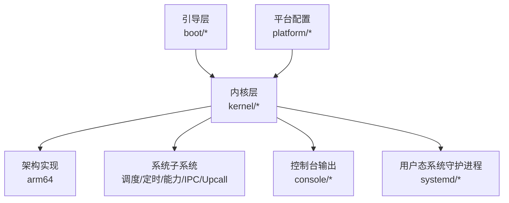
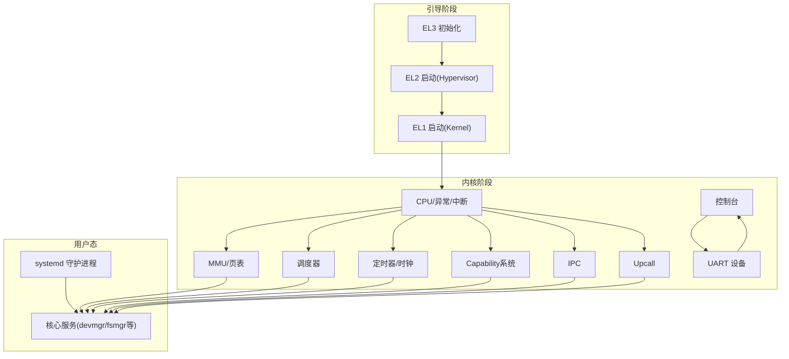
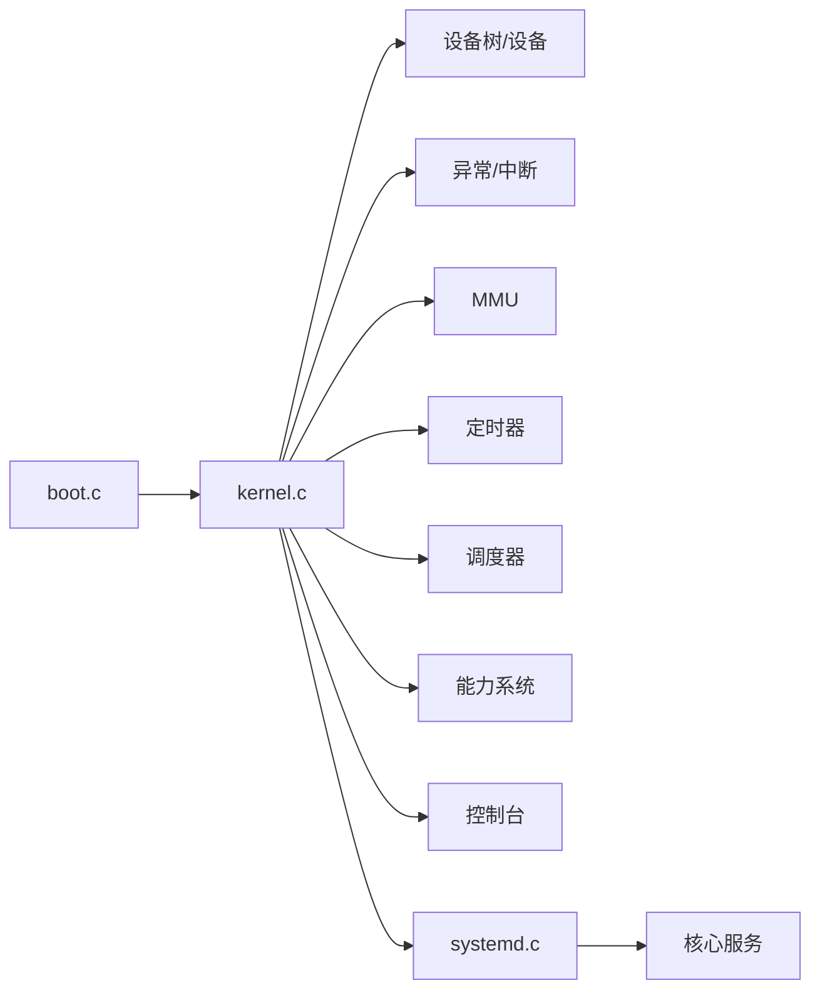

# 核心特性说明

<cite>
**本文引用的文件**
- [README.md](file://README.md)
- [microkernel_design.md](file://docs/microkernel_design.md)
- [boot.c](file://boot/boot.c)
- [kernel.c](file://kernel/kernel.c)
- [mmu.c](file://kernel/arch/arm64/mmu.c)
- [interrupt.c](file://kernel/arch/arm64/interrupt.c)
- [sched_mgr.c](file://kernel/schedule/sched_mgr.c)
- [timer_mgr.c](file://kernel/timer/timer_mgr.c)
- [capability.c](file://kernel/capability/capability.c)
- [caslock.h](file://kernel/include/sync/spinlock/caslock.h)
- [ipc.c](file://kernel/ipc/ipc.c)
- [upcall.c](file://kernel/upcall/upcall.c)
- [systemd.c](file://kernel/systemd/systemd.c)
- [console.c](file://kernel/console/console.c)
</cite>

## 目录
1. [简介](#简介)
2. [项目结构](#项目结构)
3. [核心特性总览](#核心特性总览)
4. [架构概览](#架构概览)
5. [详细特性分析](#详细特性分析)
6. [依赖关系分析](#依赖关系分析)
7. [性能考量](#性能考量)
8. [故障排查指南](#故障排查指南)
9. [结论](#结论)

## 简介
本文件面向TranquilOS核心特性，系统梳理已实现与计划实现的功能点，覆盖aarch64架构支持、MMU虚拟内存管理、中断处理、进程调度、时间与时钟管理、多进程多线程、UART控制台输出、Capability权限系统、自旋锁同步原语、SMP多核支持、IPC进程间通信、Upcall回调机制等。文档采用清单式呈现，并辅以图示帮助快速理解。

## 项目结构
TranquilOS采用分层模块化组织：引导层(boot)负责早期初始化与跳转；内核(kernel)包含架构相关实现、调度、定时、能力系统、IPC、Upcall等；用户态systemd负责核心系统服务编排；平台(platform)提供不同硬件平台的设备树与链接脚本；工具链与构建脚本位于根目录。

**章节来源**
- [README.md](file://README.md#L1-L42)

## 核心特性总览
- 已实现
  - aarch64架构支持
  - MMU虚拟内存管理
  - 中断处理
  - 进程调度
  - 时间与时钟管理
  - 多进程多线程
  - UART控制台输出
  - Capability权限系统
  - 自旋锁同步原语
  - SMP多核支持
  - IPC进程间通信
  - Upcall回调机制
- 计划实现
  - futex
  - 文件系统管理器
  - 网络管理器
  - MMI管理器
  - 根文件系统与扩展文件系统

**章节来源**
- [README.md](file://README.md#L4-L29)

## 架构概览
TranquilOS采用微内核设计，核心职责最小化，内存管理、进程/线程、文件系统、设备管理等由用户态systemd承担。内核通过EL1或EL2启动，支持SMP多核，提供高精度定时器与Capability驱动的细粒度权限模型。

**图表来源**
- [boot.c](file://boot/boot.c#L109-L136)
- [kernel.c](file://kernel/kernel.c#L125-L224)
- [systemd.c](file://kernel/systemd/systemd.c#L217-L246)

**章节来源**
- [microkernel_design.md](file://docs/microkernel_design.md#L1-L43)
- [boot.c](file://boot/boot.c#L109-L136)
- [kernel.c](file://kernel/kernel.c#L125-L224)
- [systemd.c](file://kernel/systemd/systemd.c#L217-L246)

## 详细特性分析

### aarch64架构支持
- 技术说明
  - 支持AArch64指令集与寄存器体系，包含EL1/EL2/EL3启动路径与特权级切换。
  - 提供通用HAL抽象，屏蔽具体寄存器细节。
- 实现亮点
  - 引导层分别实现EL1主从核、EL2主从核、EL3初始化流程，确保多平台一致性。
  - 内核侧提供异常、中断、MMU、上下文切换等基础能力。
- 当前状态
  - 已实现EL1/EL2启动路径与多核唤醒；EL3用于安全配置初始化。

**章节来源**
- [boot.c](file://boot/boot.c#L109-L136)
- [boot.c](file://boot/boot.c#L161-L176)
- [kernel.c](file://kernel/kernel.c#L125-L224)

### MMU虚拟内存管理
- 技术说明
  - 配置MAIR、TCR、TTBR等寄存器，建立内核与用户页表，支持4级页表与4KB粒度。
  - 提供内核/用户页表切换与TLB维护。
- 实现亮点
  - 动态生成内核身份映射页表，区分特权/非特权访问权限位。
  - 支持设备内存与普通缓存属性配置，满足不同内存区域需求。
- 当前状态
  - MMU初始化、使能/禁用、页表设置与配置查询接口完备。

**章节来源**
- [mmu.c](file://kernel/arch/arm64/mmu.c#L62-L126)
- [mmu.c](file://kernel/arch/arm64/mmu.c#L128-L151)
- [mmu.c](file://kernel/arch/arm64/mmu.c#L161-L222)
- [mmu.c](file://kernel/arch/arm64/mmu.c#L224-L231)

### 中断处理
- 技术说明
  - 通过DAIF寄存器控制中断全局开关与分类开关（常规/快速/系统错误/调试）。
  - HAL提供保存/恢复中断状态与按类型启用/禁用。
- 实现亮点
  - 统一的中断状态保存与恢复，便于临界区保护。
  - 支持在多核场景下局部中断设备的启用/禁用。
- 当前状态
  - 中断开关与状态查询接口完善，配合IRQ管理器使用。

**章节来源**
- [interrupt.c](file://kernel/arch/arm64/interrupt.c#L7-L66)

### 进程调度
- 技术说明
  - 将传统TCB拆分为执行上下文与调度上下文，支持多调度框架注册与优先级队列。
  - 提供本地调度器与全局调度管理器，支持亲和性与多核调度。
- 实现亮点
  - 调度框架可插拔，支持RT/CFS等策略扩展。
  - 通过CAS自旋锁保护调度器内部状态，保证多核一致性。
- 当前状态
  - 调度框架注册、上下文添加/移除、选择下一调度项等流程完整。

**章节来源**
- [sched_mgr.c](file://kernel/schedule/sched_mgr.c#L6-L29)
- [sched_mgr.c](file://kernel/schedule/sched_mgr.c#L74-L87)
- [sched_mgr.c](file://kernel/schedule/sched_mgr.c#L113-L129)
- [sched_mgr.c](file://kernel/schedule/sched_mgr.c#L131-L147)
- [caslock.h](file://kernel/include/sync/spinlock/caslock.h#L15-L17)

### 时间与时钟管理
- 技术说明
  - 提供单调时钟容器与硬件计数器转换，支持高精度时间保持与定时器重编程。
  - 支持多时钟源与定时器容器（最小堆/红黑树）。
- 实现亮点
  - 时间保持器计算频率与纳秒换算参数，减少浮点运算。
  - 定时器管理器根据最早到期事件重编程硬件定时器。
- 当前状态
  - 单调时钟容器与tick定时器初始化、定时器增删改查、重编程接口完备。

**章节来源**
- [timer_mgr.c](file://kernel/timer/timer_mgr.c#L164-L185)
- [timer_mgr.c](file://kernel/timer/timer_mgr.c#L115-L138)
- [timer_mgr.c](file://kernel/timer/timer_mgr.c#L50-L71)
- [timer_mgr.c](file://kernel/timer/timer_mgr.c#L84-L95)

### 多进程多线程
- 技术说明
  - systemd负责进程/线程创建、地址空间映射、能力节点与控制台创建。
  - 支持单实例与每核实例两种部署模式。
- 实现亮点
  - ELF加载与物理内存分配，支持线性映射与可加载段映射。
  - 通过进程管理器统一创建线程并设置亲和性。
- 当前状态
  - 核心系统服务（devmgr/fsmgr/idle/shell/netmgr）启动流程完整。

**章节来源**
- [systemd.c](file://kernel/systemd/systemd.c#L76-L205)
- [systemd.c](file://kernel/systemd/systemd.c#L207-L215)
- [systemd.c](file://kernel/systemd/systemd.c#L217-L246)

### UART控制台输出
- 技术说明
  - 控制台抽象绑定具体设备，提供字符写入/读取接口。
  - 引导阶段与内核阶段均可复位/初始化控制台设备。
- 实现亮点
  - 设备无关的控制台接口，便于扩展到其他显示/串口设备。
- 当前状态
  - 控制台初始化与字符I/O接口可用。

**章节来源**
- [console.c](file://kernel/console/console.c#L4-L30)
- [boot.c](file://boot/boot.c#L85-L85)
- [kernel.c](file://kernel/kernel.c#L128-L128)

### Capability权限系统
- 技术说明
  - 通过Capability封装内核对象与权限，capcall作为系统调用入口分发至不同对象类型。
  - 支持CNode目录、控制台、执行上下文、调度上下文、地址空间、系统控制、自身引用、IPC端点、Upcall端点等。
- 实现亮点
  - 基于CNode的线性索引与动态扩展，支持细粒度权限控制。
  - capcall解码能力号与方法号，路由到对应分发函数。
- 当前状态
  - 能力类型覆盖主要内核对象，分发逻辑完善。

**章节来源**
- [capability.c](file://kernel/capability/capability.c#L14-L58)

### 自旋锁同步原语
- 技术说明
  - CAS自旋锁基于原子比较交换实现，支持初始化、尝试加锁、加锁、解锁与状态查询。
  - 解锁后广播事件，唤醒等待者。
- 实现亮点
  - 低开销的无等待自旋，适合短临界区与中断上下文。
- 当前状态
  - 自旋锁API完整，配合调度器与中断使用。

**章节来源**
- [caslock.h](file://kernel/include/sync/spinlock/caslock.h#L15-L42)

### SMP多核支持
- 技术说明
  - 引导层遍历CPU节点并通过PSCI或其他机制唤醒次核。
  - 内核侧通过cpulocal初始化每核关键子系统，启用本地定时器与IRQ管理器。
- 实现亮点
  - 主核等待次核早期初始化完成，确保一致性。
  - 每核独立的本地调度器、定时器与设备初始化。
- 当前状态
  - 多核初始化与本地子系统初始化流程完备。

**章节来源**
- [boot.c](file://boot/boot.c#L68-L102)
- [kernel.c](file://kernel/kernel.c#L61-L123)
- [kernel.c](file://kernel/kernel.c#L125-L224)

### IPC进程间通信
- 技术说明
  - IPC调用通过端点进行，调用方阻塞等待，目标调度上下文切换到端点入口执行。
  - 回复时设置返回值并唤醒调用方，完成控制流立即切换。
- 实现亮点
  - 不依赖调度器行为，实现快速、确定性的IPC。
  - 支持参数传递与阻塞/唤醒机制。
- 当前状态
  - IPC调用/回复流程完整，与调度器协作良好。

**章节来源**
- [ipc.c](file://kernel/ipc/ipc.c#L9-L76)
- [ipc.c](file://kernel/ipc/ipc.c#L78-L114)

### Upcall回调机制
- 技术说明
  - Upcall用于异常/故障场景的回调处理，调用方阻塞等待，回调方处理后恢复调用方执行。
  - 支持参数传递与阻塞/唤醒。
- 实现亮点
  - 将异常处理与正常控制流解耦，提升实时性与可靠性。
- 当前状态
  - Upcall调用/回复流程完整，与调度器协作良好。

**章节来源**
- [upcall.c](file://kernel/upcall/upcall.c#L8-L52)
- [upcall.c](file://kernel/upcall/upcall.c#L54-L95)

## 依赖关系分析
- 组件耦合
  - 内核入口依赖设备树、异常/中断、MMU、定时器、调度器、能力系统与systemd。
  - systemd依赖内存管理、进程管理、IPC管理与服务注册。
- 关键依赖链
  - 引导层 → 内核入口 → 设备树/异常/中断/定时器/调度/能力/控制台 → systemd → 核心服务
- 循环依赖
  - 未发现直接循环依赖；IPC/Upcall通过调度器间接协作，避免循环。

**图表来源**
- [boot.c](file://boot/boot.c#L82-L107)
- [kernel.c](file://kernel/kernel.c#L125-L224)
- [systemd.c](file://kernel/systemd/systemd.c#L217-L246)

**章节来源**
- [boot.c](file://boot/boot.c#L82-L107)
- [kernel.c](file://kernel/kernel.c#L125-L224)
- [systemd.c](file://kernel/systemd/systemd.c#L217-L246)

## 性能考量
- 低延迟路径
  - IPC与Upcall采用“控制流立即切换”，避免调度器行为不确定性，适合实时场景。
- 内存与页表
  - 使用4KB粒度与设备/缓存属性分离，平衡性能与兼容性。
- 并发与同步
  - 调度器与关键数据结构采用CAS自旋锁，降低锁竞争开销。
- 时钟精度
  - 高精度定时器与时间保持器减少时间计算误差。

## 故障排查指南
- 启动卡死
  - 检查引导层是否正确解析设备树与CPU节点，确认PSCI唤醒成功。
  - 核对内核早期初始化日志，确认异常/中断/MMU/定时器/调度器初始化顺序。
- 中断不生效
  - 确认DAIF状态与中断开关，检查本地IRQ设备启用。
- IPC/Upcall异常
  - 检查端点状态与调度上下文状态，确认阻塞/唤醒路径正确。
- 能力调用失败
  - 核对capcall能力号与方法号解码，确认目标对象类型与权限有效。

**章节来源**
- [boot.c](file://boot/boot.c#L68-L102)
- [kernel.c](file://kernel/kernel.c#L125-L224)
- [interrupt.c](file://kernel/arch/arm64/interrupt.c#L49-L56)
- [ipc.c](file://kernel/ipc/ipc.c#L9-L76)
- [upcall.c](file://kernel/upcall/upcall.c#L8-L52)
- [capability.c](file://kernel/capability/capability.c#L14-L58)

## 结论
TranquilOS在微内核基础上，围绕aarch64架构提供了完整的MMU、中断、调度、时钟、Capability、IPC与Upcall能力，并通过systemd实现多进程多线程与核心系统服务的用户态化。当前版本在实时性、安全性与可扩展性方面具备良好基础，后续可重点推进futex、文件系统、网络与图形相关模块，进一步完善生态与用户体验。