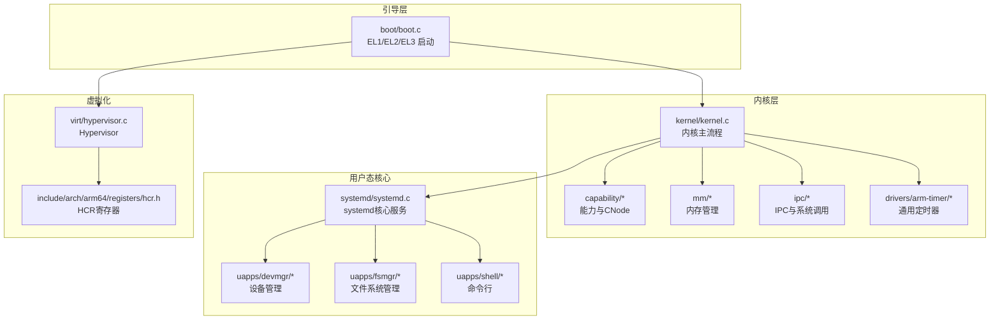
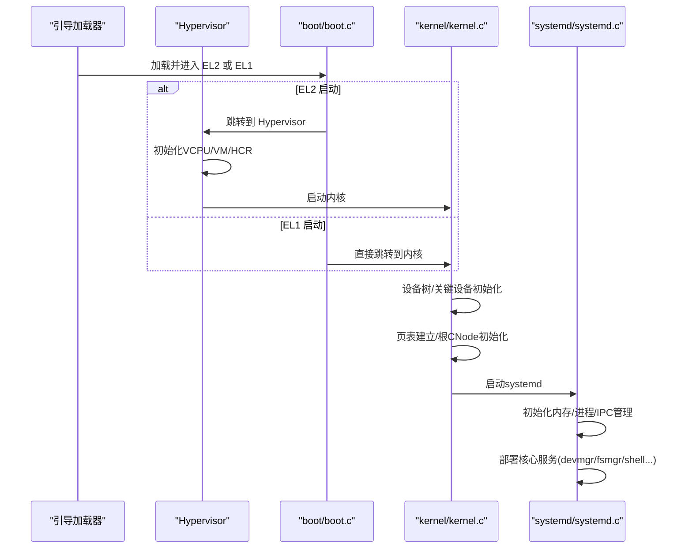
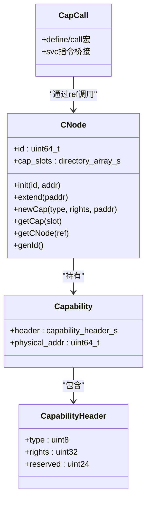
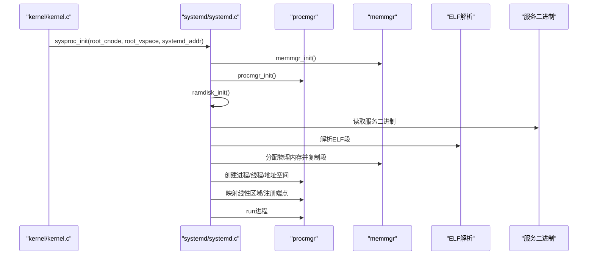
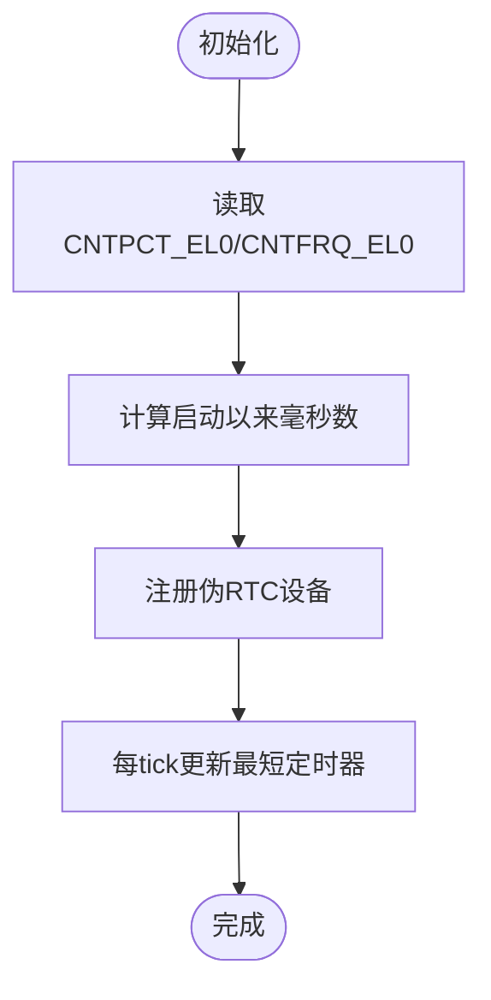
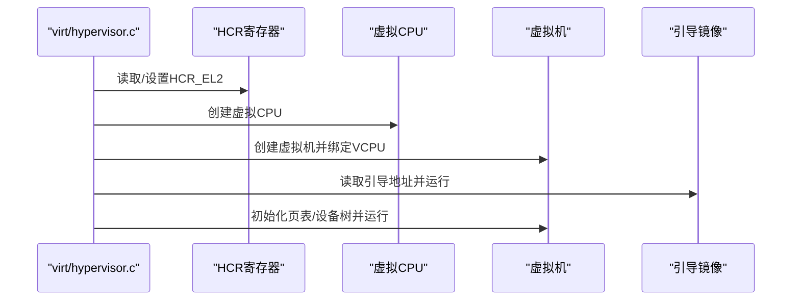
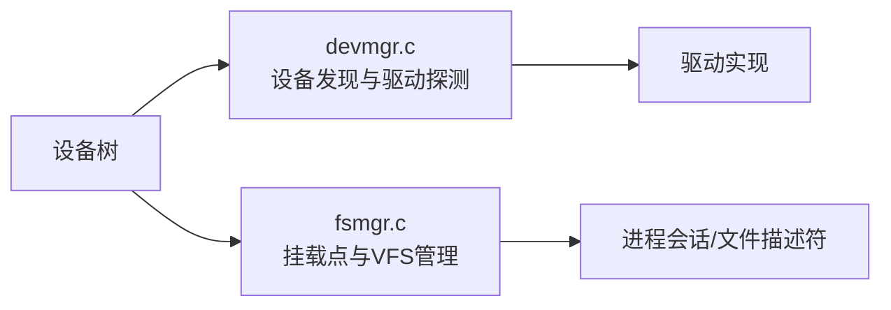
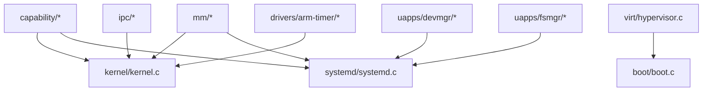

# 项目介绍

<cite>
**本文档引用的文件**
- [README.md](file://README.md)
- [microkernel_design.md](file://docs/microkernel_design.md)
- [basic_theory.md](file://docs/basic_theory.md)
- [kernel/microkernel_design.md](file://docs/kernel/microkernel_design.md)
- [kernel.c](file://kernel/kernel.c)
- [core.h](file://kernel/include/core.h)
- [systemd.c](file://kernel/systemd/systemd.c)
- [boot.c](file://boot/boot.c)
- [capcall.h](file://ulibs/include/libkernel/capcall.h)
- [cnode.h](file://kernel/include/capability/cnode.h)
- [capability.h](file://kernel/include/capability/capability.h)
- [cnode.c](file://kernel/capability/cnode.c)
- [cap_cnode.c](file://kernel/capability/cap_cnode.c)
- [mm.c](file://kernel/mm/mm.c)
- [hypervisor.c](file://virt/hypervisor.c)
- [hcr.h](file://kernel/include/arch/arm64/registers/hcr.h)
- [generic_timer.c](file://kernel/drivers/arm-timer/generic_timer.c)
- [devmgr.c](file://uapps/devmgr/devmgr.c)
- [fsmgr.c](file://uapps/fsmgr/fsmgr.c)
</cite>

## 目录
1. [简介](#简介)
2. [项目结构](#项目结构)
3. [核心组件](#核心组件)
4. [架构总览](#架构总览)
5. [详细组件分析](#详细组件分析)
6. [依赖关系分析](#依赖关系分析)
7. [性能考量](#性能考量)
8. [故障排查指南](#故障排查指南)
9. [结论](#结论)
10. [附录](#附录)

## 简介
TranquilOS 是一个基于微内核架构的轻量级操作系统，面向 ARM64 平台，采用 aarch64 特权级与虚拟化路径支持，结合能力（capability）模型、用户态核心服务（systemd）与高性能 IPC，提供安全、可扩展、可移植的嵌入式与虚拟化场景解决方案。项目强调“最小内核、最大服务”的理念：内核仅保留引导内存分配、MMU/VMMU、中断与调度、时间与时钟、上下文切换、能力系统与系统调用桥接等基础能力；绝大多数系统服务（进程/线程管理、内存管理、文件系统、设备管理、网络等）由用户态 systemd 进程及其子服务完成，形成模块化、可热插拔的服务体系。

- 核心目标与愿景
  - 构建一个安全、可验证、可移植的微内核操作系统，为嵌入式、边缘计算与虚拟化提供稳定内核基础。
  - 通过能力模型与细粒度权限控制，降低内核攻击面，提升系统整体安全性。
  - 通过用户态核心服务与高效 IPC，兼顾性能与可维护性，便于二次开发与生态建设。

- 为什么选择微内核架构
  - 安全性：内核最小化，错误隔离，故障不扩散。
  - 可靠性：服务进程化，崩溃不影响内核；服务可替换、可升级。
  - 可移植性：内核专注于硬件抽象与调度，平台差异集中在 HAL 层。
  - 可扩展性：通过 systemd 与服务模块化，按需加载与裁剪。

- 主要应用场景与目标用户
  - 应用场景：嵌入式设备、边缘网关、虚拟化平台、AI 推理加速器、安全可信计算环境。
  - 目标用户：操作系统研究者、嵌入式开发者、安全研究人员、AI/边缘平台工程师。

- 创新点与独特价值主张
  - 能力模型与 CNode 结构：统一内核对象与权限管理，支持细粒度权限与动态扩展。
  - 用户态核心服务（systemd）：将内存管理、进程/线程生命周期、IPC 管理等迁移到用户态，提高可维护性与可测试性。
  - 高精度计时与高效 IPC：基于通用定时器与执行上下文分离的 RPC 式 IPC，减少调度开销，提升实时性。
  - 多启动路径支持：同时支持从 EL1（裸机）与 EL2（Hypervisor）启动，适配真实硬件与虚拟化环境。

- 与现有方案的区别与优势
  - 相比 Linux：更小的内核、更强的权限控制、更好的可移植性与可验证性。
  - 相比 seL4：在保持微内核思想的同时，提供更贴近嵌入式与虚拟化的工程化能力（如用户态核心服务、简化 IPC）。
  - 相比裸机 RTOS：具备多进程/线程、虚拟内存、能力模型与可扩展服务生态。

- 历史背景与发展历程
  - 项目参考了 seL4 等现代微内核的设计思想，结合 ARM64 平台与实际工程需求，逐步完善能力系统、用户态核心服务与虚拟化支持。
  - 当前版本已覆盖 aarch64 特权模型、MMU/VMMU、中断与 GIC、通用定时器、上下文切换、能力与 CNode、用户态 systemd 与核心服务、EL2 Type-1 虚拟化等关键能力，持续迭代中。

- 为初学者与专家的双重表达
  - 初学者：通过“最小内核、最大服务”“能力模型”“用户态核心服务”等概念，帮助理解微内核与传统内核的差异。
  - 专家：通过源码级组件（CNode、capcall、systemd、hypervisor、generic timer）与架构图，深入掌握实现细节与优化方向。

**章节来源**
- file://README.md#L1-L42
- file://docs/microkernel_design.md#L1-L43
- file://docs/basic_theory.md#L1-L385
- file://docs/kernel/microkernel_design.md#L1-L37

## 项目结构
项目采用“内核 + 启动 + 用户态服务 + 工具链 + 虚拟化”分层组织：
- boot：引导加载与多 EL 启动路径（EL1/EL2/EL3），设备树解析与内核重映射。
- kernel：内核核心（中断、异常、调度、MMU、能力系统、IPC、系统调用桥接、用户态进程启动）。
- platform：不同硬件平台的设备树与链接脚本（Pi3b/Pi4b/CM4/QemuVirt）。
- uapps：用户态核心服务（devmgr、fsmgr、shell、netmgr、idle 等）。
- ulibs：用户态库（libc、libfdt、libgraphics、libsystem 客户端等）。
- virt：Hypervisor 实现与虚拟化相关组件。
- docs：设计文档与基础理论说明。

**图表来源**
- [boot.c](file://boot/boot.c#L1-L176)
- [kernel.c](file://kernel/kernel.c#L1-L225)
- [systemd.c](file://kernel/systemd/systemd.c#L1-L247)
- [hypervisor.c](file://virt/hypervisor.c#L1-L149)
- [hcr.h](file://kernel/include/arch/arm64/registers/hcr.h#L1-L72)

**章节来源**
- file://boot/boot.c#L1-L176
- file://kernel/kernel.c#L1-L225
- file://kernel/systemd/systemd.c#L1-L247
- file://virt/hypervisor.c#L1-L149
- file://kernel/include/arch/arm64/registers/hcr.h#L1-L72

## 核心组件
- 内核主流程与启动
  - 主核（primary）负责设备树初始化、关键设备初始化、页表建立、根 CNode 初始化、调度器与模块初始化，并启动用户态 systemd。
  - 辅助核（secondary）等待早期初始化完成，随后初始化本地中断、定时器、调度器与模块，进入调度循环。
- 能力系统与 CNode
  - capability 作为内核对象与权限的统一抽象；CNode 作为进程持有的能力容器，支持动态扩展与线性索引。
  - capcall 提供统一的系统调用入口，通过 SVC 指令与内核交互。
- 用户态核心服务（systemd）
  - systemd 负责内存管理、进程/线程创建、IPC 管理、服务部署与运行，按配置启动核心服务（devmgr、fsmgr、shell、netmgr、idle）。
- 内存管理
  - 内核保留引导期分配器，用户态 systemd 负责物理内存与虚拟内存管理。
- 计时与时钟
  - 基于通用定时器（CNTPCT/CNTFRQ）提供高精度时间戳与 RTC 伪设备。
- 中断与异常
  - GICv3 中断控制器与异常向量表配合，提供中断路由与异常处理。
- 虚拟化
  - 支持 EL2 Type-1 虚拟化，Hypervisor 初始化、VCPU 创建与运行，HCR 寄存器控制虚拟化行为。

**章节来源**
- file://kernel/kernel.c#L61-L123
- file://kernel/kernel.c#L125-L224
- file://kernel/include/capability/cnode.h#L1-L28
- file://kernel/include/capability/capability.h#L1-L26
- file://kernel/capability/cnode.c#L1-L95
- file://kernel/capability/cap_cnode.c#L135-L184
- file://ulibs/include/libkernel/capcall.h#L1-L41
- file://kernel/systemd/systemd.c#L15-L74
- file://kernel/systemd/systemd.c#L207-L215
- file://kernel/mm/mm.c#L1-L45
- file://kernel/drivers/arm-timer/generic_timer.c#L257-L283
- file://virt/hypervisor.c#L47-L76
- file://kernel/include/arch/arm64/registers/hcr.h#L1-L72

## 架构总览
TranquilOS 的启动路径支持两种模式：
- EL1 启动：引导加载器直接加载内核，内核初始化后启动 systemd。
- EL2 启动：引导加载器加载 Hypervisor，Hypervisor 初始化后加载内核与 systemd。

**图表来源**
- [boot.c](file://boot/boot.c#L47-L106)
- [boot.c](file://boot/boot.c#L109-L136)
- [kernel.c](file://kernel/kernel.c#L125-L224)
- [systemd.c](file://kernel/systemd/systemd.c#L217-L246)

**章节来源**
- file://boot/boot.c#L47-L106
- file://boot/boot.c#L109-L136
- file://kernel/kernel.c#L125-L224
- file://kernel/systemd/systemd.c#L217-L246

## 详细组件分析

### 能力系统与 CNode
- 设计要点
  - capability 将内核对象与其权限封装，统一用户态与内核态交互接口。
  - CNode 作为能力容器，支持动态扩展与线性索引，便于权限管理与资源回收。
  - capcall 通过 SVC 指令将用户态调用转换为内核侧方法分发。
- 关键流程
  - 进程启动时创建根 CNode，后续通过 CNode 方法创建/扩展/销毁能力槽位。
  - capcall 宏生成统一的系统调用包装，内核侧根据对象类型与方法号分发到具体实现。

**图表来源**
- [capability.h](file://kernel/include/capability/capability.h#L1-L26)
- [cnode.h](file://kernel/include/capability/cnode.h#L1-L28)
- [cnode.c](file://kernel/capability/cnode.c#L1-L95)
- [cap_cnode.c](file://kernel/capability/cap_cnode.c#L135-L184)
- [capcall.h](file://ulibs/include/libkernel/capcall.h#L1-L41)

**章节来源**
- file://kernel/include/capability/capability.h#L1-L26
- file://kernel/include/capability/cnode.h#L1-L28
- file://kernel/capability/cnode.c#L1-L95
- file://kernel/capability/cap_cnode.c#L135-L184
- file://ulibs/include/libkernel/capcall.h#L1-L41

### 用户态核心服务（systemd）
- 设计要点
  - systemd 作为用户态核心进程，集中管理内存、进程/线程、IPC 与服务部署。
  - 核心服务以单例对象管理，约束接口暴露，便于模块化与可测试性。
- 关键流程
  - 初始化内存管理器、进程管理器、IPC 管理器与服务注册表。
  - 从设备树查找 systemd 地址，读取 ramdisk 中的服务二进制，创建进程、线程与地址空间，映射线性区域，注册名称服务端点，启动服务。

**图表来源**
- [kernel.c](file://kernel/kernel.c#L202-L210)
- [systemd.c](file://kernel/systemd/systemd.c#L217-L246)
- [systemd.c](file://kernel/systemd/systemd.c#L76-L205)

**章节来源**
- file://kernel/kernel.c#L202-L210
- file://kernel/systemd/systemd.c#L217-L246
- file://kernel/systemd/systemd.c#L76-L205

### 计时与时钟（通用定时器）
- 设计要点
  - 基于 CNTPCT_EL0 与 CNTFRQ_EL0 提供高精度时间戳。
  - 注册伪 RTC 设备，供系统时间管理使用。
- 关键流程
  - 启动时记录基准计数值，后续通过寄存器读取计算毫秒级时间戳。
  - 在 per-CPU 初始化中注册通用定时器与伪 RTC。

**图表来源**
- [generic_timer.c](file://kernel/drivers/arm-timer/generic_timer.c#L257-L283)

**章节来源**
- file://kernel/drivers/arm-timer/generic_timer.c#L257-L283

### 虚拟化（EL2 Hypervisor）
- 设计要点
  - 通过 HCR_EL2 控制虚拟化行为（如中断/异常路由、内存访问控制等）。
  - 初始化 VCpu 与 VM，加载引导镜像，运行虚拟机。
- 关键流程
  - 读取 HCR 配置，设置中断/异常路由策略。
  - 创建虚拟 CPU 与虚拟机实例，绑定 VCPU 到物理 CPU，初始化页表与设备树，进入运行循环。

**图表来源**
- [hypervisor.c](file://virt/hypervisor.c#L47-L76)
- [hypervisor.c](file://virt/hypervisor.c#L101-L145)
- [hcr.h](file://kernel/include/arch/arm64/registers/hcr.h#L1-L72)

**章节来源**
- file://virt/hypervisor.c#L47-L76
- file://virt/hypervisor.c#L101-L145
- file://kernel/include/arch/arm64/registers/hcr.h#L1-L72

### 设备管理与文件系统服务
- 设备管理（devmgr）
  - 通过设备树匹配兼容字符串，定位设备节点，注册驱动探测函数。
- 文件系统管理（fsmgr）
  - 管理挂载点与 VFS 实例，为进程提供打开/读写/关闭文件的统一接口，维护会话与文件描述符表。

**图表来源**
- [devmgr.c](file://uapps/devmgr/devmgr.c#L10-L55)
- [fsmgr.c](file://uapps/fsmgr/fsmgr.c#L8-L28)
- [fsmgr.c](file://uapps/fsmgr/fsmgr.c#L65-L108)

**章节来源**
- file://uapps/devmgr/devmgr.c#L10-L55
- file://uapps/fsmgr/fsmgr.c#L8-L28
- file://uapps/fsmgr/fsmgr.c#L65-L108

## 依赖关系分析
- 组件耦合与内聚
  - 内核与用户态通过能力与系统调用桥接，保持高内聚、低耦合。
  - systemd 作为用户态核心，聚合内存、进程、IPC 管理，形成清晰边界。
- 外部依赖与集成点
  - 设备树（DTB）用于硬件描述与设备发现。
  - ELF 解析用于加载用户态服务二进制。
  - GIC 与通用定时器为中断与时钟基础设施。
- 潜在环路与规避
  - 能力系统通过 ref 引用避免循环依赖；capcall 分发避免内核侧直接耦合用户态实现。

**图表来源**
- [kernel.c](file://kernel/kernel.c#L1-L24)
- [systemd.c](file://kernel/systemd/systemd.c#L1-L14)
- [hypervisor.c](file://virt/hypervisor.c#L1-L20)
- [boot.c](file://boot/boot.c#L1-L14)

**章节来源**
- file://kernel/kernel.c#L1-L24
- file://kernel/systemd/systemd.c#L1-L14
- file://virt/hypervisor.c#L1-L20
- file://boot/boot.c#L1-L14

## 性能考量
- 上下文切换与调度
  - 将执行上下文与调度上下文分离，减少 IPC 时的调度器耦合，提升实时性。
- 内存管理
  - 内核仅保留引导期分配器，用户态内存管理可采用伙伴/块分配等策略，降低内核复杂度。
- IPC 优化
  - 基于执行上下文切换的 RPC 式 IPC，避免传统消息队列带来的调度抖动。
- 计时精度
  - 通用定时器提供高精度时间戳，适合实时任务与高精度 sleep/timeout。

[本节为通用指导，无需特定文件引用]

## 故障排查指南
- 启动失败（EL1/EL2）
  - 检查设备树中内核/引导/虚拟机节点是否存在与地址是否正确。
  - 确认引导加载器是否正确传递 DTB 地址。
- systemd 未启动
  - 检查设备树中 systemd 节点地址与 ramdisk 是否可用。
  - 查看内存管理器初始化与进程创建日志。
- 能力/权限问题
  - 确认 CNode 初始化与能力创建流程，检查 ref 与 slot 索引是否越界。
- 中断与时钟异常
  - 检查 GIC 初始化与通用定时器配置，确认中断路由与计数器寄存器读写正常。

**章节来源**
- file://boot/boot.c#L34-L45
- file://kernel/kernel.c#L202-L210
- file://kernel/systemd/systemd.c#L105-L120
- file://kernel/capability/cnode.c#L23-L59
- file://kernel/drivers/arm-timer/generic_timer.c#L257-L283

## 结论
TranquilOS 以微内核为核心，结合能力模型、用户态核心服务与虚拟化支持，构建了安全、可扩展、可移植的操作系统框架。通过最小内核与最大服务的设计，既满足嵌入式与虚拟化场景的性能与可靠性要求，也为研究与工程实践提供了清晰的演进路径。未来可在文件系统、网络栈、图形显示等方面进一步完善，持续增强生态与工具链。

[本节为总结性内容，无需特定文件引用]

## 附录
- 快速开始
  - 使用提供的脚本与工具链，配置环境变量后运行 QEMU 或硬件平台启动脚本。
- 参考资料
  - 微内核设计与实现、AArch64 特权与异常模型、MMU/VMMU、GICv3、通用定时器等基础理论与实现细节。

**章节来源**
- file://README.md#L35-L42
- file://docs/basic_theory.md#L1-L385