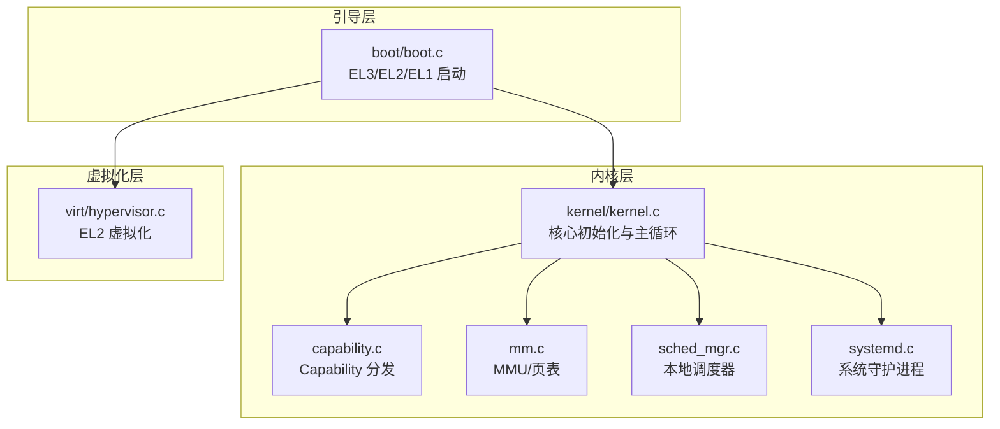
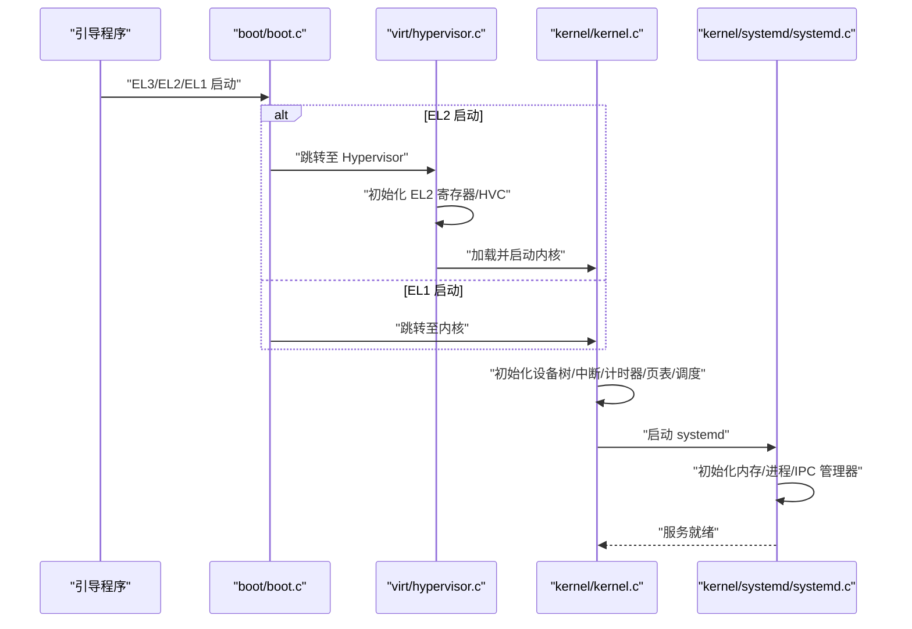
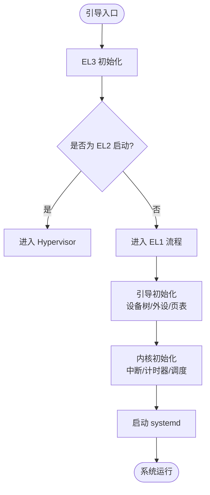
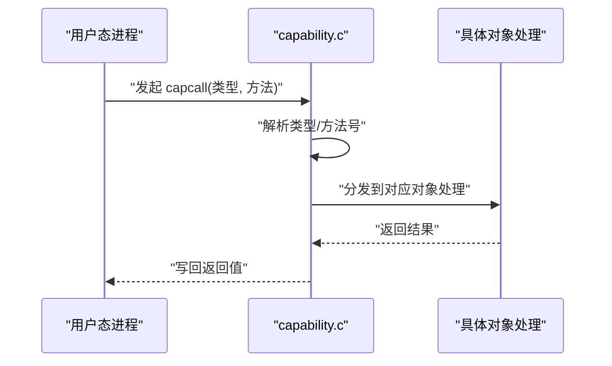
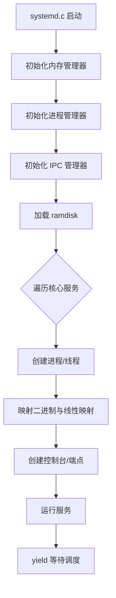
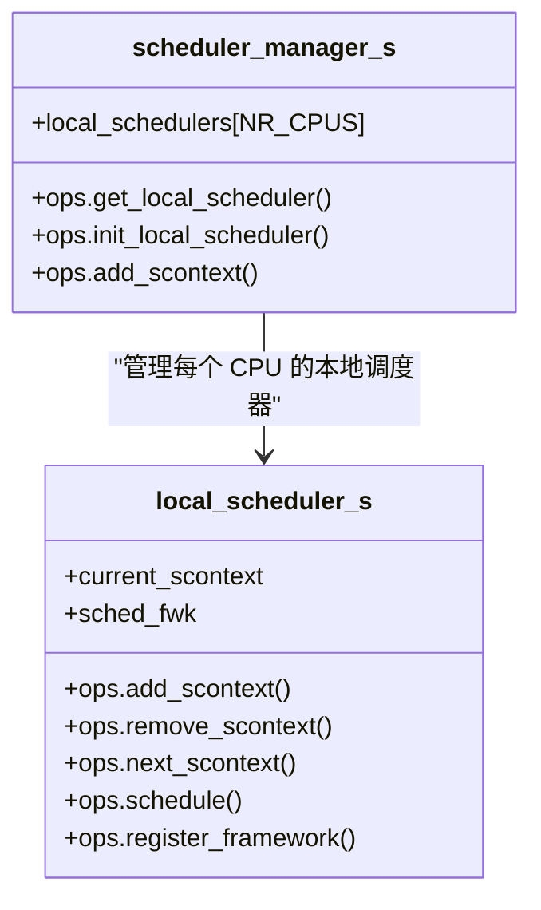
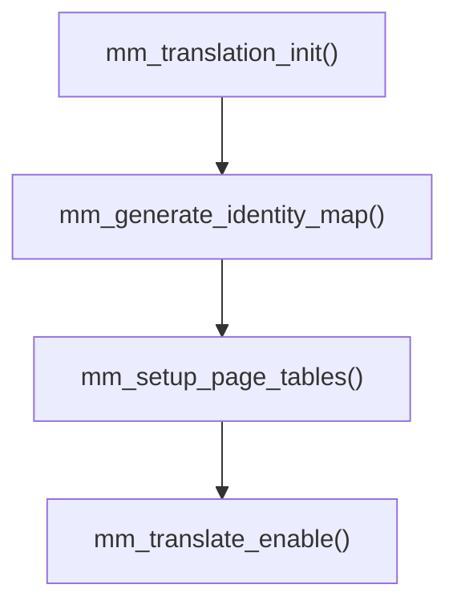
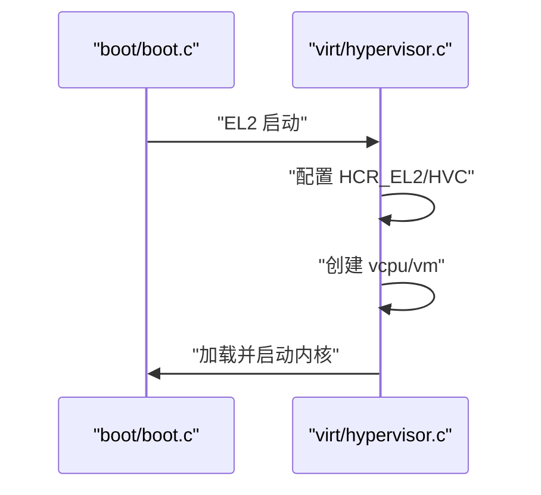
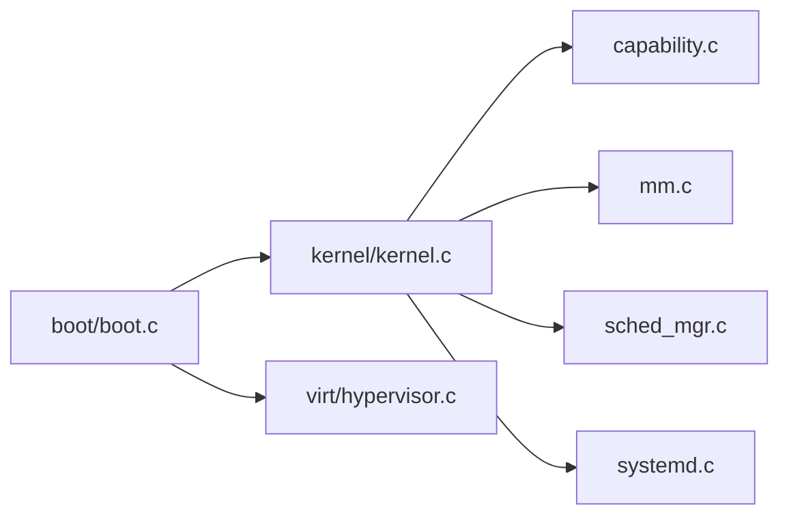

# 项目概述

<cite>
**本文引用的文件**
- [README.md](file://README.md)
- [microkernel_design.md](file://docs/microkernel_design.md)
- [kernel/microkernel_design.md](file://docs/kernel/microkernel_design.md)
- [core.h](file://kernel/include/core.h)
- [kernel.c](file://kernel/kernel.c)
- [capability.h](file://kernel/include/capability/capability.h)
- [capability.c](file://kernel/capability/capability.c)
- [common.h](file://kernel/include/arch/arm64/common.h)
- [boot.c](file://boot/boot.c)
- [hypervisor.c](file://virt/hypervisor.c)
- [systemd.c](file://kernel/systemd/systemd.c)
- [mm.h](file://kernel/include/mm/mm.h)
- [mm.c](file://kernel/mm/mm.c)
- [sched_mgr.h](file://kernel/include/scheduler/sched_mgr.h)
- [sched_mgr.c](file://kernel/schedule/sched_mgr.c)
</cite>

## 目录
1. [简介](#简介)
2. [项目结构](#项目结构)
3. [核心组件](#核心组件)
4. [架构总览](#架构总览)
5. [详细组件分析](#详细组件分析)
6. [依赖关系分析](#依赖关系分析)
7. [性能考量](#性能考量)
8. [故障排查指南](#故障排查指南)
9. [结论](#结论)
10. [附录](#附录)

## 简介
TranquilOS 是一个基于 ARM64 的特权微内核操作系统，强调“最小特权、类型安全、模块化设计”。其核心理念是将内核职责最小化，通过 Capability 权限模型实现细粒度访问控制，并将内存管理、进程/线程管理、设备驱动等大量功能下沉到用户态系统守护进程（systemd）中，从而提升安全性与可维护性。项目支持 EL2 Type-1 虚拟化，允许在同一镜像中打包内核与虚拟机，按当前 CPU 特权级选择从 EL2 或 EL1 启动；同时提供高精度计时器、快速 IPC、多核调度与中断管理等基础能力。

本概述面向初学者提供概念性理解，同时为有经验的开发者提供与源码一致的技术细节与路径指引。

## 项目结构
TranquilOS 采用分层与模块化组织：内核位于 kernel/，引导阶段位于 boot/，虚拟化位于 virt/，平台适配位于 platform/，用户态核心服务位于 uapps/，通用库位于 ulibs/。构建与运行脚本位于根目录。

- 内核层：包含体系结构抽象、MMU/页表、中断/异常、调度、Capability、IPC、定时器、系统守护进程集成等。
- 引导层：负责从 EL3/EL2/EL1 多入口启动，初始化内存映射并跳转至内核或 Hypervisor。
- 虚拟化层：实现 EL2 虚拟化框架，处理 HVC 指令与 VM 生命周期。
- 用户态系统服务：systemd 及其子服务（设备、文件系统、网络、Shell 等），通过 Capability 与内核交互。
- 平台与脚本：针对树莓派与 QEMU 的设备树与构建/运行脚本。

图表来源
- [boot.c](file://boot/boot.c#L101-L136)
- [kernel.c](file://kernel/kernel.c#L125-L224)
- [capability.c](file://kernel/capability/capability.c#L14-L58)
- [mm.c](file://kernel/mm/mm.c#L29-L45)
- [sched_mgr.c](file://kernel/schedule/sched_mgr.c#L105-L162)
- [systemd.c](file://kernel/systemd/systemd.c#L217-L247)
- [hypervisor.c](file://virt/hypervisor.c#L101-L145)

章节来源
- [README.md](file://README.md#L1-L42)
- [boot.c](file://boot/boot.c#L101-L136)
- [kernel.c](file://kernel/kernel.c#L125-L224)
- [systemd.c](file://kernel/systemd/systemd.c#L217-L247)

## 核心组件
- 微内核与引导链路：支持从 EL3/EL2/EL1 多入口启动，EL2 时进入 Hypervisor，EL1 时直接进入内核；内核早期初始化设备树、中断、计时器、页表与调度器，随后启动 systemd。
- Capability 权限模型：内核对象以 Capability 表示，进程通过 CNode 组织与持有；系统调用通过 capcall 分发到具体对象方法，具备类型安全与细粒度权限控制。
- 用户态系统守护进程（systemd）：负责内存管理、进程/线程生命周期、IPC 管理、设备与文件系统服务的拉起与管理。
- 调度与上下文：将传统 TCB 拆分为执行上下文与调度上下文，支持多核本地调度器与优先级框架注册。
- 内存管理：内核仅保留引导期小分配器，MMU 初始化与页表设置，用户态内存管理由 systemd 完成。
- 虚拟化：EL2 虚拟化框架，HVC 指令桥接，支持 VM 创建与运行。

章节来源
- [boot.c](file://boot/boot.c#L101-L136)
- [kernel.c](file://kernel/kernel.c#L125-L224)
- [capability.h](file://kernel/include/capability/capability.h#L11-L26)
- [capability.c](file://kernel/capability/capability.c#L14-L58)
- [systemd.c](file://kernel/systemd/systemd.c#L217-L247)
- [sched_mgr.h](file://kernel/include/scheduler/sched_mgr.h#L23-L49)
- [sched_mgr.c](file://kernel/schedule/sched_mgr.c#L105-L162)
- [mm.h](file://kernel/include/mm/mm.h#L12-L22)
- [mm.c](file://kernel/mm/mm.c#L29-L45)
- [hypervisor.c](file://virt/hypervisor.c#L101-L145)

## 架构总览
下图展示了从引导到内核、再到用户态 systemd 的整体流程，以及 EL2 虚拟化路径：

图表来源
- [boot.c](file://boot/boot.c#L101-L136)
- [hypervisor.c](file://virt/hypervisor.c#L101-L145)
- [kernel.c](file://kernel/kernel.c#L125-L224)
- [systemd.c](file://kernel/systemd/systemd.c#L217-L247)

## 详细组件分析

### 微内核与引导链路
- 多入口启动：支持 EL3 初始化安全寄存器后进入 EL2 或 EL1；EL2 时加载 Hypervisor，EL1 时直接进入内核。
- 早期初始化：设备树解析、中断/异常初始化、关键外设初始化、页表建立、本地计时器与调度器初始化。
- 启动 systemd：在内核早期完成后，定位 DTS 中的 systemd 地址并移交控制权。

图表来源
- [boot.c](file://boot/boot.c#L101-L136)
- [kernel.c](file://kernel/kernel.c#L125-L224)

章节来源
- [boot.c](file://boot/boot.c#L101-L136)
- [kernel.c](file://kernel/kernel.c#L125-L224)

### Capability 权限模型与 Capcall
- Capability 结构：包含类型、权限位与物理地址，用于标识内核对象与授权范围。
- CNode：进程持有的 Capability 存储结构，支持动态扩展与线性索引。
- Capcall 分发：根据 Capability 类型与方法号分发到具体对象处理函数，返回值写回通用寄存器。

图表来源
- [capability.h](file://kernel/include/capability/capability.h#L11-L26)
- [capability.c](file://kernel/capability/capability.c#L14-L58)

章节来源
- [capability.h](file://kernel/include/capability/capability.h#L11-L26)
- [capability.c](file://kernel/capability/capability.c#L14-L58)

### 用户态系统守护进程（systemd）
- 角色：作为“系统守护进程”，承担内存管理、进程/线程创建、IPC 管理、设备与文件系统服务的拉起与管理。
- 启动流程：解析 DTS 获取 systemd 地址，读取内置 ramdisk，加载 ELF，分配物理内存并映射，创建控制台与端点，按部署模式创建线程并运行。
- 服务编排：定义核心服务清单，逐个启动并维持运行。

图表来源
- [systemd.c](file://kernel/systemd/systemd.c#L217-L247)

章节来源
- [systemd.c](file://kernel/systemd/systemd.c#L217-L247)

### 调度器与上下文
- 设计：将执行上下文与调度上下文分离，本地调度器按 CPU 维度管理，支持框架注册与优先级队列。
- 接口：提供添加/移除/下一调度项/调度选择等操作，支持亲和性绑定到特定 CPU。

图表来源
- [sched_mgr.h](file://kernel/include/scheduler/sched_mgr.h#L23-L49)
- [sched_mgr.c](file://kernel/schedule/sched_mgr.c#L105-L162)

章节来源
- [sched_mgr.h](file://kernel/include/scheduler/sched_mgr.h#L23-L49)
- [sched_mgr.c](file://kernel/schedule/sched_mgr.c#L105-L162)

### 内存管理与页表
- 内核职责：初始化 MMU、生成内核页表、设置用户与内核页表基址。
- 用户态职责：systemd 负责物理内存分配、虚拟地址空间映射与内存区域管理。

图表来源
- [mm.c](file://kernel/mm/mm.c#L29-L45)
- [mm.h](file://kernel/include/mm/mm.h#L12-L22)

章节来源
- [mm.c](file://kernel/mm/mm.c#L29-L45)
- [mm.h](file://kernel/include/mm/mm.h#L12-L22)

### 虚拟化（EL2）
- 功能：配置 HCR_EL2、初始化异常处理、注册 HVC 回调、创建 vcpu/vm 并运行。
- 与引导：当引导镜像在 EL2 启动时，先加载 Hypervisor 再进入内核。

图表来源
- [boot.c](file://boot/boot.c#L114-L136)
- [hypervisor.c](file://virt/hypervisor.c#L101-L145)

章节来源
- [boot.c](file://boot/boot.c#L114-L136)
- [hypervisor.c](file://virt/hypervisor.c#L101-L145)

## 依赖关系分析
- 引导层依赖：boot.c 依赖设备树、页表与寄存器访问宏，决定从 EL2 或 EL1 启动。
- 内核层依赖：kernel.c 依赖中断/计时器/调度/MMU 等模块；capability.c 依赖各对象头文件；systemd.c 依赖 ELF 解析、内存/进程/IPC 管理器。
- 虚拟化层依赖：hypervisor.c 依赖 EL2 寄存器、异常处理与 HVC 回调注册。

图表来源
- [boot.c](file://boot/boot.c#L101-L136)
- [kernel.c](file://kernel/kernel.c#L125-L224)
- [capability.c](file://kernel/capability/capability.c#L14-L58)
- [mm.c](file://kernel/mm/mm.c#L29-L45)
- [sched_mgr.c](file://kernel/schedule/sched_mgr.c#L105-L162)
- [systemd.c](file://kernel/systemd/systemd.c#L217-L247)
- [hypervisor.c](file://virt/hypervisor.c#L101-L145)

章节来源
- [boot.c](file://boot/boot.c#L101-L136)
- [kernel.c](file://kernel/kernel.c#L125-L224)
- [capability.c](file://kernel/capability/capability.c#L14-L58)
- [mm.c](file://kernel/mm/mm.c#L29-L45)
- [sched_mgr.c](file://kernel/schedule/sched_mgr.c#L105-L162)
- [systemd.c](file://kernel/systemd/systemd.c#L217-L247)
- [hypervisor.c](file://virt/hypervisor.c#L101-L145)

## 性能考量
- 最小特权与类型安全：通过 Capability 限制访问范围，减少内核路径上的权限检查开销，提高系统整体安全性与稳定性。
- 快速 IPC：内核提供控制流立即切换的 IPC 通道，降低进程间通信延迟，提升实时性。
- 高精度计时器：内核仅提供高精度计时器，避免冗余功能带来的额外负担。
- 用户态内存管理：将内存管理下沉到用户态，内核保持轻量，有利于在受限平台上实现稳定运行。
- 多核调度：本地调度器按 CPU 维度管理，结合亲和性与优先级框架，提升多核利用率。

## 故障排查指南
- 启动失败（EL2/EL1）：确认引导镜像是否包含 hypervisor 节点与内核节点，检查设备树解析与入口分支逻辑。
- 内核初始化失败：检查中断/计时器/页表初始化顺序，确保 MMU 已启用且页表设置正确。
- systemd 启动失败：检查 DTS 中 systemd 地址、ramdisk 加载、ELF 解析与映射过程。
- Capability 调用异常：确认 capcall 类型与方法号解析正确，对象处理函数实现完整。
- 调度问题：检查本地调度器初始化、框架注册与亲和性设置。

章节来源
- [boot.c](file://boot/boot.c#L101-L136)
- [kernel.c](file://kernel/kernel.c#L125-L224)
- [systemd.c](file://kernel/systemd/systemd.c#L217-L247)
- [capability.c](file://kernel/capability/capability.c#L14-L58)
- [sched_mgr.c](file://kernel/schedule/sched_mgr.c#L105-L162)

## 结论
TranquilOS 以微内核为核心，结合 Capability 权限模型与用户态系统守护进程，实现了最小特权、类型安全与模块化设计。通过 EL2 虚拟化与高精度计时器，系统在安全性与性能之间取得平衡。随着用户态服务逐步完善，系统将具备更强的可扩展性与可维护性。

## 附录
- 技术特性概览（来自 README）：aarch64、MMU/虚拟内存、IRQ、调度、时间与计时器、多进程/线程、UART/控制台、Capability、自旋锁、SMP、IPC、Upcall 等。
- 文档与设计说明：微内核设计理念、Capability/CNode、内存管理、调度、IPC、Timer、Capcall、Systemd、引导流程与 EL2 启动路径等。

章节来源
- [README.md](file://README.md#L1-L42)
- [microkernel_design.md](file://docs/microkernel_design.md#L1-L43)
- [kernel/microkernel_design.md](file://docs/kernel/microkernel_design.md#L1-L37)